# CPP Module

설명: C++ 핵심 기능들
상태: 완료

C++의 객체 지향 프로그래밍과 핵심 기능들을 실습하며 구현해보는 과제들이다.

과제들을 하면서 알게된 개념을 정리했다.

C++뿐만 아니라 프로그래밍 언어에 공통된 중요한 개념들도 나온다.

# 개념 정리

# 객체 지향 프로그래밍(OOP)이란?

프로그램을 객체(Object)라는 기본 단위로 구성하여 소프트웨어를 설계하고 개발하는 방식.

OOP의 장점은 코드의 재사용성, 확장성, 유지보수성이 높다.

OOP의 주요 개념들은 다음과 같다.

- **객체 (Object)**:
    - 현실 세계의 사물이나 개념을 소프트웨어 내에서 표현한 것.
    - 객체는 데이터(속성, 필드)와 기능(메서드, 함수)을 포함한다.
- **클래스 (Class)**:
    - 객체를 정의하는 청사진 또는 설계도.
    - 객체의 속성과 동작을 정의한다.
    - 예를 들어, `자동차`라는 클래스를 만들면, 개별 자동차 객체들은 이 클래스에 따라 만들어진다.
- **속성 (Attribute)**:
    - 클래스에 정의된 데이터.
    - 객체의 상태나 특성을 나타낸다.
    - 예를 들어, `자동차` 클래스는 `색상`, `브랜드`, `모델` 등의 속성을 가질 수 있다.
- **메서드 (Method)**:
    - 클래스에 정의된 함수.
    - 객체의 동작을 정의한다.
    - 예를 들어, `자동차` 클래스는 `운전하다()`, `정지하다()` 등의 메서드를 가질 수 있다.
- **캡슐화 (Encapsulation)**:
    - 객체의 데이터와 메서드를 하나의 단위로 묶고, 외부로부터 숨기는 것.
    - 데이터 보호와 접근 제어를 통해 객체의 무결성을 유지함.
- **상속 (Inheritance)**:
    - 기존 클래스를 기반으로 새로운 클래스를 만드는 것.
    - 코드 재사용성을 높이고, 클래스 계층 구조를 형성한다.
    - 예를 들어, `스포츠카` 클래스는 `자동차` 클래스를 상속받아 추가 속성이나 메서드를 가질 수 있다.
- **다형성 (Polymorphism)**:
    - 같은 메서드나 연산이 다른 객체에서 다르게 동작하는 것.
    - 메서드 오버로딩(Overloading)과 오버라이딩(Overriding)을 통해 구현된다.
    - 예를 들어, `운전하다()` 메서드는 `자동차` 객체와 `오토바이` 객체에서 다르게 구현될 수 있다.
- **추상화 (Abstraction)**:
    - 복잡한 시스템을 단순화하여 핵심적인 개념이나 기능만을 모델링하는 것.
    - 인터페이스와 추상 클래스를 통해 구현된다.

# 클래스(Class)에 관하여

- 생성자와 소멸자.

생성자는 오버로딩이 가능하여 다양한 매개 변수를 받을 수 있다.

소멸자는 매개변수가 없다.

생성자와 소멸자는 말 그대로 생성과 소멸의 일을 하기 때문에 반환형이 없다.

- 오버로딩과 함수.

함수에 오버로딩을 하면 같은 함수로 다양한 자료형의 매개 변수를 받을 수 있는다.

다만 매개 변수가 같은데 반환형이 다르면

어떤 반환형을 가진 함수를 사용해야 할지 컴파일러가 구분 할 수 없어 오류가 난다.

쉽게 생각하면 오버로딩되는 기준은 매개변수 기준이라고 생각하면 된다.

- public과 private

private는 같은 클래스 객체나 자기 자신만 접근 가능한 데이터.

public은 모두가 접근 가능함.

보통 private에 데이터 자체를 넣고

public에 private 멤버 변수들을 관리하는 메서드들을 넣어줌.

메서드 안에서 접근할때 각종 예외처리나 건드리지 말아야할 부분을 처리해 줄 수 있어서 그런듯.

protedted도 있는데 이건 상속 관계 끼리 접근 가능한 부분.

# 동적 할당

new : 메모리 할당.

delete : 메모리 해제.

new와 delete 모두 연산자이다.

정확히는 연산자 함수인데 온갖 자료형에 맞게 오버로딩이 되어있어 맞는 크기만큼 할당해주고

new 매개변수로 들어온 자료형에 맞는 포인터형의 시작 주소를 반환한다.

클래스에 대한 인스턴스를 생성할때도 new 연산자를 사용한다.

# 참조자(Reference)

**포인터**와 비슷하지만, 큰 차이점들 있다.

- **포인터**와 **참조자**의 차이
    
    ### **포인터 (Pointer)**
    
    - **주소값을 저장**: 포인터는 변수의 메모리 주소를 저장하는 변수이다. 포인터는 특정 메모리 주소를 가리키고 있으며, 이 주소를 통해 해당 위치의 데이터를 간접적으로 접근할 수 있다.
    - **간접 참조**: 포인터를 통해 메모리 주소를 간접적으로 참조하고, 그 주소에 저장된 데이터를 수정하거나 읽어올 수 있다. 예를 들어, `int* p = &a;`와 같이 사용하면 `p`는 `a`의 주소를 저장하며, `p`를 통해 `a`의 값을 변경할 수 있다.
    - **재할당 가능**: 포인터는 초기화된 후에 다른 변수를 가리키도록 재할당할 수 있다.
    즉, 포인터가 가리키는 메모리 주소를 나중에 변경할 수 있다.
    
    ### **참조자 (Reference)**
    
    - **별칭 (Alias)**: 참조자는 원래 변수의 별칭으로, 변수 자체를 가리킨다. 참조자는 특정 변수의 값을 직접 참조하며, 새로운 메모리 공간을 할당받지 않는다(그래 보이지만 사실 내부적인 어셈블리어로 보면 포인터처럼 할당한다 ㅋㅋ). 참조자는 원본 변수를 수정하는 데 사용되며, 이는 직접적인 접근과 동일하다.
    - **직접 참조**: 참조자는 변수의 값을 직접 참조하고 수정할 수 있다. 참조자를 사용하면 포인터처럼 별도로 간접 참조할 필요 없이, 변수처럼 다룰 수 있다.
    - **재할당 불가**: 참조자는 초기화될 때 참조할 변수와 결합되며, 이후 다른 변수를 참조하도록 변경할 수 없다. 이는 참조자가 항상 유효한 변수를 가리키도록 보장한다.
    
    요약하자면, 참조자는 마치 원본 변수 자체를 다루는 것처럼 사용할 수 있으며,
    
    이는 포인터보다 안전하고 직관적이다.
    
    하지만 포인터는 더 유연한 메모리 조작을 가능하게 하므로, 특정 상황에서는 포인터가 더 적합할 수 있다.
    

- **포인터**가 아닌 **참조자**를 쓰는 이유
    
    ### 1. **가독성과 사용 편의성**
    
    - 참조자는 포인터에 비해 문법적으로 **간결**하고 **직관적이다**. 참조자는 마치 원래 변수를 사용하는 것처럼 코드를 작성할 수 있으므로, 코드가 더 읽기 쉽고 이해하기 쉬워진다.
    - 예를 들어, 포인터를 사용하면 `*ptr`과 같이 간접 참조를 해야 하지만, 참조자를 사용하면 변수처럼 다룰 수 있다.
    
    ### 2. **안전성**
    
    - 참조자는 초기화 후 다른 객체를 참조하도록 변경할 수 없다.
    **선언과 동시에 초기화**를 해줘야 하며, **차후에** **변경이 불가능**하다. 
    이는 참조가 항상 유효한 객체를 가리키도록 보장한다.
    - 반면, 포인터는 잘못된 메모리 주소를 가리킬 수 있으며, 이로 인해 프로그램이 **잘못된 메모리 접근**이나 **버그**를 유발할 수 있다.
    
    ### 3. **함수 오버로딩 및 연산자 오버로딩에서의 활용**
    
    - C++에서는 함수 오버로딩과 연산자 오버로딩을 자주 사용하며, 이때 참조자를 활용하면 더 자연스럽고 직관적인 코드를 작성할 수 있다.

- 참조자 사용시 주의할 점
    
    함수 매개변수나 함수 내부에서 정의된 지역적인(스택 영역) 인스턴스들을
    
    클래스처럼 전역으로 쓰이는곳에 초기화를 시키려고 하면 오류가 발생한다.
    
    참조형 멤버 변수가 함수의 매개변수로 전달된 스택 변수에 바인딩될 때 발생한다.
    
    함수가 종료되면 스택 변수는 소멸되므로,
    
    참조형 멤버 변수는 더 이상 유효하지 않은 메모리를 참조하게 된다.
    
    해결 방법중 하나는 매개변수를 스택으로 복사 받는게 아니라 원본을 참조하는
    
    참조형으로 받으면 해결된다.
    

- 참조자 이해를 돕기위한 예시와 반환에 관하여
    
    어떤 함수를 보면 반환형이 참조자인 경우가 있다. 왜 이렇게 쓸까?
    
    참조형을 반환한다면 반환 받는 변수의 자료형은 2가지로 나뉜다.
    
    같은 참조형이거나, 기본 자료형이거나.
    
    std::string으로 코드 예시를 들겠다. 예시를 잘 보면 참조형 이해에 도움이 된다.
    
    - 예시 :
        
        ```cpp
        std::string getString() {
            std::string str = "Hello";
            return str;  // 깊은 복사 1번
        }
        
        int main() {
            std::string result = getString();  // 깊은 복사 2번
        }
        ```
        
        일단 위의 경우는 getString의 반환형은 참조가 아니다.
        
        따라서 리턴할때 임시 객체를 만들어야 하기 때문에 복사가 한번 일어나고
        
        result에 임시 객체(r_value)값을 넣어줘야 하기 때문에 깊은 복사가 2번 일어난다.
        
        string자료형 ‘=’연산자 함수는 깊은 복사가 디폴트이다.
        
        <aside>
        💡
        
        return할때 임시 객체를 만드는 이유는 지역 변수는
        해당 함수 스코프가 끝나면 사라지기 때문이다.
        따라서 임시 객체에 데이터를 복사시키고 그 값을 return 한다.
        
        </aside>
        
        반환형이 참조인 경우 :
        
        1번 경우 :
        
        ```cpp
        std::string& getString(std::string str) {
            return str;  // 깊은 복사 없이 원본 참조 반환
        }
        
        int main() {
        		std::string str = "Hello";
            std::string result = getString(str);  // 깊은 복사 1번
        }
        ```
        
        이 경우 참조형은 원본 str을 가리키고 있기 때문에 return에서 임시 객체를 생성할 필요가 없다.
        
        따라서 main문에서 깊은 복사가 1번 발생한다.
        
        2번 경우 :
        
        ```cpp
        std::string& getString() {
            return str;  // 깊은 복사 x
        }
        
        int main() {
        		std::string str = "Hello";
            std::string& result = getString();  // 깊은 복사 x
        }
        ```
        
        이 경우에 result는 원본 str을 참조한다. 따라서 깊은 복사는 없다.
        
        다만 이런 경우엔 오류가 발생한다.
        
        ```cpp
        std::string& getString() {
        		std::string str = "Hello";
            return str;  // 깊은 복사 x
        }
        
        int main() {
            std::string result = getString();  // 깊은 복사 x
        }
        ```
        
        str이 getString의 지역 변수일때 참조형을 반환해버리면
        
        getString스코프가 끝나서 str의 값은 사라진다.
        
        따라서 반환값이 유효하지 않아 result 값 복사는 정의되지 않은 행동이 되버린다.
        
        보통 c++에선 클래스의 멤버를 반환할때 get함수를 사용하기 때문에
        
        이런 경우는 자주 생기진 않겠지만 참조형의 원리를 알기엔 좋다.
        
        <aside>
        💡
        
        참조형으로 반환한 값이 l-value면 원본값을 수정하려는 목적,
        
        r-value면 원본값을 복사하여 새로운 메모리에 담겠다는 목적이다.
        
        </aside>
        
        <aside>
        💡
        
        매개 변수도 return처럼 복사가 일어나기 때문에 참조형으로 받으면
        
        성능 최적화가 가능하다.
        
        </aside>
        
        <aside>
        💡
        
        C++11 이후는 임시 객체를 반환하거나 매개 변수로 받으면
        
        복사 시키지 않는 방식으로 최적화를 한다.
        
        </aside>
        

# 부동 소수점(float, double…)에 관하여

부동 소수점이 비트로 표현되는 방식은 생각보다 복잡하다.

1. **단정밀도 부동 소수점 자료형 (float)의 구성**:
    - **크기**: 4바이트 = 32비트.
    - **구성**:
        - **부호 비트 (Sign Bit)**: 1비트. 숫자가 양수(0)인지 음수(1)인지를 나타낸다.
        - **지수부 (Exponent)**: 8비트. 수의 전체 크기를 조정하기 위해 소수점의 위치를 결정한다. 
        지수부는 `127`을 **바이어스**로 갖고 있어, 지수부의 값에서 127을 빼서 실제 지수를 계산한다.
        - **가수부 (Mantissa)**: 23비트. 소수점 오른쪽의 세부적인 값을 나타내며,
        실제로는 `1.~~~~`의 형태로 가정한다.
        가수부의 각 비트는 2의 음수 제곱수(예: 2^-1, 2^-2, 2^-3, ...)로 계산된다.
        
        이걸 글자로 표현하면:
        
        ```cpp
        [S][EEEEEEEE][FFFFFFFFFFFFFFFFFFFFFFF]
        ```
        
        - `S`는 부호 비트 (1비트)
        - `E`는 지수부 비트 (8비트)
        - `F`는 가수부 비트 (23비트)
2. **지수부의 동작**:
    - 지수부는 2의 제곱수를 나타내며, `지수부 값 - 127`로 계산된 값을 2의 지수로 사용하여 수의 크기를 조정한다.
    예를 들어, 지수부 값이 `130`이면 실제 지수는 `130 - 127 = 3`이므로, 2^3이 곱해진다.
3. **가수부의 동작**:
    - 가수부는 소수점 오른쪽의 세부적인 값을 나타낸다.
    가수부의 각 비트는 `1`이면 해당 자리에서 2의 음수 제곱수(예: 2^-1, 2^-2, 2^-3)를 더한다.
    최종 가수부 값은 1.xxx 형태로 계산된다.
4. **최종 계산 방식**:
    - 부동 소수점 수는 다음과 같이 계산된다:
    Value=(−1)부호 비트×1.가수부×2지수부 값 - 127

### 예시:

이제 예시로 `1.101`이라는 이진수를 단정밀도 부동 소수점으로 표현해보면:

- **부호 비트**: 0 (양수)
- **지수부**: 예를 들어, `130` (즉, `2^{130-127} = 2^3`)
- **가수부**: `1.101`, 즉 1.625

결과 값은:

Value=1.625×23=13.0

# C++에서의 연산자

C++에서 연산자는 단순히 연산자 자체가 아닐 수 있다.

예를 들어 << 이런 연산자는 원래는 비트 연산자인데

클래스 정의 내부에서 << 연산자를 오버로딩하여 함수를 호출하게 만들 수 있다.

따라서 코드줄에서 어떤 클래스 객체에 연산자를 사용할 때

그 연산자가 클래스 내부에 함수로 오버로딩 되어있으면 해당 함수를 호출한다.

**변환 연산자** :

어떤 객체를 참 거짓 값으로 잠깐 바꿔버릴 수도 있는데,

클래스 내부에서 변환 연산자를 정의 내려 놓으면

런타임 코드에서 해당 클래스로 만들어진 객체를

**조건문, 논리 연산자, 삼항 연산자** 에 사용할 때

**변환 연산자**로 참 거짓 값으로 바꿔줄 수 있다.

- 예시 코드
    
    ```cpp
    class MyClass {
    public:
        operator bool() const {
            return isValid;
        }
    
    private:
        bool isValid = true;
    };
    
    int main() {
        MyClass obj;
    
        // 조건문에서 bool로 변환
        if (obj) {
            std::cout << "Object is valid!" << std::endl;
        }
    
        // 논리 부정 연산자에서 bool로 변환
        if (!obj) {
            std::cout << "Object is not valid!" << std::endl;
        }
    
        return 0;
    }
    ```
    

# 입출력(I/O)에 관하여

출력은 항상 시키지 않고 버퍼에 모아놨다가 std::endl을 호출하면 마지막에 개행을 붙여주면서

자동으로 버퍼 플러시까지 일어나 모든 출력물을 출력시킨다.

std::endl을 불필요하게 많이 사용하면 I/O전환 과정이 많이 발생하면서

전반적인 프로그램 성능에 안좋은 영향을 미친다.

따라서 버퍼에 잘 모아놓고 꼭 필요할때만 std::endl을 사용하는게 프로그램 최적화 방법 중 하나이다.

또한 get_line이나 cin같이 입력 작업이 발생할때는 입력 받기 전에

자동으로 버퍼에 있는 출력물들을 출력시킨다.

이 기능은 c++ 표준 라이브러리에서 기본으로 제공하는 기능이다.

# static 선언과 싱글톤

특정 변수나 함수를 static으로 선언하면 해당 공간에 정적으로 생성된다.
c언어를 배우면서 이 의미는 알고 있었으나,

단순히 지역 함수 안에서 static 키워드로 선언하면 함수 내부로 다시 들어올때

값이 유지된다고만 알고 있었다.

c++로 넘어오면서 객체 지향인 만큼 공간적인 의미가 중요해졌다.

다시 최상단의 정의를 곱씹어 보자면,

해당 ‘공간’에 정적으로 생성되는게 static 키워드의 기능이다.

그 말은 클래스, 네임 스페이스 등 한 공간 안에서 static으로 선언한 변수나 함수는

해당 공간을 바탕으로 생성된 객체에 속하는게 아닌, 공간 자체에 속한다.

<aside>
💡

요거 굉장히 중요한 개념이다!
static 멤버를 가진 클래스를 인스턴스화 시키지 않아도
클래스 내부의 static 멤버에 ::(스코프)로 바로 접근 할 수 있다는 말이다.

</aside>

만약 static멤버가 private라면,

해당 공간을 바탕으로 생성된 모든 객체들이 전역 변수에 접근하는것 처럼 접근 할 수 있다.

쉽게 말해 객체간 공유 데이터가 생기는 셈이다.

또한 어떤 클래스의 객체를 static으로 선언해서 인스턴스화 시키면,

프로그램에서 딱 한번만 인스턴스화가 허용된다.

다시 생성하는 코드줄로 돌아가도 생성이 되지 않는다.

static으로 선언되었기 때문에 한번 생성이 됬다면 해당 코드줄은 무시된다.

그리고 프로그램이 끝날때 까지 유효하다.

<aside>
💡

이렇게 객체를 프로그램에서 한번만 생성하는 방식을 싱글톤(Singleton)이라고 부른다.

</aside>

static 키워드를 실제로 사용한 예는 cpp04 의 ex04 였는데,

캐릭터가 item을 바닥에 내려놓을때 item을 저장할 바닥이라는 객체가 필요했었다.

프로그램이 끝날때 까지 유효하면서, 모두가 접근이 가능한 객체를 만들어야 했다.

따라서 Floor(바닥)이라는 클래스의 객체를 static으로 만드는

get_Instance()라는 static public 메서드를 바닥에 주고,

누군가 바닥에 접근하고 싶다면 get_Instance메서드를 호출하게 했다.

아무리 호출해도 한번만 만들어진 유일한 바닥만 반환할테니깐.

get_Instance()메서드 자체도 static으로 선언한 이유는 그래야

Floor를 객체화 시키지 않아도 모두가 바로 get_Instance()를 호출 할 수 있으니깐..

# 초기화 리스트

C++부터 신기한 문법이 추가되는데, 바로 초기화 리스트이다.

초기화 리스트를 알기 전에 한가지 중요한점이, 초기화 순서이다.

- **C++에서 초기화의 순서**
    
    C++에서는 객체가 생성될 때 멤버 변수들은 다음 순서로 초기화된다:
    
    1. **메모리 할당**: 객체를 위한 메모리가 할당된다.
    2. **멤버 변수의 초기화**: 멤버 변수들이 초기화된다. 이때 초기화 리스트가 먼저 실행된다.
    3. **생성자 본문 실행**: 초기화가 완료된 후에 생성자 본문이 실행된다.

- **초기화 리스트는 어떻게 쓰이는가**
    
    초기화 리스트는 생성자 본문이 실행되기 전에 클래스의 멤버 변수를 초기화하는 데 사용된다.
    
    이를 통해:
    
    1. **기본 생성자가 없는 클래스 타입의 멤버 변수**를 초기화할 수 있다.
    2. **참조형 멤버 변수**를 초기화할 수 있다.
    3. **상수 멤버 변수**를 초기화할 수 있다.
    
    초기화 리스트에서 멤버 변수를 초기화할 때, 그 멤버 변수의 생성자가 호출된다. 예를 들어, 만약 클래스 A가 클래스 B를 멤버 변수로 가지고 있고, B의 생성자를 초기화 리스트에서 호출하면, 이 구문은 클래스 B의 생성자를 명시적으로 호출하는 것이다.
    
    1번에 관하여 :
    
    기본 생성자가 없는 클래스의 멤버 변수는 초기화 리스트를 통해 초기화해야 한다.
    
    만약 초기화 리스트에서 초기화하지 않으면, C++은 생성자를 실행하기 전에
    
    멤버 변수 클래스의 기본 생성자를 호출하려고 시도하지만,
    
    기본 생성자가 없기 때문에 컴파일 오류가 발생한다.
    
    2번에 관하여 :
    
    클래스의 멤버 변수에 참조형 변수를 넣으면 반드시 초기화 리스트를 사용하여
    생성자 시작전에 초기화 해야 한다.
    이는 유일한 멤버 참조형 변수 초기화 방식이다.
    
    참조자는 생성과 동시에 바로 다른 변수로 초기화 해줘야 하는데,
    클래스 내부에서 정의 내리는건 허용하지 않고, 생성자 본문에서 초기화 하는건
    컴파일러가 초기화 되지않은 참조형 변수를 사용하는 것으로 간주한다.
    생성과 동시에 초기화라는 개념을 초기화 리스트로 대입시킨듯.
    
    3번에 관하여 :
    
    상수 멤버 변수도 반드시 초기화 리스트를 통해 초기화해야 한다.
    
    상수 멤버 변수는 생성된 이후 값을 변경할 수 없기 때문에, 초기화 리스트에서 초기값을 지정해야 한다.
    
    이말은 생성자 내부 코드도 생성된 이후이기 때문에, 생성자 실행 이전에 초기화 해야해서
    
    초기화 리스트를 사용하는 것이다.
    

# 얕은 복사, 깊은 복사

주로 클래스의 멤버중에 포인터가 동적 할당을 받을때 나오는 용어이다.

얕은 복사(shallow copy) :

2개의 동적 할당 받는 포인터를 = 연산자로 대입만 하여

포인터가 가리키는 주소값만 동일하게 만든다.

동적 할당을 따로 안하고 같은 데이터 값을 가리키는 장점이 있으나

주로 발생하는 문제가 있는데

복사본 데이터를 수정하면 원본 데이터도 수정이 되는 문제와,

소멸자에서 메모리 해제를 시도하는 코드가 있으면

2개의 객체가 같은 메모리를 포인터로 가리키는데

두개 다 delete하려고 시도하여 double free 문제가 발생한다.

따로 복사 할당 연산자를 구현하지 않으면 발생한다.

깊은 복사(deep copy) :

위의 문제를 없애기 위해 포인터 주소값만을 대입하지 않고

기존 메모리를 해제하고 아예 새로 동적할당을 받은 다음

그 메모리에 대입하고 싶은 데이터를 대입시켜준다.

이렇게 하면 복사본 데이터를 수정해도 원본에는 영향이 가지 않고,

소멸자에서 해제하는 코드도 더블 프리 문제없이 실행된다.

복사 할당 연산자를 따로 구현해야 가능하다.

- 깊은 복사에 관해 떠오른 의문점
    
    깊은 복사에 대해 조사해본 결과,
    
    표준 동작은 무조건 원래 있던 메모리는 해제하고
    
    새로운 메모리를 할당 받아 거기에 복사 시킨다고 한다.
    
    근데.. 꼭 무조건 해제를 시켜야 하나? 싶었다.
    
    데이터 구조는 정의 내릴때 컴파일 타임에 정적으로 결정되는 거고..
    
    런타임에 클래스 정의 같은걸 바꿀 수는 없으니까
    
    데이터 구조가 변하지 않는다는 가정 하에 원래 할당 받은 메모리를 냅두고
    
    거기다 복사(덮어씌기) 시키면 되지 않나? 이런 의문이 들었다.
    
    아직 100% 이유가 이해가 가진 않았지만, 한가지 반박에 동의했다.
    
    - GPT의 반박
        
        ### 2. **실제 중요한 부분: 메모리 관리와 객체 상태 일관성**
        
        실제로, **기존 메모리를 유지하면서 데이터를 복사**하는 방법은 이론적으로 가능하지만, 다음과 같은 이유들로 인해 새로운 메모리를 할당하여 깊은 복사를 수행하는 방식이 더 안전하고, 일반적으로 권장됩니다:
        
        1. **기존 메모리의 일관성 문제**:
            - 기존 메모리를 유지하면서 데이터를 덮어쓰면, 복사하는 과정에서 일관성 문제가 발생할 수 있습니다. 특히 복사 도중 예외가 발생하거나, 예상치 못한 상황이 발생할 경우, 기존 객체의 상태가 불안정해질 수 있습니다.
        2. **예외 안전성**:
            - 복사 도중 예외가 발생했을 때, 기존의 객체가 불완전한 상태로 남을 가능성이 있습니다. 새로운 메모리를 할당하고 복사하는 방식은, 복사 과정에서 문제가 발생해도 기존 객체의 상태를 그대로 유지할 수 있게 해줍니다.
    
     한 가지 더 찾았다. char* 같은 문자열의 경우 기존에 있는 메모리 사이즈 보다
    
    더 긴 문자열을 대입하려고 하면 메모리가 부족 할 것이다.
    
    이 경우에는 들어올 문자열 사이즈를 재고 사이즈 만큼 새로 할당하여 복사해준다.
    
    원래 있던 문자열은 해제한다.
    
    애초에 깊은 복사 라는게 원래 있던 메모리를 싹다 해제하고 새로 메모리를 만들어
    
    거기다 복사하는 거라고 한다.
    
    따라서 이걸 사용할지 말지는 내가 결정하면 될 것 같다.
    

# 상속과 다형성

C++에서는 어떤 클래스를 정의하면 해당 클래스를 상속하여

자식 클래스를 만들 수 있다.

예를 들어 Car 클래스가 있다고 가정하면

Car 클래스를 상속받아서 Sports Car 클래스를 만드는 것이다.

그럼 Car 의 데이터를 전부 받은 상태로

Sports Car의 내부 데이터를 추가적으로 만들어 줄 수 있다.

장점이 또 하나 더 있는데,

어떤 함수의 매개변수에 부모 클래스를 주면

해당 부모의 자식 클래스들도 매개 변수에 넘길 수 있다. 굉장히 강력하다.

이러한 방식으로 작동하는걸 **다형성(Polymorphism)**이라고 부른다.

<aside>
💡 다형성 이란?

객체 지향 프로그래밍(OOP)의 핵심 개념 중 하나로,

**같은 인터페이스를 공유하지만, 서로 다른 클래스의 객체들이**

**서로 다른 방식으로 동작**할 수 있게 하는 것을 의미한다.

</aside>

다형성은 크게 두 가지로 나눌 수 있다:

1. **컴파일타임 다형성(Compile-time Polymorphism)**:
    - 함수 오버로딩(Function Overloading)
    - 연산자 오버로딩(Operator Overloading)
    
    컴파일타임 다형성은 컴파일 시점에 어떤 함수나 연산자가 호출될지 결정된다.
    
2. **런타임 다형성(Runtime Polymorphism)**:
    - *가상 함수(Virtual Function)**와 이를 활용한 **동적 바인딩(Dynamic Binding)**
    
    런타임 다형성은 프로그램이 실행되는 동안 어떤 함수가 호출될지 결정된다.
    
    이는 주로 상속 관계에서 부모 클래스의 포인터나 참조를 통해 자식 클래스의 함수가 호출될 때 발생한다.
    

가상 함수라는 개념에서 다형성을 지원하기 위해 virtual이란 키워드를 쓰는데,

가상 함수와 상속에 자세한 개념에 관련해서는 밑의 새로운 제목에서 추가적으로 다루겠다.

# 상속관계 간의 생성과 소멸

생성자 :

부모 클래스가 있고 상속 받은 자식 클래스가 있다고 하면,

생성자의 실행 순서는 부모, 자식 순이고, 호출 순서는 자식 부모 순이다.

생성자가 재귀 함수처럼 스택에 쌓여서 호출 역순으로 실행된다.

그 이유는,

상속 구조에서 객체가 올바르게 초기화되도록 보장하기 위해 설정된 것이다.

자식 클래스는 부모 클래스의 멤버를 상속받기 때문에,

자식 클래스의 객체를 생성하기 전에 부모 클래스의 멤버들이 먼저 초기화되어야 한다.

이를 통해 자식 클래스에서 부모 클래스의 기능을 안전하게 사용할 수 있게 된다.

<aside>
💡 자식 클래스의 생성자에서 부모 클래스의 멤버에 접근하는 코드가 있다고 생각해보자.
어떤 큰일이 날지 바로 상상이 간다.

</aside>

자식의 생성자를 실행할 때 초기화 리스트에 따로 명시가 되있지 않으면

부모의 기본 생성자를 호출한다.

기본 생성자를 호출하면 안되는 경우도 있으니 상속받은 클래스 생성자 코드를 적을때

초기화 리스트로 부모 생성자를 명시적으로 해주자.

소멸자 :

자식의 소멸자가 먼저 호출되는건 생성자와 같지만, 소멸자는 동시에 실행까지 한다.

자식 소멸자가 실행이 끝나면 부모 소멸자로 넘어간다.

이유는 간단한데,

자식은 부모의 메모리를 포함하지만 부모는 자식의 메모리를 포함 하지 않기 때문이다.

부모로써는 자식의 멤버를 해제시켜줄 도리가 없다.. 현실고증인가…. ㅋㅋ

다중 상속인 경우에도 생성자와 소멸자는 위에 기술한 순서로 동작한다.

어떻게 이런 연속적인 호출이 가능한가? :

컴파일러가 코드를 읽고 상속관계인 클래스끼리는 연속적인 메모리에 배치한다고 한다.

쉽게 생각해서 자식의 메모리가 부모의 모든 메모리(private까지)를 내포한 상태로 할당되며,

연속적인 메모리 배치 덕분에 생성자 소멸자도 순서대로 호출이 가능하다고 한다.

자식이 부모의 private에 접근 할 수 없음에도 private가지 할당 되는 이유는

부모의 기능이 private  멤버에 의존할 가능성도 크기 때문이지만,

무엇보다 상속의 본질은 부모의 모든것을 받아야 하기 때문이다 ㅎㅎ

# 다중 상속, 가상 상속

다중 상속(multiple inheritance) :

한 자식 클래스가 여러 부모 클래스를 상속 받는 것.

개념은 간단하나 다중 상속 사용시 발생 하는 문제점들이 있다.

1. 다이아몬드 상속


위의 그림처럼 두 부모가 같은 조상으로부터 상속 받으면

왼쪽 그림처럼 될것 같지만 실제론 오른쪽 그림처럼 된다.

이유는 상속은 부모의 데이터를 받아 자식 메모리에 복사되는 것이지

부모 데이터 주소 자체를 가지는 건 아니니까. 애초에 부모 데이터도 객체를 선언해야

사용 가능한 실체(인스턴스)를 가진 메모리로써 존재하기 때문에 당연한 이야기이다.

클래스는 말 그대로 자료형이니깐.

→ 이 개념은 말로 간단하게 했지만 굉장히 중요한 개념이다. 잘 알아야 코드 짤 때 안 헷갈린다.

- 이해하기 좋게 그림을 그려보았다.
    
    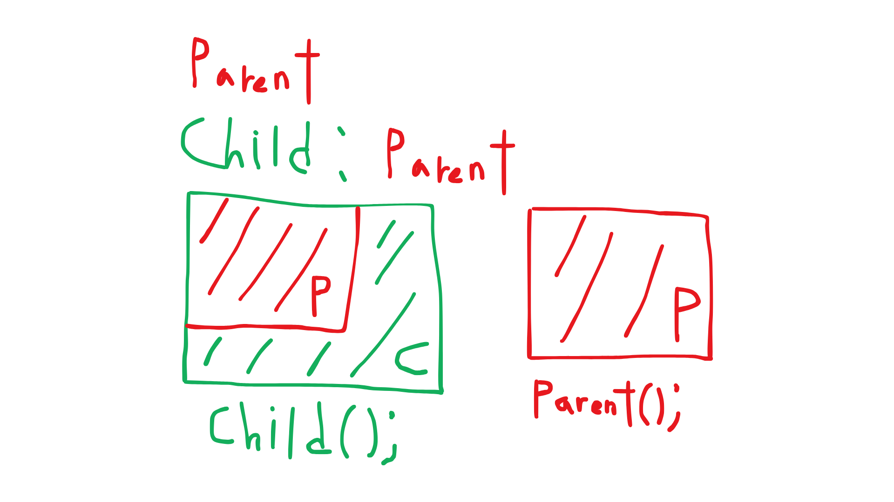
    
    위의 그림을 보면 자식을 생성할때 부모 데이터를 가지고 태어나지만 그 자식에게 귀속된 데이터일뿐,
    
    다른 어떤 부모 데이터와도 공유되지 않는다.
    

따라서 B를 생성하기 위한 조상 객체 A, C를 생성하기 위한 조상 객체 A가 완전히 다른

메모리 주소를 가진다.

가정을 한번 해보면 쉽게 알 수 있다.

B 부모 클래스가 A를 상속 받을때 B의 생성자에서 A의 멤버 값을

변경한다고 생각해보자.

C 부모 클래스가 상속받는 A는 B에서 수정한 값이 아닌 원본의 것을 받는다.

따라서 D 클래스에서 A 클래스로부터 상속받은 멤버에 접근할 경우

B가 상속받은 A클래스의 수정된 멤버에 접근해야하는지

C가 상속받은 A클래스의 접근해야하는지 알지 못하는 모호성이 생겨

컴파일 오류를 발생시킨다.

이 문제를 해결하려면 **가상 상속**을 해야한다.

- 가상 상속(Virtual Inheritance)이란?
    
    정말 쉽게 얘기하자면 저 위의 그림을 오른쪽이 아닌
    
    왼쪽 처럼 상속시키는 방법이다.
    
    조상을 하나의 인스턴스만 생성하고 부모가 몇개이든 virtual일 경우 다 같은
    
    조상 인스턴스를 상속받는것. 따라서 상속된 부분은 메모리도 공유된다.
    
    결과적으로 D, B, C는 모두 같은 A 인스턴스를 상속 받는다. 
    

1. 겹치는 이름
    
    부모인 B 와 C 클래스에서 멤버 변수 이름이 겹치는 경우에,
    
    어떤 부모의 멤버 변수를 말하는 건지 D에서 명시해야 사용 할 수 있다.
    
    B의 것이라면 B::처럼 소속을 명시한다.
    
2. 복잡성
    
    말 그대로 여러 부모의 데이터를 모조리 자식에게 때려 박는 방법이기 때문에,
    
    복잡성이 많이 증가하여 유지 보수성이 떨어진다.
    

이러한 문제점들 때문에 다중 상속은 객체 지향 언어들에서

특정한 경우를 제외하면 사용을 거의 안하는 편이라고 한다.

사용하는 특정한 경우가 바로 **인터페이스(Interface)** 상속이다. 하단 제목에서 다루겠다.

# 가상 함수(Virtual function) (***중요)**

- 가상 함수란?
    
    `virtual` 키워드는 C++에서 함수가 다형성(Polymorphism)을 지원하도록 만드는 데 사용된다.
    
    같은 함수 호출이 다른 객체에서 다른 방식으로 동작할 수 있도록 하는 키워드이다.
    
    `override` 키워드를 사용하면 자식에서 함수 재정의가 가능하다.
    
    예를 들어, 여러 종류의 도형 클래스(예: `Circle`, `Rectangle`, `Triangle`)가 있고,
    
    각각의 클래스에서 `draw()`라는 함수를 재정의한다고 가정해보자.
    
    이 때, 도형 객체들의 포인터를 `Shape`라는 공통 부모 클래스의 포인터로 관리하면서
    
    `draw()` 함수를 호출하면, 각 도형의 실제 타입에 맞는 `draw()` 함수가 실행된다.
    
    밑의 예시 코드를 보면 이해가 쉬울 것이다.
    
    ```cpp
    class Shape {
    public:
        virtual void draw() {
            std::cout << "Drawing shape" << std::endl;
        }
    };
    
    class Circle : public Shape {
    public:
        void draw() override {
            std::cout << "Drawing circle" << std::endl;
        }
    };
    
    class Rectangle : public Shape {
    public:
        void draw() override {
            std::cout << "Drawing rectangle" << std::endl;
        }
    };
    
    int main() {
        Shape* shape1 = new Circle();
        Shape* shape2 = new Rectangle();
    
        shape1->draw(); // Circle 클래스의 draw() 호출
        shape2->draw(); // Rectangle 클래스의 draw() 호출
    
        delete shape1;
        delete shape2;
    
        return 0;
    }
    ```
    
    출력문 : 
    
    ```cpp
    Drawing circle
    Drawing rectangle
    ```
    
    쉽게 요약하자면, 내가 어떤 함수를 virtual로 선언했다는 것은,
    
    이 함수는 현재에 부정될 함수고, 미래에 내가 재정의 내리겠다.
    
    이런 의미라고 생각하면 된다.
    
    이걸 다른 말로 해석하면 미래에 만들어질 함수를 
    
    내가 현재에 호출하겠다는 말도 된다.
    

- 어떻게 이런 동작이 가능한가?(*중요)
    
    가상 함수를 동작 시키기 위해서 가상 함수 테이블(table)을 생성한다.
    
    ### 가상 함수 테이블(vtable) 동작 원리
    
    1. 가상 함수 테이블(vtable): 클래스에 `virtual` 함수가 하나라도 있으면,
    컴파일러는 이 클래스에 대한 가상 함수 테이블을 생성한다.
    → 이 말은 클래스당 vtable이 하나 생성된다는 뜻이다. 객체당이 아니라. 
    이 테이블에는 해당 클래스의 모든 **가상 함수**에 대한 포인터가 저장된다. (일반 함수X)
    2. 가상 함수 포인터(vptr): 각 객체는 가상 함수 테이블을 가리키는 포인터인 `vptr`를 갖게 된다. 객체가 생성될 때, `vptr`은 해당 클래스의 vtable을 가리키도록 초기화된다.
    3. 함수 호출: 객체의 가상 함수를 호출하면, 실제로는 vptr이 가리키는 vtable에서
    해당 함수의 주소를 찾아 실행하게 된다.
    4. 오버라이드: 자식 클래스 테이블은 부모 테이블을 기반으로 생성되지만,
    자식이 상속 받은 가상 함수를 override 한다면
    자식 클래스의 가상 함수 테이블은 override한 함수로 업데이트 시킨다.
    
    vtable에는 이런 가상 함수들 뿐만 아니라 다양한 메타데이터를 저장한다.
    
    예를 들면 상속 관계, 현재 객체의 실제 타입(RTTI)등..
    
    그래서 가상 함수 사용시 말고도 많은 경우에 참조된다.
    
    요약 : vtable이 클래스 별로 생성됨.
    
    이 테이블을 가리키는 vptr이 각 객체에 생성되고
    
    각 객체는 vptr을 사용해서 테이블 정보에 접근한다.
    
    오버라이딩시 클래스에 해당하는 vtable이 업데이트 된다.
    
    - 가상 함수 테이블 예시 (from GPT && 이해하기 좋으니 참고!)
        
        ### 가상 함수 호출 과정
        
        1. **vptr 접근**: 객체의 가상 함수를 호출할 때, 컴파일러는 먼저 객체의 `vptr`을 통해 vtable에 접근합니다.
        2. **vtable 인덱싱**: vtable은 배열과 유사한 구조로, 각 가상 함수의 포인터를 저장하고 있습니다. 컴파일러는 호출하려는 가상 함수가 vtable의 몇 번째 항목에 있는지를 알고 있습니다. 예를 들어, 첫 번째 가상 함수는 vtable의 첫 번째 요소, 두 번째 가상 함수는 vtable의 두 번째 요소에 해당합니다.
        (알고 있는 이유는 애초에 컴파일러에서 vtable을 만들고 가상 함수 인덱싱까지 해주었기 때문
        3. **함수 포인터 추출**: vtable에서 해당 가상 함수의 포인터를 추출합니다. 예를 들어, `vtable[0]`은 첫 번째 가상 함수의 포인터, `vtable[1]`은 두 번째 가상 함수의 포인터를 의미합니다.
        4. **함수 호출**: 추출된 함수 포인터를 통해 실제 함수가 호출됩니다.
        
        ### 예시로 이해하기
        
        ```cpp
        cpp코드 복사
        #include <iostream>class Base {
        public:
            virtual void func1() {
                std::cout << "Base::func1" << std::endl;
            }
        
            virtual void func2() {
                std::cout << "Base::func2" << std::endl;
            }
        };
        
        class Derived : public Base {
        public:
            void func1() override {
                std::cout << "Derived::func1" << std::endl;
            }
        };
        
        int main() {
            Derived obj;
        
            Base* pBase = &obj;
        
            pBase->func1(); // Derived::func1 호출
            pBase->func2(); // Base::func2 호출
        
            return 0;
        }
        ```
        
        ### 이 코드의 내부 동작
        
        1. **vtable 구성**:
            - `Base` 클래스의 vtable:
                - `vtable[0]` → `Base::func1`
                - `vtable[1]` → `Base::func2`
            - `Derived` 클래스의 vtable:
                - `vtable[0]` → `Derived::func1` (재정의된 함수)
                - `vtable[1]` → `Base::func2`
        2. **vptr 설정**:
            - `obj` 객체는 `Derived` 클래스의 인스턴스이므로, `vptr`은 `Derived` 클래스의 vtable을 가리킵니다.
        3. **가상 함수 호출**:
            - `pBase->func1()` 호출 시:
                - 컴파일러는 `pBase` 객체의 `vptr`이 `Derived` 클래스의 vtable을 가리키고 있음을 알고 있습니다.
                - `Derived` 클래스의 vtable에서 `vtable[0]`에 해당하는 함수 포인터를 추출합니다. 이 포인터는 `Derived::func1`을 가리킵니다.
                - `Derived::func1`이 실행됩니다.
            - `pBase->func2()` 호출 시:
                - `pBase` 객체의 `vptr`을 통해 `Derived` 클래스의 vtable에서 `vtable[1]`에 해당하는 함수 포인터를 추출합니다. 이 포인터는 `Base::func2`을 가리킵니다.
                - `Base::func2`이 실행됩니다.

- 순수 가상 함수와 추상 클래스
    - **순수 가상 함수**: 순수 가상 함수(pure virtual function)는 해당 클래스에서 구현되지 않고,
        
        파생(자식) 클래스에서 반드시 구현해야 하는 함수이다.
        
        순수 가상 함수가 하나라도 있으면 해당 클래스는 **추상 클래스**가 되어 인스턴스를 만들 수 없다.
        
        순수 가상 함수도 가상 함수 테이블에 포함되지만, 그 함수에 대한 엔트리는 `nullptr` 또는 무의미한 값을 가지게 된다.
        
        선언 방법은 그냥 가상 함수 뒤에 = 0; 을 써주면 된다.
        
    - **일반 가상 함수**: 일반 가상 함수는 클래스에서 구현이 제공되며,
        
        필요에 따라 파생 클래스에서 재정의될 수 있다. 이러한 함수는 가상 함수 테이블에 포함되며,
        
        테이블에는 이 함수의 실제 구현에 대한 포인터가 저장된다.
        
        <aside>
        💡
        
        추상 클래스 의 반대는 콘크리트 클래스 이다.
        
        </aside>
        
    

한줄 요약 : 가상 함수는 소속을 명시하지 않으면 대부분 가장 마지막에 오버라이딩된 함수가 실행된다.

# this 포인터, 숨기기(Hiding)

클래스로 생성된 인스턴스 자기 자신을 가리키는 포인터이다.

다른 말로 하면 클래스안의 메서드에서 해당 클래스를 바탕으로 미래에 생성될 객체(자기 자신)을

가리킬때 쓰는 포인터이다.

메서드 정의 코드 부분에서 클래스의 멤버 이름만 기술하여 바로 접근하는 것처럼 보여도

앞에 this→ 가 생략되어있다.

자기 자신을 가리킨다는 표현을 잘 이해해야 한다.

부모, 자식간의 상속 관계가 있는 클래스 두 개가 있다고 가정해보자.

자식 객체를 생성하려면 부모 객체도 생성해야한다.

부모와 자식 모두에게 이름이 같은 name 이라는 멤버 변수가 있다.

부모의 public 메서드중에 name을 수정시키는 set_name(std::string name)이라는 메서드가 있다.

this→name = name;

이 메서드를 자식에서 호출하면, this는 현재 객체를 가리킨다고 생각하여

자식의 name을 수정해 줄 것 같지만, 부모의 name을 수정한다.

이유는 컴파일러에서 해당 이름이 정의된 스코프에서 먼저 찾기 때문이다.

부모의 메서드이니 부모 스코프 안이고, 부모의 멤버에서 먼저 찾는다는 말이다.

this 는 현재 생성된 객체를 가리키지만, 자식 데이터 안에 부모가 있기에

둘다 가리키고 있는거나 마찬가지이다.

이때 모호성이 생기지 않기 위해 컴파일러가 이름 해석 과정에서 스코프 기준으로 먼저 찾아준다.

이 예시에서 **숨기기(Hiding)**이라는 개념도 등장한다.

부모 자식의 멤버 변수 이름이 같으면, 자식의 멤버 변수가 부모의 멤버 변수를 숨긴다.

따라서 자식이 name에 접근하면 자식의 name에 접근되고,

부모의 name에 접근하려면 부모의 메서드를 이용하여 접근해야한다.

다만 부모의 name이 public 이면 Parent::name 이렇게 접근도 가능하다.

<aside>
💡

**중요** 자식의 메서드에선 자식 멤버를 참조하지만, 부모의 메서드는 부모의 멤버를 참조한다.

이는 가상 함수의 오버라이딩 방식과는 다르다.

가상 함수는 오버라이딩 시키면 부모에서 호출해도 오버라이딩한 자식 메서드를 호출 시키지만,

이름 숨기기는 메서드가 소속이 어디에 되었냐에 따라 해당 멤버를 호출한다.

이런 이유는 가상 함수는 동적 바인딩이고, 이름 숨기기는 정적 바인딩이기 때문이다.

갑자기 뜬금없는 바인딩이 뭐냐? 라고 한다면 밑에서 설명하겠다 ㅋㅋ

</aside>

- **동적 바인딩(dynamic binding), 정적 바인딩(static binding)**
    
    동적, 정적의 차이는 이제는 익숙하지만 다시 설명하자면
    
    동적은 런타임에 결정되는것, 정적은 컴파일 타임에 결정되는 것이다.
    
    따라서 가상 함수 실행을 결정하는건 런타임에서고,
    
    이름 해석은 컴파일 타임에서 결정되는 것이다.
    
    이유가 뭘까? GPT가 답변해주었다.
    
    ### 1. **가상 함수와 가상 함수 테이블 (vtable)**
    
    가상 함수는 C++에서 다형성(polymorphism)을 구현하기 위해 사용됩니다. 가상 함수의 동작은 **가상 함수 테이블(vtable)**이라는 구조에 의해 관리됩니다.
    
    - **가상 함수 테이블**: 객체가 생성될 때, 객체의 타입에 따라 가상 함수 테이블이 만들어집니다. 이 테이블은 해당 객체의 실제 타입에 따른 함수 포인터들을 저장합니다.
    - **함수 호출**: 부모 클래스의 포인터나 참조를 통해 가상 함수를 호출하면, 이 호출은 가상 함수 테이블을 통해 객체의 실제 타입에 맞는(오버라이딩된) 자식 클래스의 함수가 호출됩니다. 즉, 런타임에 객체의 실제 타입에 따라 적절한 메서드가 선택됩니다.
    
    이 메커니즘 덕분에, 부모 클래스에서 가상 함수를 호출하더라도(부모가 자식의 데이터를 정의 시점에 알지 못해도) 자식 클래스에서 오버라이딩된 함수가 호출됩니다. 이는 **동적 바인딩(dynamic binding)**이라고도 불리며, 런타임에 결정됩니다.
    
    ### 2. **이름 숨기기와 이름 해석 (Variable Hiding and Name Resolution)**
    
    이름 숨기기는 가상 함수와 달리 **정적 바인딩(static binding)**으로 처리됩니다.
    
    - **이름 해석**: 이름 숨기기는 컴파일 타임에 결정됩니다. 컴파일러는 이름을 해석할 때, 해당 이름이 정의된 **스코프에서** 먼저 이름을 찾습니다. 자식 클래스의 멤버 변수가 부모 클래스와 동일한 이름을 가지면, 자식 클래스의 멤버 변수가 부모 클래스의 멤버 변수를 숨기게 됩니다. 부모 클래스의 메서드는 자신의 스코프에서 이름을 해석하므로, 자식 클래스의 멤버 변수를 무시하고 부모 클래스의 멤버 변수를 참조하게 됩니다.
    - **스코프 기반 해석**: 이름 숨기기는 단순히 스코프 내에서 이름을 찾는 과정이며, 가상 함수 테이블과 같은 복잡한 메커니즘이 사용되지 않습니다.
    
    ### 3. **핵심 차이점 정리**
    
    - **가상 함수 (Virtual Functions)**:
        - **동작 방식**: 가상 함수 테이블(vtable)을 사용한 동적 바인딩.
        - **호출 시점**: 런타임에 객체의 실제 타입에 따라 호출될 메서드가 결정됨.
        - **부모 클래스의 메서드에서 자식 클래스의 오버라이딩된 함수 호출 가능**.
    - **이름 숨기기 (Variable Hiding)**:
        - **동작 방식**: 정적 바인딩을 사용한 스코프 기반의 이름 해석.
        - **호출 시점**: 컴파일 타임에 이름 해석이 이루어짐.
        - **부모 클래스의 메서드에서는 부모 클래스의 멤버 변수만 참조**.

# 인터페이스(Interface) 상속

특정 클래스가 특정 메서드나 함수의 집합을 반드시 구현하도록 강제하는 방법이다.

C++에서는 인터페이스가 없기 때문에, 순수 추상 클래스를 이용한다.

앞서 다룬 가상 함수에서 순수 가상 함수로만 이루어진  순수 추상 클래스를 상속하면

인터페이스 상속과 같다.

보통 이런 인터페이스 클래스는 다른 클래스가 상속받는다.

따라서 소멸자에 virtual을 붙히는건 버릇처럼 해야 할듯.

허나 인터페이스 자체로 인스턴스화 할수 없고, 멤버 변수도 없고 오로지

순수 가상 함수로만 이루어져 있기 때문에 생성자 구현을 하지 않는 경우가 많다.

구현을 하는 경우가 있는지는 현재로선 찾아내지 못했다.

# 예외(Exception) 던지기와 함수 스택(*중요)

c++에서는 try, catch 문이라는 문법으로 예외를 잡아내고

상황에 맞는 예외 처리를 할 수 있다.

문법은 어렵지 않다. try 블록문에서 예외가 throw 된다면

그 예외를 다음 코드 catch 블록문에서 잡아낸다.

따라서 catch 블록문 안에 예외 처리를 해주면 된다.

다만 try, catch 블록문 사이에 다른 코드줄은 문법적으로 기술할 수 없다.(컴파일 오류)

throw 할수 있는 예외는 <stdexcept> 에 포함된 스탠다드 에러들도 있지만

직접 예외 클래스를 <exception> 헤더를 포함해 std::exception 클래스를 상속 받고

만들 수도 있다. 사용자 정의 예외인 셈이다.

한가지 신기한 걸 발견했는데, 이거 파다보니 중요한 개념들이 많이 나왔다.. ㅋㅋ 

catch 문에서 예외를 잡아낸다면 예외를 throw한 함수와

해당 함수를 호출한 상위 함수들 까지 다 포함해서

함수들 내부에서 생성한 인스턴스들의 소멸자가 역순으로 호출된다.

예를 들면 funcA 에서 생성한 객체 objA 가 있고,

다음 코드줄에서 funcA에서 funcB를 호출하고,

funcB에서 생성한 객체 objB가 있다고 치자.

이 상황에서 funcB에서 예외가 발생한다면

objA의 소멸자가 호출이 되고,

그 다음 objB의 소멸자가 호출이 되고,

마지막으로 catch문이 실행된다.

왜 이런식으로 작동할까?

이를 이해하기 위해선 콜 스택, 스택 프레임, 스택 언와인딩 의 개념을 알아야 한다.

차근 차근 알아가보자.

- **콜 스택(call stack)**
    
    콜 스택이란 메모리(물리적) 공간인 스택 영역(stack segment)안에 생성되는
    
    자료 구조이다.
    
    컴파일러가 코드를 읽은 다음 콜 스택의 사이즈를 정해주고,
    
    런타임에서 함수 호출시마다 콜 스택에 스택 프레임이 콜 스택에 추가(push)되며,
    
    각 스택 프레임은 함수의 매개 변수, 지역 변수, 복귀 주소등을 포함한다.
    
    각 함수가 끝날때 마다 해당하는 스택 프레임도 콜 스택에서 제거(pop)된다.
    
    <aside>
    💡
    
    이해하기 쉽게 스택 프레임 자체가 추가(push)되는 것 처럼 써놓았지만
    실제로는 각 요소들(ex)매개 변수등)이 런타임에 각자 push되는 방식이다.
    
    </aside>
    
- **스택 프레임(stack frame)**
    
    스택 프레임이란 위에 기술했듯이 각 함수의 구성 요소들,
    
    지역 변수, 지역 객체, 매개 변수, 복귀(return)할 주소, 이전 베이스 포인터 값 등을
    
    담고 있는 메모리 블록이다.
    
    각 요소들에 접근할땐 스택 포인터라는 포인터를 이용해서 접근 후 작업한다.
    
    - 스택 포인터와 베이스 포인터
        - 스택 포인터(ESP/RSP) :
            
            스택 포인터는 처음에 스택 프레임의 최상단을 가리키는 것부터 시작해서,
            
            밑으로 내려가면서 각 요소들을 추가한다.
            
            - 그림 예시
                
                ```cpp
                void example() {
                    int a = 10;  // 지역 변수
                    int b = 20;  // 지역 변수
                }
                ```
                
                ```cpp
                -------------------     <- 높은 주소
                |     지역 변수 b     |     <- 스택 포인터 (RSP)가 처음에 가리킴
                -------------------
                |     지역 변수 a     |     <- `b`를 추가한 후 스택 포인터가 여기로 이동
                -------------------     <- 낮은 주소
                ```
                
            
            <aside>
            💡
            
            스택은 밑(낮은 주소)으로 확장하지만 힙(Heap)은 위(높은 주소)로 확장한다.
            이로 인해 스택과 힙 영역이 확장할때 서로 충돌을 방지한다.
            
            </aside>
            
            데이터를 제거할때는 생각보다 간단한데,
            
            다시 처음에 있던 최상단을 가리킨다.
            
            이렇게 하면 새로운 스택 프레임이 추가될때 밑으로 내려가면서
            
            기존의 유효하지 않은(제거해야 할) 스택 프레임 데이터에
            
            새로운 스택 프레임 데이터를 덮어 씌우면서 다시 내려가면 된다.
            
            알다시피 삭제하는 것도 연산이기 때문에 덮어 씌기가 효율적이기 때문.
            
            포인터니까 주소로 직접 접근하여 이러한 작업을 수행한다.
            
        
        - 베이스 포인터(EBP/RBP) :
            
            현재 함수의 스택 프레임의 시작 주소를 담은 포인터이다.
            
            이 주소값을 기준으로 매개 변수나 지역 변수에 접근한다.
            
            현재 함수에서 새로운 함수를 호출할 때, 새로운 함수의 스택 프레임안에
            
            현재 함수의 베이스 포인터 값을 넣어준다.
            
            이렇게 하면 새로운 함수가 끝나서 현재 함수로 돌아와야 할때
            
            현재 함수의 스택 프레임 주소를 새로운 함수 스택 프레임이 알기 때문에 쉽게 돌아온다.
            
            <aside>
            💡
            
            이 방식은 연결 리스트의 노드 연결 방식과 비슷하다.
            
            </aside>
            
            또한 새로운 함수가 호출되어 스택 프레임이 생성되면 베이스 포인터는 값을 넣어 준 후에
            
            새로운 함수의 시작 주소를 가리킨다. 이로 인해 연쇄적인 이전 함수 주소 기록이 가능하다.
            
            한번 보면 이해하기 어렵다. 뭔소리야..? 이럴 수 있다.
            
            그러니 쉽게 예시를 들겠다.
            
            - 예시 :
                
                ```cpp
                void funcA() {
                int x = 10;
                funcB();
                }
                void funcB() {
                int y = 20;
                }
                ```
                
                1. funcA() 실행중
                funcA의 베이스 포인터는 funcA 스택 프레임의 시작 주소를 가리키고 있다.
                2. funcB() 호출
                funcA에서 funcB를 호출하는 코드줄이 실행되면, funcB의 스택 프레임이 생성된다.
                이때 현재 함수(funcA)의 베이스 포인터 값이 funcB의 스택 프레임 안에 저장된다.
                3. 베이스 포인터 업데이트
                베이스 포인터는 이제 funcB를 가리킨다.
                4. funcB() 실행
                funcB 함수가 실행된다.
                5. funcB() 종료
                funcB가 종료될때 funcB의 스택 프레임 안에 funcA의 스택 프레임 시작 주소 값이 있기 때문에 funcA의 스택 프레임으로 되돌아 간다.
                6. funcA() 계속해서 실행 후 종료
                
        
        스택 포인터와 베이스 포인터는 cpu의 레지스터로 처리된다.
        
        레지스터는 주소에 직접 접근하기 때문에 포인터라는 이름을 붙힌듯.
        
        레지스터는 매우 한정된 고속 메모리이기 때문에 중요한 작업에만 쓰인다.
        
        이 두 포인터가 얼마나 중요한지 알 수 있는 부분이다.
        
    - 내가 생각한 콜 스택과 스택 프레임 비유
        
        일단 말하기 앞서서 내가 생각한 예시라 맹신하면 안된다.
        
        말 그래도 떠오르기 쉽게 “비유”한거라 간단하게 참고만 하자.
        
        콜 스택과 스택 프레임을 단순 자료구조료 비유하자면
        
        콜 스택 = 스택
        
        스택 프레임 = 연결 리스트 노드
        
        콜 스택은 아래를 향하고 있는 단방향 연결 리스트로 구현한 스택
        
        이라고 생각하면 편할듯.
        
        물론 각 노드 안의 요소가 포인터(스택 포인터)로 접근이 가능하다는 점 때문에
        
        스택 프레임 자체를 노드로 보기보단 모든 요소(ex)지역 변수, 이전 주소 값등)을
        
        노드로 보는게 사실상 맞다. 그래도 저게 이해하기는 편하니까.. ㅋㅋ
        
    
    <aside>
    💡
    
    지금까지의 개념을 이해했다면 재귀 함수가 어떻게 돌아가는지도 이해 할 수 있다.
    현재 함수 자신의 스택 프레임이 계속해서 콜 스택에 쌓이는 방식이다.
    
    </aside>
    
    - 왜 복귀(return)할 주소는 따로 담는가?
        
        글을 읽다 보면 이전 함수 스택 프레임 주소 값이 있으니 쉽게 되돌아 가면 되는거 아닌가
        
        하고 의문이 들 수 있다.
        
        하지만 스택 프레임이란건 함수의 구성 요소를 자료구조에 담아
        
        관리를 용이하게 하려는 것 뿐이지, 실제 코드를 실행하는건 아니다.
        
        따라서 복귀하는 주소값에는 함수를 호출한 코드줄의 주소값이 담겨있다.
        
    - 그림 요약
        
        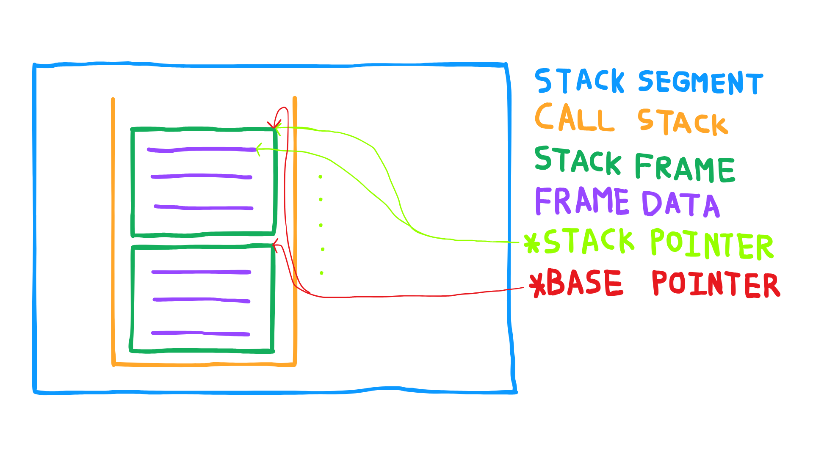
        
- **스택 언와인딩(stack unwinding)**
    
    콜 스택 안의 스택 프레임들을 제거하는 것을 말한다.
    
    이미 위에서 다룬 내용이긴 한데,
    
    콜 스택에 가장 마지막으로 추가된 함수(스택 프레임)부터
    
    하나씩 제거되는 과정을 말한다.
    
    보통 함수 하나가 끝나면, 그 함수에 대한 스택 프레임만 제거되는데
    
    예외가 발생하면 예외 처리를 위해 예외를 던진(throw) 최상단 함수 부터
    
    차례로 스택에서 제거되며, 이때 예외 처리 구문(catch)까지 거슬러 올라간다.
    
    거슬러 올라갈때는 추가적인 코드는 실행하지 않고 바로 스택 프레임을 제거한다.
    
    따라서 try, catch문을 기술하지 않으면, 프로그램의 main 함수까지 거슬러 올라가
    
    모든 함수를 포함한 프로그램 자체를 종료시킬 것이다. → C에서 exit()느낌?
    
    try, catch문을 어떤 함수에 기술했다면
    
    해당 함수의 catch문 전 까지만 스택 언와인딩이 발생한다.
    
    catch문 이후의 코드는 언와인딩 없이 정상적으로 실행되기 때문에
    
    어디에 catch문을 기술할 지가 중요할듯.
    
     
    

<aside>
💡

<stdexcept> 안의 runtime_error 같은 스탠다드 에러들도 std::exception 을 
상속받아 만들어진 예외들이다. 따라서 catch (std::exception& e) 같은 방식으로
캐치를 하면 스탠다드 에러들도 다 잡을 수 있다.

</aside>

# 형변환(Casting)과 컴파일, 런타임(*중요)

c에서처럼 c++에도 형변환이 존재한다.

그러나 단순히 자료형만 바로 변화시키는 c와는 달리 c++에는

형변환 연산자가 도입되어 명확한 사용 목적을 강조 할 수 있고,

변환시 타입 안정성 검사 등을 수행 할 수 있다.

이제부턴 형변환을 캐스팅이라고 부르겠다.

c++에서 캐스팅 연산자는 4개가 있다.

- 1. static_cast
    
    사용 예시)
    
    ```cpp
    int i = 42;
    double d = static_cast<double>(i);
    ```
    
    위에 기술한건 기본형 변환이다.
    
    ```cpp
    Child child;
    Parent* parentPtr = static_cast<Parent*>(&child);
    ```
    
    이번에 기술한건 업캐스팅(자식 → 부모)이다.
    
    컴파일 타임에 검사한 후에 변환까지 한다. 런타임에는 하지 않는다.
    
    따라서 성능이 효율적이며, 아예 생략하여 암시적 변환도 가능하다.
    
    기본적인 변환은 보통 이 연산자가 암시적으로 생략되어 있을 가능성이 높다.
    
    단점으로는 런타임에 캐스팅 오류가 나도 잡을 수가 없어
    
    정의되지 않은 동작을 일으킬 수 있다.
    
    변환이 불가능한 경우는 컴파일 에러가 난다.
    

- 2. dynamic_cast
    
    사용 예시)
    
    ```cpp
    Parent* parentPtr = new Child;
    Child* childPtr = dynamic_cast<Child*>(parentPtr);
    ```
    
    주로 위에 기술한 다운캐스팅(부모 → 자식)에 쓰인다.
    
    런타임에 검사하기 때문에 타입 캐스팅이 가능한지 안전하게 확인이 가능하다.
    
    캐스팅에 실패하면 포인터일시 NULL, 참조일시 예외(std::bad_cast)를 던진다.
    
    런타임에 검사하기 때문에 성능 측면으로 비효율적이다.
    
    또한 가상 함수가 없는 클래스면 사용 불가능하다.
    
    이유는 dynamic_cast에서 변환 유효성 검사를 할때
    
    현재 객체의 `vtable`을 참조하여 실제 변환할 객체 타입(RTTI)을 확인하는데,
    
    테이블이 없다면 RTTI 확인 자체가 불가능하기 때문이다.
    

- 업캐스팅(Upcasting)과 다운캐스팅(Downcasting)(*중요)
    
    캐스팅이라는 단어가 붙어있어서 부모 자식간 자료형 자체를 바꾸는
    
    느낌이 있지만 메모리 구성이 다르기 때문에 말이 안된다는건 알 수 있다.
    
    따라서 예시 코드처럼 실제로는 **부모 포인터가 자식**을 가리킬 수 있게 **(업캐스팅)**
    
    혹은 **자식 포인터로 부모의 포인터가 가리키는 자식**을 가리킬 수 있게 **(다운캐스팅)**
    
    만들어 준다.
    
    왜 자식 포인터로 부모의 객체는 가리킬 수 없나? 란 의문이 들 수 있다.
    
    왜냐면 자식 포인터로 자식 메서드에 접근이 가능한데
    
    부모 객체를 가리키는 상태에선 자식 메서드에 대한 정보가 없어
    
    접근을 시도하면 정의되지 않은 동작으로 치명적인 오류가 발생할 것이다.
    
    - 이해하기 쉽게 그림을 그려봤다.
        
        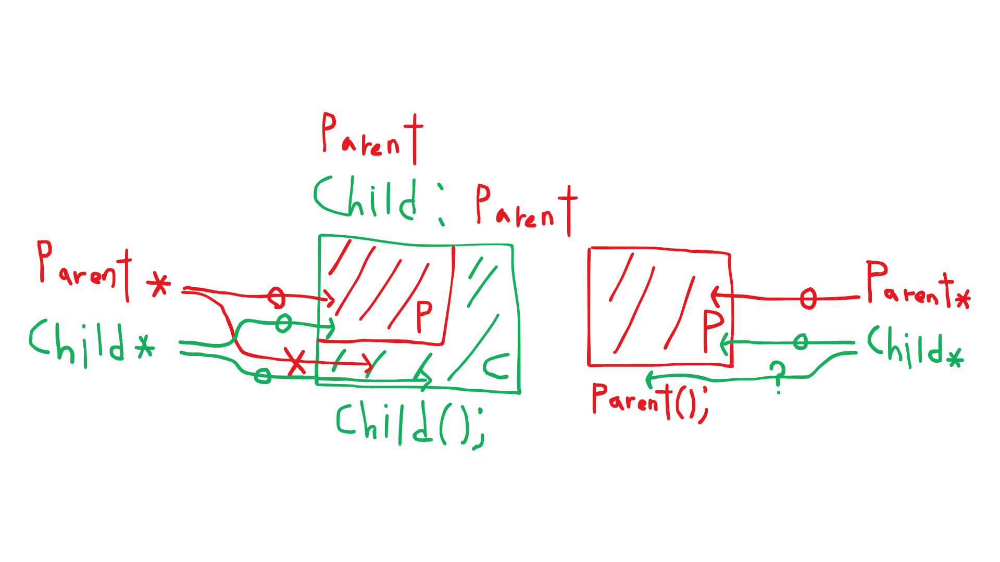
        
        O = 접근 가능
        X = 접근 불가능
        ? = 정의되지 않은 동작(undefined)
        
    
    위의 그림에서 Parent* 가 Child 객체를 가리킬때 Child 데이터에 접근은 못하지만
    
    Child에서 오버라이딩한 가상 함수는 Parent* 로도 사용이 가능하다.
    
    왜나면 Parent* 가 가리키는 Child 객체에 속한 `vptr` 은
    
    자식 클래스 `vtable`을 가리키고 있기 때문에, 오버라이딩된 가상 함수를 호출할 수 있다.
    

- **컴파일러의 역할과 런타임과의 차이에서 오는 연산자 차이(*중요)**
    
    위의 글을 읽다보면 의문이 생길 것이다.
    
    왜 업캐스팅과 다운캐스팅은 캐스팅 연산자가 달라야 할까?
    
    이를 알기 위해선 컴파일 타임과 런타임의 차이를 알아야 하고,
    
    이 차이를 알기 위해선 컴파일러의 역할과 그로 인한 한계점을 알아야 한다.
    
    - **컴파일러(Compiler)의 정의와 역할**
        
        minishell 파싱을 해봐서 어느 정도 알겠지만, 다시 한번 간략하게 정리해보았다.
        
        컴파일러는 프로그래밍 언어로 작성된 소스 코드를 컴퓨터가 이해할 수 있는
        
        기계어로 번역해주는 소프트웨어 도구이다.
        
        번역해주는 동시에 일정 수준의 검사나 최적화도 수행해준다.
        
        보통 컴파일러의 역할은 크게 5**가지**로 나뉜다.
        
        1. **소스 코드 분석(정적 분석)** : 토커나이징, 구문(문법)분석, 타입 검사등
        2. **코드 최적화** : 중간 코드(IR)를 생성하여 변환과 최적화를 수행
        3. **코드 생성** : 최적화된 중간 코드를 기반으로 목적 코드(Object code)를 생성
        4. **링킹** : 목적 코드 → 어셈블리어 → 기계어의 변환 과정을 거친 후
        링커가 변환된 여러 목적 코드를 연결하여 실행 파일 생성
        5. **에러 보고 및 디버깅 지원**
    
    이 모든게 수행되는 시점이 컴파일 타임이다.
    
    1번의 분석 단계에서 컴파일러는 상속 구조와 타입 정의를 분석하여
    
    캐스팅을 할때 자료형이 맞지 않으면 컴파일 오류를 뱉는다.
    
    따라서 **상속 관계가 성립하는 자료형끼리는 변환을 허용한다.**
    
    그렇다면, **부모 포인터로 자식 객체 자체의 주소를 받는** 업캐스팅의 경우에서
    
    부모 포인터에 자식이 아닌 관계없는 다른 자료형 데이터 주소를 대입 시킨다면
    
    컴파일러가 타입 분석 시점에 충분히 오류를 감지 할 수 있다.
    
    따라서 업캐스팅에는 static_cast를 사용한다.
    
    다운 캐스팅의 경우에는 어떨까?
    
    다운 캐스팅은 자식 포인터로 **부모** **객체의 주소를 받는게 아닌,**
    
    **부모 포인터 자체**를 값(r-value)으로 받는다.
    
    이 말은, r-value로 받는 부모 포인터 안에
    
    l-value인 자식 포인터에 대응하는 자식 객체 주소가 아니라
    
    다른 자식 객체의 주소가 들어가 있을 수도 있고,
    
    부모 객체의 주소가 들어가 있을 수도 있다.
    
    명백한 오류가 일어날거라고 예상 할 수 있지만, 컴파일러는 이 오류를 잡아내지 못한다.
    
    왜냐하면 부모 포인터를 자식 포인터로 캐스팅 하는건
    
    상속 관계에 해당하는 자료형끼리의 캐스팅이라서, 컴파일러는 허용한다.
    
    부모 포인터 안에 어떤 값이 들어 있는지는 관여하지 않는다.
    
    컴파일러의 역할은 실행 전 정적 분석후 코드 변환이지,
    
    프로그램이 실행되는 동안(런타임)의 일은 관여하지 않기 때문이다.
    
    런타임에 컴파일러는 포인터가 어떤 객체를 가리키는지 알 수 없다.
    
    컴파일 오류가 나지 않았다면 포인터는
    
    자료형에 대응하는 객체를 가리키고 있을 것이다.
    
    하지만 위에 말한것 처럼, 
    
    대응한다고 해서 무조건 l-value에 맞는 값이라는 보장은 없다.
    
    명시적인 코드가 기술 되어있다고 하더라도,
    
    런타임에 실행 분기에 따라(ex 입력값에 따른 조건문)
    
    동적으로 생성되고 참조가 이루어지는 경우가 자주 있기 때문에
    
    **컴파일러는 실행 흐름을 알 수 없어 관여하지 않는다.**
    
    **→ 이것이 컴파일러의 역할에서 오는 한계점이다.**
    
    따라서 부모 포인터가 실제 대입할 자식 객체를 가리키고 있는지 알 필요가 있다.
    
    그래서 다운캐스팅은 런타임에 유효성 검사를 해주는 dynamic_cast를 사용한다.
    

- 3. const_cast
    
    const(상수성) 제거 혹은 추가에 사용된다.
    
    const 제거 예시)
    
    ```cpp
    void modify(int* ptr) {
        *ptr = 10;  // 포인터가 가리키는 값을 수정
    }
    
    int main() {
        const int a = 5;  // 상수
        modify(const_cast<int*>(&a));  // 상수성을 제거하여 함수에 전달
    }
    ```
    
    const 추가 예시)
    
    ```cpp
    void print(const int* ptr) {
        // 포인터가 가리키는 값을 출력하지만 수정은 못함
    }
    
    int main() {
        int b = 5;
        print(const_cast<const int*>(&b));  // 상수성을 추가하여 함수에 전달
    }
    ```
    
    const(상수성)을 제거하고 값을 수정하는 경우에는 굉장히 조심해야 한다.
    
    그 값이 처음에 const로 선언된 이유는 작성자가 수정하지 말라는 분명한
    
    의도를 드러낸 것이기에, 수정한다면 정의되지 않은 동작을 일으킬 가능성이 크다.
    

- 4. reinterpret_cast
    
    캐스팅 연산자이지만,
    
    **타입 시스템을 무시하는 캐스팅이다.**
    
    예를 들면 포인터형을 int형으로 변환시켜버린다.
    
    말만 들어도 어마무시하다. 그만큼 강력하지만 위험한 캐스팅이다.
    
    **안정성 체크가 아예 없기 때문.**
    
    <aside>
    💡
    
    사실 **<변환>**한다고 써놓았지만, 해석 방법의 차이일 뿐이다.
    
    무슨 말이냐면, 원본 데이터(비트) 자체는 변화시키지 않고
    
    다른 타입으로 원본 메모리에 저장된 비트를 읽는 것이다.
    
    그렇게 새롭게 해석한(변환한) 값인 r-value(임시 값)을
    
    l-value로 복사시켜 넣어준다. 말그대로 재해석(reinterpret). 
    
    </aside>
    
    <aside>
    💡
    
    다른 캐스팅은 비트 구조가 변할 수 있다. 예를 들면 static_cast에서
    int형을 float형으로 캐스팅하면 부동 소수점 비트 해석 방식이 다르기 때문에
    비트 구조가 변한다.
    
    </aside>
    
    코드 예시를 들겠다.
    
    ```cpp
    int main() {
        int x = 42;
        int* ptr = &x;  // 정수 x의 주소를 가리키는 포인터
    
        // 포인터를 정수형으로 변환
        intptr_t int_ptr = reinterpret_cast<intptr_t>(ptr);
        std::cout << "Pointer as integer: " << int_ptr << std::endl;
    
        // 다시 정수를 포인터로 변환
        int* new_ptr = reinterpret_cast<int*>(int_ptr);
        std::cout << "Dereferenced value: " << *new_ptr << std::endl;
    
        return 0;
    }
    ```
    
    결과값 :
    
    ```cpp
    Pointer as integer: 140732730001464
    Dereferenced value: 42
    ```
    
    결과값을 보면 int_ptr에는 ptr안에 있는 x의 주소 값이
    
    int형으로 재해석되어 들어간 것을 볼 수 있다.
    
    이것을 다시 포인터로 변환해서 역참조하면 당연히 x 값이 나온다.
    
    메모리 직접 접근 연산이다보니 배열같은 메모리 구조에서 인덱스 참조 이동으로도 쓸 수 있다.
    
    예시)
    
    ```cpp
    int arr[5] = {10, 20, 30, 40, 50};
    intptr_t int_ptr = reinterpret_cast<intptr_t>(arr);
    int_ptr += sizeof(int) * 2;  // 배열의 세 번째 요소로 이동
    int* new_ptr = reinterpret_cast<int*>(int_ptr);
    std::cout << *new_ptr << std::endl;  // 30 출력
    ```
    
    정수로 해석한 주소값에 int사이즈 * 2 한 값을 더해주니
    
    int_ptr이 가리키는 주소가 3번째 요소인걸 볼 수 있다.
    
    근데 이렇게 안하고 그냥 포인터 연산하면 끝나긴한다.. ㅋㅋ
    
    이런걸 쓸일이 있냐? 라고 묻는다면 있다고 한다.
    
    대부분 저수준 메모리를 다뤄야 하는 작업에 쓰이며, 대표적인 예는
    
    임베디드, 게임 엔진등..
    
    아무래도 정수값으로 바꿔서 연산하면 포인터 연산보단 편하니까
    
    복잡한 메모리 연산을 다룰 때에는 유용할 것 같긴 하다.
    
    대신 참조 에러가 발생할 가능성은 매우 높아진다.. 양날의 검인 셈이다.
    

<aside>
💡

이미 눈치 챘겠지만 캐스팅 연산자의 반환값 자료형은 < > 안에 있는 자료형이다.

</aside>

# 템플릿(Template)

어떠한 함수나 클래스를 자료형에 구애받지 않고 설계할 수 있다.

이 말은 **동일한 코드를 여러 자료형에 대해 동작하게 만들 수 있다**는 말이다.

이런 설계 방식을 일반화 프로그래밍(generic programming)이라고 한다.

템플릿은 일반적으로 함수 템플릿과 클래스 템플릿으로 나뉜다.

- 함수 템플릿(Function template)
    
    같은 함수를 다양한 타입에 대해 동일하게 작동하게 만들 수 있다.
    
    사용 예시)
    
    ```cpp
    template <typename T>
    T max(T a, T b) {
        return (a > b) ? a : b;
    }
    ```
    
    max가 함수 템플릿의 이름이다. typename T 는 템플릿의 매개변수로,
    
    들어오는 자료형에 따라서 T의 자료형이 결정된다.
    

- 클래스 템플릿(Class template)
    
    특정 클래스의 멤버 데이터를 원하는 자료형으로 다룰 수 있다.
    
    사용 예시)
    
    ```cpp
    template <typename T>
    class Array {
    private:
        T* arr;
        int size;
    public:
        Array(int s) : size(s) {
            arr = new T[size];
        }
    
        T& operator[](int index) {
            return arr[index];
        }
    
        ~Array() {
            delete[] arr;
        }
    };
    ```
    
    코드를 보면 Array 클래스가 템플릿 매개변수로 들어온 T 자료형으로
    
    새로운 배열을 동적할당 하는 걸 볼 수 있다.
    
    - 왜 배열 인덱스 접근 연산자인 [] 를 오버로딩 했나?
        
        이유는 배열 데이터인 arr가 private 멤버이기 때문에
        
        외부에서 바로 []로 접근 할 수 가 없기 때문이다.
        
        일종의 getter + setter라고 보면 될듯.(참조형 반환이라 값 수정도 가능)
        
    
    선언 예시)
    
    ```cpp
    int main() {
        Array<int> intArray(10);    // int형 배열
        Array<double> doubleArray(5); // double형 배열
    
        intArray[0] = 100;
        doubleArray[0] = 3.14;
    
        cout << intArray[0] << endl;
        cout << doubleArray[0] << endl;
    }
    ```
    
    <aside>
    💡
    
    함수 템플릿은 자료형(typename)을 함수로 넘겨주는 매개변수 자료형으로 판단하고,
    클래스 템플릿은 객체를 선언할때 <int>이런식으로 자료형을 명시해야 한다.
    
    </aside>
    

- 템플릿 특수화(Template specialization)
    
    특정 자료형에 대해서만 다른 동작을 구현하고 싶을때 쓰는 방법이다.
    
    사용 예시)
    
    ```cpp
    template <typename T>
    T add(T a, T b) {
        return a + b;
    }
    
    // 템플릿 특수화: 문자열에 대한 동작을 정의
    template <>
    const char* add(const char* a, const char* b) {
        static std::string result;
        result = std::string(a) + std::string(b);
        return result.c_str();
    }
    
    ```
    
    이렇게 하면 add함수를 사용할때 매개 변수로 char*를 넘겨주면
    
    특수화된 템플릿 함수가 사용된다.
    

- 타입이 아닌 매개 변수(non-type argument)
    
    템플릿으로 자료형 <typename T>가 아니라
    
    일반 매개 변수도 <int size> 처럼 넘겨 줄 수 있다.
    
    사용 예시)
    
    ```cpp
    template <typename T, int size>
    class Array {
    private:
        T arr[size];
    public:
        T& operator[](int index) {
            return arr[index];
        }
    };
    ```
    
    이런식으로 매개 변수를 자료형만 받지 않고
    
    일반 변수도 받아서 더 세밀화된 구현이 가능하다.
    
    다만 저런 논타입 매개 변수는 넘겨 줄때 무조건 상수를 넘겨줘야 한다.
    
    이유는 밑에 **템플릿의 구체화** 항목에 기술하겠다.
    
    <aside>
    💡
    
    위의 예시를 봐서 알 수 있듯이 템플릿 매개변수는 여러개를 받을 수 있다.
    
    자료형도 여러개 넘길 수 있고, c++11부터는 가변 인자도 받는다.
    
    </aside>
    

<aside>
💡

템플릿 함수도 오버로딩이 가능하다.

</aside>

- **C++의 함수 생성 시점**
    
    C++에서 함수가 메모리에 생성 되는 시점은 컴파일 타임이다.
    
    컴파일러가 함수를 읽고 실제로 쓰일 함수를
    
    미리 구현해 놓은 다음 코드 영역에 저장하고 런타임에 호출한다.
    
    왜 이렇게 작동할까?
    
    이유는 **C++는 정적 타입 언어**이기 때문이다.
    
    정적 타입 언어란,
    
    프로그램에서 쓰이는 모든 타입이 컴파일 타임에 미리 정의되어 있어야 하는걸 말한다.
    
    그래서 컴파일 타임에 타입 체크가 가능하고, 빠른 오류 발견으로 안정성이 올라간다.
    
    또한 타입에 따라 컴파일러가 최적화된 코드도 만들 수 있고, 런타임에 타입 검사를 하면
    
    프로그램 성능 자체에 영향을 주기 때문에 성능 최적화 측면에서도 좋다.
    
    타입을 명시적으로 쓰기 때문에 가독성과 유지 보수성이 올라간다.
    
    다만 단점은 코드 작성시 타입을 무조건 써야해서 줄이 길어질 수 있고,
    
    이로 인해 초기 개발 속도도 느리다.
    
    또한 컴파일 타임에 타입이 정해지기 때문에 런타임에 타입을 변화시키는데
    
    제약이 있고, 이로 인해 유연성이 떨어진다.
    
    <aside>
    💡
    
    정적 타입 언어의 반대인 동적 타입 언어의 대표적인 예는 파이썬(Python)이다.
    
    </aside>
    
    아마 템플릿이 생겨난 이유도, 동적 타입 변화에 제약이 많은 정적 타입 언어의
    
    한계를 어느정도 극복하려고 만든 문법인거 같다.
    
    타입마다 똑같은 함수를 만들기에는 너무 코드가 길어지고 비 효율적이니깐..
    
    갑자기 왠 함수 생성 시점을 논하냐고 묻는다면, 다음 목차에 이유가 있다.
    

- **템플릿의 구체화(Instantiation)**
    
    위에서 말한것 같이 C++은 **정적 타입 언어**이기 때문에,
    
    무조건 자료형이 정해져야 컴파일러가 실제로 실행할 코드를 만들어
    
    코드 영역에 저장할 수 있다.
    
    하지만 위에 템플릿 사용 예시 코드를 보면 자료형을 따로 정하지 않고
    
    <typename T>로 기술한 걸 볼 수 있다.
    
    컴파일러는 이런 정해지지 않은 자료형을 어떻게 처리할까?
    
    생각보다 쉽게 처리한다. 2가지가 있다.
    
    첫 번째는 템플릿 자체 매개변수(<>)로 자료형을 명시해서 넘겨주는 경우다.
    
    당연하게도 이 경우는 컴파일러가 알 수 밖에 없다. 더 설명하지 않겠다.
    
    두 번째 경우는 자료형을 명시하지 않고 템플릿 함수 매개변수로 판단하는 경우다.
    
    이 매개 변수는 <typename T>를 말하는게 아니라 함수 자체의 매개변수이다.
    
    T의 자리에 넘겨준 매개변수의 자료형이 템플릿의 typename이 된다.
    
    다만 두개 이상의 T에 서로 다른 자료형을 넣으면 컴파일 오류가 난다.
    
    (이럴 경우는 typename G와 같이 다른 typename을 선언해서 받아주면 된다)
    
    이렇게 컴파일러는 받은 매개변수들을 토대로 자료형마다 실제 실행할 함수들을 생성한다.
    
    이렇게 따로 자료형을 파악하여 함수를 생성하는 과정을 **템플릿의 구체화**라고 한다.
    
    다만 템플릿의 자체 매개변수에 논타입 매개변수가 있다면 무조건 상수를 넣어야 한다.
    
    이유는 <> 안에 있는 정보들로 컴파일러가 템플릿 코드를 구체화 시키는데,
    
    <>안에 있는 값이 런타임에 정해지는 일반 변수라면 컴파일러가 코드를 구체화 시킬 수 가 없다.
    
    <> 안에는 자료형, 상수같이 정적 매개변수만 전달 가능하다.
    
    <aside>
    💡
    
    이와 반대로 일반 함수의 매개변수()는 동적으로 전달 가능하다.
    
    일반적인 실행 코드를 생성하고, 동적으로 받는 값에 따라 코드를 실행한다고 한다.
    
    (ex)반복, 조건문등 분기를 나눌때 동적값을 사용)
    
    </aside>
    

기본적인 템플릿의 형태도 다양한 자료형에 대응한다는 측면에서

상당한 장점이 있는 동시에 특수화, 논타입 매개변수등을 사용해서

사용성을 더욱 끌어올릴 수 있다. 상당히 강력한 기능이다.

그러나 컴파일 타임에 구체화 되어야 하기 때문에 제약이 조금 있고,

많은 기능을 사용할수록 코드가 복잡해지는건 어쩔수 없는 단점인 것 같다.

오류 메시지도 장황하다고 한다..ㅋㅋ 컴파일러가 추론을 하는 과정이 고된가 보다

# STL(Standard Template Library)

STL이란 프로그램에서 자주 사용되는 자료구조와 알고리즘을

쉽게 활용할 수 있도록 만들어진 라이브러리다.

STL은 크게 세가지로 나뉜다.

- 컨테이너(Container)
    
    다양한 자료구조들을 미리 정의된 형태로 제공해준다.
    
    상황에 맞게 잘 쓰면 유용할 것이다.
    
    주로 사용하는 컨테이너는 다음과 같다.
    
    - 벡터(vector)
        
        동적 배열이다. 일반 배열과 달리 크기를 동적으로 변화시킬 수 있다.
        
        단순히 추가 혹은 삭제해주는 함수를 쓰면 내부적으로 알아서 크기를 조정한다.
        
        배열인 만큼 메모리를 연속적으로 저장시키고, 인덱스 접근([])도 가능하다.
        
        삽입 삭제는 가장 끝에서 가장 빠르고(O(1)), 나머지 위치는 시간 복잡도가 O(n)이다.
        
        <aside>
        💡
        
        이유는 알다시피 배열인 만큼 메모리에 연속적으로 있기 때문에
        중간에 삽입하려면 뒤에있는 요소들을 메모리에서 한칸 씩 뒤로 밀어줘야 하기 때문.
        삭제도 반대로 작동해서 마찬가지다.
        
        </aside>
        
        사용 예시 코드)
        
        ```cpp
        #include <iostream>
        #include <vector>
        
        int main() {
            // 벡터 선언 및 초기화
            std::vector<int> vec = {10, 20, 30};
        
            // 요소 추가
            vec.push_back(40);  // 끝에 40 추가
        
            // 요소 삭제
            vec.pop_back();  // 끝의 요소 삭제 (50 삭제)
        
            // 임의 접근
            std::cout << "First element: " << vec[0] << std::endl;  // 배열처럼 인덱스 접근
        
            // 벡터 순회
            for (int i = 0; i < vec.size(); ++i) {
                std::cout << vec[i] << " ";
            }
            std::cout << std::endl;
        
            return 0;
        }
        
        ```
        
        push_back()이나 pop_back()은 추가, 삭제 함수이다.
        
        인덱스 접근하는 [] 연산자는 vector 클래스 내부적으로 오버로딩 되어 있다고 한다.
        
        size()는 현재 벡터의 크기(요소 갯수) 반환.
        
        이외에 주요 메서드들도 살펴보자면 :
        
        insert() : 중간 삽입.
        
        capacity() : 벡터의 메모리 크기 반환.
        
        resize(n) : 벡터의 크기(요소 갯수)를 n으로 변경. 
        
    - 리스트(list)
        
        이중 연결 리스트이다. 따라서 양방향 순회가 가능하다.
        
        많이 사용해서 잘 알겠지만 리스트는 메모리가 연속적으로 배치 되어 있지 않다.
        
        따라서 삽입 삭제를 해도 포인터(ex)next)주소값만 변경하고
        
        다른 메모리를 이동시킬 필요가 없기 때문에 시간 복잡도는 O(1)이다.
        
        다만 순회는 인덱스 접근이 불가하기에 O(n)이다.
        
        사용 예시 코드)
        
        ```cpp
        #include <iostream>
        #include <list>
        
        int main() {
            // 리스트 선언 및 초기화
            std::list<int> mylist = {10, 20, 30};
        
            // 앞과 뒤에 요소 추가
            mylist.push_back(40);  // 끝에 40 추가
            mylist.push_front(5);  // 앞에 5 추가
        
            // 요소 삭제
            mylist.pop_back();  // 끝의 요소 삭제 (40 삭제)
            mylist.pop_front();  // 앞의 요소 삭제 (5 삭제)
        
            // 리스트 순회
            for (int value : mylist) {
                std::cout << value << " ";
            }
            std::cout << std::endl;
        
            return 0;
        }
        ```
        
        지정된 위치에서 삽입 삭제를 하고 싶다면
        
        insert(iterator, value) 혹은 erase(iterator, value)를 사용하면 된다.
        
        이터레이터가 잠깐 나오는데, 후술할 목차에서 설명하겠다.
        
        간단하게만 설명하면 현재 노드를 가리키는 포인터로 이해하면 될듯.
        
    - 큐(queue)
        
        **선입선출(FIFO, First In First Out)** 자료 구조다.
        
        먼저 추가된 요소가 먼저 제거된다. 스택이랑 반대다.
        
        추가하면 오른쪽에서 왼쪽 방향으로 쌓이고, 삭제 시
        
        가장 왼쪽이 삭제된다고 생각하면 편할듯.
        
        내부적으로 덱(deque)위에서 동작한다.
        
        <aside>
        💡
        
        위에서 동작한다는 말은 결국 덱 객체를 내부적으로 포함하여
        덱의 기능에 제한을 두거나 맞춤화시키는 방식으로 구현했다는 말.
        생각해보면 덱에 몇개 기능을 뺀게 큐라서 이런 방식이 좋긴 할거 같다.
        
        </aside>
        
        사용 예시 코드)
        
        ```cpp
        #include <iostream>
        #include <queue>
        
        int main() {
            // 큐 선언
            std::queue<int> myqueue;
        
            // 요소 추가
            myqueue.push(10);
            myqueue.push(20);
            myqueue.push(30);
        
            // 맨 앞의 요소 확인
            std::cout << "Front element: " << myqueue.front() << std::endl;
        
            // 요소 삭제
            myqueue.pop();  // 맨 앞의 요소 삭제 (10 삭제)
        
            // 큐 순회는 불가능하므로 요소들을 하나씩 제거하며 출력
            while (!myqueue.empty()) {
                std::cout << myqueue.front() << " ";
                myqueue.pop();
            }
        
            std::cout << std::endl;
        
            return 0;
        }
        ```
        
        push(value): 큐에 요소 추가
        
        pop(): 큐의 맨 앞 요소 삭제
        
        front(): 맨 앞 요소 반환
        
        back(): 맨 뒤 요소 반환
        
        empty(): 큐가 비어 있는지 확인
        
    - 덱(deque)
        
        양방향 큐(queue)로, 앞뒤 양쪽 끝에서 삽입과 삭제가 가능하다.
        
        배열처럼 인덱스 접근도 가능하다.
        
        시간 복잡도는 모두 O(1)이다.
        
        다만 중간 삽입은 배열과 같이 O(n)이다.
        
        사용 예시 코드)
        
        ```cpp
        #include <iostream>
        #include <deque>
        
        int main() {
            // 덱 선언 및 초기화
            std::deque<int> dq = {10, 20, 30};
        
            // 앞과 뒤에 요소 추가
            dq.push_back(40);  // 끝에 40 추가
            dq.push_front(5);  // 앞에 5 추가
        
            // 요소 삭제
            dq.pop_back();  // 끝의 요소 삭제 (40 삭제)
            dq.pop_front();  // 앞의 요소 삭제 (5 삭제)
        
            // 덱 순회
            for (int value : dq) {
                std::cout << value << " ";
            }
            std::cout << std::endl;
        
            return 0;
        }
        ```
        
        - **덱의 메모리 관리 방법과 인덱스 접근 방법**
            
            검색을 하다보니 덱만의 특별한 메모리 관리 방법을 찾았는데,
            
            덱은 양쪽 끝에서의 삽입 삭제를 용이하게 하기 위해
            
            배열 형태의 메모리 블록이라는 걸 여러개 연결시켜서
            
            요소를 관리 한다고 한다.
            
            블록의 크기는 8,16, 32등 다양하지만, 4라고 가정하고 예시를 들겠다.
            
            1. 초기 상태 :
            
            ```cpp
            [ ]  // 빈 덱, 블록 없음
            ```
            
            1. 요소 추가 → push_front(1);
                
                첫 번째 요소를 앞쪽에 추가한다. 이때 새로운 블록이 생성된다.
                
                ```cpp
                Block 0: [ _, _, _, 1 ]
                ```
                
                앞쪽부터라며 왜 맨 뒤에 추가되었는가? 궁금하다면
                
                가장 뒤부터 채워 넣어야 다시 push_front를 할때 메모리 블록을
                
                새로 만들지 않고 계속 넣을 수 있기 때문이다.
                
                큐에서 추가를할때 오른쪽에서 왼쪽 방향으로 넣으면
                
                가장 왼쪽에 붙는거랑 비슷하다고 보면 될듯.
                
                1. push_front(2);
                    
                    ```cpp
                    Block 0: [ _, _, 2, 1 ]
                    ```
                    
                
                이런식으로 쌓인다.
                
                1. push_front(3), push_front(4);
                    
                    ```cpp
                    Block 0: [ 4, 3, 2, 1 ]  // 블록이 모두 채워짐
                    ```
                    
                    블록이 다 채워졌다. 여기서 한번더 push_front를 한다면 어떻게 될까?
                    
                2. push_front(5);
                    
                    ```cpp
                    Block -1: [ _, _, _, 5 ]
                    Block 0:   [ 4, 3, 2, 1 ]
                    ```
                    
                
                메모리 블록이 가득 찼으므로, 새로운 메모리 블록이 앞쪽에 할당된다.
                
                할당된 블록에 5를 넣어준다.
                
                그럼 여기서 뒤에 추가해주는 push_back을 쓰면 어떻게 될까?
                
                1. push_back(6);
                
                ```cpp
                Block 0: [ _, _, _, 5 ]
                Block 1:   [ 4, 3, 2, 1 ]
                Block 2:   [ 6, _, _, _ ]
                ```
                
                뒤에 추가할 여유 공간이 없기 때문에 새로운 블록이 만들어 진다.
                
                첫 블록 인덱스가 0 이어야 하기 때문에 인덱스를 조정했다.
                
                이렇게 형성된 덱의 내용은 이제
                
                ```cpp
                Deck A: [ 5, 4, 3, 2, 1, 6 ]
                ```
                
                이렇게 구성이 된다.
                
                따라서 A[5] 로 접근하면 ‘6’ 값이 나온다.
                
                메모리 블록이 나뉘어 있는데 어떻게 배열처럼 인덱스 접근이 가능할까?
                
                이유는 블록들끼리 연결되어 있기 때문이다.
                
                그럼 포인터로 연결되어있나? 그건 아니다.
                
                map이라는 포인터 배열을 내부적으로 사용해서
                
                각 블록의 주소를 map 배열에 저장시키고
                
                이 주소값들을 이용해서 요소값들을 가져온다고 한다.
                
                이게 어떻게 가능한지 바로 설명하겠다.
                
                - **map 배열의 구조와 동작 원리**
                    
                    각 메모리 블록들의 주소를 담는 포인터 배열이다.
                    
                    ```cpp
                    // 맵 배열 (각 블록에 대한 포인터를 저장)
                    Map: [ &Block0, &Block1, &Block2, ..., &BlockN ]
                    
                    // 각 블록은 고정 크기의 배열
                    Block0: [ 요소들 ]
                    Block1: [ 요소들 ]
                    ...
                    BlockN: [ 요소들 ]
                    ```
                    
                    저런식으로 블록들의 주소를 가지고 있다.
                    
                    저걸 어떻게 이용하냐면
                    
                    덱 자체의 인덱스, 예를 들어 위의 A[5]에서 5을 이용하면
                    
                    맵의 인덱스와 블록내의 인덱스도 구할 수 있다.
                    
                    일단 수식부터 보자.
                    
                    **수식:**
                    
                    - **맵 인덱스 (block_index):**
                    `block_index = (start_offset + deck_index) / block_size`
                    - **블록 내 인덱스 (element_index):**
                    `element_index = (start_offset + deck_index) % block_size`
                    
                    `start_offset` 이 있는 이유는 덱의 첫 요소([0])의 자리가
                    
                    블록내에서 인덱스 0 일거라는 보장이 없기 때문에
                    
                    블록내 실제 요소 위치를 고려하여 인덱스를 수식에 적용시켜야 수식이 유효하다.
                    
                    예를 들어 위의 Deck A 의 start_offset은 3으로 정해진다.
                    
                    이유는 Block 0 이 시작블록인데 첫 요소 앞에 빈자리가 3개 있으니까.
                    
                    `block_size`는 정해져 있으니 내부적으로 알 수 있다.
                    
                    이제 이해할 수 있게 수식을 사용해보겠다.
                    
                    위에서 언급한 Deck A를 예시로 들자면
                    
                    start_offset은 3 이고, 블록 사이즈는 4 이다. 
                    
                    - `block_index = 8 / 4 = 2`
                    - `element_index = 8 % 4 = 0`
                    
                    `block_index`로 Map[2]에서 Block2를 가져오고,
                    
                    `element_index`로 Block2[0]에서 요소를 찾는다.
                    
                    이렇게 하면 Deck A의 Block2의 인덱스[0] 요소인
                    
                    6을 가져온다.
                    
        
    - 스택(stack)
        
        **후입선출(LIFO, Last In First Out)** 자료 구조다.
        
        가장 나중에 추가된 요소가 가장 먼저 제거된다.
        
        스택도 큐와 마찬가지로 내부적으로 덱(deque) 위에서 동작한다.
        
        <aside>
        💡
        
        큐와 스택처럼 기존에 있는 컨테이너를 기반으로 만들어진 컨테이너를
        추상화된 컨테이너, 혹은 **컨테이너 어댑터(Container Adapter)**라고 부른다.
        어댑터의 기반 컨테이너(여기서는 덱)를 알려주는 자료형은 container_type 이다.
        
        </aside>
        
        사용 예시 코드)
        
        ```cpp
        #include <iostream>
        #include <stack>
        
        int main() {
            // 스택 선언
            std::stack<int> mystack;
        
            // 요소 추가
            mystack.push(10);
            mystack.push(20);
            mystack.push(30);
        
            // 맨 위의 요소 확인
            std::cout << "Top element: " << mystack.top() << std::endl;
        
            // 요소 삭제
            mystack.pop();  // 맨 위의 요소 삭제 (30 삭제)
        
            // 스택 순회는 불가능하므로 요소들을 하나씩 제거하며 출력
            while (!mystack.empty()) {
                std::cout << mystack.top() << " ";
                mystack.pop();
            }
        
            std::cout << std::endl;
        
            return 0;
        }
        ```
        
        <aside>
        💡
        
        스택 순회를 불가능하게 만든 이유는 애초에 후입 선출 방식의 작동법이
        효율적일 때에만 사용하라고 최적화해서 만든 자료구조이기 때문이다.
        push,pop 등 일반적인 스택 연산들의 시간복잡도가 O(1)이다.
        재귀, 콜 스택에서 스택이 사용되는 이유가 이것이다.
        
        </aside>
        
    - 맵(map)
        
        키(key) - 값(value)  →  이렇게 쌍으로 데이터를 저장하는 자료구조이다.
        
        키는 자동으로 정렬되며, 중복될 수 없다. 각 키에 대해 값(value)를 하나씩 매칭시킨다.
        
        예를 들면, 전화번호부에서 이름(키)와 전화번호(값)을 짝지어 저장하는것과 비슷하다.
        
        쌍(Pair)로 저장하는 방식은 std::pair라는 자료구조를 사용한다.
        
        - std::pair 원형
            
            ```cpp
            template <typename T1, typename T2>
            struct pair {
                T1 first;  // 첫 번째 요소 (key)
                T2 second; // 두 번째 요소 (value)
            
                // 생성자 등 여러 메서드 제공
            };
            ```
            
            이 자료구조를 std::map 내부적으로 포함한다.
            
            이렇게 생긴 덕에 map의 이터레이터로 데이터에 접근할때
            
            iterartor→first, iterator→second 이렇게 접근이 가능하다.
            
        
        사용 예시 코드)
        
        ```cpp
        #include <iostream>
        #include <map>
        
        int main() {
            std::map<std::string, int> ageMap;
        
            // 데이터를 삽입
            ageMap["Alice"] = 30;
            ageMap["Bob"] = 25;
            ageMap["Charlie"] = 35;
        
            // 특정 키로 값에 접근
            std::cout << "Alice의 나이: " << ageMap["Alice"] << std::endl;
        
            // 맵을 순회하며 키-값 출력
            for (const auto& pair : ageMap) {
                std::cout << pair.first << ": " << pair.second << std::endl;
            }
        
            return 0;
        }
        ```
        
        이런 컨테이너를 연관 컨테이너(Associatice container)라고 부른다.
        
        내부적인 구현은 이진 탐색 트리의 일종인 레드-블랙 트리(Red-Black Tree)로 구현되어 있다.
        
        뭔 트리? 그게 뭐야 라고 묻는다면 이제 설명하겠다.
        
        - 레드-블랙 트리(Red-Black Tree)
            
            균형 이진 탐색 트리의 한 종류로, 삽입과 삭제시 트리의 균형을 유지시킨다.
            
            이 말은 트리가 지나치게 한쪽으로 치우치지 않게 삽입, 삭제가 동작 한다는 말이다.
            
            이렇게 트리의 높이(Height)를 유지하여 최악의 경우에도
            
            모든 작업의 시간 복잡도를 O(log n)으로 유지한다.
            
            <aside>
            💡
            
            양방향 리스트로 하면 O(n)이다. 즉, 100만개의 요소중 하나를 찾으려면
            평균 50만번 반복해야 하는 반면 O(log n)은 최대 20번이다.
            균형 이진 트리는 한번 탐색할때마다 / 2 만큼 경우의 수가 줄기 때문.
            
            </aside>
            
            이렇게 균형을 유지 시키기 위해 특정 규칙과 리밸런싱(Rebalancing) 기법을 사용한다.
            
            일단 레드-블랙 트리의 규칙부터 살펴보자.
            
            1. 노드는 레드 혹은 블랙중 하나의 색상을 가진다.
            2. 루트 노드는 무조건 블랙이다.
            3. 모든 리프 노드(말단 노드혹은 NIL)들은 블랙이다.
            4. 레드 노드의 자식노드 양쪽은 언제나 모두 블랙이다. (즉, 레드 노드는 연달아 나타날 수 없으며, 블랙 노드만이 레드 노드의 부모 노드가 될 수 있다)
            5. 어떤 노드로부터 시작되어 그에 속한 하위 리프 노드에 도달하는 모든 경로에는 리프 노드를 제외하면 모두 같은 개수의 블랙 노드가 있다.
                
                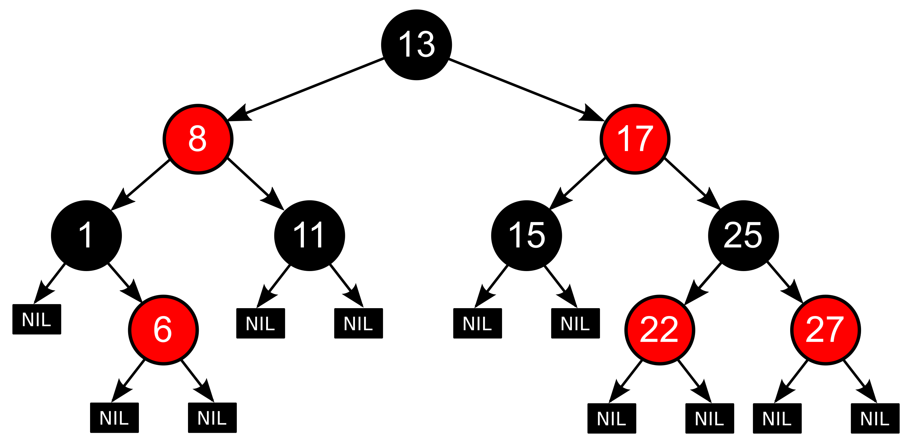
                
            
            이 규칙들을 따르면 위의 모양 처럼 트리가 구성된다. 전체적으로 균형 잡힌 걸 볼 수 있다.
            
            4번 규칙인 레드 노드가 연이어 나타날 수 없음과 동시에
            
            5번 규칙인 리프 노드 까지의 모든 경로에 블랙 노드의 개수가 똑같다는 점을 고려해보면
            
            이렇게 균형잡힌 모습으로 생성될거 라는걸 예상할 수 있다.
            
            레드던 블랙이던 한 경로에 과하게 분포하지 않게 규칙으로 억제시킨셈.
            
            하지만 삽입, 삭제를 할 시에 저 규칙들이 위반되는 경우가 있다.
            
            예를 들면 삽입하는 노드는 무조건 레드인데
            
            레드의 자식은 레드가 될 수 없다. 따라서 이런 문제를 해결하기 위해
            
            노드의 색상을 변경한다던지, 트리를 회전시키던지 하는 방식으로
            
            규칙에 맞는 트리를 재구성(Rebalancing)한다.
            
            - 트리의 회전
                
                트리에 회전 개념이 있다는 것을 여기서 처음 알았다.
                
                간단하게 어떻게 작동하는지 알아보자.
                
                처음에 이런 트리가 있다고 치자.
                
                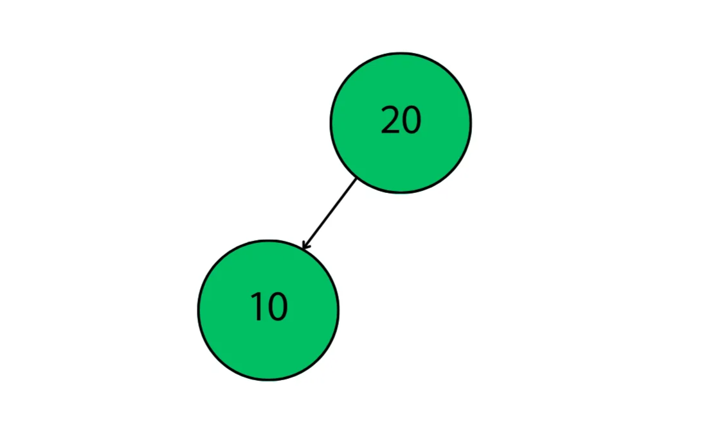
                
                이 트리에 5를 가진 노드를 삽입해보겠다.
                
                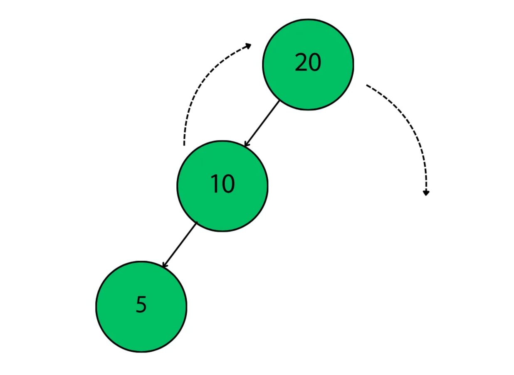
                
                딱봐도 균형 잡혀 있지 않다. 왼쪽으로 치우쳐 있기 때문에
                
                균형이 잡히도록 20을 오른쪽으로 회전하고 10을 20의 위치로 올려보겠다.
                
                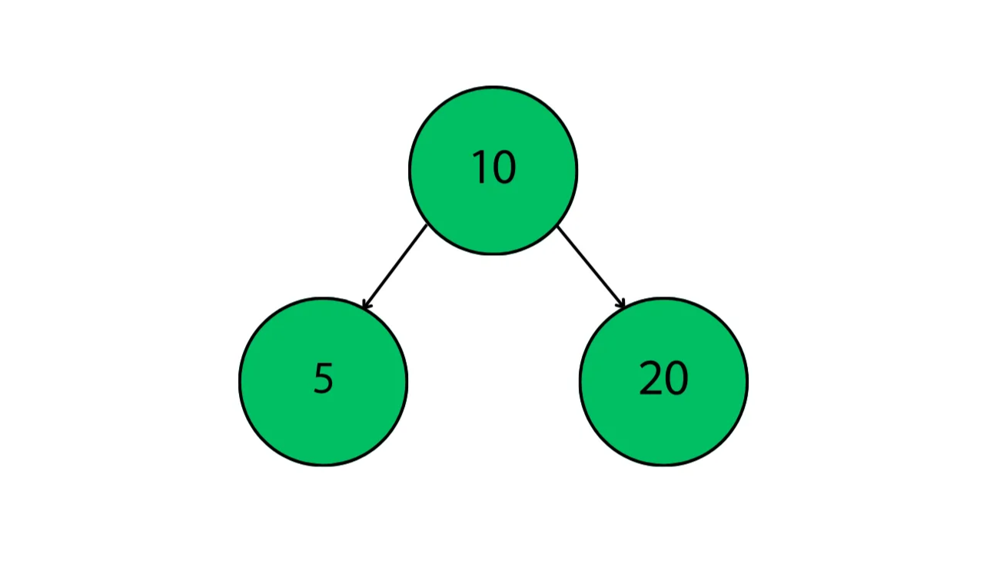
                
                이제 균형도 잡히고 이진 트리 규칙인 왼쪽은 작은수 오른쪽은 큰수도 지켜졌다.
                
                이런식으로 트리를 회전하여 균형을 잡아 줄 수 있다.
                
                회전을 할때 회전 하는 노드는 부모 노드이다.
                
                부모 노드가 위치를 옮겨 갈때 부모에 연결된 조상 노드도 있을 수 있기 때문에
                
                부모가 있던 자리를 회전하는 반대 방향에 위치한 자식이 대신한다.
                
                이렇게 하면 이진 트리 규칙을 지키면서 안전하게 노드를 옮길 수 있다.
                
                - 다른 예시
                    
                    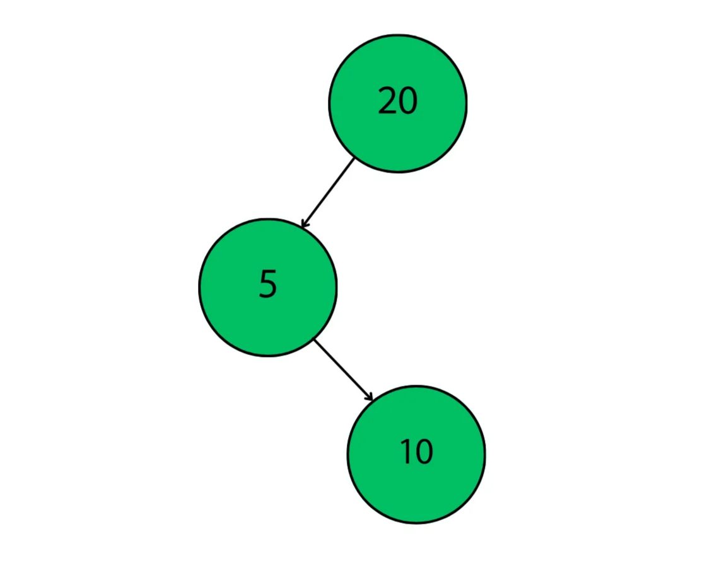
                    
                    위의 경우보단 조금 더 복잡하지만 사실 회전을 한번만 더 하면 된다.
                    
                    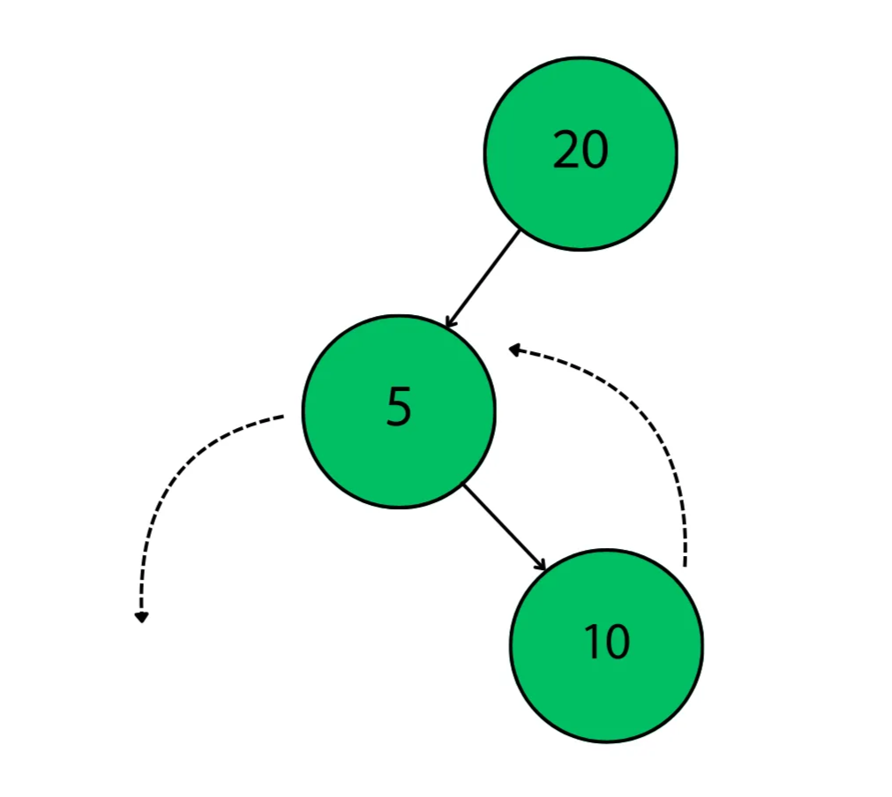
                    
                    5을 왼쪽으로 회전하고 반대 방향 자식인 10을 5의 위치로 올리면
                    
                    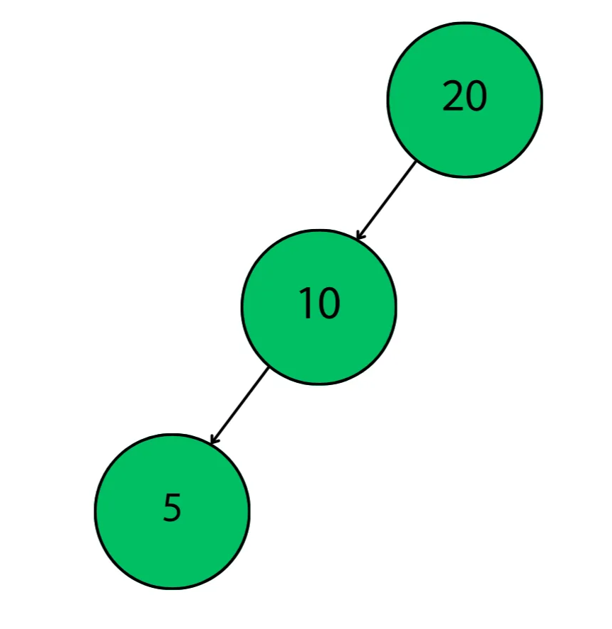
                    
                    어디서 본 모양이다. 그렇다 위의 첫번째 예시와 똑같아졌다.
                    
                    그럼 여기서 회전을 한번만 더 해주면 균형이 잡힌다.
                    
            
            삽입 삭제의 자세한 동작은 여기를 참조하자. https://ko.wikipedia.org/wiki/레드-블랙_트리#cite_note-2
            
            재구성 하는 도중 회전같은 작업이 발생해도 한 두번 밖에 발생하지 않기 때문에
            
            O(log n)을 유지한다.
            
            정렬 상태를 유지하면서 작업 시간복잡도가 O(log n)이기 때문에
            
            실제로 많이 쓰인다고 한다.
            
            C++ STL에서 set이라는 컨테이너에도 쓰이고,
            
            멀티 스레딩, 네트워크 라우팅 테이블, 심지어 Linux 커널에도 쓰인다고 한다 ㄷㄷ
            
    

- 알고리즘(Algorithm)
    
    정렬, 탐색, 변환등의 기능을 수행하는 함수를 제공한다.
    
    컨테이너 종류에 따라 사용 가능한 알고리즘이 다른데,
    
    이유는 알고리즘 함수가 주로 특정 반복자(Iterator)를 인자로 받기 때문이다.
    
    반복자에 대한 내용은 다음 목차에 후술하겠다.
    
    대표적으로 쓰이는 함수들 :
    
    - **sort()** : 컨테이너의 요소를 정렬.
    - **find()** : 특정 값을 찾는다.
    - **binary_search()** : 이진 탐색을 수행.
    - **reverse()** : 컨테이너의 요소를 뒤집는다.
    - **accumulate()** : 컨테이너의 요소를 모두 더한다.
    - **for_each()** : 범위 내 각 요소마다 특정 함수를 적용.
    
    알고리즘 함수들은 템플릿 함수로 구현되어있다.
    
    따라서 맞지 않는 반복자를 템플릿 매개변수로 넘길 경우
    
    템플릿 내부 코드에서 자료형이 다른 반복자의 기능을 사용하는 코드때문에
    
    컴파일 단계에서 에러가 난다.
    

- 반복자(Iterator)
    
    포인터처럼 동작하여 컨테이너의 요소들을 접근 할 수 있게 해준다.
    
    각 컨테이너마다 사용되는 반복자는 다르지만, 이는 내부적인 구현 차이이고
    
    사용자는 추상화된 반복자를 제공받기 때문에 일관된 방식으로 사용 가능하다.
    
    <aside>
    💡
    
    템플릿처럼 일반적 프로그래밍(Generic programming)의 한 예이다.
    
    </aside>
    
    반복자의 종류는 다음과 같다.
    
    - 입력 반복자(Input Iterator)
        
        읽기 전용으로 데이터를 순회하는 반복자.
        
        입력 스트림처럼 한번만 읽을 수 있고 위치를 되돌릴 순 없다.
        
        전방 순회만 가능하며, 쓰기 작업은 당연히 불가능하다.
        
        사용 예시) std::cin으로 입력 받은 값을 std::istream_iterator로 컨테이너에 값을 넣음.
        
        사용 가능 알고리즘) std::find, std::for_each, std::accumulate 등
        
        - 사용 예시 코드
            
            ```cpp
            #include <iostream>
            #include <iterator>
            #include <algorithm>
            #include <vector>
            
            int main() {
                std::vector<int> numbers;
            
                // 입력 반복자를 사용하여 std::cin으로부터 데이터를 읽어 벡터에 저장
                std::istream_iterator<int> input_it(std::cin);   // 입력 시작
                std::istream_iterator<int> eof_it;               // 종료 상태 (EOF)
            
                // 입력이 종료될 때까지 데이터 읽기
                std::copy(input_it, eof_it, std::back_inserter(numbers));
            
                // 입력된 데이터 출력
                std::cout << "You entered: ";
                for (int n : numbers) {
                    std::cout << n << " ";
                }
            
                return 0;
            }
            ```
            
            eof_it이 eof를 가리키는 이유는 
            
            입력 반복자를 기본 생성자로 인스턴스화하면 eof를 나타내는 반복자로 생성되기 때문이다.
            
            input_it이 eof가 올때까지 공백, 개행등의 기준으로 나눠서 numbers에 계속 넣어준다. 
            
    - 출력 반복자(Output Iterator)
        
        쓰기 전용으로 데이터 순회하는 반복자.
        
        출력 스트림처럼 한번만 사용 가능하다.
        
        당연히 읽기 작업은 불가능. 입력 반복자와 같이 전방 순회만 가능하다.
        
        사용 예시) std::ostream_iterator로 컨테이너에 있는 값을 std::cout에 전달하여 출력.
        
        사용 가능 알고리즘) std::copy, std::fill 등
        
        - 사용 예시 코드
            
            ```cpp
            #include <iostream>
            #include <iterator>  // std::ostream_iterator
            #include <vector>
            #include <algorithm> // std::copy
            
            int main() {
                // 벡터에 몇 개의 정수를 저장
                std::vector<int> numbers = {1, 2, 3, 4, 5};
            
                // 출력 반복자에 std::cout을 넣고 공백도 넣어줌
                std::ostream_iterator<int> out_it(std::cout, " ");
                
                // 벡터의 데이터를 출력 스트림(std::cout)에 복사
                std::copy(numbers.begin(), numbers.end(), out_it);
            
                return 0;
            }
            ```
            
            cout에 복사된 numbers 요소들과 공백이 프로그램이 끝날때
            
            버퍼가 flush되면서 출력된다.
            
    - 전방 반복자(Forward Iterator)
        
        읽기와 쓰기 모두 가능하며 전방 순회만 가능한 반복자.
        
        한번 쓰고 끝인 입출력 반복자와는 달리 시작 위치를 가리키는 반복자만 얻으면
        
        같은 반복자여도 계속 시작 위치를 가리키게 만들어 재사용 가능하다.
        
        이를 **다중 패스(Multi pass)**라고 한다.
        
        사용 예시) 단방향 리스트
        
        사용 가능 알고리즘) std::find, std::for_each, std::accumulate, std::merge 등
        
        - 사용 예시 코드
            
            ```cpp
            #include <iostream>
            #include <vector>
            #include <algorithm>
            
            int main() {
                std::forward_list<int> forlst = {1, 2, 3, 4, 5};
                auto it = forlst.begin();
            
                // 첫 번째 순회
                std::cout << "First pass: ";
                std::for_each(it, forlst.end(), [](int v) { std::cout << v << " "; });
                std::cout << std::endl;
            		//시작 위치를 가리키는 반복자 값을 대입시켜 다시 시작 위치를 가르킴
            		it = forlst.begin();
                // 두 번째 순회
                std::cout << "Second pass: ";
                std::for_each(it, forlst.end(), [](int v) { std::cout << v << " "; });
                std::cout << std::endl;
            
                return 0;
            }
            ```
            
            [](int n) { std::cout << n << “ “;} 이 부분은 람다 함수로,
            
            C++11부터 도입된 개념이다.
            
            함수 객체나 포인터를 사용하지 않고 즉석에서 함수를 정의한다.
            
            []는 캡쳐리스트로 외부 변수를 명시하면 람다 함수 내에서 사용 가능하다.
            
    - 양방향 반복자(Bidirectional Iterator)
        
        전방 후방 자유롭게 순회 가능한 반복자이다.
        
        읽기 쓰기 모두 가능하고 다중 패스를 지원한다.
        
        사용 예시) 트리, 양방향 연결리스트
        
        사용 가능 알고리즘) std::reverse, std::next_permutation, std::find 등
        
        - 사용 예시 코드
            
            ```cpp
            #include <iostream>
            #include <vector>
            #include <algorithm>
            
            int main() {
                std::list<int> lst = {1, 2, 3, 4, 5};
            
                // 첫 번째 순회 (정방향 순회)
                std::cout << "First pass: ";
                std::for_each(lst.begin(), lst.end(), [](int v) { std::cout << v << " "; });
                std::cout << std::endl;
            
                // 두 번째 순회 (역방향 순회)
                std::cout << "Second pass: ";
                std::for_each(lst.rbegin(), lst.rend(), [](int v) { std::cout << v << " "; });
                std::cout << std::endl;
            
                return 0;
            }
            ```
            
            std::list는 양방향 리스트고 내부적으로 사용하는 반복자가 양방향 반복자이다.
            
            따라서 begin() 이나 end()를 사용하면 양방향 반복자가 반환된다.
            
            또한 역방향으로 순회할때는 rbegin(), rend() 처럼 다르게 호출해야 한다.
            
            이유는 for_each함수의 내부 동작이 반복자를 ++하기 때문이다.
            
            예를 들어 for_each(lst.end(), lst.begin() ~~) 이렇게 넣는다면
            
            lst의 맨 끝을 가리키는 반복자 end를 for_each 함수 안에서 ++ 할 것이다.
            
            주소 연산상 데이터의 맨 끝에서 ++을 하면 할당되지 않은 메모리를 가리킬 확률이 높다.
            
            따라서 이런 방식은 안되고, 역방향을 가리키는 rbegin()등을 써야한다.
            
            <aside>
            💡
            
            rbegin(), rend()도 추상화된 이터레이터이다. 무슨 말이냐면
            rbegin()을 호출하면 내부적으로 end()를 가져온 다음
            rbegin 에 ++연산을 하면 실제로 end에 - 연산을 한다고 한다.
            연산자 오버로딩 시킨듯.
            
            </aside>
            
    - 랜덤 접근 반복자(Random Access Iterator)
        
        가장 강력한 반복자.
        
        위의 모든 반복자들의 기능을 포함하면서 랜덤 인덱스 접근([])기능까지 포함한다.
        
        사용 예시) 배열, 벡터, 덱(deque)
        
        사용 가능 알고리즘) std::sort, std::lower_bound, std::upper_bound,
        
        std::nth_element, std::binary_search 등 가장 많은 알고리즘 지원 
        
        - 사용 예시 코드
            
            ```cpp
            #include <iostream>
            #include <vector>
            
            int main() {
                // std::vector 생성 (랜덤 접근 반복자를 지원하는 컨테이너)
                std::vector<int> vec = {10, 20, 30, 40, 50};
            
                // 정방향 순회 (벡터 요소 출력)
                std::cout << "Vector elements: ";
                for (auto it = vec.begin(); it != vec.end(); ++it) {
                    std::cout << *it << " ";  // 반복자를 통해 접근
                }
                std::cout << std::endl;
            
                // 인덱스 기반 접근 (랜덤 접근 반복자의 특징)
                std::cout << "Element at index 2: " << vec[2] << std::endl;  // 인덱스로 접근
                std::cout << "Element at index 4: " << vec[4] << std::endl;
            
                // 반복자 주소 연산
                auto it = vec.begin();
                it += 3; // 인덱스 상 3번을 가리킴, 4번째 요소
                std::cout << "Element at position 3 using iterator: " << *it << std::endl;
            
                return 0;
            }
            ```
            
    
    <aside>
    💡
    
    end()는 컨테이너의 맨 끝 요소를 가진 노드를 가리키는게 아니라
    char* 문자열 끝의 NULL처럼 값은 없고 컨테이너의 끝이라고 알려주는 용도의
    노드를 가리킨다고 한다.
    
    </aside>
    
    <aside>
    💡
    
    std::find처럼 단순한 비교 알고리즘은 반복자의 종류에 구애받지 않고 사용 가능하다.
    
    </aside>
    
    - **이터레이터의 무효화**
        
        컨테이너에 삽입이나 삭제를 할 시에 이터레이터가 무효화 될 수 있다.
        
        예를 들어 벡터는, 연속적으로 메모리에 배치되어 있다.
        
        사이즈가 4인 벡터의 2번째 요소를 가리키는 이터레이터가 있다.
        
        이때 벡터의 2번째 자리에 다른 요소를 삽입한다면, 뒤에 있는 요소들은 뒤로 한칸 씩 밀린다.
        
        즉, 원래 2번째 자리에 있던 요소를 가리키던 이터레이터가 이제는 삽입된 요소를 가리킨다.
        
        따라서 해당 이터레이터는 더 이상 유효하지 않다.
        
        또한 계속 push_back을 시도하면 메모리 블럭이 부족해 아예
        
        다른 메모리 블럭으로 옮기는 경우가 있다.
        
        이때 이터레이터가 옮기기 전의 메모리를 가리킨다면 유효하지 않다.
        
        그러나 리스트는 같은 경우에서 무효화 되지 않는다.
        
        왜냐하면 메모리가 연속적으로 배치되있지 않기 때문이다.
        
        따라서 요소들의 메모리상 자리가 바뀔 일이 없다.
        
        메모리 위치가 자주 바뀌는 컨테이너라면 이터레이터 사용은 위험할 수 있고,
        
        반대라면 안정적일 것이다.
        
        이터레이터를 사용하고 싶다면 어떤 컨테이너를 선택해야 할지
        
        고민해야하고, 고민할때 컨테이너의 메모리 구조를 고려해야 할 것이다.
        
    
     
    

# **포드 존슨(Ford-Johnson) 알고리즘**

cpp09 ex02 과제가 포드 존슨 알고리즘을 사용하는 과제이다.

다양한 컨테이너안에 있는 int형 양수들을 포드 존슨으로 정렬시켜서

정렬될때까지의 시간을 기록한다.

컨테이너마다 구조가 다르기 때문에 시간차가 생길 수 밖에 없다.

알고리즘을 컨테이너에 맞게 구현하고, 왜 시간차가 생기는지 이해하는 과정에서

알고리즘과 컨테이너에 대한 이해도를 높일 수 있는 과제이다.

- **병합삽입(Merge-Insertion)알고리즘**
    
    포드 존슨 알고리즘이랑 같은 말이다.
    
    이 알고리즘이 병합이랑 삽입을 같이해서 이런 이름으로도 불린다. (사실 이게 진짜 이름..)
    
    그럼 이 알고리즘은 어떤 걸까? 천천히 알아보자.
    
    병합삽입(포드 존슨)알고리즘은 비교 정렬 알고리즘 중 이론적인 비교 하한(lower-bound) 횟수에
    
    근접한 비교만을 수행하여 정렬하는 알고리즘이다.
    
    여기서 비교 정렬의 이론적인 비교 하한은 어떻게 구해지는 걸까?
    
    - **비교 정렬의 하한(lower-bound)**
        
        비교 정렬(Comparison sort) : 
        
        - 데이터들간의 상대적 크기관계 만을 이용하여 정렬하는 알고리즘
        - 따라서 데이터들간의 크기 관계가 정의되어 있으면 어떤 데이터에도 적용 가능(문자열, 알파벳, 사용자 정의 객체등)
        - 버블정렬, 삽입정렬, 퀵정렬 등
        
        일단 결론부터 말하면 어떤 비교 정렬이던 시간복잡도가 O(nlogn)보다 낮을 수는 없다.
        
        이걸 증명하기 위해서 결정 트리(decision tree)라는 자료구조가 있다.
        
        - 결정 트리(decision tree)
            
            임의의 비교 정렬을 한다고 가정해보자.
            
            정렬을 하기 위해서는 값들을 하나씩 비교해야 한다.
            
            값들을 비교하는 전체 과정을 트리로 나타낼 수 있다. 여기선 3개의 값을 예로 들겠다.
            
            정렬의 결과는 단말 노드(leaf node)로 줄 것이다.
            
            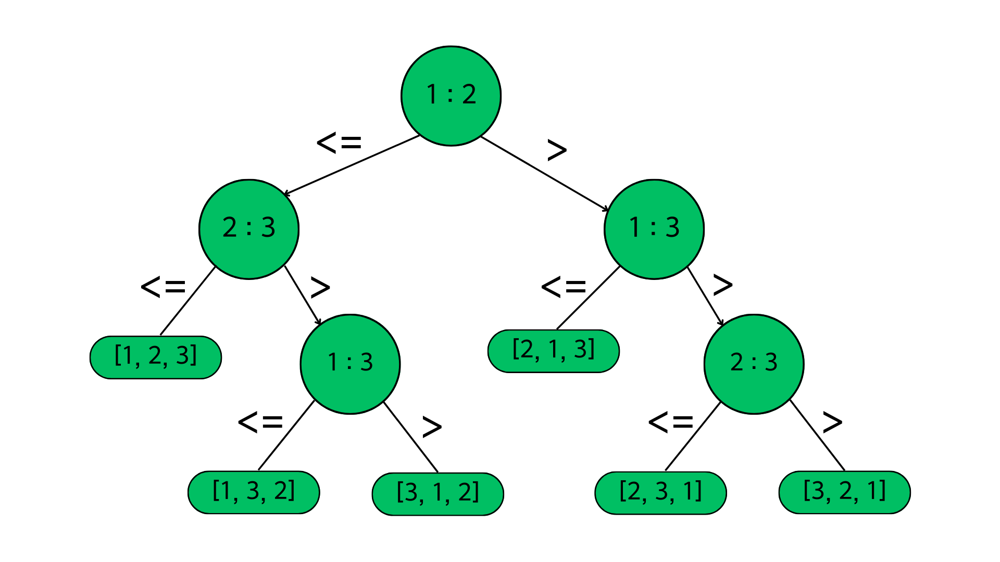
            
            단말 노드를 제외한 비교 노드(원)은 n번째 요소끼리 비교한다.
            
            보다시피 3개의 요소를 모든 경우의 수로 비교해 보았다.
            
            더이상의 비교 케이스는 없기 때문에, 단말 노드를 제외한
            
            트리의 높이가 비교 횟수, 즉 시간복잡도 라는걸 알 수 있다.
            
            따라서 최악의 경우에도 3번(log₂3!)이다.
            
            단말 노드의 갯수는 3! = 3 * 2 * 1 = 6 인걸 볼 수 있다.
            
            n!은 n개의 요소들로 만들 수 있는 모든 순열 조합 갯수이다.
            
            즉, n! 에 log₂를 하면 **최악의 경우의 비교 횟수(비교 정렬의 하한)**값이 도출된다.
            
            이걸 정식으로 공식화 시킨게 OEIS A001768 수열 이다.
            
            - OEIS A001768 수열
                
                **n개의 요소를 정렬하기 위해 필요한 최소 비교 횟수**를 나타내는 수열이다.
                
                이 수열은 비교 기반 정렬 알고리즘에서 n개의 요소를 정렬할 때
                
                이론적으로 필요한 최소한의 비교 횟수를 알려준다.
                
                따라서 이 수식의 결과값을 기준으로 내가 만든 정렬 알고리즘의 성능을 평가 할 수 있다.
                
                $$
                a(n)=⌈log₂n!⌉
                $$
                
                n! = n개의 요소를 배열하는 모든 가능한 순열의 수. 즉 n 팩토리얼. 
                log₂ = 2 가 밑인 이진 로그.
                [ x ] = 올림 함수. 반올림과 다르게 x가 소수이면 무조건 x를 하나 올려준다.
                
                이 수식은 2가 밑이고 r-value 가 n 팩토리얼인 경우에 2의 제곱수가 몇인지 구한다.
                
                $$
                2^x=n!
                $$
                
                구한 값(x)을 올림해주면 그 값이 최소 비교 횟수이다.
                
                예를 들어 **n = 3**일 때 :
                
                1. **3! = 3 x 2 x 1 = 6**
                2. log₂6 ≈ 2.585
                3. 올림하면 **a(3) = 3**
                
                이런식으로 구해진다. 요소가 3개면 최소 비교 횟수는 3번이다.
                
            
            수학적으로 log₂n! = O(nlogn) 이다. → 이것에 대한 증명은
            
            고급 수학 개념이 많이 들어가 생략하겠다..
            
    
    병합삽입 정렬이 등장하기 전에 가장 비교횟수가 적다고 알려진게
    
    이진 삽입(Binary-Insertion)이었다.
    
    - **이진 삽입(Binary-Insertion)**
        
        이진 탐색을 이용한 삽입법이다.
        
        이진 탐색은 정렬된 요소들의 리스트에 검색 범위를 2분의 1로 줄여나가며 탐색한다.
        
        정렬된 요소들에만 사용할 수 있다는 단점이 있지만,
        
        검색 범위가 절반씩 줄어나가 빠르다는 장점이 있다.
        
        이진 탐색의 동작 방식은 다음과 같다.
        
        1. 배열 전체에서 중간 값을 가져와 비교한다.
        2. 중간 값보다 검색 값이 크면 중간 값 기준 배열의 오른쪽 구간을 탐색한다. (mid < key)
        3. 중간 값보다 검색 값이 작으면 중간 값 기준 배열의 왼쪽 구간을 탐색한다. (mid > key)
        4. 값을 찾거나 범위가 역전될때 까지 반복한다.
        
        그림 예시로 좀 더 자세히 보자.
        
        탐색할 시작값 위치 = low, 중간값 위치 = mid, 끝값 위치 = high, 탐색 값 = key
        
        key = 32
        
        1. 각 위치를 정해준다.
            
            .png)
            
            mid = low + (high - low) / 2
                   = 0 + (9 - 0) / 2
                   = 4
            
        2. mid 와 key 값을 비교한다.
        arr[4] < mid 이므로 오른쪽 구간을 탐색 범위로 정한다. 이때 low를 움직인다.
            
            .png)
            
            low = mid + 1
                   = 4 + 1
                   = 5
            
        3. 새로운 low와 high가 정해졌음에 따라 mid도 움직인다.
            
            .png)
            
            mid = 5 + (9 - 5) / 2
                    = 7
            
        4. mid와 key 값을 비교한다.
        arr[7] > key 이므로 왼쪽 구간을 탐색 범위로 정한다. 이때 high를 움직인다.
            
            .png)
            
            high = mid - 1
                     = 7 - 1
                     = 6
            
        5. 새로운 범위에 따라 mid를 움직인다.
            
            .png)
            
            mid = 5 + (6 - 5) / 2
                    = 5 + 0 / 2
                    = 5
            
        6. mid 와 key 값을 비교한다.
            
            32 == 32 값을 찾아 탐색을 종료한다.
            
        
        이진 탐색의 종료 조건은 두가지가 있다.
        
        1. 검색에 성공할 경우
        arr[mid] == key → 5번 그림 참조.
        
        1. 검색에 실패할 경우
        더이상 검색할 범위가 없는 경우다. 이때 low > high 가 성립한다.
            
            .png)
            
        
        이진 삽입은 이진 탐색이 종료되면 마지막 위치 mid 값과 삽입할 key값을 비교하여
        
        mid > key 면 mid 왼쪽, mid < key 면 오른쪽에 삽입한다.
        
        mid == key 면 어느 위치에 넣던 상관없다.
        
    
    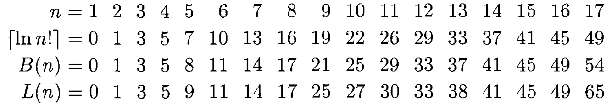
    
    n개의 요소들중 최대 비교 횟수를 정렬 방법에 따라 나열한 표다.
    
    여기서 B(n)이 이진삽입이고, L(n)은 이진 삽입과 거의 근사하지만 조금 효율이 떨어지는
    
    two-way merging이라고 한다. 모두 O(nlogn)에 근접하다.
    
    ln n! = log₂n! 이다. 그럼 해당 줄의 횟수들이 가장 최적일텐데, 제일 가까운 이진 삽입도
    
    n이 5개일때 경우를 보면 8번의 비교 횟수가 나온다. 이진 삽입도 최악일 경우 8번은 나온다는 말.
    
    그럼 이런 경우에 무조건 7번 나오게 할 수 있는 방법이 없을까?
    
    있다. 예시를 통해 한번 알아보자.
    
    - **예시**
        
        5개의 원소를 K1~K5 라고 하겠다.
        
        K1 과 K2 를 비교(+1번)하고, K3 와 K4를 비교(+1번)한다.
        
        2개씩 비교한 후에 그 중 더 큰 요소들을 위로 올린다.
        
        위로 올린 더 큰 요소들끼리 비교(+1번)하여 정렬한다.
        
        나머지 요소인 K5는 그대로 둔다. 이때까지 총 3번 비교했다.
        
        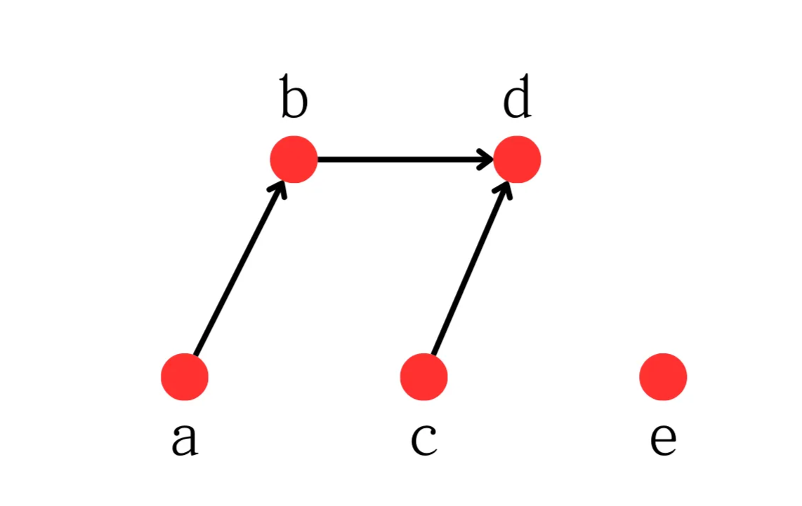
        
        3번의 비교 과정 후에 위와 같은 그래프가 나온다.
        
        → 는 a < b 이다. 더 큰쪽을 향해 화살표가 그려져있다. 이런걸 유향그래프라고 한다.
        
        지금까지의 비교로 a < b < d 는 정렬되어 있다. 따라서 c와 e를 삽입하면 된다.
        
        a→b→d 에 c와 e를 이진 삽입으로 삽입한다. 먼저 e부터 삽입하겠다.
        
        이진 삽입이니 b : e (+1번)부터 하고, 비교 결과에 따라 a : e 혹은 d : e (+1번)를 한다.
        
        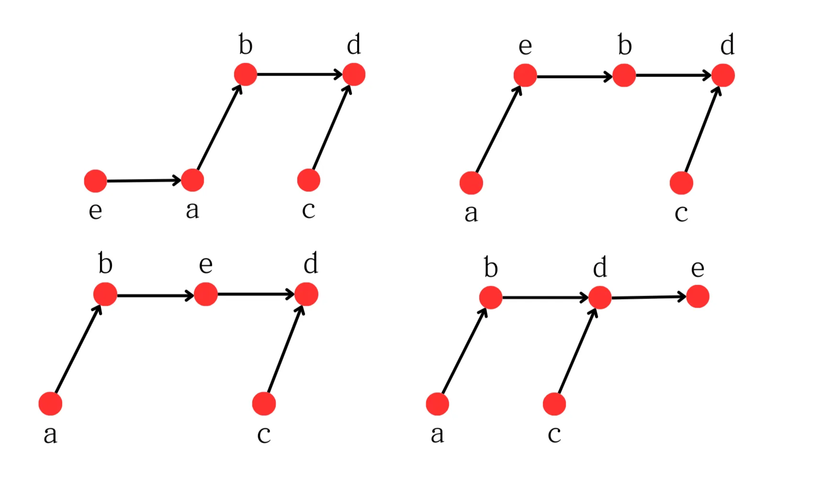
        
        비교 결과에 따라 삽입을 하면 위의 그림처럼 4가지 그래프가 그려진다.
        
        이제 총 비교 횟수는 5번이다. 나머지 c를 삽입할 차례다.
        
        여기서 e 가 d 보다 큰 경우(그림 오른쪽 하단)는 c→d→e 가 성립되어 있기 때문에,
        
        이진 삽입을 a→b 에서만 하면 된다. 이 경우에 비교 횟수는 최대 2번이다.
        
        → (a < c → b : c) or (b > c → a : c)
        
        나머지의 경우는 c→d 를 제외한 요소들에 이진 삽입을 한다.
        
        이 경우들은 3개의 요소들에 이진 삽입을 하기 때문에, 마찬가지로 최대 비교 횟수는 2번이다.
        
        따라서 2가지 경우 모두 최대 비교 횟수는 2번. (+2번)
        
        최종적으로 모든 경우의 최대 비교 횟수는 7번이다.
        
    
    <aside>
    💡
    
    이진 삽입에서 최대 비교 횟수는 원소의 갯수에 따라 달라진다.
    n개의 원소가 정렬되어 있고 어떤 원소를 삽입한다고 하면
    최대 비교 횟수는 log₂n 이다.
    
    원소의 갯수를 특정지어 보겠다.
    
    n = 1 → 최대 비교 횟수 = 1번
    
    n = 2~3 → 최대 비교 횟수 = 2번
    
    n = 4~7 → 최대 비교 횟수 = 3번
    
    n = 8~15 → 최대 비교 횟수 = 4번
    
    이때 n의 최대 갯수 = 2^(최대 비교 횟수) - 1 인걸 알 수 있다.
    
    </aside>
    
    위의 이진 삽입 특성을 이용하여 예시에 나온 방법을 좀 더 일반화 해보자.
    
    - **일반화된 예시**
        
        위의 예시를 포드와 존슨이 일반화 시킨 방법이다.
        
        이번엔 원소가 21개 있다고 치겠다.
        
        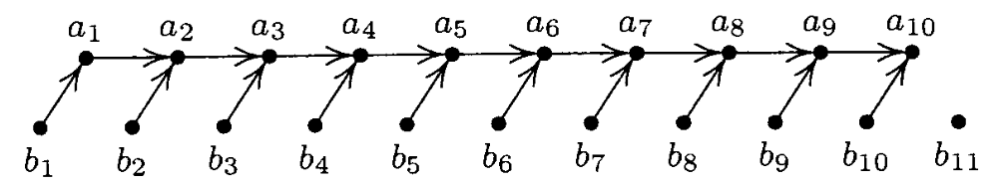
        
        2개씩 짝지어 비교하고 2개 중에 더 큰 원소들을 위로 보내 위의 리스트를 정렬하면
        
        위와 같은 그래프가 나온다. 위의 리스트(a 리스트)를 메인 체인(main chain)이라고 부르겠다.
        
        <aside>
        💡
        
        메인 체인을 정렬하는 방법은 원소가 2개가 남을때 까지 재귀적으로 분할하여
        
        다시 합쳐지면서 저렇게 정렬 되지만 일단 간단하게 생각하자.
        
        </aside>
        
        이제 앞전의 예시에서 처럼 b3까지 삽입해보겠다.
        
        .webp)
        
        메인 체인에 b3, b2 이 삽입되었다.
        
        이제 다음 원소를 삽입해야 하는데, 이때 위에 말한 이진 삽입의 특성을 이용하겠다.
        
        메인 체인에 삽입될 거기 때문에, 메인 체인의 원소 갯수를 기준으로 최대 비교 횟수를 계산한다.
        
        최대 비교 횟수가 2번인 b3, b2는 이미 삽입되었고,
        
        b4 부터는 비교할 메인 체인의 갯수가 최소 6개 이상이다. (a4와는 관계는 이미 결정 되었다.)
        
        원소가 4~7개 일때 최대 탐색 횟수는 3번이다.
        
        따라서 메인 체인의 7번째(a4) 까지는 3번의 비교 횟수로 삽입이 가능하다.
        
        그러므로 c1 ~ a4 까지 비교해야 하는 b5부터 이진 삽입을 한다.
        
        .webp)
        
        b5, b4 까지 삽입된 모습이다.
        
        이제 삽입해야할 가장 가까운 원소는 b6이다.
        
        따라서 비교해야할 메인 체인의 원소는 최소 10개(d1 ~ d10)다.
        
        이제 어디부터 삽입해야 하는지 감이 올 것이다.
        
        그렇다. 최대 비교 횟수가 4번인 8~15개, 즉 d1 ~ a10(15개)까지 비교해야 하는
        
        b11부터 이진 삽입을 한다.
        
        <aside>
        💡
        
        왜 역순으로 삽입할까?
        
        이유는 정순으로 삽입해보면 바로 답이 나온다.
        정순으로 삽입할 시 비교해야할 메인 체인의 갯수가 늘어남과 반대로
        역순으로 삽입하면 메인 체인의 전체 갯수는 늘어나지만
        삽입하는 순서가 줄어들수록 비교 체인이 부분적으로 생성되어 있기 때문에
        **비교 횟수는 늘어나지 않고 같은 수를 유지한다.**
        
        </aside>
        
        지금까지의 비교횟수를 정확히 세지는 않았지만, 정확하게 세어보면 다음과 같다.
        
        10 + S(10) + 2 + 2 + 3 + 3 + 4 + 4 + 4 + 4 + 4 + 4 = 66
        
        S(10)은 메인 체인의 재귀적 정렬 단계에서의 비교 횟수다.
        
        그리고 21개의 원소의 lower-bound를 계산해보면
        
        $$
        2^{65} < 21! < 2^{66}
        $$
        
        66이라는걸 알 수 있다.
        
        위의 식에서 어떤 경우에도 n = 21 일 경우 66번 미만의 비교는 있을 수 없다는 걸 알 수 있다.
        
        참고로 이진 삽입만 사용하면 n = 21 일 경우 74번의 비교가 필요하다.
        
        <aside>
        💡
        
        lower-bound를 기준으로 본다면, 참으로 완벽한 알고리즘이지만
        구현이 복잡하고 복잡한 만큼 실행 시간이 오래걸린다.
        말 그대로 “비교 횟수” 만 최소화 시킨 알고리즘.
        
        </aside>
        
    
    일반화된 예시에서 보았다시피 삽입 순서는
    
    b3, b2; b5, b4; b11, b10, b9, …, b6; b21, b20, b19, …~; 이런식으로 진행된다.
    
    이 순서는 이렇게 정의 될 수 있다.
    
    $$
    b_{t_k},\;b_{{t_k}-1},\;b_{{t_k} - 2},\;...,\;b_{t_{k - 1} + 1};
    $$
    
    위 수식에 나온 t(k) 수열은
    
    $$
    (t_1,\;t_2,\;t_{3},\;t_4,\;t_5,\;...)\; = \; (1,\;3,\;5,\;11,\;21,\;...)
    $$
    
    이렇게 정의된다. 역순으로 삽입을 시작할 원소 위치를 딱 알려준다.
    
    k = 최대 비교 횟수 도 성립한다.
    
    t(k) 수열은 그럼 어떻게 구할까?
    
    - **t(k)수열 구하기**
        
        t(k)를 하나씩 구하는 공식을 얻으면 t(k)수열을 구할 수 있다.
        
        공식을 얻어보자.
        
        %201.png)
        
        먼저 위의 그래프에서 b(t(k))의 t(k)를 구해보자.
        
        생각보다 어렵지 않다. 왜냐하면 앞서 보았던 예시에 방법이 있다.
        
        우린 일반화된 예시에서 b11을 구하기 위해 이진 삽입 최대 비교 횟수를 따졌다.
        
        즉, 메인 체인의 원소 갯수가 15개가 될때까지 세주고 거기까지만 비교하면 되는
        
        b11을 최종적으로 구했다. 그렇다면 위의 그래프에서 b(t(k))를 삽입하려면 
        
        x1 ~ x(2 * t(k - 1)) 범위와  a(t(k - 1) + 1) ~ a(t(k) - 1)까지의 범위만 비교하면 된다.
        
        그래프를 좀 더 해석해 보겠다.
        
        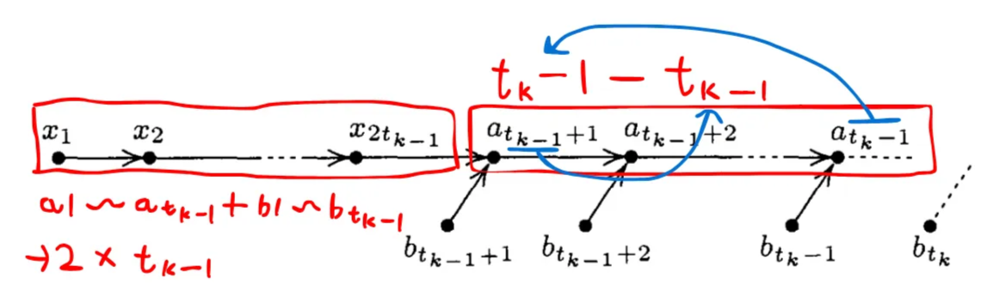
        
        왼쪽 빨간 박스 안의 원소들은 a1 ~ a(t(k - 1))의 리스트에 b1 ~ b(t(k - 1))까지의 원소들을
        
        삽입한 결과다. 따라서 원소 갯수는 t(k - 1) 의 2배가 된다.
        
        오른쪽 빨간 박스 안의 원소들의 갯수는 가장 끝 원소 위치인 t(k) - 1 에
        
        시작 위치인 t(k - 1) + 1 에 -1 을 한 t(k - 1)을 빼주면 된다.
        
        <aside>
        💡
        
        헷갈린다면 일반화된 예시의 그래프를 참조하면서 보자.
        
        </aside>
        
        2 * t(k - 1) + t(k) - 1 - t(k - 1) = 비교할 메인 체인의 최대 원소 갯수 가 된다.
        
        이때 비교할 메인 체인의 최대 원소 갯수는 2^k - 1 로도 계산되기 때문에,
        
        $$
        2t_{k - 1} + t_k - t_{k - 1} - 1 = 2^k - 1
        $$
        
        이 식이 성립한다. 좀더 단순하게 만들면
        
        $$
        t_k + t_{k - 1} = 2^k
        $$
        
        이렇게 된다. 이 식의 각 k에 -1을 해줘도 = 는 성립한다. 따라서
        
        $$
        t_{k - 1} + t_{k - 2} = 2^{k - 1}
        $$
        
        이 식도 성립한다. 이 식의 양변에 2씩 곱해보겠다.
        
        $$
        2t_{k - 1} + 2t_{k - 2} = 2^k
        $$
        
        이렇게 된다. 우변은 2^(k - 1) 이었기 때문에 2를 곱하면 제곱이 하나 늘어나 k가 되었다.
        
        여기서 우변인 2^k은 어디서 많이 본거다. 2번째 수식의 우변이랑 똑같다. 따라서
        
        $$
        2t_{k - 1} + 2t_{k - 2} = t_k + t_{k - 1}\;
        $$
        
        이 식이 성립한다. 여기서 우변의 t(k - 1)을 좌변으로 옮기면 t(k)를 구할 수 있다.
        
        $$
        t_{k - 1} + 2t_{k - 2} = t_k
        $$
        
        좌 우변 위치를 바꾸면
        
        $$
        t_k = t_{k - 1} + 2t_{k - 2}
        $$
        
        이런 식이 나온다. t(k)를 구하는 공식이다.
        
        t(0) = 1
        
        t(1) = 1
        
        t(2) = t(1) + 2 * t(0) = 1 + 2 = 3
        
        t(3) = t(2) + 2 * t(1) = 3 + 2 = 5
        
        t(4) = t(3) + 2 * t(2) = 5 + 6 = 11
        
        …
        
        참고로 위의 공식은 **야콥스탈 수(Jacobsthal numbers)**의 공식과 같다.
        
        따라서 야콥스탈 수 공식을 사용하면 t(k)를 쉽게 구할 수 있지만, 필수는 아니다.
        
        t(k)는 이진 삽입의 최대 비교 횟수에 좌우되기 때문이다. 예를 들어,
        
         int nextCnt = 3; 을 설정하고, 이 수에 반복해서 * 2 + 1 을 해준다.
        
        그럼 이진 탐색의 최대 비교 횟수가 바뀌는 최대 원소 갯수만큼 수가 바뀐다.
        
        ex) 3 → 7 → 15 → 31
        
        이렇게 구해지는 값에 + 1을 한만큼 메인 체인의 갯수를 세어주고, 해당 번째와 짝지어진
        
        b를 구하면 b의 야콥스탈 수를 구하는거랑 결과값이 똑같다.
        
        실제로 포드, 존슨이 일반화 시킨 이 알고리즘에 야콥스탈 수는 포함되어 있지 않다.
        
    
    여기까지가 포드-존슨 알고리즘이다. 요약하자면,
    
    1. n개의 원소들을 2개씩 짝지어(Pair)비교한다. (만약 홀수면 나머지 하나는 남겨둔다.)
    2. 1단계에서 판정한 더 큰 원소들을 2~3개가 남을때 까지 재귀적으로 분할한다.
    3. 2단계에서 남은 2~3개를 정렬시키고, Pair인 원소들과 남은 원소까지 메인 체인에 이진 삽입한다.
    4. 재귀를 탈출하며 3단계를 반복한다.
    

출처 : 

- The Art of Computer Programming (vol. 3_ Sorting and Searching) (2nd ed.) [Knuth 1998-05-04].pdf
- [**[Algorithm] 3-6. 정렬의 하한(lower bound)**](https://ict-nroo.tistory.com/57)
- https://80000coding.oopy.io/6880ebc0-acb3-4225-809f-37fc419adf71
- https://yoongrammer.tistory.com/75

# 구현중 깨달은 점

# 포드 존슨 알고리즘 구현 기록

포드 존슨 알고리즘의 특성을 전부 만족하기 위해서, 많은 고민을 해보았는데

아무리 생각해봐도 비교 횟수를 log2n! 유지하면서 재귀적으로 정렬하는 방법은

컨테이너에 단순히 int형만 받는거로는 불가능하다.

제일 막히는 부분이 알고리즘 작동 원리상 원소끼리 비교한 비교 관계를 기억해야 한다.

재귀로 돌다 보니 계속 파고 들어가면 비교 관계가 쌓인다.

단순히 인덱스 매핑으로 비교 관계를 유지 할 순 없었다. 재귀 함수 마지막 코드에

정렬을 하고 빠져나오기 때문에 순서가 재귀 들어오기 전이랑 바뀌어서

이전 재귀에 매핑한 배열, 즉 삽입할 작은 원소들 배열이랑 크기는 같지만 매핑이 안된다.

삽입할 작은 원소 배열을 비교한 큰 원소랑 묶은 pair형식의 배열로 만들면

일단 2개로 묶이기 때문에 비교 관계를 쌓을 순 없다. 따라서 해당 재귀에 pair배열을

남겨놔야 하는데, 그럼 정렬된 메인 체인이 돌아왔을때 남겨져 있던 pair배열과 순서가

달라 큰 값을 서로 비교해가면서 어느 작은 값이랑 pair로 묶여있는지 추가적으로 탐색해야한다.

find함수를 써야하는데, 선형 자료구조라 시간복잡도가 많이 올라간다.

따라서 생각난 방법이, 비교 관계가 쌓인다면 그만큼 관계를 저장해주면 된다.

즉 벡터에 int형 벡터를 담는 2차원 벡터로 만들어서 각 원소끼리 비교한 비교 관계를

2차원 벡터 원소(벡터)에 계속 push_back하는거다. 마치 스택처럼 쌓이게.

이해하기 쉽게 그림 예시를 들겠다.

- **그림 예시**
    
    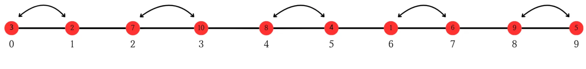
    
    위와 같은 10개의 원소를 가진 벡터가 있다고 치자. (클릭하면 확대할 수 있다.)
    
    원 안의 숫자가 원소 값이고, 원 밑이 인덱스이다. n 과 n + 1, 2개씩 짝지어서 비교한다.
    
    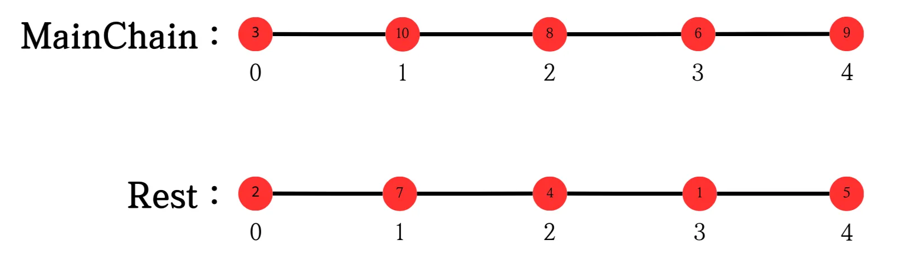
    
    비교 결과에 따라 메인 체인과 나머지 요소들이 나뉜다.
    
    메인 체인과 Rest의 비교 관계가 인덱스로 매핑되는걸 볼 수 있다. (이걸 잘 기억하자.)
    
    여기서 나머지 요소들(Rest)의 인덱스를 메인 체인의 대응하는 각 벡터안에 넣어준다.
    
    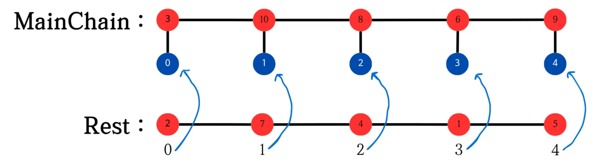
    
    메인 체인은 2차원 벡터이기 때문에, 이렇게 push_back이 가능하다. Rest도 마찬가지.
    
    여기서 한번 재귀를 들어간다면,
    
    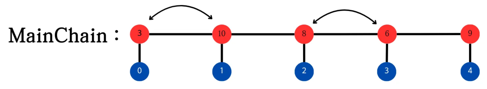
    
    메인 체인에서 비교 한 후 새로운 메인 체인으로 나누고
    
    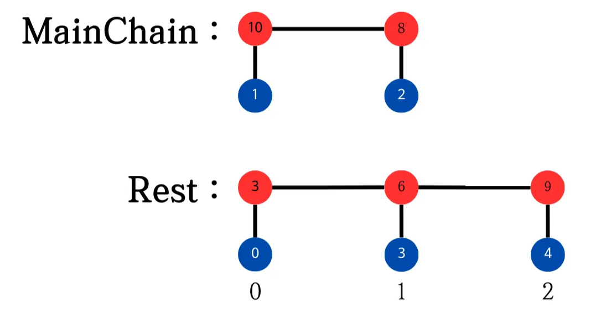
    
    Rest의 인덱스를 넣어주면
    
    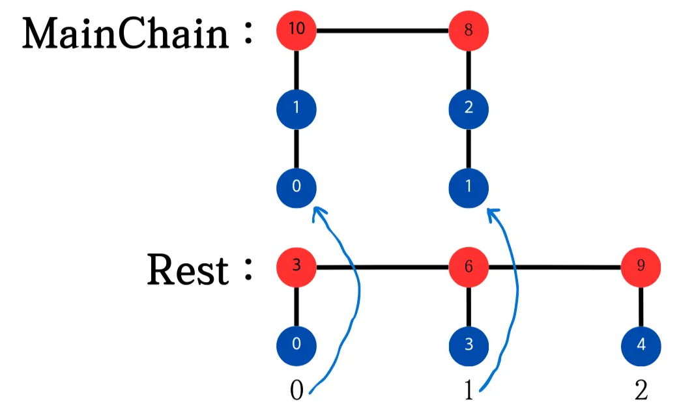
    
    이렇게 된다.
    
    메인 체인의 벡터 갯수가 3개 이하이기 때문에, sort함수로 정렬해준다.
    
    <aside>
    💡
    
    sort함수에 무려 2차원 벡터를 넘겨주는게 가능하다..!
    각 벡터의 첫번째 요소를 기준으로 정렬한다고 한다.
    
    </aside>
    
    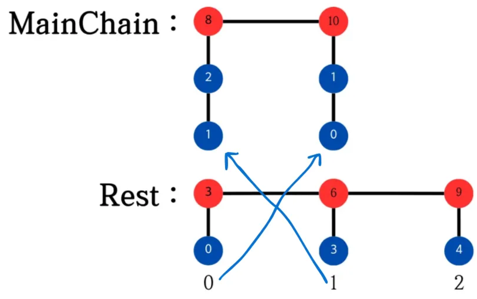
    
    메인 체인이 빨간 원값 기준으로 정렬되었다. 여기서 유심히 봐야 할 것이 있다.
    
    이 그림이 기억나는가?
    
    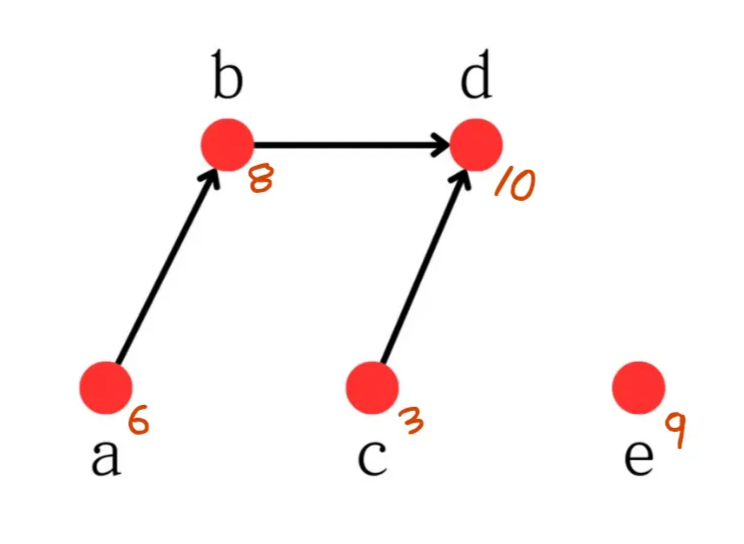
    
    (상단 포드 존슨 알고리즘 개념 설명 예시 참조)
    
    지금 우리가 가지고 있는 메인 체인의 첫번째 요소, 즉 메인 체인의 빨간 원들이 b, d이고,
    
    a, c는 각 메인 체인 벡터의 마지막 파란 원값(Rest 인덱스)에 대응하는 Rest 빨간 원이다.
    
    e는 Rest의 3번째 원소이다. 이제 감이 오는가?
    
    Rest 인덱스 값을 메인 체인의 원소들마다 저장해 주었던건
    
    메인 체인이 나열된 순서대로 비교했던 Rest의 원소들을 나열하기 위함이었다.
    
    그렇다면 왜 메인 체인의 원소(파란 원)에 Rest의 값 자체를 넣지 않고 인덱스를 넣었을까?
    
    메인 체인이 정렬 될때, 결국엔 벡터들이 정렬되기 때문에
    
    파란 원도 빨간 원과 같이 움직인다.
    
    만약 메인 체인의 파란 원에 Rest의 인덱스가 아닌 Rest 빨간 원의 값을 넣었다면
    
    메인 체인이 정렬되며 Rest와 인덱스 기준으로 비교 관계가 매핑되었던게 사라지면서
    
    삽입을 시도할때 메인 체인의 파란 원 값과 대응되는 Rest의 빨간 원 값을 찾기 위해 Rest를 탐색해야 한다.
    
    이는 **포드 존슨 알고리즘에 포함되지 않은 비교 행위이므로**, 구현에 위반된다.
    
    그냥 Rest의 빨간 원 값만이 아닌 벡터 자체를 메인 체인 파란 원에 주면 어떤가? 라고 묻는다면
    
    3차원 벡터가 되기 때문에 구현히 굉장히 까다로워 진다.
    
    할 수는 있겠으나.. 가독성, 복잡성과 메모리 측면에서 바람직하지 않다고 생각한다.
    
    반면에 인덱스를 넣는다면 삽입을 시도할때 추가적인 비교 없이
    
    바로 Rest의 원하는 원소(벡터)에 접근이 가능하다.
    
    이 방법으로 이제부터 삽입 해보겠다.
    
    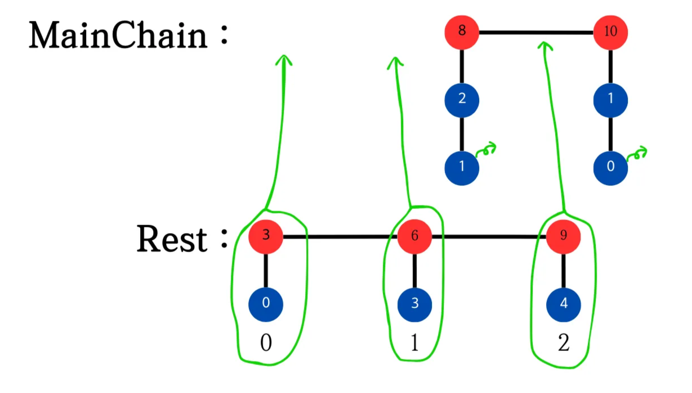
    
    이진 삽입으로 삽입하는 방법은 상단 알고리즘 설명에 자세히 써놓았으니 참고하자.
    
    메인 체인 벡터들의 마지막 원소(1, 0)번째 Rest 벡터 원소들과, 나머지 2번째 원소까지 삽입한다.
    
    (실제 삽입 순서는 0, 2, 1번째 이다.)
    
    삽입을 완료한 인덱스(파란 원)는 삭제한다.
    
    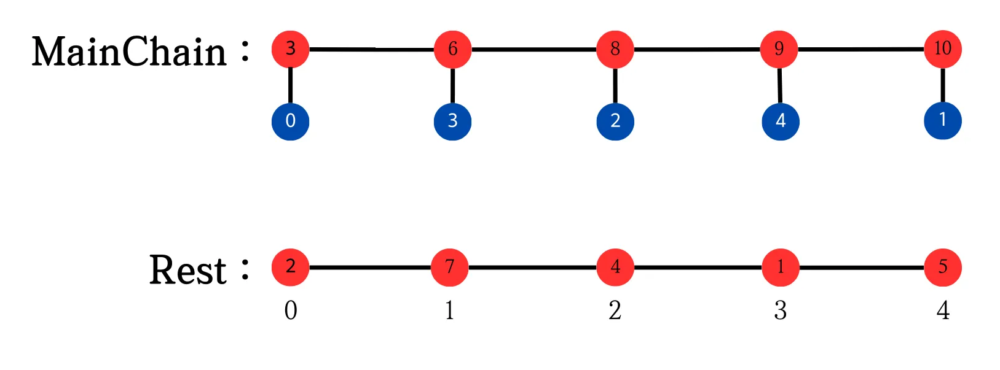
    
    삽입을 완료한 모습이다. 3번째 그림과 비슷하지만 메인 체인이 정렬된게 차이점이다.
    
    이전과 똑같은 방식으로 이진 삽입하고, 파란 원을 빼주면
    
    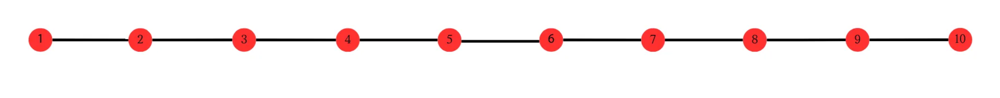
    
    정렬된 벡터를 얻을 수 있다.
    

위에 설명한 예시의 방법대로 구현한 코드를 찬찬히 보자.

- **코드 리뷰**
    
    ```cpp
    class PmergeMe
    {
        private :
            std::vector<int> originalData;
            std::vector<int> vec;
            std::list<int> lst;
            PmergeMe();
    
        public :
    		    ~
    };
    ```
    
    과제에서 요구한 PmergeMe 클래스이다.
    
    originalData에 처음 프로그램의 매개변수로 들어온 인자들(양수)을 하나씩 넣어준다.
    
    벡터와 리스트 두 컨테이너에 알고리즘을 적용시킬 것이기에 vec과 lst를 선언해주었다.
    
    벡터와 리스트 둘다 로직은 똑같기 때문에 벡터 위주로 보겠지만,
    
    리스트 코드에 특이점이 있을 경우 같이 보겠다.
    
    ```cpp
    void PmergeMe::FJSort()
    {
        Vec2D mainChainVec;
        Lst2D mainChainLst;
        clock_t start, end;
    
        printBefore();
    
        pushVecs(mainChainVec); // 1차원 벡터들을 2차원 벡터에 삽입
        start = clock();
        FJSortVec(mainChainVec);
        getSortedVec(mainChainVec);
        end = clock();
    
        printAfter();
        printTimeSpent(end - start, "vector");
    
        pushLsts(mainChainLst); // 1차원 리스트들을 2차원 리스트에 삽입
        start = clock();
        FJSortLst(mainChainLst);
        getSortedLst(mainChainLst);
        end = clock();
    
        printTimeSpent(end - start, "list");
    }
    ```
    
    start와 end는 알고리즘의 실행 시간을 ms단위로 재기위해 선언했다.
    
    originalData 에 있는 정수형 양수들을 pushVecs, pushLsts 함수로
    
    벡터의 첫번째( [0] )에 담아 mainChainVec과 mainChainLst에 push_back 해준다.
    
    그 후 완성된 2차원 벡터, 리스트인 mainChainVec, mainChainLst를 포드 존슨 알고리즘 함수인
    
    FJSortVec, FJSortLst 에 넘겨준다.
    
    알고리즘 적용이 끝난 0번째 원소 기준으로 정렬된 2차원 컨테이너들을
    
    getSortedVec과 getSortedLst로 클래스의 멤버인 vec 과 lst에 0번째 원소 값만 복사해준다.
    
    ```cpp
    void PmergeMe::pushVecs(Vec2D& vec2D) const
    {
        for (std::size_t i = 0; i < originalData.size(); ++i)
        {
            std::vector<int> elementVec;
    
            elementVec.push_back(originalData[i]);
            vec2D.push_back(elementVec); // 1차원 벡터 삽입
        }
    }
    ```
    
    originalData를 순회하며 각 원소를 1차원 컨테이너의 0번째에 담아 2차원 컨테이너에
    
    하나씩 push_back해준다.
    
    ```cpp
    PmergeMe::Vec2D PmergeMe::FJSortVec(Vec2D& mainChain) const
    {
        Vec2D rest;
    
        if (mainChain.size() > 3)
            splitChain(mainChain, rest);
    
        if (mainChain.size() > 3)
            mainChain = FJSortVec(mainChain); // 재귀
        else
            std::sort(mainChain.begin(), mainChain.end());
    
        if (rest.empty() == false)
            binaryInsert(mainChain, rest);
    
        return (mainChain);
    }
    ```
    
    FJSortLst도 똑같이 생겼다. 리스트를 사용하는것만 다르다.
    
    rest는 해당 재귀에서 삽입을 완료하면 사용할 일이 없어지기에 지역 변수로 선언했다.
    
    매개변수로 들어온 mainChain은 아직 분리되지 않은 체인이다.
    
    따라서 splitChain에 매개변수의 mainChain과 rest를 넘겨주어
    
    메인 체인과 Rest를 분리해준다.
    
    분리 된 후에 메인 체인 원소 갯수가 3개 이상이라면, 재귀를 돌아 다시 분리시킨다.
    
    아니면 sort함수로 정렬시킨다.
    
    분리될 것이 없거나 재귀에서 탈출하면 binaryInsert로 이진 삽입을 한다.
    
    ```cpp
    void PmergeMe::splitChain(Vec2D& mainChain, Vec2D& rest) const
    {
        Vec2D newMainChain;
        std::size_t i = 0;
        std::size_t j = 0;
    
        while (i < mainChain.size() - 1)
        {
            if (mainChain[i][0] <= mainChain[i + 1][0])
            {
                newMainChain.push_back(mainChain[i + 1]);
                rest.push_back(mainChain[i]);
                newMainChain[j].push_back(j);
            }
            else
            {
                newMainChain.push_back(mainChain[i]);
                rest.push_back(mainChain[i + 1]);
                newMainChain[j].push_back(j);
            }
    
            ++j; // j = rest 와 newMainChain의 마지막 인덱스와 항상 동일
            i += 2;
            if (i == mainChain.size() - 1)
                rest.push_back(mainChain[i]);
        }
    
        mainChain = newMainChain;
    }
    ```
    
    분리되지 않은 mainChain을 순회하며 i번째 원소의 [0]과 i + 1의 [0]을 비교한다.
    
    둘 중에 더 크거나 같은 벡터를 newMainChain에 넣어주고, 작은건 rest에 넣어준다.
    
    rest의 인덱스를 newMainChain의 원소 벡터에 push_back해줘야 하기 때문에
    
    newMainChain 과 rest의 현재 인덱스에 대응하는 j 를 newMainChain에 push_back 해준다.
    
    마지막 비교할 짝이 없는 원소 벡터는 rest에 push_back 해준다.
    
    매개 변수에 참조형으로 들어온 mainChain에 newMainChain을 복사시켜
    
    mainChain을분리된 메인 체인으로 업데이트 시킨다.
    
    ```cpp
    void PmergeMe::binaryInsert(Vec2D& mainChain, Vec2D& rest) const
    {
        std::vector<std::size_t> restIndex;
        std::vector<std::size_t> Jacobs;
    
        moveIndex(mainChain, rest, restIndex); // rest의 인덱스 복사
    
        makeJacobsNums(Jacobs, restIndex);
    
        int high = 1;
        for (std::size_t i = 0; i < Jacobs.size(); ++i)
        {
    
            for (std::size_t j = Jacobs[i] - 1; i == 0 || j > Jacobs[i - 1] - 1; --j)
            {
                mainChain.insert(mainChain.begin() +
                        binarySearch(mainChain, rest[restIndex[j]][0], high - 1),
                        rest[restIndex[j]]);
                if (!i)
                    break ;
            }
    
            high = high * 2 + 1;
            if (high > static_cast<int>(mainChain.size()))
                high = static_cast<int>(mainChain.size()); // high 조정
        }
    }
    ```
    
    이진 삽입을 진행하는 코드다.
    
    restIndex라는 1차원 벡터를 선언한 이유는 메인 체인에 원소 벡터들이 삽입될때
    
    처음 rest와 대응되는 메인 체인 원소 벡터 마지막 원소인 rest의 인덱스들이 나열된 순서가 바뀌면서
    
    rest와 대응되지 않는 문제점이 발생하여 삽입 되기 전 moveIndex에서 restIndex에 복사해준다.
    
    그 다음 야콥스탈 번째부터 삽입을 시도할것이기 때문에 makeJacobsNums로 야콥스탈 벡터를 만들어준다.
    
    high는 이진 탐색할 범위다.
    
    반복문 안에서 해당 야콥스탈 번째부터 수를 빼주면서 하나씩 삽입한다.
    
    어디에 삽입할지는 binarySearch로 이진 탐색하여 정해준다.
    
    high를 2 * 1 + 1 한 이유는, 이진 탐색의 최대 비교 횟수가 증가하는 범위에 따라
    
    high도 늘려준 것. 늘렸을때 메인 체인 사이즈 보다 크면 안되니 조정해준다.
    
    삽입을 하면서 이진 탐색을 하기 때문에 high는 항상 같은 수로 유지되야 한다. → 이 부분이
    
    기억이 안나면 개념 설명의 일반화된 예시를 다시 보자.
    
    <aside>
    💡
    
    high, 즉 이진 탐색 범위가 항상 전체면 잘못된 구현이다!
    
    </aside>
    
    ```cpp
    void PmergeMe::moveIndex(Vec2D& mainChain, Vec2D& rest,
            std::vector<std::size_t>& restIndex) const
    {
        for (std::size_t i = 0; i < mainChain.size(); ++i)
        {
            restIndex.push_back(mainChain[i].back());
            mainChain[i].pop_back();
        }
    
        if (restIndex.size() != rest.size())
            restIndex.push_back(rest.size() - 1); // 나머지 요소가 존재할때
                                                  // 나머지 요쇼 인덱스 삽입
    }
    ```
    
    복사한 인덱스는 메인 체인 원소 벡터에서 pop_back시켰다.
    
    마지막 조건문은 rest에 비교짝이 없었던 원소도 삽입해야 하기 때문에 restIndex에
    
    해당 원소 인덱스를 넣어주는 코드다.
    
    ```cpp
    void PmergeMe::makeJacobsNums(std::vector<std::size_t>& Jacobs,
            std::vector<std::size_t>& restIndex) const
    {
        Jacobs.push_back(1);
        if (restIndex.size() > 1)
            Jacobs.push_back(3);
        else
            return ;
    
        for (int n = 2; Jacobs.back() < restIndex.size(); ++n)
            Jacobs.push_back(Jacobs[n - 1] + 2 * Jacobs[n - 2]);
    
        Jacobs.back() = restIndex.size(); // 야콥스탈 수 조정
    
    }
    ```
    
    야콥스탈 수를 만드는 함수이다.
    
    1과 3은 먼저 넣어주고 다음부턴 n - 1 과 n - 2 번째 원소들을 이용하여 구한다.
    
    마지막에 야콥스탈 수가 삽입할 rest원소 갯수보다 크면 안되니 조정해준다.
    
    ```cpp
    void PmergeMe::makeJacobsNums(std::list<std::size_t>& Jacobs,
            std::list<std::size_t>& restIndex) const
    {
    		Tlst_it J_it = Jacobs.begin();
    
        Jacobs.push_back(1);
        if (restIndex.size() > 1)
            Jacobs.push_back(3);
        else
            return ;
    
        while (Jacobs.back() < restIndex.size())
            Jacobs.push_back(*(getPrevIt(J_it, 1)) + 2 * *(getPrevIt(J_it, 2)));
    
        Jacobs.back() = restIndex.size();
    
    }
    ```
    
    야콥스탈 수를 리스트로 만든 코드다.
    
    위와 전반적으로 비슷하나 특이한 점들이 있는데,
    
    이터레이터인 J_it에 Jacobs에 아무것도 없을때 부터 begin() 이터레이터를 복사 시킨다.
    
    이렇게 하면 Jacobs의 end()가 J_it에 복사된다. 이유는,
    
    컨테이너가 비었을때 begin()이 가리키는 곳과 end()가 가리키는 곳이 똑같아서 라고 한다.
    
    그럼 왜 end()를 가리키게 했을까?
    
    이유는 **리스트의 이터레이터가 삽입 후에도 유효하다는 점**에서 온다.
    
    예를 들어, 사이즈가 4인 list의 it 이라는 이터레이터가 list의 2번째 원소를 가리킨다고 하자.
    
    이때 list의 2번째에 다른 원소를 삽입시켜도, it은 전에 가리키던 해당 원소를 계속 가리키고 있다.
    
    왜나하면 리스트는 메모리에 연속적으로 배치되지 않기 때문이다.
    
    만약 벡터였다면 2번째 위치에 삽입시 원소들이 뒤로 밀리기 때문에
    
    2번째 원소를 가리키는 이터레이터가 삽입된 원소를 가리킬 것이다.
    
    이 점을 이용하여, 리스트의 end()를 가리키게 하고 end() - 1 과 end () - 2 번째 원소로
    
    야콥 스탈 수를 계산하며 계속 push_back 해준다.
    
    마지막으로, 컨테이너 별로 알고리즘이 수행된 시간을 출력시킨 결과값을 보자.
    
    - n = 10 일때
        
        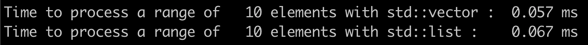
        
    - n = 100
        
        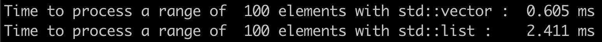
        
    - n = 1000
        
        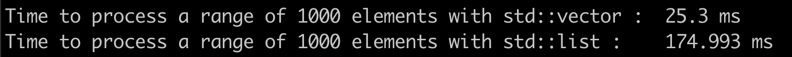
        
    - n = 10000
        
        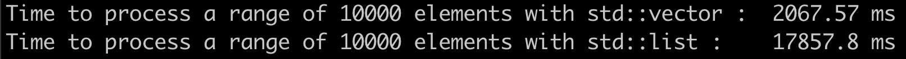
        
    
    원소 갯수가 많아 질수록 시간차이가 기하 급수적으로 난다. 왜이럴까?
    
    가장 중요한 차이점은 벡터는 랜덤 엑세스([])가 가능하고, 리스트는 불가능 하다는 점이다.
    
    특정 위치에 있는 원소를 얻으려면 접근을 해야 한다.(이 알고리즘엔 이런 경우가 자주 있다)
    
    벡터의 랜덤 엑세스는 인덱스로 특정 위치에 바로 접근이 가능해 접근시 시간복잡도가 O(1)이다.
    
    그러나 리스트는 특정 위치에 접근하려면 리스트 전체를 순회하며 탐색을 해야한다.
    
    왜냐하면 노드마다 저장된건 앞,뒤의 노드를 가리키는 포인터 뿐이기 때문에,
    
    이터레이터를 사용하여 노드를 하나씩 접근해 한자리씩 위치를 옮겨가며 특정 위치까지 가야한다.
    
    따라서 시간 복잡도가 O(n)이고, 원소 갯수(n)이 많아질수록 탐색이 더 오래 걸릴 수 밖에 없다.
    

- 구현 후기
    
    
    알고리즘이 복잡한 만큼 구현하는 도중 많은 문제에 부딪혔다.
    
    특히 포드 존슨 알고리즘의 특성을 전부 만족한채로 구현하는게 생각보다 어려웠다.
    
    많은 교육생들이 이 부분을 만족하지 못한채 구현하는 걸로 알고있고, 구현하는 도중
    
    그 이유를 어느정도 알 것 같았다. 대부분은 알고리즘의 작동 방식만 보고 비슷해 보이게
    
    구현 하지만 재귀를 통한 분할을 하지 않거나, 비교 횟수 최소화 조건을 무시하는 등
    
    구현 상 편리를 위해 몇 가지 핵심 조건을 빼먹는 경우가 잦다.
    
    작동 원리를 파악하지 못하고 작동 방식만 보고 그대로 따라하는 경우도 있다.
    
    물론 이렇게 해도 평가는 웬만하면 통과한다. 평가자도 알고리즘을 잘 모르는 경우가 많으니깐.
    
    그러나 난 그게 싫었고, 이론을 제대로 이해하고 그에 맞는 구현을 하고 싶었다.
    
    그리고 그 결과 만족했다. 평가자들도 만족했기에 성취감이 더 좋았다. 
    
    깊게 파보고 그걸 정리해놓는다면 나에게 큰 자산이 되기에
    
    계속해서 이렇게 해보려고 한다. 대충 넘어가지 말고 자세히 배우고, 그걸 잘 정리하자.
    
    고생했다!
    

- [1]    36896 illegal hardware instruction
    
    이런 오류를 처음 봤는데, 2개 이상의 포인터가 같은 객체를 가리킬시
    
    그 포인터들을 모두 delete 하려고 하면 발생하는 오류다.
    
    이미 소멸한 객체에 delete를 해서 또 소멸자가 호출되면 오류가 뜬다.
    
    더블 free문제랑 비슷한듯.
    
    얕은 복사를 해도 이런 문제가 자주 발생할 것 같다.
    

- std::adjacent_difference
    
    벡터 인접 두 요소들의 차이값을 다른 벡터에 저장해주는 함수
    
    ```cpp
    std::vector<int> result(vec.size());  // 크기를 vec.size()로 미리 할당
    
    // result.begin()은 충분한 공간을 가리키므로 안전하게 동작
    std::adjacent_difference(vec.begin(), vec.end(), result.begin());
    ```
    
    이 함수를 쓰려면 미리 크기가 할당되어 있는 벡터의 시작 이터레이터를 3번째 매개 변수에 넣어줘야 한다.
    
    크기가 할당되어 있지 않으면 seg fault가 난다.
    
    ```cpp
    std::vector<int> result;  // 크기가 0인 벡터
    
    // result.begin()은 유효한 메모리 공간을 가리키지 않기 때문에 오류 발생 가능
    std::adjacent_difference(vec.begin(), vec.end(), result.begin()); 
    ```
    
    이유는 std::adjacent_difference함수에서 result 벡터에 push_back 처럼 새로 할당하는 동작 없이
    
    그저 들어온 벡터의 이터레이터만 반복문 안에서 움직이면서 연산후 복사한다고 한다.
    

- const 메서드와 const_iterator
    
    const 메서드는 어떠한 멤버 값 수정도 없을 거라는 명시이기 때문에
    
    const메서드 안에서 다른 메서드를 사용하려면
    
    다른 메서드들도 const여야 한다. 그래야 상수성이 보장된다.
    
    또한 const 메서드 안에서는 이터레이터를 반환시키면
    
    그 이터레이터도 const여서 이터레이터끼리도 자료형을 맞춰야 한다.
    
    cpp09 ex00 에서 map 컨테이너의 이터레이터를 받아오는 메서드가 const 였다.
    
    여기서 map.begin() 을 하니 map::iterator 가 아니라 map::const_iterator가 반환되었다.
    
    따라서 나도 해당 이터레이터를 받을때 const_iterator로 받아주었다.
    
    이러한 const_iterator는 주소 연산은 가능하지만 참조해서 값 수정을 하는건 불가능하다.