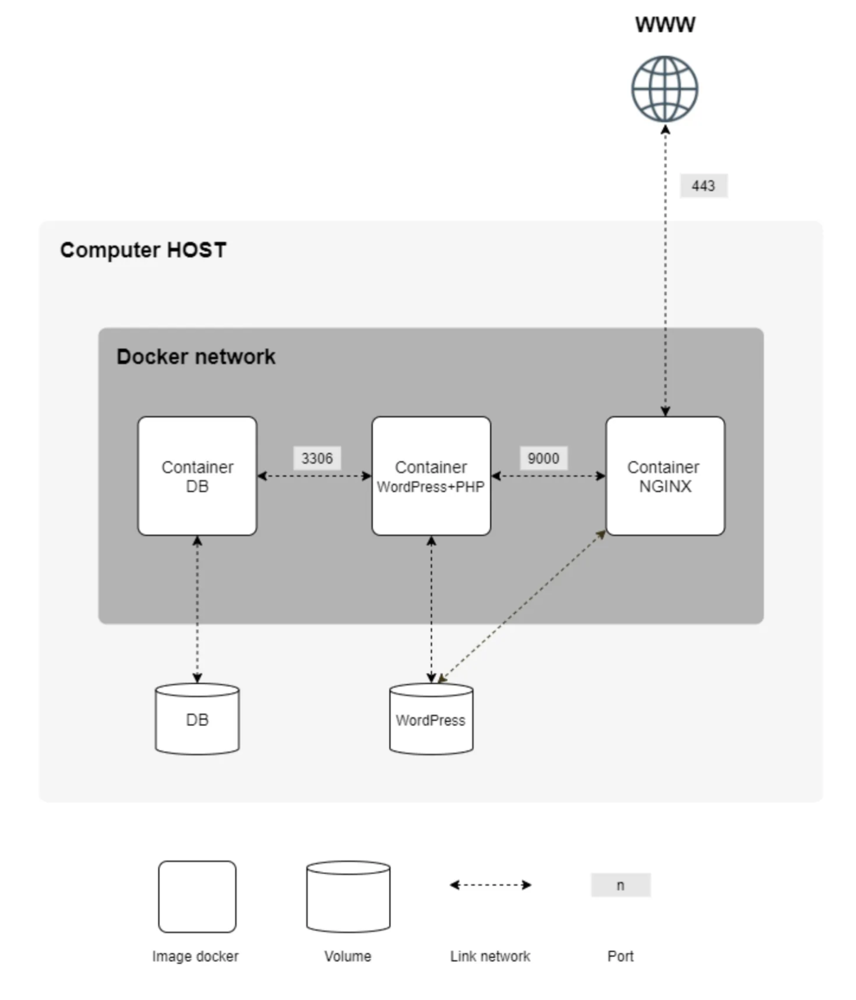
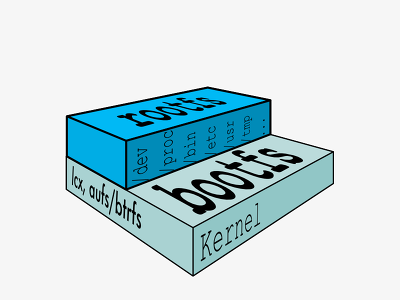
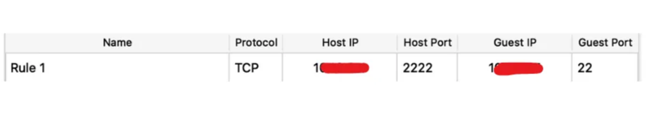
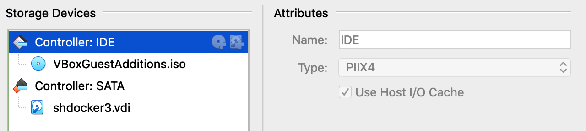
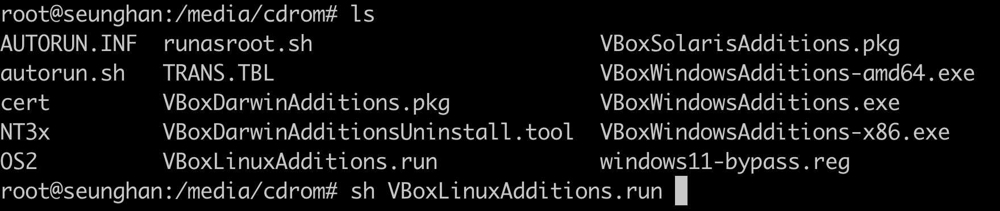

# Inception

설명: 도커와 컨테이너
상태: 완료


**도커(Docker)를 사용하여 컨테이너를 만들고 서로 상호작용 할 수 있게 만드는 과제이다.**

# 과제 소개

과제 설명에 앞서 과제 이름부터 짚고 가보자. 왜 `Inception` 일까?

영화 인셉션에서는 꿈 속의 꿈 처럼 중첩된 꿈 속으로 들어간다.

이 과제도 비슷하다. virtualBox로 가상 환경을 만들고, 그 가상 환경 안에서

도커라는 프로그램을 사용해 가벼운 가상 환경인 컨테이너를 또 다시 만든다.

꿈 속의 꿈, 가상 환경안의 가상 환경.. 비슷하긴 하다 ㅋㅋ

하지만 한 가지 의문점이 들었다. 멀쩡한 호스트 머신에도 도커 설치해서

컨테이너를 만들 수 있는데, 굳이 virtualBox로 가상 머신을 통으로 만들어서

거기다가 도커를 설치해 컨테이너를 띄우는 이유가 뭘까?

이유는 생각보다 명확했는데, 도커 자체가 리눅스 운영체제에서 제일 잘 돌아간다.

정확히는 도커가 리눅스의 커널 시스템을 사용해서 그렇다.

왜 리눅스의 커널을 사용하냐면, 리눅스 커널은 `cgroups, namespace, chroot` 등

다양한 격리화 기능들이 존재 한다. 이 격리화 기능들을 통해

각 컨테이너에 OS 자원을 분배하여 독립된 파일 시스템과 네트워크 환경, 프로세스들을

제공함으로써 격리된 새로운 환경을 만드는게 가능하다.

따라서 호스트의 커널을 공유받는 방식이지만, 격리되어 있기 때문에

컨테이너 환경에서 일어나는 일들은 호스트 머신에 영향을 주지 않는다.

서론이 길었는데, 과제를 본격적으로 소개하겠다.

virtualBox로 만든 가상 환경 안에서, 도커를 사용하여 컨테이너를 총 3개 생성해야 한다.

1. nginx (HTTP 웹서버)
2. wordpress + php-fpm (CMS, php코드 처리 앱)
3. mariaDB (DBMS)

이 세 컨테이너를 도커 네트워크로 연결하고, 설정 값을 올바르게 설정해준 다음

웹 사이트를 띄우는게 과제이다. 그림으로 보면 이렇다.



# 개념 정리

- **도커 : 이미지와 컨테이너**
    
    
    도커로 컨테이너를 만드려면 컨테이너의 청사진이 되는 **이미지(Image)** 파일이 있어야 한다.
    
    이를 기반으로 컨테이너를 만들기 때문에, 이미지 파일에는 OS의 핵심 구성 요소,
    
    애플리케이션 파일, 라이브러리, 설정 등이 포함되어 있다.
    
    위의 설명만 들으면 어느정도 감은 올 수 있지만 개념적으로 모호하다.
    
    내부적으로 어떻게 동작하는지 구체적으로 살펴보자.
    
    일단 리눅스의 전통적인 부팅 방법부터 먼저 알 필요가 있다.
    
    
    
    리눅스 기본 구조
    
    리눅스의 부팅을 위해선 **boot file system(bootfs)**와 **root file system(rootfs)**이 필요하다.
    
    bootfs에는 부트로더(ex)GRUB)와 커널이 있고, 부트로더가 커널을 메모리에 로드시켜
    
    커널을 작동시킨 다음 커널이 초기화 작업을 진행한다. 하드웨어와 소프트웨어 전반으로
    
    초기화를 진행한 다음 루트 파일 시스템을 마운트시켜 파일 시스템 트리의 최상위 디렉토리를
    
    구성하여 기본적인 준비를 마친다.
    
    도커 컨테이너도 리눅스 커널 기반이기 때문에 비슷한 구조로 만들어진다.
    
    다만 이미 부팅되어 실행 중인 커널을 공유 받는 거라, **부팅 과정이 필요하지 않다.**
    
    이는 도커가 컨테이너를 빠른 속도로 빌드하는데 일조하는 중요한 특징이다.
    
    
    
    도커 컨테이너의 구조
    
    공유받은 호스트의 커널이 최하단에 있다.
    
    바로 위에 Base Image로서 Debian이 있는데, 이는 rootfs와 비슷한 역할이다.
    
    커널만 있다고 해서 운영체제가 돌아가진 않으니, 운영체제 실행에 필수적인 파일들이 있는
    
    rootfs, 여기서는 Base Image가 필요하다.
    
    Base Image 위쪽 부터는 애플리케이션이다. 텍스트 편집기인 emacs, 웹서버인 Apache 가 있다.
    
    이들 모두 이미지라고 써있는걸 볼 수 있다.
    
    그림을 보면 알겠지만, 베이스 이미지를 포함한 이미지들을 차곡차곡 쌓아올린다.
    
    각 이미지는 **이미지 레이어(Image Layer)**라고도 부르며, 이 레이어들은 **스냅샷**의 역할을 한다.
    
    **파일 시스템에 변화가 생길 때마다 스냅샷을 찍고,**
    
    아래에서 위로 가면서 각 스냅샷을 복원하여 결합시키는 방식이다.
    
    이런 방식을 가능하게 해주는 파일 시스템이 **유니온 파일 시스템(Union File System)**이다.
    
    - **유니온 파일 시스템(Union FS)**
        
        두 개 이상의 디렉토리를 하나의 디렉토리인 것처럼 합쳐서 보여주는 파일 시스템.
        
        다음 그림은 IBM의 공식 문서에 있는 예시인데, 두 디렉토리 간에는 상위(upper), 하위(lower)
        
        관계가 있고 두 디렉토리의 내용물이 하나의 디렉토리인 것 처럼 합쳐서 보여준다.
        
        만약 두 디렉토리중에 겹치는 데이터가 있다면 상위 디렉토리의 것을 사용한다.
        
        
        
        upperdir, lowerdir을 Layer라고 한다면, 여러겹의 레이어를 아래서부터 하나씩
        
        Union하여 최종적으론 모든 레이어가 합쳐진 하나의 파일 시스템이 사용자에게 제공된다.
        
        이를 구현하기 위해 도커는 **스토리지 드라이버(Storage Driver)**라는 툴을 사용한다.
        
        대표적으로 사용되는 스토리지 드라이버는 OverlayFS 이다.
        
    
    **컨테이너를 빌드할때 사용하는 이미지 파일은 이러한 이미지 레이어들의 모음이다.**
    
    따라서 위의 그림대로 만든 이미지 파일로 컨테이너를 빌드한다고 가정하면,
    
    Debian의 rootfs를 가져오고 해당 파일 시스템 안에
    
    emacs와 Apache를 설치한 상태로 컨테이너가 만들어진다.
    
    그렇다면 도커는 이런 레이어 기반의 이미지 분산 관리 방식을 채택한 이유가 뭘까?
    
    두 가지 장점이 있는데, 하나씩 살펴보자.
    
    1. **이미지 레이어를 한번 만들면 재사용이 가능하다.**
        
        도커의 핵심 장점이라고 봐도 무방하다.
        
        도커는 스냅샷한 이미지 레이어들을 호스트의 특정 디렉토리안에 저장하는데, 이때
        
        저장하려는 레이어가 스냅샷된 다른 레이어와 중복된다면 저장하지 않는다.
        
        이는 도커 허브 같은 원격 저장소에서 이미지를 다운로드 받을 때
        
        중복되는 레이어들을 스킵할 수 있어 다운로드 시간을 절약시켜,
        
        빌딩 시간을 단축시킨다. 또한 로컬 저장소의 공간 효율을 높인다.
        
        예를 들면 특정 이미지의 버전에서 신규 버전이 나왔는데, 신규로 수정된 부분이 아닌
        
        레이어들은 그대로 재사용이 가능해 공간, 시간적 효율을 극대화시켜 이런 장점이 빛을 발한다.
        
    2. **개별 레이어가 모듈처럼 존재하여 관리가 용이하다.**
        
        도커는 이미지 파일을 만들때, **Dockerfile** 이라고 하는 파일의 내용을 읽어들여
        
        이미지 파일을 만든다. Dockerfile 내부에는 명령어가 작성되어 있으며,
        
        이 명령어들은 기존 이미지 참조, 메타 데이터 수정, 특정 파일 복사, 애플리케이션 설치 등
        
        여러 역할을 수행한다. 이러한 명령어들 가운데 파일 시스템에 변화를 주는 명령어만
        
        레이어로 생성되며, 명령어들을 수정하거나, 삭제 혹은 삽입하는건 코드를 작성하듯이 하면 되기 때문에 굉장히 편리하다.
        
    
    이러한 장점들을 살리기 위해, 이미지는 **Read-only**로 제공된다.
    
    사용자가 write 할 수 있다면 이미지의 신뢰성이 보장되지 않아 재사용이 불가능하다.
    
    좀 내려오긴 했는데, 위에 있는 도커 컨테이너의 구조 그림에서 이미지, 커널 박스들은
    
    불투명한 이유가 Real-only라서 그렇다. 그렇다면 최상단에 있는 투명한 박스인
    
    Container가 뭔지는 대충 감이 올 것이다.
    
    바로 사용자가 실제로 작업할 공간인 **Read-writable** 공간이다.
    
    컨테이너가 모든 박스를 전부 포함한걸 말하는게 아닌가 헷갈릴 수 있는데,
    
    엄밀히 말하면 컨테이너는 실제로 사용자와 상호작용 하는 부분을 말하는거고,
    
    저 그림은 컨테이너의 **환경**에 가깝다. 편의상 컨테이너라고 부르기도 하는것.
    
    따라서 모든 박스가 레이어인 것 처럼 컨테이너도 레이어에 속한다. 이를 **컨테이너 레이어** 라고 부른다.
    
    컨테이너 레이어에서 사용자가 작업한 모든 변경 사항은 해당 레이어에만 저장된다.
    
    따라서 기존의 Read-only인 이미지 레이어들에게 영향을 주지 않으면서, 작업이 가능하다.
    
    다만 컨테이너를 종료시키면, 컨테이너 레이어는 삭제된다.
    
    다시 이미지 파일로 컨테이너를 빌드 하면 새로운 컨테이너 레이어가 최상단에 생성된다.
    
    만약 작업한 내용을 종료 후에도 저장시키고 싶다면 `docker commit` 이라는 명령어로
    
    작업한 컨테이너 레이어를 이미지 레이어로 바꿔 이미지 파일에 추가시킬 수 있다.
    

- **웹 : 3계층 구조**
    
    
    웹 서비스의 구조에 대해 이해하기 전에, **3계층 구조**가 어떤건지 알 필요가 있다.
    
    이에 대해 직접 설명하고 싶었지만, 이미지 저작권이 있는 설명글이 존재하기에
    
    대신 링크를 올리겠다.
    https://www.stevenjlee.net/2020/05/08/%EC%9D%B4%ED%95%B4%ED%95%98%EA%B8%B0-3%EA%B3%84%EC%B8%B5-%EA%B5%AC%EC%A1%B0-3-tier-architecture/#google_vignette
    
    해당 글에 있는 그림과 설명을 본다면 어느정도 이해가 갈 것이다.
    
    요약하자면, **3계층 구조**는 애플리케이션을 서비스하는데 유용한 아키텍쳐이고,
    
    3가지 계층을 하나씩 살펴보자면
    
    1. **프레젠테이션 계층(Presentation Tier)**
        
        사용자와 직접 맞닿는 계층이다. 주로 사용자 인터페이스를 표현한다.
        
    2. **애플리케이션 계층(Application Tier)**
        
        요청된 정보를 적절한 방식으로 처리하여 응답한다.
        
    3. **데이터 계층(Data Tier)**
        
        데이터 베이스를 포함하며 데이터 베이스를 관리한다.
        
    
    이렇게 나뉘어져 있다. 이를 과제 소개에 있는 그림을 참조하면서
    
    웹 서비스에 적용하여 하나씩 다시 살펴보자.
    
    1. 프레젠테이션 계층 → **웹 서버(NGINX)**
        
        NGINX는 사용자 인터페이스를 제공한다.
        
        제공하는 방식은 정적인 콘텐츠는 자체에서 바로 제공하며,
        
        동적인 콘텐츠는 애플리케이션 서버(CMS)에 요청을 전달하여 응답을 받아
        
        사용자에게 제공한다. 통신은 HTTP/HTTPS 프로토콜을 사용한다.
        
        이외에도 많은 기능들이 있지만, 자세한건 webserv 과제에서 다루겠다.
        
    2. 애플리케이션 계층 → **CMS(wordpress + php-fpm)**
        
        CMS는 동적 데이터 관리 프로그램으로써, 컨텐츠의 생성, 삭제, 배포가 가능하다.
        
        사용자가 동적 컨텐츠를 작성하면, 웹 서버가 CMS에 데이터 저장을 요청하고,
        
        CMS는 이를 처리해 데이터 베이스에 저장을 요청한다.
        
        반대로 사용자가 동적 컨텐츠를 요청하면, 웹 서버는 CMS에 데이터를 요청하고,
        
        CMS는 데이터베이스에 데이터를 요청하고,
        
        데이터 베이스로부터 데이터를 반환받으면 웹 서버에 응답(제공)한다.
        
        php-fpm은 PHP언어 처리 툴인데, wordpress와 같이 있는 이유는
        
        wordpress가 PHP언어로 작성된 앱이기 때문이다.
        
    3. 데이터 계층 →  **DBMS(MariaDB)**
        
        데이터 계층은 데이터 베이스와 DBMS를 포함한다.
        
        DBMS는 데이터 베이스 관리 시스템이다.
        
        데이터 베이스 생성, 삭제, 검색, 수정 등이 가능하다.
        
    
    **3계층 구조**의 장점은 각 기능의 논리적, 물리적 분리를 통해
    
    각각 별도의 전용 하드웨어 혹은 가상 머신에서 실행되므로,
    
    다른 계층에 영향을 주지 않고 각 계층의 서비스를 사용자 정의하고
    
    최적화 할 수 있다. 이는 각 계층마다 팀을 나누어 빠른 개발을 가능하게 하고,
    
    독립적 확장을 가능케하며, 보안과 신뢰성(성능) 측면에서도 좋다.
    
    이러한 장점으로 인해 많은 애플리케이션이 3계층 구조를 차용했지만,
    
    현재는 [클라우드 네이티브](https://www.ibm.com/kr-ko/topics/cloud-native) 기술이 사용되기 때문에 점점 바뀌어 가는 추세이다.
    

- 번외 : 하이퍼 바이저는 그래서 사용 가치가 있는가?
    
    
    virtualBox같은 하이퍼 바이저는 아예 새로운 운영 체제를 만들어 버린다.
    
    이 말은 **새로운 커널, 부팅, 백그라운드 프로세스 등이 가동**된다는 말이다.
    
    용량도 많이 차지하고 호스트 하드웨어의 자원도 많이 사용한다.
    
    그에 반해 도커는 새로운 운영 체제를 만드는게 아닌 호스트의 커널이 호스트의 자원을
    
    분배하고 격리시키는 방식이기 때문에 굉장히 가볍고 자원 사용량도 적다.
    
    그럼 전부 도커를 사용하면 되는거 아닌가? 같은 의문이 들 수 있다.
    
    하지만, 바로 이 차이점 때문에 하이퍼 바이저를 사용한다.
    
    눈치가 빠르면 이미 알겠지만 호스트의 커널을 공유한다는건 **호스트의 커널이 손상되거나**
    
    **보안적 취약점이 발견되면 컨테이너들이 전부 영향을 받을 가능성이 높다는 의미이다.**
    
    그러나 하이퍼바이저로 만든 가상 머신은 **완전히 독립된** 다른 운영 체제이기 때문에
    
    **한 OS에서 발생한 보안 위협이 다른 OS에 영향을 주지 않는다.**
    
    높은 보안성을 가진다는 건데, 이러한 강점으로 인해 멀티 테넌트 환경인
    
    대규모 클라우드 서비스 에서는 고객간의 완전한 보안 격리가 필수적이기 때문에 
    
    하이퍼 바이저를 사용한다.
    
    또한 도커는 호스트의 커널에 의존하기 때문에 컨테이너가 리눅스 커널 기반 컨테이너라면
    
    해당 컨테이너를 윈도우 환경에서 직접적으로 실행할 수 없다는 단점도 있다.
    
    다만 이를 보완하기 위해 간접적으로 도커 자체에서 가상 환경을 만들어 실행 시켜주는 방법등이 있다.
    

# 구현 기록

# 기본 setup

일단 VM이 필요하기 때문에 virtualBox로 Debian의 최신 stable 버전인 bookworm 기반

운영체제를 설치했다.

제한된 하드웨어 자원을 가져서 그런지 반응 속도가 느려 ssh를 사용하기 위해

포트 포워딩을 하고 호스트 터미널과 VM 터미널을 연결시켰다.



포트 포워딩 설정 모습

`ipconfig getifaddr en0` : mac IP 주소 확인 (Host)

`hostname -I` : Linux IP 주소 확인 (Guest)

`apt-get install ssh` : ssh 패키지 설치

그 후 VM에 도커를 설치했다. 설치 방법은 도커 공식 문서를 참조했다.

 https://docs.docker.com/engine/install/debian/

특이한 점이 설치를 시도할때 GPG key 라는것을 요구했는데, 도커 공식 문서에서 어떤건지 찾아보았다.

GPG 키는 Docker 패키지와 저장소의 **진위성**과 **무결성**을 검증하기 위해 사용되는

공식 암호화 키 라고한다.

다음과 같이 두 가지 역할을 한다.

- Docker 저장소에 **서명**하여 다운로드한 패키지가 **진본**이며 조작되지 않았음을 보장.
- Docker 패키지를 설치하기 전에 시스템이 그 **진위성**을 검증.

그 다음 필요한 패키지들을 설치했다.

설치한 패키지들 중 새롭게 알게된 유용한 패키지 두 가지가 있었다.

- **yamllint** : docker-compose 파일 형식같은 yaml 파일의 문법 및 포맷 오류를 정확히 알려준다.
    
    `apt-get install yamllint` 
    
- **tree** : 디렉토리 구조의 파일 시스템을 트리 형태로 보여준다.
    
    `apt-get install tree` 
    

또한 과제 관련 구현 파일들의 관리 편의성을 위해

호스트와 가상 머신간 공유 폴더를 만들어야 했는데,

이를 위해 **VBoxGuestAdditions** 라는 서비스를 설치했다.

- **Guest Additions**
    
    ### **Guest Additions의 주요 기능**
    
    1. **공유 폴더 사용**
        - 가상 머신과 호스트 간에 파일을 쉽게 주고받을 수 있도록 공유 폴더 기능을 제공한다.
    2. **드래그 앤 드롭**
        - 호스트와 가상 머신 간에 파일을 드래그 앤 드롭으로 쉽게 이동할 수 있게 한다.
    3. **양방향 클립보드**
        - 호스트와 가상 머신 간에 텍스트나 데이터를 복사 및 붙여넣기할 수 있다.
    4. **화면 해상도 조정**
        - 가상 머신의 창 크기를 변경하면 자동으로 화면 해상도가 조정된다.
    5. **커서 통합**
        - 마우스 포인터가 호스트와 가상 머신 간에 원활하게 이동할 수 있게 한다.
    6. **시간 동기화**
        - 호스트와 가상 머신의 시간을 동기화한다.
    7. **성능 최적화**
        - 3D 가속 같은 그래픽 기능과 전반적인 성능 향상을 제공한다.
    
    서비스 패키지의 iso파일은 기본적으로 제공이 되어있는데, 설치는 안되있는 상태였다.
    
    따라서 iso 파일을 가상 머신의 cdrom에 마운트하여
    
    가상머신 안에서 마운트 된 iso파일 안에 `VBoxLinuxAdditions.run` 스크립트 파일을 
    
    실행하여 설치를 완료했다.
    
    
    
    가상 머신에 기본으로 삽입된 GuestAdditions.iso 디스크
    
    
    
    
    
    삽입된 디스크에 있는 설치 스크립트 파일 실행
    
    이렇게 많은 장점이 있는데 왜 처음부터 설치 해 주지 않은건가..? 의문이 들었지만,
    
    오히려 설치를 강제하지 않고 선택의 여지로 남겨두는게 자율성, 유연성을 보장한다.
    
    누구는 이 서비스가 단순히 필요하지 않을 수 있고, 용량이 부족한 경우도 있을거다.
    
    서비스를 제공하는 입장을 고려하는 습관을 들여야 겠다.
    

번외로 기본적인 명령어가 안되서 애먹었는데,

$PATH 환경 변수에 sbin 경로가 포함이 되지 않아서 문제였다.

두 가지 해결 방법이 있는데, 쉘 프로파일에 `export PATH` 해서 경로를 추가하던지,

시스템 전역 설정 파일인 `etc/environment` 안의 `PATH=”/usr/local/bin …”` 안에

경로를 추가해야 한다.

첫 번째 방법은 왠지 모르게 안먹혀서 두번째 방법으로 해결했다.

`PATH="/usr/local/sbin:/usr/local/bin:/usr/sbin:/usr/bin:/sbin:/bin:/sbin"` 

# Dockerfile

어떠한 서비스를 컨테이너로 띄우기 위해 이미지를 빌드할때

DockerHub에서 ready-made image를 가져와도(Pulling) 되지만,

내가 직접 이미지 빌드를 할 수도 있다.

위의 개념 설명에 있는 컨테이너의 구조 그림 처럼 베이스 이미지를 가져오고, 해당 베이스 이미지 위에

각종 패키지를 설치하고 설정 파일을 복사하는 등의 방법으로 커스텀 이미지를 만든다.

이를 위해 **Dockerfile**을 사용하며, 다음은 mariadb 컨테이너 이미지를 빌드하는 도커 파일 예제이다.

```docker
# 베이스 이미지
FROM debian:bullseye

# mysql유저 추가, 소켓 디렉토리 만들고 권한 변경
RUN groupadd -g 101 mysql && \
    useradd -u 101 -g mysql -r mysql && \
    mkdir -p /run/mysqld && \
    chown mysql:mysql /run/mysqld

# 각종 패키지 설치
RUN apt-get update -y && \
    apt-get upgrade -y && \
    apt-get install -y mariadb-server tini && \
    #apt 캐시 비우기
    apt-get clean

# 설정 파일 복사
COPY ./conf/docker-entrypoint.sh /usr/local/bin/
COPY ./conf/50-server.cnf /etc/mysql/mariadb.conf.d/50-server.cnf

# 시작 스크립트 권한을 mysql 유저로 변경
RUN chown mysql:mysql /usr/local/bin/docker-entrypoint.sh

# mariadb 서비스를 시작하기 위한 유저인 mysql 유저로 기본 유저를 변경
USER mysql

# 포트 번호 노출
EXPOSE 3306

# tini 서비스를 컨테이너의 PID 1번 프로세스로 실행
ENTRYPOINT ["tini", "--"]

# 시작 스크립트 실행
CMD ["/usr/local/bin/docker-entrypoint.sh"]
```

각 명령 섹션마다 무조건 레이어가 쌓일 것 같지만, 위의 개념 설명에도 기재했듯이

실제론 **파일 시스템에 변화를 주는 명령만 이미지 레이어로 쌓인다.**

따라서 `FROM`, `RUN`, `COPY`를 제외한 `USER`, `ENTRYPOINT` 등은 이미지 레이어로 쌓이지 않는다.

다만 레이어가 쌓일때 **명령줄 한 줄을 기준으로 한 레이어가 쌓이기 때문에**,

`RUN` 명령어에 볼 수 있듯이 모든 명령들을 && 로 묶어 한 명령줄로 처리했다.

이렇게 하면 총 4개의 명령을 가진 `RUN` 명령어의 명령줄은 하나로써

`RUN`에 해당하는 이미지 레이어는 하나만 쌓여 빌드 속도와 저장소 효율성을 향상 시킬 수 있다.

단, 각 명령의 결과를 따로 캐싱 해야하는 경우에는 &&을 없애 개별 명령줄로 분리한다.

또한 `ENTRYPOINT` 명령에 `tini` 라는 명령이 있는데, 이게 뭔지 알 필요가 있다.

- **tini(or dumb-init) 이란?**
    
    도커 컨테이너의 **PID 1번 프로세스로 tini 혹은 dumb-init** 을 많이 쓴다.
    
    이 프로그램의 역할은 리눅스 PID 1번 프로세스인 **init** 과 비슷하다.
    
    잘 정리된 글이 있으니 참고하자. https://swalloow.github.io/container-tini-dumb-init/
    
    처음에 내가 짠 구조는 PID 1번이 nginx, mysqld 같은 서비스 프로세스였다.
    
    이렇게 하면 해당 서비스가 종료되면 컨테이너도 종료되고, 시그널도 수신 할 수는 있다.
    
    그러나 init같은 프로세스가 아니기에 시그널을 받아도 예상대로 동작하지 않을 수 있고,
    
    좀비 프로세스를 정리하는 기능도 없다.
    
    따라서 컨테이너에서도 해당 역할을 수행할 프로세스가 필요했고,
    
    그래서 사용한게 **tini**이다.
    
    아무래도 컨테이너용 이다보니 init의 핵심 기능만 가져온 경량화된 버전이다.
    
    ~~'dumb'가 붙은 이유도 이런 단순화된 특성 때문인 듯.. ㅋㅋ~~
    

**tini** 프로세스는 1번 부모 프로세스로써, 자식 프로세스(ex)mariadb, nginx)를 둔다.

이를 위해 `tini` 명령어의 인자로 mysqld, nginx 등 서비스 실행 명령을 줘야 하는데,

이때 `tini` **명령어의 옵션인지, 아니면 인자인지를 구분하며 전달해야 한다.**

이때 사용되는 구분자가 `tini` 명령어 뒤에 있는 `--` 이다.

만약 구분자를 주지 않는다면 `tini` 명령이 서비스 실행 명령을 옵션으로 착각하여

찾을 수 없는 옵션이라는 오류와 함께 서비스 실행이 되지 않는다.

# docker compose

**docker compose** 란 여러 컨테이너를 도커 컴포즈 명령어로 한번에

빌드, 관리하게 해주는 편리한 도구이다. 이를 위해 도커 컴포즈 파일을 사용하며,

하나의 파일로 각 컨테이너의 네트워크, 볼륨, 환경 변수, 이름 등을 전부 설정 할 수 있다.

컴포즈 파일의 확장자는 `.yml` 이다. 파일을 한번 보자.

```cpp
---
//서비스 정의
services:
  mariadb:
    // 이미지 정의 (태그를 inception으로 붙혀 ready-made image Pulling 차단)
    image: mariadb:inception
    container_name: mariadb
    // 이미지 빌딩에 참조할 도커 파일 경로
    build:
      context: ./requirements/mariadb
    // Crash일 경우 재시작
    restart: always
    // 환경 변수 포함
    env_file: .env
    // 컨테이너 내부 볼륨 경로 정의
    volumes:
      - DB:/var/lib/mysql
    // 포트 노출
    expose:
      - "3306"
    // 도커 네트워크 정의
    networks:
      - intra

  nginx:
    image: nginx:inception
    container_name: nginx
    build:
      context: ./requirements/nginx
    restart: always
    volumes:
      - WordPress:/var/www/html
    ports:
      - "443:443"
    networks:
      - intra

  wordpress:
    image: wordpress:inception
    container_name: wordpress
    build:
      context: ./requirements/wordpress
    restart: always
    env_file: .env
    volumes:
      - WordPress:/var/www/html
    expose:
      - "9000"
    networks:
      - intra

// 볼륨 정의
volumes:
  DB:
    name: DB
    driver: local
    driver_opts:
      // 바인드 마운트 방식의 볼륨 생성
      o: bind
      type: none
      // 호스트 볼륨 경로 정의
      device: /home/seunghan/data/var/lib/mysql
  WordPress:
    name: WordPress
    driver: local
    driver_opts:
      o: bind
      type: none
      device: /home/seunghan/data/var/www/html

networks:
  intra:
    driver: bridge
```

만약 도커 컴포즈를 사용하지 않고 컨테이너를 하나씩 빌드한다면,

`docker run`이라는 명령어에 위의 ****컴포즈 파일에 써있는 각 코드줄 마다 옵션으로 직접 추가해야 한다.

이는 다르게 말하면 **컴포즈 파일의 각 코드 줄은 도커 컨테이너의 실행 옵션이며,**

**모든 코드 줄은 컨테이너가 실행된 이후에 적용 된다는 의미이다.**

이걸 모르고 과제를 진행했다가 꽤나 고생을 했다.

도커 네트워크와 볼륨이 나왔는데, 무엇인지 간단하게 알아보자.

- **도커 네트워크와 볼륨**
    - **도커 네트워크(Docker Network) : 컨테이너 간의 통신을 관리하기 위한 기능**
        
        같은 호스트 내의 컨테이너끼리 서로 통신하고 데이터를 주고 받아야 하는 경우에 설정되며, 
        
        설정이나 관리하는 과정이 비교적 간단하다.
        
        대표적으로 **host, bridge 네트워크**가 있는데,
        
        **host 네트워크**는 호스트의 네트워크를 직접 사용하여 성능이 뛰어난 반면 격리가 사라진다.
        
        **bridge 네트워크**는 가상 네트워크 브릿지를 만들어 스위치 역할을 하게 하고,
        
        해당 브릿지를 통해 컨테이너들이 통신한다.
        
        호스트와 격리되어 있지만 성능이 host 네트워크에 비해 떨어진다.
        
    - **볼륨(Volume) : 컨테이너가 종료되거나 삭제되더라도 데이터 보존을 위해 사용되는 저장소**
        
        컨테이너는 자체 파일 시스템을 가지고 있지만, 기본적으로 비영구적이며 컨테이너가 삭제되면
        
        데이터도 사라진다. 이를 해결하기 위해 볼륨을 사용한다.
        
        두가지 볼륨 설정이 있는데, 하나씩 알아보자.
        
        1. **도커 볼륨(Docker Volume)** : 도커가 관리하는 디렉토리를 저장소로 지정한다.
        2. **바인드 마운트(Bind Mount)** : 사용자가 직접 저장소 위치를 지정한다.
        
        **도커 볼륨**은 저장소 경로 위치와 관리를 도커가 자동으로 처리하므로
        
        사용자가 디렉토리 경로나 권한 문제를 걱정할 필요가 없고, 다른 환경에서의 호환성이 높다.
        
        다만 도커가 관리하여 사용자 지정이 제한적이고 유연성이 부족하다.
        
        **바인드 마운트**는 호스트의 특정 디렉토리를 컨테이너 내부의 특정 디렉토리와 연결하므로
        
        기존 파일 시스템에 직접 접근이 가능하다. 따라서 작업의 편의성과 유연성이 증가하지만,
        
        다른 환경과의 호환성이 부족하고 권한 문제등을 직접 설정해야 한다.
        

이번 과제에서는 내가 직접 볼륨 파일들을 관리해야하는 경우가 많아

**바인드 마운트** 방식의 볼륨을 생성했다.

# 쉘 스크립트 작성의 중요성과 예제

wordpress 컨테이너에서 Fast CGI 서비스인 php-fpm을 실행하기 전에,

동적 데이터를 가져올 데이터 베이스인 mariadb 가 준비 되었는지,

준비 되었다면 워드 프레스 테이블이 존재하는지 확인해야 했다.

이를 해결하기 위해 쉘 스크립트로 동작 순서를 제어했다.

wordpress 컨테이너 시작 스크립트 파일을 한번 보자.

```bash
#!/bin/bash
# mariadb 서비스 준비 확인
until mysqladmin ping -h"$MYSQL_HOST" -u"$MYSQL_USER" -p"$MYSQL_USER_PASSWORD" --silent; do
    echo "Waiting for database connection..."
    sleep 2
done
# 워드 프레스 테이블 존재 유무 확인
if ! echo 'SHOW TABLES;' | mysql -h"$MYSQL_HOST" -u"$MYSQL_USER" \
-p"$MYSQL_USER_PASSWORD" "$MYSQL_DATABASE" | grep -q 'wp_options'; then
    echo "No WordPress tables found. Initializing WordPress setup..."
    /usr/local/bin/wp core install --url="$WP_URL" \
    ~~
else
    echo "WordPress tables already exist. Skipping setup."
fi

exec php-fpm7.4 --nodaemonize
```

복잡해 보이는 쉘 커맨드이지만 생각보다 간단하다.

`until ~ do ~ done` 은 `until` 뒤의 명령어가 성공하여 반환 코드로 0 을 받으면 반복이 종료된다.

위의 until 반복문은 mariadb 서비스가 준비가 되었는지 계속해서 확인한다.

확인이 되면 반복문이 종료된다.

`if ~ then ~ else ~ fi` 은 `if` 조건문이 참이면 `then` 명령을 수행하고,

아니면 `else` 명령을 수행한다.

위의 if문은 mariadb에 사용자의 워드 프레스 테이블이 존재하는지 체크하고,

존재 한다면(`else` )테이블을 만들지 않고, 존재 하지 않으면(`then` )테이블을 만든다.

이 조건문도 `if` 뒤의 조건 명령의 반환 코드로 참, 거짓을 구분한다.

쉘 스크립트의 유용성과 반환 코드의 중요성을 알 수 있는 부분이다.

# 마주쳤던 문제 상황들

- 도커 컴포즈 파일 관련
    1. `docker compose up` 으로 컨테이너들을 생성할 때
        
        이미지를 컴포즈 파일 기준 위에서 아래 순으로 빌드하는데,
        
        위의 작업이 경로 문제나 존재하지 않는 파일을 사용 시도하는등 `ERROR`로 빌드가 실패하면
        
        아래의 작업들은 `CANCELED` 된다.
        
    2. 컴포즈 파일에는 기본적으로 탭을 작성할 수 없다.
        
        따라서 공백으로 스코프를 구분해야 한다.
        
    
    1. `depends_on`으로 의존성을 줄 수 있다.
        
        다만 의존성이란게 컨테이너의 시작 기준이고, 내부 서비스 시작이 기준이 아니다.
        
        그래서 딱히 필요하진 않아 쓰진 않았다.
        
    
    1. 컴포즈 파일에서`.env` 파일에 있는 환경 변수들을 포함시키면 각 컨테이너에 적용은 가능하나, 
        
        컨테이너가 실행된 이후에 적용된다. 이 말은 이미지를 빌드하는 시점에는 적용이 안된다는것.
        
        mariadb 도커 파일에 환경 변수를 사용했을때 적용이 안되 빌드 `ERROR` 가 났다.
        
    
- 도커 파일 관련
    1. 각 서비스의 설정 파일들을 미리 정의하고 컨테이너 내부로 `COPY` 할때,
        
        서비스마다 설정 파일 확장자가 달라서 헷갈렸다. 이번 과제를 기준으로 설명하자면
        
        - mariadb, mysql → `.cnf`
        - nginx → 확장자 x
        - php-fpm → `.conf`
        - wordpress → `.php` (wp-config.php)
    
    1. Debian:bullseye 공식 원격 레포지토리에는 php 7.4 버전이 포함되어 있기 때문에,
        
        그 이상의 버전은 php패키지 설치가 불가능 하다.
        
    
- 볼륨 관련
    
    컨테이너 시작시 볼륨에 해당하는 디렉토리는 바인딩된
    
    호스트 디렉토리 기준으로 덮어씌워진다.
    
    그래서 컨테이너 시작 전인 도커 파일에서 해당 컨테이너 내부의 볼륨 경로에
    
    어떤 파일을 설치하거나 옮기면 컨테이너가 시작되었을때 사라졌다.
    
    따라서 해당 경로에 원하는 파일을 위치시키기 위해 컨테이너 시작 후에 실행하는
    
    시작 스크립트에서 파일을 옮겨야 했다.
    
    **도커 볼륨을 사용하면 이런 일이 없다.**
    
- 환경 변수 관련
    
    환경 변수 중에 `MYSQL_USER_PASSWORD` 라는게 있었는데
    
    이걸 `MYSQL_PASSWORD`로 작성해서 seunghan 유저로 mariadb 접속이 되지 않았다.
    
    mariadb 컨테이너에서 `mysql -u seunghan -p` 로 시도하면 접속이 안되고,
    
    wp-config.php 파일에 `DB_PASSWORD : ''` 같이 비밀 번호가 적히지 않아
    
    DB접근이 안되 `wp core install` 같은 명령어도 실패했다.
    
    환경 변수 사용시 이름에 신경 쓰자!
    

# 명령어 모음

# docker

**docker 명령어**

`docker run` : 컨테이너를 생성(명령 실행도 동시에 가능,

예를 들어 `-it`,`bash`옵션을 주면 터미널 실행까지 가능)

`docker stop` : 컨테이너를 중지

`docker start` : 중지된 컨테이너를 다시 시작(생성, 명령 실행 X)

`docker exec` : 이미 시작된 컨테이너에 명령 실행

`docker ps` : 현재 실행중인 컨테이너 정보 조회(`-a` 옵션 주면 중지된 것 까지)

`docker rm` : 컨테이너를 삭제 (`-f` 옵션 주면 실행중인 컨테이너 강제 삭제)

`docker rm $(docker ps -a -q)` : 중지된 컨테이너 모두 삭제 (`-f` 옵션 주면 실행중인 것 까지)

- `docker ps -a -q`: 모든 컨테이너의 ID만 가져온다.
- 컨테이너를 루트 사용자로 들어가려면 `—user root` 옵션을 추가하면 된다.

`docker images` : 현재 존재하는 이미지 조회

`docker images prune` : 사용중이지 않은 이미지 삭제 (`-a` 옵션을 주면 사용중인 것 까지 삭제)

사용중인 이미지의 기준은 존재하는 컨테이너의 이미지냐 아니냐로 나뉜다.

`docker volume ls` : 현재 존재하는 볼륨 조회

`docker volume inspect` : 해당 볼륨에 대한 상세 정보 조회

`docker system prune` : 모든 중지된 컨테이너,

모든 사용중이지 않은 도커 네트워크, 사용중이지 않은 볼륨, 사용중이지 않은 빌드 캐시,

사용중이지 않은 이미지 삭제(`-a` 옵션을 주면 사용중인 것 까지)

**docker compose 명령어**

`docker compose build` : 컴포즈 파일에 정의된 이미지 빌드

`docker compose up` : 이미지 빌드와 컨테이너 실행까지 (`-d` 옵션을 주면 백그라운드로 실행)

`docker compose down` : `docker compose up` 으로 실행중인 컨테이너 종료후 삭제

`docker compose ps` : `docker compse up` 으로 실행된 컨테이너 정보 조회

`docker compose config` : 컴포즈 파일의 유효성, 구성 확인

# MYSQL

**명령어**

`mysqld_safe` : mariadb 시작(`&` 옵션 주면 백그라운드로 실행)

`mysql` : mariadb 접속

- `-u` : 유저 지정
- `-p` : 유저에 비밀 번호가 있다면 비밀번호 입력 프롬프트 띄움.
         다만 바로 뒤에 `-p”MYSQL_USER_PASSWORD”` 처럼 
         공백 없이 비밀 번호를 붙히면 프롬프트 스킵 가능.
         다만 보안상 좋지 않아 권장하진 않음. 프로세스 로그에 남기 때문.
- `-h` : 호스트 지정
         인자를 `localhost` 로 주면 바로 mariadb에 로컬 호스트로써
         접속 가능, 따라서 로컬이 아닌 환경에서는 사용이 불가능한 인자.
         이게 가능한 이유는 해당 서버에 있는 유닉스 소켓을 사용하여 접속 하기 때문.
- `-e` : 인자로 하나의 쿼리문만 받고 실행
          쿼리문을  MYSQL CLI 에 들어가지 않은 상태로 실행하고
          해당 쿼리문의 성공 여부를 반환 코드로 쉘에 반환하기 때문에,
          스크립트 파일 작성에 도움되는 편리한 옵션.

**쿼리문**

`CREATE` : 데이터 베이스, 테이블, 유저 등 생성

`DROP` : 데이터 베이스, 테이블, 유저 등 삭제

`USE` : 데이터 베이스 선택

`FROM` : 테이블 선택

`SELECT` : 테이블 열 선택하여 데이터 조회

`SHOW` : 정보 확인
              인자로 `DATABASES` , `TABLES` , `USERS` 등 다양한 정보 확인 가능.

`ALTER` : 테이블, 유저 등 바꾸기

`GRANT` : 권한 부여
               인자로 `ALL PRIVILEGES ON (DB1) TO 'myuser'@'localhost'` 이렇게 주면
               DB1 에 대한 모든 권한을 myuser에게 주는 명령.

`FLUSH` : 초기화
               인자로 `PRIVILEGES` 를 주면 권한 초기화, `CACHE` 를 주면 캐시 초기화,
               `LOGS` 를 주면 로그 초기화등 다양한 초기화 가능.

`IDENTIFIED BY` : 비밀번호 필요할시 입력