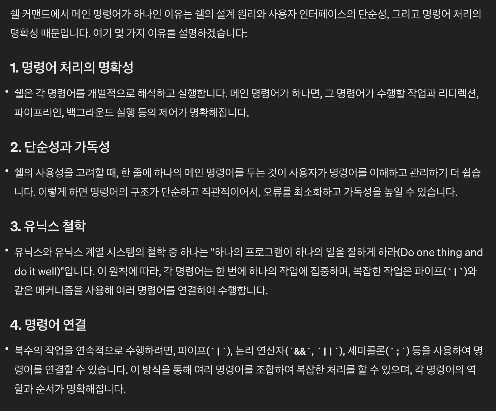
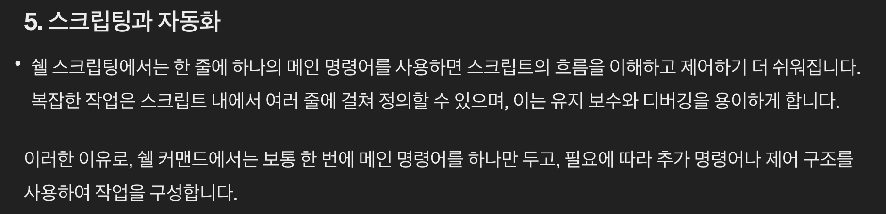

# Minishell

설명: 커스텀 셸 구현
상태: 완료

간소화된 셸(shell)을 구현하는 과제이다.

파싱 부분을 담당했다. 파싱은 **구문 분석 트리(Syntax Parsing Tree)**를 사용할 예정이다.

# 사전 지식 모음

# 파이프 와 **리디렉션**

**파이프( | )** : 한 명령어의 출력을 다른 명령어의 입력으로 전달해준다.

명령어 사이에 관을 놓아서 직접 결과물을 전달해 준다고 생각하면 편하다.

파이프 앞 명령어의 표준 출력을 뒤 명령어의 표준 입력으로 전달하는 관이다.

명령문 한 줄에 실시간으로 데이터를 연결시켜 전달하고 싶을때 사용한다.

버퍼에 명령 결과물을 담고있다가 다음 목적지에 도착하면

다음 목적지의 명령어가 버퍼에서 명령 결과물을 읽어 처리한다.

**리디렉션(<, >, >>, <<)** : 입출력 스트림(흐름)의 경로를 바꿔준다.

경로는 다른 파일이 될 수도 있고 또 다른 스트림(예) fd, /dev/null 등)이 될 수도 있다.

이미 존재하는 한 흐름의 경로를 바꿔준다고 생각하면 편하다.

보통 데이터의 저장(>), 또는 데이터 입력 출처(<)를 결정하는 데 사용된다.

명령문 한 줄에 같은 방향이 중첩되면 오버로딩이 되어 마지막 종착지만 유효하게 된다.

리디렉션은 주로 표준 입출력 스트림을 다른 파일이나 스트림으로 바꿔준다.

**히어독( << ) :** 표준 입력으로 구분자 까지의 입력을 받는다.

리디렉션중 하나이지만 특별한 히어독(Here Doc)이다.

<< 뒤에 파일이 아닌 구분자를 입력받는데,

표준 입력으로 계속 입력받다가 구분자가 표준 입력으로 들어오면

EOF 처럼 판단하고 입력을 끝낸다.

쉘은 명령문에 히어독을 사용하면 제일 먼저 히어독부터 입력받으며,

입력을 다 받으면 그때부터 명령문의 제일 처음(왼쪽)부분부터 실행을 시작한다.

# 셸의 리디렉션 파싱

예1 )  echo hoho > test.txt
    →  > test.txt echo hoho

예2 )  cat < test.txt > test2.txt
    →  < test.txt cat > test2.txt
    →  < test.txt > test2.txt cat
    →  > test2.txt < test.txt cat

예시의 명령문은 아래 화살표로 연결된 명령문과 똑같은 결과를 산출한다.

이 케이스들이 왜 가능하냐면,

쉘은 구문 분석을 할때 실행 전에 전체 명령 줄을 읽고 흐름 구조를 먼저 결정한다.

리디렉션이 포함된 구문은 파이프가 나오거나 명령문이 끝날때 까지 리디렉션 파트로 판단한다.

리디렉션 파트 안에서 리디렉션이 몇개가 나오던 마지막의 > 와 < 로 방향을 결정한다.

이 말은 전에 있던 리디렉션들은 오버로딩이 된다는 의미이다.

그리고 리디렉션 파트엔 명령어가 꼭 하나 포함되는데,

이 명령어는 통로 기능을 한다.

명령어를 파싱해서 통로 명령어를 조합하는 방법은 명령문 순서로 따진다.

메인 명령어가 제일 앞(왼쪽)에 있어야 인식 가능하고, 

명령어 옵션은 무조건 메인 명령어 뒤쪽에 있어야 가능하다.

아니면 명령어 옵션을 메인 명령어로 인식해 command not found 가 뜬다.

이 말은 내가 명령어 순서를 따로 파악해서 재조합할 필요는 없다는 뜻이다.

**결과적으로 마지막 < 의 뒤에있는 파일에서 내용을 읽어오고,**

**그걸 중간 통로인 명령어에 전달하고,**

**마지막 > 뒤에 있는 파일에게 명령어 출력 결과물을 보내준다.**

위의 과정이 쉘이 리디렉션 파트을 파싱하는 과정이다.

<aside>
💡 통로 명령어나 옵션은 리디렉션 기호 바로 뒤에 있을 수 없다!
이 말은 리디렉션 기호 바로 뒤 토큰은 무조건 파일명 이라는 뜻이다.

</aside>

# 셸의 메인 명령어가 하나인 이유

쉘의 명령어들을 다루다 보니 깨달은 점이 있다.

쉘의 명령문 구조는 명령어 파트들이 파이프 기준으로 나뉘고,

하나의 명령어 파트에서 메인 명령어는 하나이다.

그 명령어를 통해 여러가지 추가 작업을 수행할 수도 있고 안할 수도 있고..

왜 이런 구조로 만들었을까 라는 생각이 들어 GPT에서 물어보았다.

- GPT의 답변
    
    
    
    
    

# 환경 변수

환경 변수($) : 쉘에서 프로세스가 실행될 때 동적으로 정의되는 값들.

보통 시스템 설정이나 사용자 세션에 관한 정보를 저장한다.

사용자가 로그인할때마다 값이 초기화되고,

필요에 따라 사용자가 값을 추가, 변경, 삭제 할 수도 있다.

값을 추가하거나 변경하는 경우는 export 명령어를 쓰고,

삭제는 unset 명령어를 사용한다.

환경 변수를 실제 값이나 그 결과로 변환하는 과정을 확장(expansion)이라고 한다.

<aside>
💡 확장은 와일드카드, 산술, 명령어(서브쉘) 확장등 다양한 확장이 있다.

</aside>

# 토커나이즈(Tokenize)

입력된 명령문 문자열을 개별 구성 요소인 토큰(Token)으로 분리해야 한다.

구문 분석을 용이하게 하기위해 만들어진 방법으로써

각 토큰으로 분리시킨 요소들을 구문 분석 트리로 조합하여 명령문을 해석한다.

컴파일러도 이 방법을 사용하여 코드를 해석한다.

토큰 분리는 보통 공백을 기준으로 한다.

하지만 예외 사항이 몇 가지 있다.

1. 문자열 표현인 ‘ 혹은 “ 가 나오면 다음 ‘ “ 가 나올때까지 토큰 분리를 하지 않는다.
    
    다음 ‘ “가 나오면 거기까지 단일 문자열 토큰으로 분리한다.
    

1. 특수 문자는 토큰으로 분리한다. (예 )**`|`**, **`>`**, **`<`**, **`()`**, **`{}`**, **`&&`**, **`||` 등)**
    
    이 문자들은 공백이 없어도 토큰으로 분리해야 한다.
    
2. 환경 변수 기능을 사용할 때도 화이트 스페이스가 없어도 된다.
    
    환경 변수에 맞는 형식의 문자열을 만나면 토큰으로 분리해분다.
    
    다만 확장은 토커나이징 단계가 아닌 실행 직전에 한다.
    
    그 이유는 하단에 기재되어 있다.
    

이러한 방법들로 토커나이징 하여 토큰들로 분리하고 

분리된 토큰 문자열과 해당하는 정보를 토큰 리스트에 담아준다.

- **토큰 리스트 구성요소**
    1. 토큰 문자열
    2. 토큰 리스트 인덱스
    → 트리 노드에 int 배열을 줄건데, 이 배열에는 토큰 인덱스들이 들어있다.
        토큰 리스트의 토큰들 중에서 어떤 토큰을 써야 할지 인덱스로 알기위해.
    3. 해당 토큰이 컨트롤 토큰(파이프, 리디렉션)인지 알기 위한 매크로값을 담는 변수
    4. 쿼터가 공백으로 바뀌었을 때의 플래그
    → 내가 짠 코드는 토큰 분리를 수월하게 하기위해
         문자열의 마지막 문자를 공백으로 바꿔주는데
         쿼터로 둘러싸였을때 마지막이 쿼터인 문자을 공백으로 바꿔 주면
         다음 토큰이 쿼터에 붙어있던 상태인 경우 쿼터 문자열과 붙여 주어야 하기 때문에
         그 경우를 알기 위한 플래그이다.
    5. next  포인터
    6. prev 포인터
    7. 환경 변수로 보이는 이름들의 길이값을 담은 노드 배열
    → 환경 변수로 보이는 이름이 몇자리인지 파악하여
         실제 환경 변수 목록에 있는 환경 변수 이름들과 비교한다.
         길이값이 0이면 환경 변수 이름 형식에 맞지 않는것.
         이는 싱글 쿼터 안에 있는 경우도 포함이다.
         노드 배열로 한 이유는 환경 변수로 보이는 이름의 길이와
         더블 쿼터 안에 있는지 알기 위한 플래그 형식의 멤버 변수
         두가지 정보를 담기 위해서.
    
    <aside>
    💡 사실 환경 변수로 보이는 이름이 더블 쿼터 안에 있는지는 토커나이징 단계에서 알 수 있어
    따로 노드 배열의 멤버 변수로 줄 필요가 없다고 생각했지만
    리디렉션 파일명 오류인 ambiguous redirect 오류 때문에 주게 되었다.
    자세한 이유는 하단에 기재되어 있다.
    
    </aside>
    

# 구문 분석 트리(Syntax Parsing Tree)

소스 코드 혹은 쉘 명령어 등을 구문적으로 분석하여 구조화한 트리.

컴파일러와 쉘은 내부적으로 이 자료구조를 사용하여 명령문이나 소스코드를 분석한다.

트리 자료구조가 가지고 있는 계층 구조의 특성을 이용하여

각 노드에 분석할 구문의 명령어, 연산자 등을 할당해주어 구조적 요소를 부여해주고,

노드 간 부모 자식간의 관계를 설정해주어 요소 간의 관계를 부여해 줄 수 있다.

# 구문 분석 트리 구조 짜기

- **트리 노드의 구성요소**
    1. 토큰 리스트의 첫 번째 주소를 담은 포인터
    2. 트리 노드 인덱스
    3. 노드를 방문했는지 알기위한 체크 플래그
    4. 노드가 컨트롤 토큰(파이프, 리디렉션)노드인지 알기위한 매크로 값을 담는 변수
    → 변수에 담긴 매크로 값으로 파이프인지 혹은 어떤 방향의 리디렉션인지 알 수 있다.
    5. ambiguous redirect 오류를 알기 위한 플래그
    → 이 플래그를 준 이유는 해당 오류는 프로세스를 exit하지 않고
         다음 명령어 파트로 넘어가기 때문에 실행부에게 이러한 행동을 할 수 있도록
         정보를 넘겨주기 위해 넣은 멤버 변수이다.
    6. 명령문의 끝(마지막 노드)인지 알기 위한 플래그
    7. 노드가 가져야 하는 토큰들의 인덱스 번호를 담은 int형 배열
    → 굳이 토큰 문자열을 노드에 할당하지 않고 토큰 리스트의 인덱스를 담은 이유는
         해당 인덱스를 참조하여 리스트에 담긴 토큰 문자열과 각종 정보들을
         알 수 있기 때문에 메모리 낭비를 막고 추가 정보들도 가져올 수 있다.
    8. 왼쪽 자식 노드 포인터
    9. 오른쪽 자식 노드 포인터
    10. 이전(부모) 노드 포인터

전위 순회 방식을 쓸 예정이다.

- 💡 **전위 순회(Pre-order traversal)란?**
    
    트리의 순회 방식 중 하나이다.
    
    순회 순서는 다음과 같다.
    
    1. 현재 노드를 먼저 방문한다.
    2. 왼쪽 자식 노드를 방문한다.
    3. 다시 올라와서 오른쪽 자식을 방문한다.
    
    왼쪽 자식이 연속적으로 있다면 계속해서 왼쪽부터 간다.
    
    오른쪽도 꼭 방문해야 하기 때문에 오른쪽을 방문 하지 않은
    
    부모 노드가 있다면 다시 올라가서 오른쪽도 방문해준다.
    

인덱스 번호가 오른쪽 최하단 노드까지 갔다면 

다시 올라갈 필요가 없으니 end_flag를 올려주고

결과물을 보내준다.

보통 파이프 기준으로 명령문 파트가 나뉘기 때문에,

부모 노드를 파이프로 잡고 파이프 앞 부분을 왼쪽 자식 노드 혹은 서브 트리,

파이프 뒷 부분을 오른쪽 자식으로 준다.

다중 파이프 같은 경우는 위의 경우와 똑같이 만들되,

오른쪽 자식을 다음 파이프로 주면 연속적으로

똑같은 구조로 만들 수 있다.

마지막 파이프 노드의 오른쪽 자식은 명령문 마지막 파이프 뒷 부분을 주면 된다.

동적 할당 순서는 명령문에 파이프가 있는지 부터 체크해야 한다.

파싱중 파이프가 있으면 부모로 할당해주고 왼쪽 자식을 파이프 앞 파트로 할당.

파싱을 재개하고 또 파이프가 있으면 오른쪽으로 같은 방식 할당.

없으면 마지막 파이프 뒷 파트을 오른쪽 자식으로 할당.

파이프 앞 뒤의 파트를 서브트리 자식으로 할당할 때

리디렉션 파트라면 할당할 때 2파트로 나눠준다.

1. 왼쪽 리디렉션 할당 파트. 

왼쪽 리디렉션 기호들이 있는지 먼저 판단하여 있다면 왼쪽 자식 노드로 전부 할당한다.

여기서 통로 명령어도 모아서 조합시켜 준다.

명령어를 조합시키는 방법은 리디렉션 기호 바로 뒤에있는 토큰 빼고 전부 명령어로 인식시키고

명령문 순서인 왼쪽부터 오른쪽으로 조합시킨다.

왼쪽 기호들이 없다면 통로 명령어가 서브트리의 루트가 되면서

리디렉션이 없고 명령어만 있는 파트라도 그대로 사용 가능하다.

모든 작업이 끝나면 다시 서브트리의 루트로 올라온다.

1. 오른쪽 리디렉션 할당 파트.

왼쪽 방향과 똑같은 방법인데 노드가 붙는 방향만 오른쪽이다.

명령어 노드는 왼쪽에서 할당 해주었기 때문에 안해도 된다.

마찬가지로 통로 명령어나 왼쪽 기호가 없다면 오른쪽 기호가 서브트리 루트가 된다.

예시 : ls -a >> a < b -l > c | grep "" | cat << x > y   (/n 개행 노드는 무시.)

# 발견한 신기한 것들

1. 쿼터 “ ‘ 안에 있는 문자들을 문자열로 처리하고 쿼터 기호는 토큰에 포함 시키지않는다.
    
    쿼터 처리는 좀 특별한데, 먼저 나온 쿼터 가 문자열을 지배한다.
    
    즉, “ ‘ ‘ “ 면 “ 가 문자열 토큰을 지배하고,
    
    ‘ “ “ ‘ 면 ‘ 가 지배한다.
    
    “가 지배하면 쿼터 안에있는 문자열 전체가 “ 의 룰을 따른다. ‘ 도 마찬가지다.
    
    <aside>
    💡 가장 실험하기 좋은 예시는 환경변수($)다! 두가지 지배상황 모두 정 중앙에 환경 변수를 넣어보자.
    
    </aside>
    

1. 히어독( << )은 앞 명령어의 표준 입력 fd을 자신의 fd로 바꾸는데, 
    
    다른 fd변환 (예) 파이프)보다 우선권을 가진다.
    
    다만 리디렉션 오버로딩은 피하지 못한다.
    

1. execve로 쉘의 내장명령어(cd, pwd)나
    
    파이프, 리다이렉션, 조건문, 와일드 카드(*, ? []) 등은 실행 할 수 없다.
    
    구문 분석 트리를 왜 구현해야 하는지 몰랐는데, 이 사실을 알고 바로 깨달았다.
    
2. 파이프 앞에 아무것도 없으면 syntax error가 뜨지만
    
    뒤에 아무것도 없으면 표준 입력으로 받으려 대기한다. → 다중 파이프일시 마지막 파이프만 해당.
    

1. cat은 입력을 받을때 cat 뒤에 명령어 인자가 있으면 리디렉션이나 표준 입력은 무시된다. 
    
    예) cat < bao k h > a  → bao파일은 무시되고 k, h 는 명령어 인자로 바뀌어 cat k h > a 이렇게 된다.
    
    이런 이유는 cat이 기본적으로 리디렉션이나 표준 입력이 아니라 인자를 받아서 처리하도록
    
    설게되었기 때문이라고 한다.
    
    cat은 인자가 몇개든 append 형식으로 출력해준다!
    

1. 리디렉션은 통로 명령어가 지정 되있지 않을 경우에도 동작한다.
    
    < a  →  a에서 입력은 받지만 명령어가 입력되어 있지 않기 때문에
    
    아무 일도 일어나지 않는다.
    
    > a  →  a파일이 존재하면 명령어가 없기 때문에 a파일에 아무 입력이 들어가지 않고,
    
    존재하지 않으면 빈 파일 a 가 생성된다.
    

1. grep 명령어 뒤에 파이프가 있으면 eof가 입력될때까지 입력을 기다린다.
    
    파이프가 없으면 기다리지 않고 바로 표준 출력으로 출력시킨다.
    
    이 케이스에서 파일을 grep하면 eof가 자동 포함이기 때문에 기다리는 것이 없을것이고,
    
    cat 같은 명령어로 표준 입력을 키보드로 받으면 eof가 입력될때 까지 기다린다.
    
    쉘 내부에서 버퍼링 처리하는 방식이 이런가 보다 ㅋㅋ
    
2. 와일드 카드중 ? 의 기능은?!
    
    만약 a?.txt 라고 한다면 a 뒤에 정확히 한 문자만 붙어있는 파일만 찾아준다.
    

# 구현 기록 모음

<aside>
📖 구현할게 많아서 기록이 길다.
시행착오도 적혀있어 조금 난잡할 수 있다.

</aside>

# 리디렉션 관련 구현기록

한 명령어 파트에서 리디렉션 기호가 다수 있어 같은 방향의 리디렉션이 오버로딩 되는 상황에서

리디렉션 최종방향을 제외한 전의 리디렉션들을 구문 분석 트리에 포함 시키지 않는 방법은 안될 것 같다.

실제 쉘은 몇개의 리디렉션이 오든 일단 구문 분석 트리에 포함 시킨다고 한다.

쉘 구현이니 똑같이 해야할듯. 작동 방식을 비슷하게 만들어야 대조할때 좋을 것 같고.

리디렉션 파트에서 명령어 토큰들을 구분할 때, 

무작정 리디렉션 기호 토큰이 아닌걸 전부 cmd_node에 토큰으로 주면

안될 것 같다. 리디렉션 뒤의 파일명 토큰도 포함시키기 때문에.

어떻게 구분시킬지 고민해보자.

→ ctrl_token이 파이프가 아닌 상태 즉 리디렉션인 상태에서 바로 다음에 토큰이 있다면

    카운트를 -1 해준다. 카운트 수 만큼 동적 할당을 한 후에

    해당 위치의 토큰 리스트 노드의 prev 노드가 리디렉션 노드이면 리스트를 next로 넘어가준다.

    해당 위치는 리디렉션 토큰 다음인 파일명 토큰이기 때문이다.

# 명령어, 쿼터 처리 관련 구현기록

단순 명령어 파트 → 완료

특별한 경우들이 아닌 토큰은 명령어 노드에 세트로 들어가 주면 된다.

지금 명령어 노드가 무조건 왼쪽에 붙는다. 마지막 명령어 파트는 오른쪽에 붙어야 한다..

→ next_left포인터가 널이면 왼쪽, 아니면 오른쪽으로 노드를 붙인다!

명령문 마지막 파트 어떻게 처리할지 생각해보자.

reassembly 함수 하나로 가능..? → 응 가능 ㅋㅋ

재사용률을 높이기 위해 많은 상황에 대비하여 만드니 편리하다.

쿼터 처리 → 완료

쿼터 안에 있는지, 있다면

싱글쿼터 안인지 더블쿼터 안인지 구분하여 토큰화시키자.

명령문 문자열을 파싱할 때 더블 쿼터가 먼저 시작되면 meta_value가 D_QUOTE이고,

해당 쿼터가 장악하여 더블 쿼터가 또 나오기 전까진 더블 쿼터 룰을 따른다.

싱글 쿼터도 마찬가지다.

quote_closed_chk함수로 체크하여 쿼터가 닫히지 않은 상태라면

기능이없는 단순 문자로 처리한다.

# 환경 변수 관련 구현기록

환경 변수 확장 순서가 중요하다.

환경 변수값 확장전에 트리부터 만들어야 한다.

환경 변수는 실행 과정에서도 export가 가능하기 때문에

토커나이징이나 파싱 단계에서 확장해버리면 실행 도중 export된 환경 변수는 확장 할 수 없다.

리디렉션 파일명을 환경 변수로 주면 확장을 시행하는데

쿼터로 싸여있으면 먼저 치환을 하고 해당 문자열 자체를 리디렉션 파일명으로 주고,

안 싸여있으면 일단 환경변수 값이 valid 한지 체크하고 invalid면 ambigous redirect 오류 메시지가 뜬다.

또한 환경변수 값에 공백같은 구분자가 포함되면 인수가 2개 이상이 되며 리디렉션 파일명을 설정할 수 없어

이 경우에도 ambigous redirect 오류가 뜬다. 그러나 쿼터로 싸여있으면 단일 토큰인 문자열로 처리되며

해당 문자열을 파일명으로 인식한다.

환경 변수는 쿼터안에선 어떤 쿼터가 먼저 나왔냐에 따라 쿼터 장악 주체가 달라지기 때문에.

quote_tokenize에서 meta_value 값이 무엇인지 확인하면 되고,

쿼터가 아닌 경우는 어차피 한 토큰으로 나뉘기 때문에 괜찮다.

이 두 경우 모두 env_chk함수에서 문자열 파싱과정중에 환경 변수인지 아닌지 체크하면 될듯.

달러 싸인 만나면 그 뒤의 문자가 환경 변수에 맞는 문자인지 파싱해준다.

환경 변수 이름 최대 길이 안에서 반복시키면 될듯.

환경 변수 확장을 시도할때 유효하지 않으면 아예 문자열 할당을 하지 않는다.

env_list에서 맞는 환경변수를 찾으면 val 의 strlen을 구한다.

못 찾으면 name의 len을 구하고 원래 문자열에서 그 길이를 뺀다.

토큰 그 자체면 0 반환하면 될듯.

환경 변수의 이름은 알파벳 대문자, 소문자, 숫자, 언더바(_) 로 이루어져 있다.

이름 파싱할때 이외의 문자가 나오면 환경 변수의 이름은 이외의 문자 전까지.

→ 이름 파싱을 하는 이유는 올바르지 않은 이름이 들어왔을때 어디까지를 환경변수

     이름으로 판단할 것이냐가 중요하기 때문.

환경변수는 따로 토큰화 시키지 않는다.

실제로 쉘에서도 따로 토큰화하여 문자열 분리는 하지 않고

본래 문자열은 보존하는 상태로

유효한 문자까지만 상응하는지 확인하여 치환시키는 방식이다.

환경 변수 확장 구현 → 완료

리스트의 멤버 변수에 int형 env_lset 배열을 준다.

토큰에서 환경 변수가 여러개 있어도 배열에 명령문 순서대로 환경 변수 길이만 주면 되니깐.

환경 변수가 invalid 한 경우 길이값을 0으로 준다.

env로 보이는 문자열이 나왔는데 이름이 어디까지 인지 체크하는 부분을 토커나이징 단계에

추가하여 env_list에 상응하는 환경 변수 이름이 존재하는지는 따지지 않고

일단 이름 형식이 어디까지 맞는지, 그에 따른 길이는 몇인지 체크해준다.

이름 형식은 알파벳, 숫자, 언더바이다. 처음 한 문자만 숫자로 지정 할 수 없다.

형식이 처음부터 맞지 않다면 길이 값은 0이 되고 invalid 로 인식한다.

싱글 쿼터 처리도 여기서 할 수 있을 것 같다.

문자열을 장악하는 쿼터가 무엇인지 s_quote_flag 로 판단하면서

플래그가 서있는 상태에서 환경 변수로 보이는 문자열을 만나면 길이 값을 0으로 주고 지나간다.

싱글 쿼터를 처음 만나면 쿼터가 닫혀있는지 확인하고

쿼터가 닫혀있지 않으면 s_quote_flag == ON시키지 않는다.

쿼터가 닫혀있다면 ON시키고 닫힘 쿼터를 만나면 OFF시킨다.

→ 이렇게 할 수 없다. 쿼터를 빼고 토큰을 할당하기 때문에.

특정 토큰이 어떤 상태인지는 meta_value를 매개변수로 받고 그걸로 판단 해야겠다.

meta_value가 싱글 쿼터면 env_lset크기는 정해주되 싱글 쿼터기 때문에

정해준 부분을 전부 0으로 초기화해준다.

아니라면 체크해서 맞는 길이를 넣어주고, 

str_join을 해야하는 상태라면

두개를 합친 만큼 크기를 할당한 후 앞전의 토큰 env길이 정보를 복사하고

뒤의 붙히는 토큰 상태를 meta_value로 판단하여 0으로 초기화할지 아님 길이를 넣어줄지 결정 한다.

이렇게 하면 후에 확장 단계에서 무시하고 지나갈 수 있다.

환경변수가 없으면 env_lset 배열은 널로 초기화.

트리에서 실제로 env_chk를 할때는

쉘 명령문을 파이프까지 서브트리로 만들어주는 모듈을 만들어서 재사용하듯

환경변수 전 까지의 문자열과 확장한 환경변수를 붙혀주는 함수를 만들자. 이걸 재사용 반복하면서 마지막 환병변수 뒤에만 붙혀주면 될듯

이름 첫번째 문자가 숫자면 $하고 숫자 하나까지 지워버림 다음부터는 출력

e_idx를 매개변수로 넘기지 말고 expansion에서 지역 static으로 주고

env_lset == END 가 되면 e_idx를 0으로 초기화 시켜주는 걸로.

env_lset에 매크로값으로 S_QUOTE 줘볼까?

→ 딱히 필요 없었다. 쿼터 처리 부분에서 싱글 쿼터면 길이를 0으로 처리 했으나

    get_front_str에서 해당 부분을 환경 변수로 판단하지 않고 길이값을 가져와 주었다.

    다만 ‘$’ 문자 하나를 못가져와서 임의로 길이를 1 추가해주었다.

# Error 출력 처리, free, exit_code 관련 구현기록

문법 오류(syntax error)처리 → 완료

리디렉션 기호 뒤에 파일명이 없다면 syntax error를 띄어야 한다.

파이프 앞에 명령어가 없어도 마찬가지다.

ls > → 이런식으로 입력하면

syntax error near `\n' 이런식으로 에러가 뜨는데, 

빈 명령어 또는 파일명 위치의 다음 토큰을 near 로 주는거 같다.

이 상황에서 리디렉션 연산자를 오버로딩 시켜도 syntas error를 띄운다.

→ 파이프 같은 경우는 토큰 리스트에서 파이프 토큰 노드 앞 노드가 널이면 에러를 띄운다.

     리디렉션 같은 경우는 리디렉션 토큰 노드 다음이 널이거나 컨트롤 토큰 노드면 에러를 띄운다.

     near로 주는 토큰은 파이프는 파이프를 주면 되고 리디렉션은 다음 위치의 토큰. 

     다음 토큰이 널이면 “newline”

리디렉션 파일명 모호 오류(ambiguous redirect) →  완료

ambiguous redirect오류 = 파일명을 확장 후에 파일명이 하나가 아니거나(와일드카드) 환경 변수 확장 후에 빈 문자열인경우, 확장했는데 이름에 공백이 담긴 경우에 해당한다.

빈 문자열일 경우는 처리했는데 이름에 공백이 담긴 경우가 문제다.

더블 쿼터 안에 있으면 공백이 있거나 빈 문자열이어도 오류 처리를 하지 않는다.

더블 쿼터 밖에 있어야 ambiguous redirect 오류가 뜬다.

이유는 더블 쿼터에 싸인 부분을 단일 문자열로 판단하여 이리 작동 하는 것 같다. 

어떻게 구분시킬까?

→ env_lset을 노드 배열로 주고 멤버 변수에 d_quote를 줘서 더블쿼터 안에 있는 환경변수인지

    밖에 있는건지 구분시켰다.

free 시키기 → 완료

direct를 이용한 오른쪽 왼쪽 같은 함수 사용이 가능하다고 생각했으나 한가지 문제점 발견.

왼쪽 서브트리는 파이프 노드가 없기에 가능했으나

오른쪽 서브트리에는 파이프 노드들이 있어 반복문에서

tree → prev → ctrl_token ≠ PIPE 이 조건이 먹히지 않는다.

→ 그냥 파이프 밑의 서브트리를 전부 해제시켜주는 함수를 따로 만들었다.

     이 함수로 오른쪽이든 왼쪽이든 파이프에 달린 서브트리를 전부 해제 시켜 줄 수 있다.

exit_code 처리 → 완료

처음엔 파싱부에서 exit을 쓰고 매개변수로 exit_code를 주면 된다고 판단했으나

파싱부에서 exit을 해버리면 실행부는 파싱을 부모 프로세스에서 하기 때문에

프로그램 전체가 끝나버린다.

따라서 트리 노드에 exit_code 매개변수를 주고

특정한 오류 발생시 해당하는 exit_code를 부여해주었다.

사실 파싱부에서 부여할 exit_code는 syntax error뿐이다.

syntax error 는 258을 exit_code 로 주면 된다.

# 단순 구현 기록

meta_token 바로 뒤 토큰 처리해야한다.

메타 토큰을 공백으로 바꾸면 처리가 가능할거 같긴한데.. 버스에러 난다. 왜지??

→ malloc으로 동적 할당 안하고 바로 초기화 시켜서 ㅋㅋㅋㅋㅋ 와 피신때 본 버스에러가

    왜나나 싶었는데 이게 이유였다.. ㅋㅋㅋ 오랜만이라 오히려 반갑다 ㅋㅋ

    어쨋든 메타 토큰인 해당 문자열 한 자리를 공백으로 바꿔주니 해결되었다.

\ 다음의 “ 을 처리하는 과정에서 len을 하나 줄인다음 문자열로 할당해야 한다.

어떻게 할까? 반복 대입 과정에서 횟수 한번 줄이는건 쉽지만

malloc할때도 한번 줄여줘야 한다. 이 경우를 생각해보자!

→ ft_substr에서 따로 예외 처리를 하여 길이 하나를 덜 주고 할당한다음

    백 슬래시를 제외시켜 복사했다.

트리에서 서브루트로 가는 방법은 지금 생각나는 한가지는 트리 노드에 parent 멤버 변수를 줘서

prev 노드로 계속 가다가 parent가 참이면 멈추는거.

parent를 1로주는 기준은 파이프일때, 리디렉션은 왼쪽 방향일때, 명령어는 맨 앞 토큰일때.

tk_list의 위치를 기억하고 있어야 한다. reassembly는 가장 가까운 파이프까지 트리를 만들고

다음에 reassembly를 호출하면 다음 파이프 트리를 만들 수 있게.

pipechk 랑 rd_right_chk 함수 만들자.

go_to_subroot랑 go_to_pipe함수 사용여부

알 수 있게.

구분자로 탭을 추가해 말어… ㅋㅋㅋㅋㅋ

→ 생각 보다 간단하게 탭을 구분자로 추가했다.

그냥 원래는 문자 하나가 공백인지 아닌지 확인하는 조건문에서

해당 조건을 함수로 뺀 다음 

공백과 탭 이렇게 두개를 조건문으로 확인하게 하니 해결됬다 ㅋㅋ

# 파이프와 fd에 관하여

시험인 microshell에서 실행부 파트를 간략하게 짜야해서 배운 점들을 기록했다.

파일 디스크립터(File Descriptor) : 운영 체제가 파일이나 입력/출력 장치를 다루기 위해 사용하는 간단한 숫자.

각 파일 디스크립터는 열려 있는 파일이나 소켓 등을 가리킨다.

이 숫자를 사용하여 파일을 읽고 쓰거나, 파일을 닫는 등의 작업을 수행할 수 있다.

0번은 표준 입력, 1번은 표준 출력, 2번은 표준 에러이며

3번부터는 open하면 해당 프로세스에 할당된다.

한 프로세스에서 3번을 할당 받고

다른 프로세스에서 3번을 할당 받아도

둘은 다른 프로세스(메모리 공간)안의 독립적인 파일 디스크립터 이기 때문에

다른 곳을 가리킨다.

다만 부모에서 복사 받은 fd는 자식에서도 유효하다.

따라서 기본적으로 열려있는 표준 fd(0, 1, 2)는 자식에게 자연스럽게 복사된다.

파이프(pipe) :  프로세스끼리 정보를 주고 받을 수 있는 통신 수단. 

프로세스 끼리 연결해 주는 관 이라고 생각하면 편하다.

보통 프로세스 끼리는 데이터 공유가 안되지만 파이프를 연결하면

정보 통신이 가능하여 편리하다.

파이프를 열면 fd가 2개가 할당되는데,

더 작은 fd가 읽기 끝(read_end)이고, 더 큰 fd가 쓰기 끝(write_end)이다.

이해하기 쉽게 예시를 들겠다.

프로세스 A가 있고 B가 있는데,

그 둘을 파이프로 연결 할 수 있다.

파이프를 하나 생성하고, 파이프에 fd가 2개 할당된다.

0, 1번이 할당 되었다고 가정하면, 0번이 읽기 끝이고, 1번이 쓰기 끝이다.

A 프로세스와 B 프로세스를 파이프로 연결하면,

A에서의 출력물을 파이프에 넣고, 파이프에서 나온 출력물이 B로 전달 되어야 한다.

연결 시키는 과정은 다음과 같다.

파이프의 쓰기 끝(fd 1번)을 A 프로세스의 표준 출력 fd에 리디렉션 해준다.

이 말은, A 프로세스의 출력물은 원래 표준 출력으로 가야 하지만,

파이프의 쓰기 끝으로 갈 수 있게 경로를 변경 해주었다는 말이다.

똑같은 방식으로 B 프로세스의 표준 입력을 파이프의 읽기 끝(fd 0번)으로 리디렉션 해준다.

이렇게 하면 프로세스간 정보 전달이 가능하다.

특이한 점은 파이프 입장에선 정보를 읽는게 1번이고, 쓰는게 0번인데

프로세스 입장에서는 A에서 쓰는게 1번이고 B에서 읽는게 0번이다.

파이프는 프로세스 입장에서 fd를 정해 준다.

따라서 fd가 더 큰게 오히려 앞에 있다.

처음에 이거 때문에 많이 헷갈렸는데,

파이프 입장으로 생각하다 보니 보통은 읽기가 0번이고 쓰기가 1번인데

반대여서 헷갈렸었다 ㅋㅋ

ls -al | grep .c | wc -l | grep 6

<aside>
💡 파이프를 말 그대로 송수관이라고 생각해보자.
출력물은 물이고, 송수관 바깥 영역은 표준 영역이다.

</aside>

여담으로 세미콜론도 구현해야 했는데, 간단히 차이점을 요약했다.

세미콜론과 파이프의 차이 :

세미콜론은 전달하는게 없고 앞 뒤 명령어가 순차적으로 실행된다.

파이프는 출력 결과를 전달하는데 앞 뒤 명령어가 병렬로 실행된다.

그래서 파이프는 보통 입력을 기다리는 명령어와 같이 사용한다.