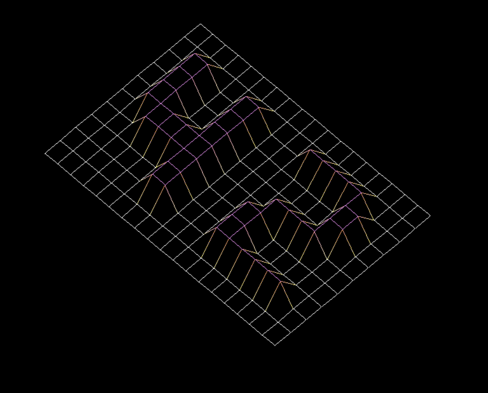
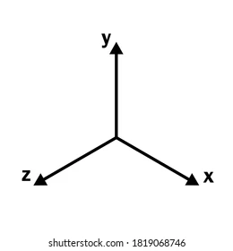

# fdf

설명: 와이어프레임 모델
상태: 완료

3D 좌표를 받아서 화면에 3D지형을 Wireframe model로 투영하는 과제이다.

# 방향 잡기

픽셀을 찍어서 지형이 실제로 3D인것 처럼 시각적인 표현을 해야하는데

이걸 가능하게 하는 투영법중에 등각 투영법이 있고 이걸 사용할 예정이다.

투영 후 지형 모양이 3D 타일셋 모양이다.

거기서 지형의 높낮이에 따라 선이 휜다.

옛날 롤러코스터 타이쿤과 비슷한 지형이다 ㅋㅋ

파일로 들어온 좌표계를 잘 이용해보자.

등각 투영법을 잘 사용해보면 될 것 같다.

등각 투영(isometric projection)에 대한 설명 링크는 하단에 2개가 있다.

꽤 많은 의문점을 해소해 주었다..!

[https://clintbellanger.net/articles/isometric_math/](https://clintbellanger.net/articles/isometric_math/)

첫번째 인 이 방법으로 하면 회전이 되지 않아.. 결국엔 두번째 링크의 공식을 썼다.. ㅋㅋ

그 흔적은 삽질의 흔적 항목에!

[http://www.gandraxa.com/isometric_projection.xml](http://www.gandraxa.com/isometric_projection.xml)

두번째인 삼각 함수를 이용한 정석 등각 투영 방법이다.

또한 이 객체를 회전하는기능을 넣을건데 이때 삼각 함수를 이용한 회전 행렬이 필요하다.

# 3D 회전 행렬 이란

3d 회전 행렬이란

3d에서 각 좌표 (x, y, z)값을 가진 3d 좌표에서 각 축을 기준으로 행렬을 이용하여 회전 하는것을 말한다.

듣기 어렵다. 그러니 내가 알아듣기 쉽게 적어놓겠다.

3d 좌표에는 x축, y축, z축이 있다.

x축은 수평, y축은 수직, z축은 깊이 이다.

각 축의 방향은 오른손 혹은 왼손 좌표인지에 따라 다르다.

일단 디폴트 좌표를 가져왔다.

이건 오른손 3d 좌표 이다. 왼손 좌표는 z축이 화면 안쪽(오른쪽 대각선) 으로 향한다.

이 좌표가 회전하면 어떻게 바뀌는지 보자.

보다시피 y축이 아래로 누웠다. z축이 수직방향으로 올라가면서

시각적으로는 z축이 y축이 된것처럼 보이나 회전한 것일뿐 z는 수직 방향이 아니다.

어떻게 회전을 했냐,

x축을 기준으로 y축과 z축이 시계방향으로 -90도를 회전했다.

x축은 가만히 있는걸 알 수 있다. 기준이기 때문에.

왜 -90도냐면 보통 음의 각도는 시계방향으로 돈다.

양의 각도는 반시계 방향으로 돈다.

이게 x축 기준으로 -90도 회전 행렬 연산을 수행하면 나오는 축 모양이다.

기준 축을 제외한 나머지 축들이 회전을 했으니 들어온 좌표값도 동시에 회전한다.

이 효과를 노린것이 바로 회전 행렬 연산이다.

또한 기준 축은 변하지 않고, 나머지 축들이 돌기 때문에

좌표가 얼마나 멀리있든 각도만 구하면 거리에 상관없이 회전 변환이 가능하다.

왜냐하면 사인 코사인 값만 구하면 거리에 비례해서 

회전 한 이후의 해당 축의 좌표 값이 나오기 때문이다.

이걸 실제 회전 행렬 연산식에 대입하면 다음과 같다.

이것이 회전 행렬이다.

이걸 들어온 x, y, z 3개로 구성된 좌표인 3행 1열 벡터와 곱해준다.

행렬의 곱 연산은 앞의 행렬의 열 개수와 뒤의 행렬의 행 개수가 같아야 정의 할 수 있다.

연산식은 다음과 같다.

여기서 저 어려워 보이는 옆으로 뒤집힌 M(시그마) 는 코드의 반복문과 같다.

k=1 이고 n만큼 뒤의 수식을 k를 대입하며 반복 연산하는것.

n은 앞에 말한 행렬의 곱 연산 정의 조건과 똑같이 정해진다.

n = 앞의 행렬의 열 개수 or 뒤의 행렬의 행 개수

이 수식에 관한 것과 연산 방식을 그림과 함께 설명한 영상이 하단에 있다.

[https://www.youtube.com/watch?v=6FwQolijEzE](https://www.youtube.com/watch?v=6FwQolijEzE)

이런 회전 행렬 연산을 할때 삼각 함수가 많이 쓰이는걸 볼 수 있다. (사인 코사인등)

개념이 생소하면 이해하기 어려우니 삼각함수에 대한 쉬운 개념 설명 영상도 하단에 있다.

[https://www.youtube.com/watch?v=L8H3oOVCMIE&t=703s](https://www.youtube.com/watch?v=L8H3oOVCMIE&t=703s)

내가 모든 각도의 삼각함수 결과값을 직접 계산할 수 없다.

삼각 함수는 실제로는 정확한 결과값이 나오지 않아 루트를 많이 쓰고,

코드로는 루트를 표현 할 수가 없다.

그렇기에 math.h 헤더를 포함하라고 pdf에 써져 있었던 것.

# 좌표를 향한 평균 증가코드

뭔가 앞으로 유용할 것 같은 코드를 만들었다!

실제로 유용할진 두고 봐야겠지만 일단 저장해 두자.

[to_target.c](to_target.c)

이  코드는 수학의 기울기 개념을 이용했다.

x 와 y 수가 들어오면

두 변수 (여기서는 i와 j)가

반복을 통해 증가하면서 x 와 y 까지 도달하는 함수이다.

증가하는 위치는 총 반복횟수에서

평균적으로 균일한 위치에서 증가한다.

평균적으로 균일한 위치에서 증가하는 방법은,

예를 들어 y가 10, x가 5이면

y / x  즉  10 / 5 를 하여 2 라는 몫을 구한다.

총 반복 횟수는 둘 중에 작은 수(여기서는 x = 5)만큼 반복 시킬건데,

5만큼 반복 할 때 이전에 연산한 몫(2) 만큼 y를 증가시킨다.

즉 5번의 반복에서 y는 2만큼 각 반복마다 증가하고,

x는 당연히 1씩 증가한다.

그러나 이 방식의 문제점은,

/ 연산 결과값에 나머지가 있을 때 그 나머지 만큼은 y를 증가 시켜 주지 못한다.

이걸 해결 하기 위해 나머지를 총 반복 횟수 안에서 또 다시 평균적으로 균일 하게 증가를 시켜줘야 한다.

즉 y는 몫만큼 증가하되, 나머지값을 맞추기 위해

균일한 반복 위치에서 1만큼 더 증가시킨다.

예를 들어 y가 115, x가 20이면

115 / 20 = 5 이고 나머지는 15가 나온다.

15를 20번의 반복횟수 안에서 균일하게 증가 시켜줘야 한다.

그 방법은,

20 / 15  즉  x / 나머지값 = 1 을 이용한다.

하단의 글 부턴 위의 연산식의 결과값인 1을 fair_db(fair_distribution)으로 통칭 하겠다.

여기서 나온 fair_db(1) 만큼 반복을 했을때 나머지 값을 맞추기 위해 1 만큼 y를 더 증가시켜준다

쉽게 말해 20 번의 반복에서 fair_db(1) 만큼 반복 횟수가 늘어 날때 즉,

총 20번의 반복에서 15번의 반복 까지 1번의 반복 마다 y가 추가로 1씩 증가한다.

그럼 나머지 값도 y의 증가에 포함시키게 되어,

y를 최종적으로 100 이 아닌, 115로 만들어 줄 수 있다.

그러나 이 방식도 문제가 생길 수 있다.

20번의 반복에서 초반 15번의 반복에 1을 쭉 증가시켜주면

평균적으로 균일한 위치 만큼 증가 한다고 보기에는.. 만족스럽지 않다.

실제로 이 방법으로 선을 그어 봤을때,

끝 부분이 붕 뜨는 느낌이 든다. 구름처럼.

끝의 5번만 y가 1이 덜 증가하기 때문이다.

이 문제의 해결법은

나머지를 더해주고 나서 남은 반복 수 (위의 케이스에서는 5) 가 3 이상 일시에,

 fair_db 를 ++ 시켜준다.

그럼 fair_db는 2가 되겠지?

그 상태에서 총 반복 횟수 20번에 2번의 반복 횟수마다 1씩 증가 시켜주면,

총 10이 추가로 증가한다.

상당히 균일한 위치에서 1씩 증가하게 된다.

하지만 문제는 나머지는 15이기 때문에 5가 덜 더해진 상태라는 거다.

이걸 해결 해 주기 위해 상단의 덜 더해 진 수(5)를 이용하면 된다.

하단의 글 부턴 덜 더해 진 수(5)를 last_db_mod로 통칭하겠다.

last_db_mod(5)를 총 반복 횟수인 20과 나눠준다.

20 / 5 = 4

4번의 반복 횟수마다 y를 1씩 더 증가시켜 준다. 상단의 fair_db와 비슷하다.

이 ‘4’ 라는 수가 코드에서 last_db이다.

이후는 더 이상 거르는 작업을 진행 하지 않고 그냥 선을 잇고 마무리한다.

전체적으로 보면 총 2번 걸러내며 평균적으로 균일하게 증가시킨다.

2번만 걸러내기 때문에 사실 완벽한 코드는 아니다.

대부분의 경우에서 선을 이쁘게 잘 긋지만,

어떻게 하든 예외 케이스는 생기기 마련이다.

실제로 아주 가끔 가다 끝 부분이 살짝 붕뜨는 느낌을 줄 때가 있다.

사실 시중에 있는 선 긋는 알고리즘을 사용하면 되지만,

스스로 구현해 보고 싶어서 고심하며 구현 해 보았다.

결과는 만족스러웠다.

다른 사람이 구현 한 것을 그대로 쓰지 않고

스스로 꽤나 정확한 구현 결과를 얻었다는 점에서 만족스러웠고, 

이렇게 고뇌하는 시간이 결국 나에게 실력으로 돌아올 것 이라는 걸 알기 때문에

그 점도 만족스러웠다.

고생했다!

<aside>
👌🏽 여유가 생기면 더 보완할 수 있는 방법을 고안해보자.. 시간이 나면… ㅋㅋㅋ

</aside>

- 💡 오류 1번 (해결!)
    
    가끔식 x, y 중에 더 큰 수가 1 이 부족하게 나온다.
    
    오류 예시 → x = 32 y = 12, 19, 20
    
    그냥 막판에 1 부족하면 하나 더 찍어주는 걸로 해결했다  ㅋㅋ
    
- 💡 오류 2번 (해결!)
    
    타일 모양이 쿠션마냥 폭신해 보일 때가 있다 ㅋㅋ
    
    초반에 너무 빨리 mod를 감소시키며 픽셀을 찍어준게 문제였는데
    
    fair_db가 생각보다 작아서 이런 현상이 일어났다.
    
    이런 경우엔 fair_db와 mod의 곱을 총 반복 횟수에서 뺀 수가
    
    3이 넘어가면 fair_db++ 해준다.
    
    여기선 fair_db를 1만 증가시켜줘도 꽤나 균일하게 보인다.
    
    또한 last_db도 이용해서 한번 더 mod의 남은수를 균일하게 나눠준다.
    

# 긴 삽질의 흔적들

포기하지 말자.. 

스스로 하기엔 정말 어렵고 다 안되는 중이다… 그래도 해보자..

x축 기준 회전은 축을 좀 내려줘야 해서 y_rt + (map → y_tile * 10) 을 하고

y_rt를 구할땐 - (map → y_tile * 10)을 한다.

이건 왜 되는지 잘 모르겠다. 분석해보자.

점은 찍었다.. 힘내자… 파이팅

일단 점은 찍히는데 x축 회전 y축 회전할때 수치 조정이 좀 필요할듯.

x축으로 돌리면 y가 줄어들고, 반대도 마찬가지다.

x축 회전할때는 -z 를 무조건 하는게 아니라 to_target 코드를 이용해서 z까지 서서히 가고

90도에 z에 도달하면 될 것 같다.

y축은 반대로.

각도를 돌릴때 축을 제외한 각의 차이값이 생기니 이걸 기록해서

기준 출발점은 고정시키고 차이값만 좌표 사이사이에 대입하면 될까?

# 결국 자료 참조후 빌딩..

자료 참조후 짠 코딩에서

회전과 투영이 잘 되지 않아서 문제가 있었는데

알고 보니 내가 짠 회전 행렬 코드(rotate) 와 등각 투영 공식 코드(make_iso)에

문제가 있어 회전과 투영이 제대로 되지 않던 거였다..

문제가 되었던 부분은

변수를 가지고 계산할때 해당 변수의 temp 변수를 새로 주고 결과 값을 받아야 했는데

계산한 후의 결과값을 계산을 수행한 같은 변수에 그대로 넣어주니

다음 계산식에서 해당 변수를 쓸때 오염된 값으로 연산이 수행되어

값이 올바르지 않아 결과도 올바르지 않던 것..

결국 코드의 문제가 컸다. 너무 그래픽에 집중만 하니 내가 코드 잘때 한 실수를 캐치하지 못했다.

또 하나 중요한걸 알았는데

등각 투영 하기 전에 회전을 수행해야 3개의 축을 기준으로 올바른 회전이 수행된다.

만약 회전 전에 투영을 해버리면

투영한 모양대로 수직, 수평방향으로 회전이 된다.

알다시피 3d의 x, y 축은 방향이 정확한 수직 수평이 아니다. (z축은 수직이다).

그러다 보니 이전 코드에선 

사선으로 투영된 객체를 사선의 축 기준으로 회전해야 하는데

사선으로 투영된 객체를 정방향의 축 기준으로 회전을 수행했다.

회전이 되긴 되지만 보기엔 좀 이상했다.

그리고 이전 코드에선 90도 이상 넘어가면 z가 소실되거나 방향이 이상해지는 등

문제가 많았는데

아직 원인은 알아내지 못했으나

자료 참조후 짠 코딩을 보니 temp를 선언하지 않아서 문제가 있었거나

축 방향이 이상해서 회전이 잘 안된듯 하다.

시간이 허락하면 한번 알아보자. 원인을 알면 수정도 가능할 수 있으니.

결론은 상단 “방향 잡기”의 2번째 링크의 방법으로 

삼각 함수로 등각 투영을 구현하여 회전 문제를 해결했다.

# 보너스 파트

추가 기능중에 하나 생각난게 있는데, 일단 초반이라 가능한 진 모르겠지만 적어놓자.

지형을 실시간으로 편집하는 기능을 만드는거야.

예를 들면 어떠한 타겟 좌표를 하나 정해. 

처음에는 정중앙으로 하든지, 아니면 좌표값을 매개변수로 받던지.

그 상태에서 키보드의 방향키로 움직일때 그 방향으로 타겟 좌표가 움직이는 거지.

타겟 좌표는 빨간색 점 같은 걸로 표시하고.

좌표는 fdf 파일로 들어온 좌표를 이용하면 될듯.

타겟 좌표가 원하는 좌표로 움직였으면 키보드의 특정 키를 눌렀을때

타겟 좌표에 해당하는 지형이 솟아나던지, 내려앉든지 

둘중 하나의 기능을 수행하도록 hook을 주는거야.

예를 들면 G를 누르면 타겟 좌표의 지형이 1만큼 솟아나고

H를 누르면 1만큼 내려 앉는거지.

일단 생각나는 애로사항은 좌표 움직일때 수직에서 내려다보는 방향에선 쉽겠지만

회전 했을때 비스듬한 시야각에서도 가능하냐 이거지.

구현 자체는 가능하겠지만 좌표를 정하는것도 애매 할 것 같긴한데..

또 끝도 없이 올리거나 내리는건 막아야할듯. 그럼 보기에도 안좋고 세그 폴트 날수도..ㅋㅋ

일단 보자고!

<aside>
🔥 결국 구현 했다!!

</aside>

arrow 키 를 처음 누르면 edit_flag가 세워지면서 편집 모드로 들어간다.

그 이후에 방향키로 좌표를 선택할 수 있고,

선택한 좌표는 빨간 점으로 하이라이트 된다.

좌표를 선택한 상태에서 G키를 누르면

해당 좌표의 높이가 올라가고,

H키를 누르면 내려간다.

회전, 줌 인, 줌 아웃 모든 작업을 병행하면서 할 수 있다.

사실상 실시간 지형 편집기능 을 만들었다!!

평가를 받을때도 상당히 피드백이 좋았다.

사실 모듈별로 기능을 나눠 놔서 구현 자체는 어렵지 않았다.

처음 짤때 기능에 필요한 함수를 미리 구상 해 놓은게 도움이 많이 되었다.

앞으로도 이런 아이디어가 생기면 주저하지 말고 시도해보자.

포기하지 않으면 할 수 있다!!

- 💡 애로사항은 어떻게 해결했는지?
    
    좌표를 가져올 때 회전, 투영후의 좌표를 가져오고,
    
    거기에 빨간 점을 찍는데 생각보다 어느 상태에서 찍든 선명하게 잘 보이고 자연스럽다.
    
    그냥 점 하나 찍는거라 괜찮은 거라고 생각한다.
    
    끝도 없이 올라가는거나 내려가는건 따로 처리 안해도
    
    mlx자체에서 window에서 벗어나면 연산을 안하고
    
    출력되는 부분만 연산이 되는거 같다. → 이건 내 예상이지만 왠만한 수치에도 안 터진다.
    

# 단축키 모음

W -  위로 움직임              I -  줌 인

S -  아래로 움직임           O -  줌 아웃

A -  왼쪽으로 움직임        R -  처음 상태로 되돌아감

D -  오른쪽으로 움직임

오른쪽 키패드 모음 - 회전

2 - 아래로 회전   6 - 오른쪽으로 회전   7 - 왼쪽 위 대각선으로 회전

8 - 위로 회전      4 - 왼쪽으로 회전      9 - 오른쪽 밑 대각선으로 회전

위쪽 키패드 모음 - 직교 투영

1 - x축 90도 회전    3 - y축 90도 회전    5 - 0도 회전 (직교투영 후 처음 화면)

2 - x축 -90도 회전  4 - y축 -90도 회전

지형 편집 (보너스)

화살표 방향키 중 하나를 처음 누르면 좌표 중앙에 빨간 점이 생기고

화살표 방향키에 따라 빨간 점이 해당 좌표로 움직임.

G - 해당 좌표 지형 상승

H - 해당 좌표 지형 하강

<aside>
💡 컴파일 플래그 :                                                                                                                               gcc -Wall -Werror -Wextra -L/usr/local/include -lmlx -framework OpenGL -framework AppKit -lz

</aside>