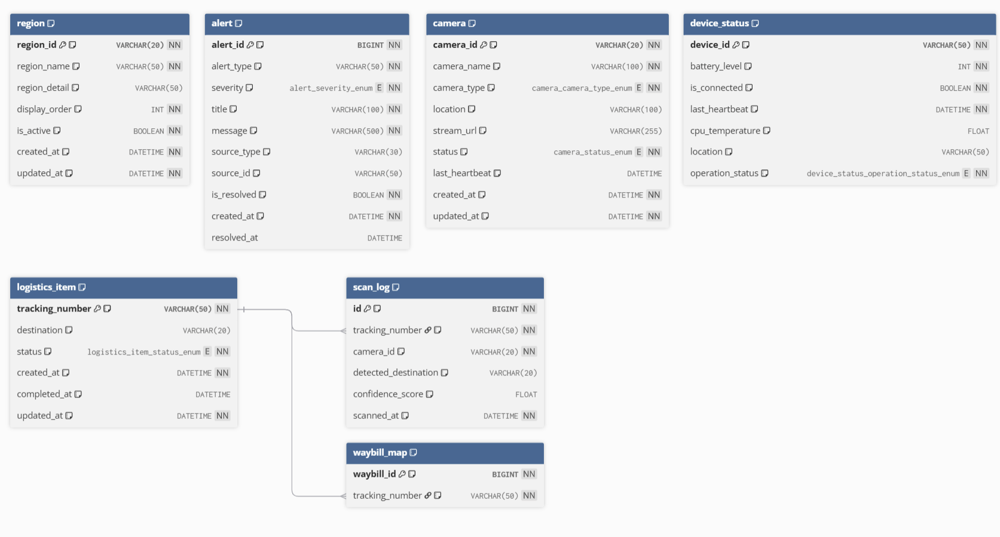

# ERD

상태: Done
생성자: 재국

[https://dbdiagram.io/d/Autobox-69688755d6e030a02419fd01](https://dbdiagram.io/d/Autobox-69688755d6e030a02419fd01)



```sql
/* =========================================================
   AutoBox Database (MySQL 8.x)
   ========================================================= */

CREATE DATABASE IF NOT EXISTS autobox
  DEFAULT CHARACTER SET utf8mb4
  DEFAULT COLLATE utf8mb4_0900_ai_ci;

USE autobox;

/* =========================================================
   1) LogisticsItem (물류 아이템 메인)
   - tracking_number: 프론트 ERD의 PK
   - destination/status/created_at/completed_at/updated_at: 프론트 필드와 1:1
   ========================================================= */

DROP TABLE IF EXISTS scan_log;
DROP TABLE IF EXISTS waybill_map;
DROP TABLE IF EXISTS logistics_item;
DROP TABLE IF EXISTS device_status;
DROP TABLE IF EXISTS region;
DROP TABLE IF EXISTS camera;
DROP TABLE IF EXISTS alert;

CREATE TABLE logistics_item (
  tracking_number VARCHAR(50) NOT NULL COMMENT '운송장 번호 (고유값)',
  destination     VARCHAR(20) NULL COMMENT '목표 지역 (region_id)',
  status          ENUM('READY','MOVING','COMPLETED','ERROR') NOT NULL DEFAULT 'READY' COMMENT '상태',
  created_at      DATETIME NOT NULL DEFAULT CURRENT_TIMESTAMP COMMENT '생성 시간',
  completed_at    DATETIME NULL COMMENT '완료 시간',
  updated_at      DATETIME NOT NULL DEFAULT CURRENT_TIMESTAMP ON UPDATE CURRENT_TIMESTAMP COMMENT '최종 수정 시간',
  PRIMARY KEY (tracking_number),
  INDEX idx_li_created_at (created_at),
  INDEX idx_li_status_created (status, created_at),
  INDEX idx_li_destination_created (destination, created_at)
) ENGINE=InnoDB COMMENT='물류 아이템(메인)';

/* =========================================================
   2) ScanLog (스캔 이력)
   - 한 운송장(tracking_number)에 대해 여러 스캔이 쌓임 (1:N)
   - 최신 스캔 1개(latest_scan)를 빠르게 뽑기 위한 복합 인덱스 포함
   ========================================================= */

CREATE TABLE scan_log (
  id                   BIGINT NOT NULL AUTO_INCREMENT COMMENT '로그 고유 ID',
  tracking_number      VARCHAR(50) NOT NULL COMMENT '운송장 번호 (FK)',
  camera_id            VARCHAR(20) NOT NULL COMMENT '촬영한 카메라 ID',
  detected_destination VARCHAR(20) NULL COMMENT 'AI가 인식한 지역명(region_id)',
  confidence_score     FLOAT NULL COMMENT 'AI 신뢰도(0~100)',
  scanned_at           DATETIME NOT NULL DEFAULT CURRENT_TIMESTAMP COMMENT '스캔 시간',
  PRIMARY KEY (id),
  CONSTRAINT fk_scan_log_tracking
    FOREIGN KEY (tracking_number) REFERENCES logistics_item(tracking_number)
    ON DELETE CASCADE,
  INDEX idx_sl_tracking_scanned (tracking_number, scanned_at DESC, id DESC),
  INDEX idx_sl_scanned_at (scanned_at)
) ENGINE=InnoDB COMMENT='스캔 로그(이력)';

/* =========================================================
   3) DeviceStatus (장치 상태)
   - 젯슨/라즈베리파이/로봇 등 단말의 최신 상태 1행으로 유지(UPSERT)
   ========================================================= */

CREATE TABLE device_status (
  device_id        VARCHAR(50) NOT NULL COMMENT '기기 ID (ROBOT_01 등)',
  battery_level    INT NOT NULL COMMENT '배터리 잔량(0~100)',
  is_connected     BOOLEAN NOT NULL COMMENT '연결 상태',
  last_heartbeat   DATETIME NOT NULL DEFAULT CURRENT_TIMESTAMP COMMENT '마지막 통신 시간',
  cpu_temperature  FLOAT NULL COMMENT 'CPU 온도',
  location         VARCHAR(50) NULL COMMENT '위치 정보(좌표 또는 구역명)',
  operation_status ENUM('LOAD','TRANSPORT','STOP') NOT NULL DEFAULT 'STOP' COMMENT '동작 상태',
  PRIMARY KEY (device_id),
  INDEX idx_ds_heartbeat (last_heartbeat)
) ENGINE=InnoDB COMMENT='장치 상태(최신)';

/* =========================================================
   4) (선택) waybill_id 라우팅 유지용 매핑 테이블
   - 너의 API는 /waybills/{waybill_id} 형태가 존재
   - DB 메인은 tracking_number라서 ID<->tracking_number 매핑을 둬서 깔끔하게 연결
   ========================================================= */

CREATE TABLE waybill_map (
  waybill_id       BIGINT NOT NULL AUTO_INCREMENT COMMENT '내부 운송장 ID',
  tracking_number  VARCHAR(50) NOT NULL COMMENT '운송장 번호',
  PRIMARY KEY (waybill_id),
  UNIQUE KEY uk_waybill_map_tracking (tracking_number),
  CONSTRAINT fk_waybill_map_tracking
    FOREIGN KEY (tracking_number) REFERENCES logistics_item(tracking_number)
    ON DELETE CASCADE
) ENGINE=InnoDB COMMENT='내부 ID(waybill_id) <-> tracking_number 매핑';

/* =========================================================
   5) (선택) Region / Camera / Alert
   - 너의 API 문서에 이미 존재하는 자원들
   - 프론트 메타데이터/운영 대시보드/알림 기능을 위해 DB로 저장하는 구조
   ========================================================= */

CREATE TABLE region (
  region_id      VARCHAR(20) NOT NULL COMMENT '구역 ID (seoul-a)',
  region_name    VARCHAR(50) NOT NULL COMMENT '구역 이름 (서울-A)',
  region_detail  VARCHAR(50) NULL COMMENT '상세(마포)',
  display_order  INT NOT NULL DEFAULT 0 COMMENT '표시 순서',
  is_active      BOOLEAN NOT NULL DEFAULT TRUE COMMENT '활성 여부',
  created_at     DATETIME NOT NULL DEFAULT CURRENT_TIMESTAMP,
  updated_at     DATETIME NOT NULL DEFAULT CURRENT_TIMESTAMP ON UPDATE CURRENT_TIMESTAMP,
  PRIMARY KEY (region_id),
  INDEX idx_region_active_order (is_active, display_order)
) ENGINE=InnoDB COMMENT='구역 메타데이터';

CREATE TABLE camera (
  camera_id        VARCHAR(20) NOT NULL COMMENT '카메라 ID',
  camera_name      VARCHAR(100) NOT NULL COMMENT '카메라 이름',
  camera_type      ENUM('live','capture') NOT NULL COMMENT '카메라 타입',
  location         VARCHAR(100) NULL COMMENT '설치 위치',
  stream_url       VARCHAR(255) NULL COMMENT '스트림 URL',
  status           ENUM('online','offline') NOT NULL DEFAULT 'offline' COMMENT '상태',
  last_heartbeat   DATETIME NULL COMMENT '마지막 하트비트',
  created_at       DATETIME NOT NULL DEFAULT CURRENT_TIMESTAMP,
  updated_at       DATETIME NOT NULL DEFAULT CURRENT_TIMESTAMP ON UPDATE CURRENT_TIMESTAMP,
  PRIMARY KEY (camera_id),
  INDEX idx_camera_status (status),
  INDEX idx_camera_heartbeat (last_heartbeat)
) ENGINE=InnoDB COMMENT='카메라 메타/상태';

CREATE TABLE alert (
  alert_id      BIGINT NOT NULL AUTO_INCREMENT COMMENT '알림 ID',
  alert_type    VARCHAR(50) NOT NULL COMMENT '알림 타입(ocr_error 등)',
  severity      ENUM('info','warning','critical') NOT NULL DEFAULT 'info' COMMENT '심각도',
  title         VARCHAR(100) NOT NULL COMMENT '제목',
  message       VARCHAR(500) NOT NULL COMMENT '메시지',
  source_type   VARCHAR(30) NULL COMMENT '출처 타입(waybill/system 등)',
  source_id     VARCHAR(50) NULL COMMENT '출처 ID(waybill_id/tracking_number 등)',
  is_resolved   BOOLEAN NOT NULL DEFAULT FALSE COMMENT '해결 여부',
  created_at    DATETIME NOT NULL DEFAULT CURRENT_TIMESTAMP,
  resolved_at   DATETIME NULL,
  PRIMARY KEY (alert_id),
  INDEX idx_alert_resolved_created (is_resolved, created_at),
  INDEX idx_alert_severity_created (severity, created_at)
) ENGINE=InnoDB COMMENT='알림';

/* =========================================================
   6) (선택) 데이터 무결성 보강: CHECK (MySQL 8.0.16+에서 동작)
   ========================================================= */

ALTER TABLE device_status
  ADD CONSTRAINT chk_ds_battery CHECK (battery_level BETWEEN 0 AND 100);

ALTER TABLE scan_log
  ADD CONSTRAINT chk_sl_confidence CHECK (confidence_score IS NULL OR (confidence_score BETWEEN 0 AND 100));

```

---

## 2) (중요) “리스트에서 최신 스캔(latest_scan) 뽑는 쿼리” — MySQL 8 윈도우함수

`GET /waybills` 응답이 `latest_scan`을 포함하므로, DB에서도 **tracking_number별 최신 1건만** 빠르게 가져오도록 설계

```sql
/* 최신 스캔 1건을 tracking_number별로 추려서 리스트에 붙이는 쿼리 */
WITH latest AS (
  SELECT
    sl.*,
    ROW_NUMBER() OVER (
      PARTITION BY sl.tracking_number
      ORDER BY sl.scanned_at DESC, sl.id DESC
    ) AS rn
  FROM scan_log sl
)
SELECT
  li.tracking_number,
  li.destination,
  li.status,
  li.created_at,
  li.completed_at,
  li.updated_at,

  l.camera_id AS latest_camera_id,
  l.detected_destination AS latest_detected_destination,
  l.confidence_score AS latest_confidence_score,
  l.scanned_at AS latest_scanned_at
FROM logistics_item li
LEFT JOIN latest l
  ON l.tracking_number = li.tracking_number
 AND l.rn = 1
ORDER BY li.created_at DESC
LIMIT 20 OFFSET 0;

```

이 쿼리가 잘 돌도록 `scan_log(tracking_number, scanned_at DESC, id DESC)` 인덱스를 넣어둠.

---

# 3) 왜 이렇게 설계했는지 (상세 이유)

## 3.1 핵심 원칙: 정보를 언제나 실시간으로 공유

백엔드/DB는 결국 그 화면을 안정적으로 공급해야 함

그래서 `LogisticsItem`을 “운송장 1건의 현재 상태”로 두고:

- `tracking_number` (운송장 고유키)
- `destination` (분류 구역)
- `status` (READY/MOVING/COMPLETED/ERROR)
- `created_at`, `completed_at`, `updated_at`

을 **프론트가 그대로 소비할 수 있게 1:1로 테이블화**.

> 프론트는 매번 “API 키 변환”을 하지 않아도 되고, DB도 “현재 상태”를 읽는 쿼리가 단순해집니다.
> 

---

## 3.2 현재 상태와 이력(로그)은 분리

물류처럼 이벤트가 반복되는 시스템에서 가장 흔한 실수는:

- 테이블 하나에 “현재 상태”도 넣고
- “스캔 이력”도 같은 곳에 계속 덮어쓰는 것

이러면 나중에 **분석/감사/디버깅**이 불가능.

그래서 구조를 이런 방식으로 나눔

- `logistics_item`: **현재 상태(정규화된 스냅샷)**
    
    → 대시보드 테이블, 진행 상태 표시, 통계 집계의 기준
    
- `scan_log`: **이력(append-only)**
    
    → OCR 결과가 여러 번 들어올 수 있고, 카메라가 여러 번 찍을 수 있음
    

> 테이블 목록은 항상 가볍게 조회 가능하고, 상세 화면에서만 로그를 많이 보여주면 됨. 문제 발생 시 “언제 어떤 카메라가 어떤 confidence로 무엇을 읽었는지”를 남길 수 있습니다.
> 

---

## 3.3 상태(status) 단순화

운영상 오류도 반드시 필요하니까 최종적으로:

- READY (준비: 스캔~인식까지 포함)
- MOVING (이동)
- COMPLETED (완료)
- ERROR (오류)

4단계로 통일.

> 화면은 복잡할수록 버그가 나고, UX가 흔들림.  내부 상세 이벤트는 `scan_log`(또는 별도 event log)에서 다루면 됨. 프론트는 “지금 어떤 단계냐”가 가장 중요함
> 

표시용 상태와 내부 이벤트를 분리

---

## 3.4 인덱스 설계는 “대시보드 쿼리 3개”를 기준으로 한다

대시보드는 보통 다음을 많이 해:

1. **최근 생성 순 목록**
- `ORDER BY created_at DESC`
- 그래서 `idx_li_created_at`
1. **상태별 필터 + 날짜 정렬**
- `WHERE status = ? ORDER BY created_at DESC`
- 그래서 `idx_li_status_created (status, created_at)`
1. **구역(destination) 필터 + 날짜 정렬**
- `WHERE destination = ? ORDER BY created_at DESC`
- 그래서 `idx_li_destination_created (destination, created_at)`

그리고 너는 목록에서 `latest_scan`을 보여주고 싶어 했지.

이게 성능의 승부처라서 scan_log는:

- `idx_sl_tracking_scanned (tracking_number, scanned_at DESC, id DESC)`

이게 없으면 tracking_number별 최신 스캔을 찾기 위해

로그 테이블을 계속 뒤져야 해서 급격히 느려져.

---

## 3.5 DeviceStatus는 “이력 테이블”이 아니라 “최신 1행 테이블”이 맞다

장치 상태는 대시보드에서는

- 현재 배터리 몇 %
- 연결 됐나?
- 마지막 하트비트가 언제인가?

이런 최신 상태만 필요한데, 이걸 로그로 쌓으면

- 데이터가 불필요하게 커진다
- 최신 상태 조회가 느려진다
- 운영 화면이 어렵다.

그래서 `device_id` PK로 **한 행을 UPSERT로 계속 갱신**.

---

## 3.6 Region/Camera/Alert를 테이블로 둔 이유

- Region: 구역 추가/비활성화/정렬(display_order) 같은 기능이 명세에 있음
- Camera: last_heartbeat로 “카메라 죽었나?” 모니터링 가능
- Alert: 해결 처리(resolved)와 “미해결 알림 목록”이 명세에 있음

즉, 이 3개는 DB에 있어야 명세대로 정상 운영이 된다.