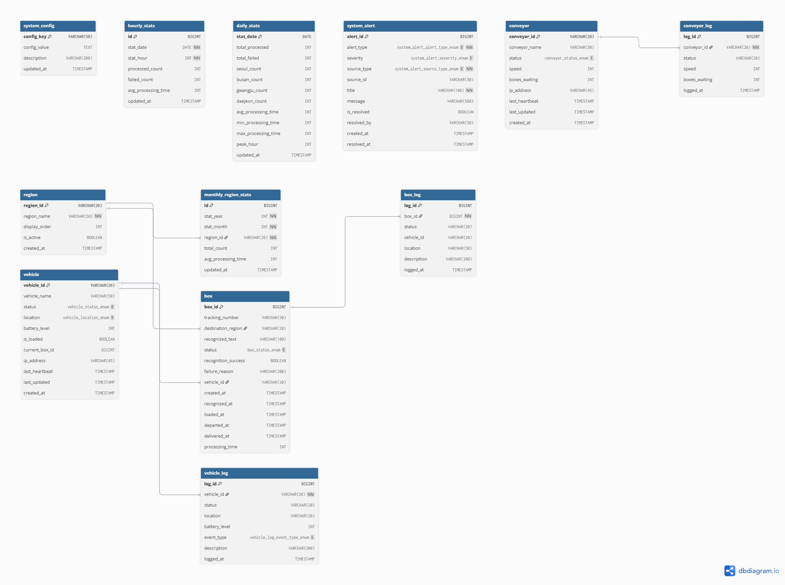

# 간단한 ERD 스크래치

생성 일시: 2026년 1월 15일 오후 3:25
생성자: KimHyunbin

> 간단히 구상했습니다 언제든지 바뀔 수 있습니다
> 

## ERD 개요

```
┌─────────────┐     ┌─────────────┐     ┌─────────────┐
│   Vehicle   │     │    Box      │     │   Region    │
│   (차량)    │────<│   (박스)     │>────│   (구역)    │
└─────────────┘     └─────────────┘     └─────────────┘
       │                   │
       │                   │
       ▼                   ▼
┌─────────────┐     ┌─────────────┐
│VehicleLog   │     │  BoxLog     │
│(차량이력)    │     │ (박스이력)   │
└─────────────┘     └─────────────┘

┌─────────────┐     ┌─────────────┐
│ Conveyor    │     │ SystemAlert │
│(컨베이어)    │     │ (시스템알림) │
└─────────────┘     └─────────────┘

```

## 테이블 설계

### 1. 차량 관리

```sql
-- 차량 기본 정보
CREATE TABLE vehicle (
    vehicle_id      VARCHAR(20) PRIMARY KEY,  -- 'V001'
    vehicle_name    VARCHAR(50),
    status          ENUM('idle', 'loading', 'moving', 'unloading', 'returning', 'error'),
    location        ENUM('conveyor', 'in_transit', 'seoul', 'busan', 'gwangju', 'daejeon'),
    battery_level   INT,                       -- 0~100
    is_loaded       BOOLEAN DEFAULT FALSE,
    current_box_id  INT NULL,
    last_updated    TIMESTAMP DEFAULT CURRENT_TIMESTAMP ON UPDATE CURRENT_TIMESTAMP,
    created_at      TIMESTAMP DEFAULT CURRENT_TIMESTAMP
);

-- 차량 상태 이력 (모니터링용)
CREATE TABLE vehicle_log (
    log_id          BIGINT AUTO_INCREMENT PRIMARY KEY,
    vehicle_id      VARCHAR(20),
    status          VARCHAR(20),
    location        VARCHAR(20),
    battery_level   INT,
    logged_at       TIMESTAMP DEFAULT CURRENT_TIMESTAMP,
    FOREIGN KEY (vehicle_id) REFERENCES vehicle(vehicle_id)
);

```

### 2. 박스/택배 관리

```sql
-- 배송 구역
CREATE TABLE region (
    region_id       VARCHAR(20) PRIMARY KEY,  -- 'seoul', 'busan'
    region_name     VARCHAR(50),              -- '서울', '부산'
    display_order   INT
);

-- 박스 정보
CREATE TABLE box (
    box_id              BIGINT AUTO_INCREMENT PRIMARY KEY,
    tracking_number     VARCHAR(50) UNIQUE,       -- 송장번호
    destination_region  VARCHAR(20),              -- 목적지 구역
    recognized_text     VARCHAR(100),             -- OCR 인식 원본 텍스트
    status              ENUM('waiting', 'recognized', 'loaded', 'in_transit', 'delivered', 'failed'),
    recognition_success BOOLEAN DEFAULT TRUE,
    failure_reason      VARCHAR(200) NULL,        -- 인식 실패 사유
    vehicle_id          VARCHAR(20) NULL,         -- 배정된 차량
    created_at          TIMESTAMP DEFAULT CURRENT_TIMESTAMP,  -- 컨베이어 진입 시간
    recognized_at       TIMESTAMP NULL,           -- 인식 완료 시간
    loaded_at           TIMESTAMP NULL,           -- 차량 적재 시간
    delivered_at        TIMESTAMP NULL,           -- 구역 도착 시간
    FOREIGN KEY (destination_region) REFERENCES region(region_id),
    FOREIGN KEY (vehicle_id) REFERENCES vehicle(vehicle_id)
);

-- 박스 상태 이력 (추적용)
CREATE TABLE box_log (
    log_id          BIGINT AUTO_INCREMENT PRIMARY KEY,
    box_id          BIGINT,
    status          VARCHAR(20),
    vehicle_id      VARCHAR(20) NULL,
    location        VARCHAR(50),
    logged_at       TIMESTAMP DEFAULT CURRENT_TIMESTAMP,
    FOREIGN KEY (box_id) REFERENCES box(box_id)
);

```

### 3. 컨베이어벨트 관리

```sql
-- 컨베이어 상태
CREATE TABLE conveyor (
    conveyor_id     VARCHAR(20) PRIMARY KEY,
    status          ENUM('running', 'stopped', 'error'),
    boxes_waiting   INT DEFAULT 0,            -- 대기 중인 박스 수
    last_updated    TIMESTAMP DEFAULT CURRENT_TIMESTAMP ON UPDATE CURRENT_TIMESTAMP
);

```

### 4. 시스템 알림

```sql
-- 시스템 알림/이슈
CREATE TABLE system_alert (
    alert_id        BIGINT AUTO_INCREMENT PRIMARY KEY,
    alert_type      ENUM('vehicle_error', 'route_deviation', 'communication_error', 'recognition_fail', 'conveyor_error'),
    severity        ENUM('info', 'warning', 'critical'),
    source_id       VARCHAR(50),              -- 관련 차량ID 또는 박스ID
    message         VARCHAR(500),
    is_resolved     BOOLEAN DEFAULT FALSE,
    created_at      TIMESTAMP DEFAULT CURRENT_TIMESTAMP,
    resolved_at     TIMESTAMP NULL
);

```

### 5. 통계용 집계 테이블 (성능 최적화)

```sql
-- 일별 통계 (대시보드 빠른 조회용)
CREATE TABLE daily_stats (
    stat_date           DATE PRIMARY KEY,
    total_processed     INT DEFAULT 0,
    seoul_count         INT DEFAULT 0,
    busan_count         INT DEFAULT 0,
    gwangju_count       INT DEFAULT 0,
    daejeon_count       INT DEFAULT 0,
    failed_count        INT DEFAULT 0,
    avg_processing_time INT DEFAULT 0,        -- 초 단위
    updated_at          TIMESTAMP DEFAULT CURRENT_TIMESTAMP ON UPDATE CURRENT_TIMESTAMP
);

-- 시간대별 통계
CREATE TABLE hourly_stats (
    id                  BIGINT AUTO_INCREMENT PRIMARY KEY,
    stat_date           DATE,
    stat_hour           INT,                  -- 0~23
    processed_count     INT DEFAULT 0,
    avg_processing_time INT DEFAULT 0,
    UNIQUE KEY (stat_date, stat_hour)
);

```

## 주요 인덱스

```sql
-- 자주 조회되는 컬럼에 인덱스
CREATE INDEX idx_box_status ON box(status);
CREATE INDEX idx_box_created ON box(created_at);
CREATE INDEX idx_box_destination ON box(destination_region);
CREATE INDEX idx_box_log_boxid ON box_log(box_id);
CREATE INDEX idx_vehicle_log_vid ON vehicle_log(vehicle_id);
CREATE INDEX idx_alert_resolved ON system_alert(is_resolved, created_at);

```

## 대시보드 기능별 쿼리 예시

```sql
-- 1. 실시간 차량 현황
SELECT * FROM vehicle;

-- 2. 구역별 오늘 처리량
SELECT destination_region, COUNT(*) as count
FROM box
WHERE DATE(delivered_at) = CURDATE() AND status = 'delivered'
GROUP BY destination_region;

-- 3. 평균 분류 시간 (인식 → 배송완료)
SELECT AVG(TIMESTAMPDIFF(SECOND, recognized_at, delivered_at)) as avg_seconds
FROM box
WHERE DATE(delivered_at) = CURDATE() AND status = 'delivered';

-- 4. 인식 실패 목록
SELECT * FROM box
WHERE recognition_success = FALSE
ORDER BY created_at DESC;

-- 5. 미해결 알림
SELECT * FROM system_alert
WHERE is_resolved = FALSE
ORDER BY severity DESC, created_at DESC;

-- 6. 특정 박스 추적
SELECT bl.*, b.tracking_number
FROM box_log bl
JOIN box b ON bl.box_id = b.box_id
WHERE b.tracking_number = 'TRACK001'
ORDER BY bl.logged_at;

```

---



[ERD 다이어그램 스크래치.pdf](ERD_%EB%8B%A4%EC%9D%B4%EC%96%B4%EA%B7%B8%EB%9E%A8_%EC%8A%A4%ED%81%AC%EB%9E%98%EC%B9%98.pdf)