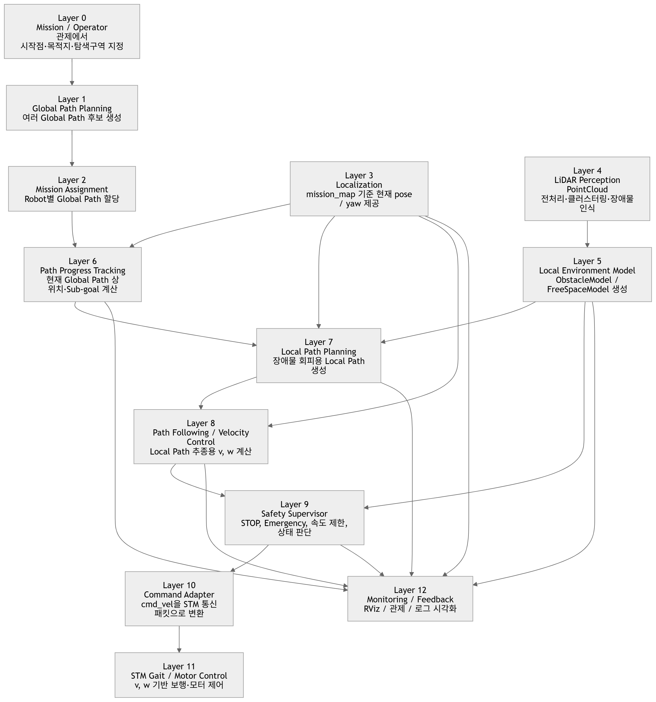

# [AN] 구조 설계 초안

상태: Autonomous Navigation

```bash
1단계:
assigned global path를 받아 현재 waypoint / lookahead target 계산

2단계:
global path만 따라가는 local_decision_node 구현

3단계:
전방 장애물 감지 시 STOP 또는 AVOID_LEFT/RIGHT 판단

4단계:
free_space_model.best_heading 기반으로 local target point 생성

5단계:
local target point들을 nav_msgs/Path로 묶어 /planning/local_path publish

6단계:
local_path_follower_node가 /planning/local_path를 따라가도록 구현

7단계:
local path 완료 후 global path nearest index를 재계산해 복귀

8단계:
motion_command_adapter_node로 STM 명령 연결
```

[데이터 흐름도]

```bash
[관제]
start / goal / search area
        ↓
[Global Path Planner]
/mission/candidate_global_paths
        ↓
[Mission Assignment]
/mission/assigned_global_path
        ↓
[Path Progress Tracker]
/navigation/path_progress
/navigation/global_sub_goal
        ↑
/localization/pose
        ↓
[Local Path Planner]
/planning/local_path
        ↑
/perception/lidar/obstacle_model
/perception/lidar/free_space_model
        ↓
[Path Follower / Velocity Controller]
/control/cmd_vel_raw
        ↑
/localization/pose
        ↓
[Safety Supervisor]
/control/cmd_vel
/decision/local_decision
        ↓
[Command Adapter]
STM packet
        ↓
[STM Gait Controller]
motor / servo control
```

---

### 전체 계증 구조도



### ROS Topic 중심 데이터 흐름도

.png)

### 좌표계 기준 흐름도


---