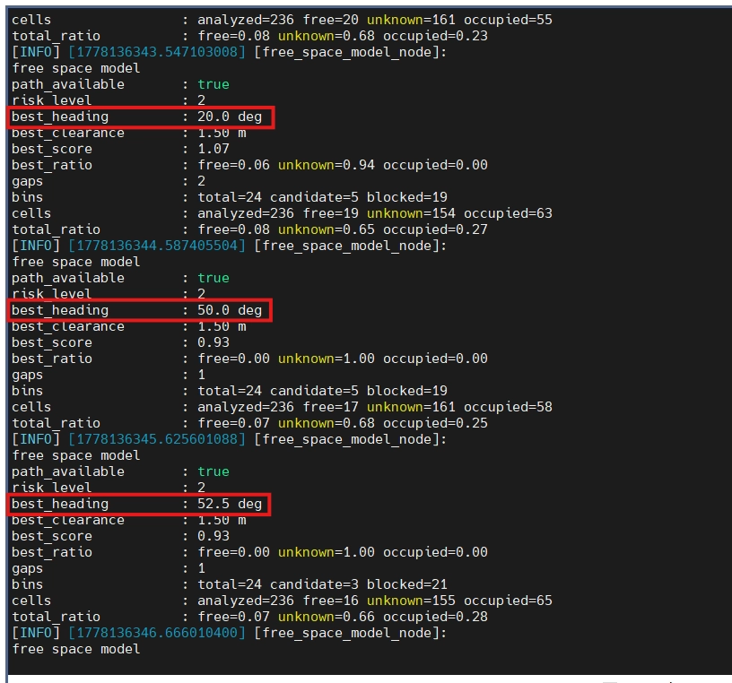

# [Perception] LiDAR 기반 환경 모델 문서화

상태: Perception

```cpp
find . -type f -name "*.rviz"

roi_min_x: 0.35, roi_max_x: 1.5, roi_min_y: -1.0   # 왼쪽 1m
roi_max_y:  1.0, roi_min_z: 0.05, roi_max_z: 1.0

# Voxel downsampling leaf size [m]
voxel_leaf_size: 0.03

# Invalid point filtering
remove_invalid_points: true
remove_zero_points: true
zero_point_epsilon: 0.000001
```

> 지금까지 만든 Perception 환경 모델들을 확실히 문서화하는 작업
> 

```bash
T1:
ros2 launch robot_bringup rl_motion_manager.launch.py

T2:
ros2 launch lidar_perception lidar_environment_with_memory.launch.py

T3:
ros2 launch spot_localization localization_tf_chain_real.launch.py

T4:
ros2 launch spot_navigation local_path_pipeline.launch.py

T5:
rviz2 -d ./.rviz2/verification_final_perception_localization_navigation.rviz

T6: CLASSIC
```

[Param 검증]

```bash
ros2 param get /{Node} {Parameter Name}
ros2 param get /local_path_planner_node obstacle_model_topic
ros2 param get /mission_tf_node start_x_m ; ros2 param get /mission_tf_node start_y_m ; ros2 param get /mission_tf_node start_yaw_rad
```

[LiDAR 기반 Perception 노드 역할 정리]

```bash
1. pointcloud_preprocess_node
   - raw LiDAR point cloud를 base_link 기준으로 변환
   - ROI/filtering/downsampling 수행
   - /perception/lidar/points_filtered publish

2. obstacle_cluster_node
   - points_filtered 기반 clustering
   - obstacle cluster 생성
   - colored point cloud 시각화

3. obstacle_model_node
   - cluster 결과를 front/left/right sector별 대표 장애물로 요약
   - 각 방향의 obstacle valid, nearest distance, azimuth 산출

4. local_occupancy_grid_node
   - points_filtered를 2D OccupancyGrid로 변환
   - unknown/free/occupied cell 생성
   - ray tracing 기반 free cell 생성
   - /perception/lidar/local_occupancy_grid publish

5. free_space_model_node
   - local_occupancy_grid를 front/left/right sector별로 분석
   - free/block/unknown/clearance/ratio 계산
   - /perception/lidar/free_space_model publish

6. free_space_marker_node
   - free_space_model 결과를 RViz 부채꼴 sector로 시각화
```

[Perception 계층 MVP]

```bash
ObstacleModel:
- 장애물 cluster가 있으면 방향과 거리를 잘 뽑는다.
- front/left/right sector별 대표 장애물을 구분한다.

LocalOccupancyGrid:
- points_filtered를 base_link 기준 2D grid로 변환한다.
- ray tracing으로 free cell을 생성한다.
- occupied endpoint를 grid에 표시한다.

FreeSpaceModel:
- grid 기반으로 sector별 unknown/free/occupied/clearance를 계산한다.
- 다만 현재 unknown_ratio가 높아 상태 판단은 보수적이다.
- 따라서 현재는 "주행 가능 최종 판단"보다 "공간 상태 요약"으로 사용한다.

FreeSpaceMarker:
- FreeSpaceModel의 판단 sector와 상태를 RViz에서 확인한다.
```

```bash
ObstacleModel = 명확한 장애물 중심 정보
FreeSpaceModel = 공간 상태와 관측 신뢰도 정보
LocalOccupancyGrid = 이 둘의 grid 기반 근거
FreeSpaceMarker = 해석 보조 시각화
```

[README_LIDAR_PERCEPTION_MODELS.md]

```bash
1. LiDAR Perception 전체 파이프라인
2. 각 노드 역할
3. 각 토픽 입력/출력
4. ObstacleModel vs FreeSpaceModel 차이
5. LocalOccupancyGrid의 unknown/free/occupied 의미
6. FreeSpaceModel의 blocked_state 해석
7. 현재 한계: unknown_ratio dominant 문제
8. 상위 EnvironmentModel에서의 사용 방침
9. 다음 단계: EnvironmentModel 또는 Localization MVP
```

---

## 0. lidar_perception 패키지 파일 구조

```bash
jetson@ubuntu2204:~/robot_ws/src/perception/lidar_perception$ tree
.
├── CMakeLists.txt
├── config
│   ├── free_space_model.param.yaml
│   ├── local_occupancy_grid.param.yaml
│   ├── obstacle_cluster.param.yaml
│   └── pointcloud_preprocess.param.yaml
├── include
│   └── lidar_perception
│       ├── free_space_marker_node.hpp
│       ├── free_space_model_node.hpp
│       ├── local_occupancy_grid_node.hpp
│       ├── obstacle_cluster_node.hpp
│       ├── obstacle_model_node.hpp
│       ├── pointcloud_preprocess_node.hpp
│       └── scan_utils.hpp
├── launch
│   ├── lidar_base.launch.py
│   ├── lidar_environment_model.launch.py
│   ├── lidar_free_space_model.launch.py
│   ├── lidar_obstacle_model.launch.py
│   ├── lidar_preprocess.launch.py
│   └── local_occupancy_grid.launch.py
├── package.xml
├── README.md
└── src
    ├── free_space_marker_node.cpp
    ├── free_space_model_node.cpp
    ├── local_occupancy_grid_node.cpp
    ├── obstacle_cluster_node.cpp
    ├── obstacle_model_node.cpp
    └── pointcloud_preprocess_node.cpp

```

---

## 1. Raw LiDAR

```bash
[Raw LiDAR]
CygLiDAR Driver
  └── publish: /scan_3D
        ↓
Static TF: base_link ↔ laser_frame 관계 제공
        ↓
pointcloud_preprocess_node
  └── subscribe: /scan_3D
  └── publish  : /perception/lidar/points_filtered
```

- **확인할 소스 파일 목록**
    - **pointcloud_preprocess_node.hpp**
    - **pointcloud_preprocess_node.cpp**
    - **lidar_base.launch.py**
    - **pointcloud_preprocess.param.yaml**

#### 1-1. Static TF의 역할

Static TF는 **LiDAR 센서가 로봇 몸체(base_link) 기준으로 어디에 달려 있는지 알려주는 고정 좌표 변환 정보**이다.

```bash
base_link 기준으로 laser_frame은
- (x, y, z) = (0.14m, 0.00m, 0.05m)
- (roll, pitch, yaw) = (0, 0, 0)
위치에 고정되어 있다.
```

즉, 로봇 중심 좌표계(`base_link`)와 LiDAR 센서 좌표계(`laser_frame`) 사이의 관계를 **ROS2 TF tree에 등록하는 역할**

#### 1-2. ROS PointCloud2, PCL PointCloud 차이

**1️⃣ ROS - `sensor_msgs/msg/PointCloud2`**

PointCloud2는 ROS에서 PointCloud를 토픽으로 주고받기 위한 **메시지 포맷**으로 통신용 포맷에 가깝다.

```cpp
ROS 노드 A
  publish PointCloud2
      ↓
ROS topic
      ↓
ROS 노드 B
  subscribe PointCloud2
```

- 장점 : ROS 토픽으로 주고받을 수 있다.
- 단점 : **내부 구조는 binary data 배열** 중심으로, 직접 필터링 및 다운샘플링 알고리즘을 구현해 다루기 불편하다

---

**2️⃣ PCL - `PointCloud<pcl::PointXYZ>`** 

PCL(Point Cloud Library)로 **PointCloud 데이터를 필터링, 다운샘플링, 클러스터링, 평면 제거, 노이즈 제거 등으로 처리하기 위한 C++ 라이브러리**이다.

```cpp
// PointCloud : 데이터 컨테이너
// PointXYZ   : 데이터 타입(자료구조)
pcl::PointCloud<pcl::PointXYZ>
```

- PCL에서 사용하는 **점군 자료구조**로 x, y, z 좌표를 가진 점들의 묶음이다.
- 각 점은 아래의 구조를 가진다(3차원 포인트라는 가정)
    
    ```cpp
    point[0] = (x0, y0, z0)
    point[1] = (x1, y1, z1)
    point[2] = (x2, y2, z2)
    ...
    ```
    
- 즉, pcl::PointXYZ = x, y, z 좌표만 가진 점 타입으로 다양한 자료 구조가 있음
    - `pcl::PointXYZI` : 좌표 + intensity(반사 강도 및 수신 신호 세기)
    - `pcl::PointXYZRGB` : 좌표 + 색상

#### 1-3. 전처리 과정

- **전처리 요약 과정**
    
    ```cpp
    1. /scan_3D 수신
    2. 빈 PointCloud인지 확인
    3. ROS PointCloud2 → PCL PointCloud<pcl::PointXYZ> 변환
    4. NaN / Inf / zero point 제거
    5. lookupTransform()으로 laser_frame → base_link 변환 정보 조회
    6. TransformStamped를 Eigen 변환 행렬로 변환
    7. pcl::transformPointCloud()로 PCL 점군에 직접 TF 적용
    8. ROI crop
       - x 범위 필터
       - y 범위 필터
       - z 범위 필터
    9. VoxelGrid downsampling
    10. PCL PointCloud → ROS PointCloud2 변환
    11. header.stamp = 원본 stamp
    12. header.frame_id = base_link
    13. /perception/lidar/points_filtered publish
    ```
    
- **변수 정리**
    
    ```cpp
    msg
    - raw ROS PointCloud2
    - frame: laser_frame
    - points: 9600
    
    cloud_raw
    - raw PCL PointCloud
    - zero point 포함
    
    cloud_raw_valid
    - NaN / Inf / zero point 제거된 PCL PointCloud
    - frame 의미상 아직 laser_frame 기준
    
    cloud_input
    - PCL에서 직접 TF 적용된 PointCloud
    - frame 의미상 base_link 기준
    
    cloud_roi_x / y / z
    - ROI 적용 결과
    
    cloud_downsampled
    - voxel downsampling 결과
    
    output_cloud_msg
    - 최종 ROS PointCloud2
    - frame_id = base_link
    ```
    

1️⃣**NaN/Inf/Zero point 제거**

```cpp
NaN
= 숫자가 아님
= 좌표 계산 실패, 유효하지 않은 측정

Inf
= 무한대
= 계산 결과가 비정상적으로 발산

Zero point
= (0, 0, 0)
= 숫자 자체는 정상처럼 보이지만, 센서/드라이버가 invalid 값을 0으로 채웠을 가능성 있음
```

- **`/sacn_3D` Raw 데이터에서 NaN, Inf, Zero point 확인**
    
    
    
    
    
    
    
    - `is_dense : False`는  “이 PointCloud 안에 invalid한 점이 있을 수 있다”는 표시
    - NaN, Inf 값은 없지만 zero exact points 값이 4000개 정도 있음 → 센서 드라이버가 NaN, Inf 값을 (0, 0, 0)으로 처리 중
- 해당 값 제거는 TF 변환 전에 `/scan_3D`의 토픽을 받아서 제거해야됨.
- 그 이유는 (0, 0, 0)의 값은 TF 이후 raw zero point가 (0.14, 0, 0.05)로 변하기 때문이다. → **Static TF 값에 종속되는 현상**

2️⃣ **ROI  필터**

> 로봇 기준(base_link) 전방 x, 좌우 y, 높이 z의 영역 외 PointCloud2 무시
> 

```bash
[ROI Parameter]
- roi_min_x: 0.35, roi_max_x: 1.5
- roi_min_y: -1.0, roi_max_y: 1.0
- roi_min_z: 0.05, roi_max_z: 1.0
```

- x: 0.35m ~ 1.5m → 로봇 기준 전방 35cm 부터 1.5m 까지
- y: -1.0m ~ 1.0m → 로봇 기준 좌우 폭 2m 범위
- z: 0.05m ~ 1.0m → 로봇 기준 높이 5cm부터 1m까지

---

3️⃣ **VoxelGrid downsampling**

> 점군의 개수를 줄이는 대표적인 방법
> 

LiDAR PointCloud는 점이 많을수록 계산량이 커지므로 가까운 위치에 점들이 너무 빽빽하게 모여 있으면 모든 점을 다 유지하지 않아도 장애물 판단에는 큰 문제가 없다. 

따라서 **공간을 작은 3D 격자로 나눈 다음 각 격자 안의 점들을 대표점 하나로 줄이는 방식이 VoxelGrid**이다.

[Voxel]

```cpp
pixel = 2D 이미지의 작은 사각형
voxel = 3D 공간의 작은 정육면체
```

- 2D에서 기본 단위를 pixel로 부르는 것처럼 3D에서는 Voxel이라 부름

---

[Voxel leaf size]

```cpp
voxel_leaf_size: 0.05 [m]
```

- voxel leaf size는 3D 공간을 `가로 5cm × 세로 5cm × 높이 5cm 크기의 큐브`로 나눈다는 의미이다.
- 각 voxel 안에 점이 여러 개 있다면, 그 점들을 하나의 대표점으로 줄인다. → voxel down sampling
    
    ```cpp
    어떤 5cm × 5cm × 5cm 공간 안에 점이 12개 있음
    		↓
    VoxelGrid는 그 12개 점을 하나의 대표점으로 바꿈
    		↓
    12개 점 → 1개 대표점
    ```
    
- **Voxel Grid downsampling이 필요한 이유**
    - 계산량 감소 ( 점 300개 처리 → 점 800개 처리)
    - 노이즈 완화 : 미세한 흔들리는 점을 일정 공간으로 묶기에 흔들림 감소 효과
    - 후속 모델 입력 안정화
    - leaf size에 따른 상황 변화
        
        [leaf size가 작은 경우]
        
        ```
        voxel_leaf_size: 0.02
        ```
        
        라면 voxel 크기가 2cm라서 점을 덜 줄여.
        
        ```cpp
        **[장점]
        - 형상이 더 자세히 남음
        - 작은 장애물 표현이 좋아질 수 있음
        
        [단점]
        - 점 개수가 많음
        - 계산량 증가
        - cluster가 과하게 쪼개질 수 있음**
        ```
        
        ---
        
        [leaf size가 큰 경우]
        
        예를 들어:
        
        ```
        voxel_leaf_size: 0.10
        ```
        
        라면 voxel 크기가 10cm라서 점을 더 많이 줄여.
        
        ```cpp
        **[장점]
        - 계산량 감소
        - 노이즈에 덜 민감
        - cluster가 단순해짐
        
        [단점]
        - 작은 물체가 사라질 수 있음
        - 장애물 경계가 뭉개질 수 있음
        - occupancy grid가 부정확해질 수 있음**
        ```
        

---

**[Voxel leaf size 파라미터 튜닝] - 중요**

```cpp
장애물이 잘 안 잡힌다
→ voxel_leaf_size를 줄여보기
예: 0.05 → 0.03

점이 너무 많고 cluster가 지저분하다
→ voxel_leaf_size를 키워보기
예: 0.05 → 0.07 또는 0.10

작은 물체가 사라진다
→ voxel_leaf_size를 줄이기

노이즈 점이 너무 많다
→ voxel_leaf_size를 키우거나 noise removal 추가
```

---

4️⃣ **PCL PointCloud → ROS PointCloud2 변환**

```cpp
ROS PointCloud2 = 통신용

PCL PointCloud = 계산/처리용
```

- 변환 과정이 필요한 이유는 **ROS 토픽 통신**은 `sensor_msgs/msg/PointCloud2` 로 해야하고, **점군 처리 알고리즘은 PCL 자료구조**에서 처리하는 게 훨씬 편하기 때문
- 비유 :
    
    ```cpp
    ROS PointCloud2
    = 택배 상자 형태
    
    PCL PointCloud
    = 상자를 열어서 내용물을 작업대 위에 펼친 상태
    
    전처리
    = 필요한 물건만 고르고 정리하는 과정
    
    다시 ROS PointCloud2
    = 정리된 결과를 다시 택배 상자에 담아 다음 노드로 보내는 과정
    ```
    

#### 1-4. 출력 토픽과 메시지 구조

- Output Topic : `/perception/lidar/points_filtered`
- Msg Type : `sensor_msgs/msg/PointCloud2` - 표준 ROS 메시지
    
    ```cpp
    filtered_cloud_pub_ = this->create_publisher**<sensor_msgs::msg::PointCloud2>**(
        "/perception/lidar/points_filtered",
        10
    );
    ```
    

[ROS2 표준 `PointCloud2` 구조]

```
**std_msgs/Header header  # header.stamp, header.frame_id**

uint32 height       # 세로 방향 점 개수
uint32 width        # 가로 방향 점 개수

sensor_msgs/PointField[] fields # 각 점의 value(PointXYZ인 경우 x, y, z 값을 가짐)

bool is_bigendian

uint32 point_step   # 점 하나의 byte
uint32 row_step     # 한 줄(row)의 byte 크기
**uint8[] data        # 실제 점군 데이터가 들어있는 binary 배열**
bool is_dense       # 점군 플래그 (True : 유효, False : NaN)
```

현재 이 노드에서 특히 중요한 필드는 이거야.

```
header.stamp
- 입력 /scan_3D의 stamp를 그대로 사용

header.frame_id
- target_frame_ 값 사용
- 현재 yaml 기준 "base_link"

data
- ROI crop + voxel downsampling이 적용된 point cloud binary data
```

#### 1-5. 파라미터 수정 (중요)

[voxel leaf size : 0.05 → 0.03]


---

[voxel leaf size : 0.03 → 0.02]


---

```cpp
장애물이 잘 안 잡힌다
→ roi_max_x를 1.5에서 2.0 또는 2.5로 늘려보기
→ voxel_leaf_size를 0.05에서 0.03으로 줄여보기

바닥 점이 너무 많이 잡힌다
→ roi_min_z를 0.05에서 0.08~0.10으로 올려보기

점이 너무 적다
→ roi_min_x를 0.35에서 0.20~0.30으로 낮춰보기
→ roi_max_z를 넓혀보기
```

- voxel leaf size는 후속 노드 검증 특히 `obstacle_cluster_node` 검증에서 cluster가 불안정하면 0.02로 낮추는 방식으로 조정하기 (중요)

#### 1-6. 추가하면 좋은 전처리 방법

```cpp
필수 후보:
1. NaN / Inf 제거
2. zero point 제거

상황 보고 추가:
3. ground removal : 바닥 제거
4. outlier removal : 튀는 점 제거
5. self filtering : 로봇 다리 등 몸체 제거
```

---

## 2. ObstacleModel Pipeline

```bash
[ObstacleModel Pipeline]

/perception/lidar/points_filtered
  └── pointcloud_preprocess_node가 publish한 전처리 완료 PointCloud2
        ↓
obstacle_cluster_node
  └── subscribe: /perception/lidar/points_filtered
  └── publish  : /perception/lidar/obstacle_clusters
  └── publish  : /perception/lidar/clustered_points_colored
        ↓
obstacle_model_node
  └── subscribe: /perception/lidar/obstacle_clusters
  └── publish  : /perception/lidar/obstacle_model
```

```cpp
한계:
- track_id는 base_link 기준 local tracking이므로 로봇이 움직이면 정적 물체도 상대적으로 움직여 보일 수 있음
- tracking은 cluster merge/split 상황을 완벽히 해결하지 못함
- colored cloud 색상은 track_id 기반이지만 8색 반복이라 완전 고유 색상은 아님
- nearest_distance_xy는 base_link 원점 기준 거리이며 robot footprint 기준 clearance는 아님
```

- **확인할 소스 파일 목록**
    - **ObstacleCluster.msg**
    - **ObstacleClusters.msg**
    - **ObstacleModel.msg**
    - **obstacle_cluster_node.hpp**
    - **obstacle_cluster_node.cpp**
    - **obstacle_model_node.hpp**
    - **obstacle_model_node.cpp**
    - **lidar_obstacle_model.launch.py**
    - **obstacle_cluster.param.yaml**

#### 2-1. Obstacle Cluster 처리 - `obstacle_cluster_node`

```cpp
1단계 개선:
sector를 nearest point 기준으로 변경

2단계 검증:
큰 물체가 sector 경계에 걸칠 때 front/left/right 판단이 더 자연스러운지 확인

3단계 판단:
그래도 하나의 cluster가 여러 sector에 걸친 정보를 잃는 문제가 있으면,
그때 sector_mask 기반 multi-sector 구조를 검토
```

```cpp
/perception/lidar/points_filtered
  ↓
obstacle_cluster_node
  ↓
/perception/lidar/obstacle_clusters            // clustering Output
/perception/lidar/clustered_points_colored     // clustering Rviz 시각화용
```

- **Clustering 과정 요약**
    
    ```cpp
    1. /points_filtered 수신
    2. ROS PointCloud2 → PCL PointCloud 변환
    3. 빈 cloud면 return
    4. KD-Tree 생성
    5. Euclidean clustering 수행
    6. cluster별 nearest distance 계산
    7. nearest_distance 기준으로 cluster 정렬
    8. 각 cluster descriptor 계산
       - centroid
       - nearest point
       - centroid distance
       - nearest distance
       - azimuth/elevation
       - bbox size
       - sector
    9. ObstacleClusters 메시지 publish
    10. RGB colored PointCloud2 publish
    ```
    
- **변수 정리**
    
    ```cpp
    centroid_x/y/z
    = cluster 중심 좌표
    
    centroid_distance_xy
    = base_link에서 cluster 중심까지의 수평 거리
    
    nearest_x/y/z
    = cluster 내부 point 중 base_link에 가장 가까운 표면점 좌표
    
    nearest_distance_xy
    = base_link에서 가장 가까운 표면점까지의 수평 거리
    
    azimuth_angle_rad
    = 가장 가까운 표면점의 수평 방향각
    
    elevation_angle_rad
    = 가장 가까운 표면점의 수직 방향각
    
    sector
    = 가장 가까운 표면점 기준 front / left / right 분류
    ```
    

**1️⃣ KD-Tree 처리**

clustering하기 위해 각 LiDAR Point들이 서로 이웃한 점인지에 대한 **탐색이 빠르게 진행될 수 있도록 하는 데이터 구조화 작업**

```cpp
pcl::search::KdTree<pcl::PointXYZ>::Ptr tree(new pcl::search::KdTree<pcl::PointXYZ>());
tree->setInputCloud(cloud);
```

- KD-Tree의 역할 : **가까운 점 탐색을 빠르게 하기 위한 공간 인덱스**
- 이후 Euclidean clustering과 같은 군집화 알고리즘으로 이웃 점들을 반복적으로 찾아야하니, KD-Tree 없이 단순 비교하면 계산량이 커지므로 KD-Tree를 사용한다.

---

**2️⃣ Euclidean clustering**

Euclidean clustering이란 **데이터간 거리가 일정거리 이하이면 하나의 군집으로 묶는 알고리즘**으로 clustering을 위한 **데이터 구조화 작업(KD-Tree)가 필요**하다.


**[핵심 군집화 구조]**

```cpp
pcl::EuclideanClusterExtraction<pcl::PointXYZ> ec;  // Euclidean clustering 알고리즘 객체
ec.**setClusterTolerance(cluster_tolerance_)**;  // 점 사이의 최대 거리 기준 [m]
ec.**setMinClusterSize(min_cluster_size_)**;     // cluster로 인정할 최소 point 수
ec.**setMaxClusterSize(max_cluster_size_)**;     // cluster로 인정할 최대 point 수
ec.setSearchMethod(tree);    // 이웃 탐색에 활용할 tree 지정(KD-Tree)
ec.setInputCloud(cloud);     // clustering을 수행할 입력 점군 지정 (filtered_points)
ec.extract(cluster_indices); // clustering 실행
```

- 현재 파라미터 기준 :
    - `cluster_tolerance = 0.15` : 15cm 이내로 연결된 점들을 같은 cluster로 묶는다.
    - `min_cluster_size = 10`  : 10개 미만의 cluster는 노이즈로 처리 →  clustering X
    - `max_cluster_size = 3000` : 3000개 넘는 cluster는 제외 → clustering X
- **`extract(cluster_indices)` 호출 시 진행되는 과정** :
    
    ```cpp
    1. 아직 방문하지 않은 점 하나를 시작점으로 선택
    2. KD-Tree로 주변 cluster_tolerance 거리 이내의 이웃 점 탐색
    3. 연결된 이웃 점들을 계속 확장
    4. 하나의 연결된 점 묶음을 cluster 후보로 생성
    5. point 개수가 min/max 조건을 만족하면 cluster로 저장
    6. 모든 점을 검사할 때까지 반복
    ```
    

---

**3️⃣ 구조체 기반 Cluster Sort 진행** 

**[cluster_indices 구조]**

```cpp
std::vector<pcl::PointIndices> cluster_indices;

cluster_indices[0] = indices: [3, 8, 11, 20, ...]      // cluster 1
cluster_indices[1] = indices: [40, 41, 45, 50, ...]    // cluster 2
cluster_indices[2] = indices: [100, 102, 105, ...]     // cluster 3
```

- 즉, cluster별 point index 묶음이 들어가 있는 상황

**[ClusterOrderInfo 구조체]**

```cpp
struct ClusterOrderInfo
{
    pcl::PointIndices indices;    // cluster의 point index 묶음
    double nearest_distance_xy;   // 최근접 거리
};
```

- 이후 정렬을 하기 위해 nearest_distance_xy와 같이 관리하는 구조체를 통해 sort 진행

---

4️⃣ **Cluster Descriptor**

LiDAR Point 값들을 군집화 시킨 **Cluster의 핵심 정보(클러스터 중심, 각도 등)**을 계산하는 작업

```cpp
1. point_count                 // 한 cluster를 이루는 총 점의 갯수
2. centroid_x/y/z              // cluster의 중심점
3. nearest_x/y/z               // cluster 내부의 base_link 기준 가장 가까운 점
4. centroid_distance_xy        // base_link 기준 가장 가까운 중심점 [m]
5. nearest_distance_xy         // base_link 기준 가장 가까운 표면점 [m]
6. azimuth_angle_rad           // base_link 기준 수평 방향각 [rad]
7. elevation_angle_rad         // base_link 기준 수직 방향각 [rad]
8. bbox_size_x/y/z             // cluster의 크기와 형상을 파악하기 위한 descriptor
9. sector                      // FRONT, LEFT, RIGHT
```

- bbox : 하나의 cluster를 감싸는 **가상의 최소 축 정렬 박스**
    
    **[현재 파이프라인에서의 역할]**
    
    현재 `obstacle_model_node`는 bbox를 직접 사용하지 않는다. 지금은 주로 다음 값들을 기준으로 sector별 대표 장애물을 선택한다.
    
    ```
    valid
    sector
    nearest_distance_xy
    ```
    
    따라서 현재 bbox는 **즉시 판단에 쓰이는 값이라기보다, 후속 확장과 디버깅을 위한 cluster 크기 정보**로 보면 된다.
    
    ---
    
    **[나중에 활용 가능한 용도]**
    
    bbox는 후속 노드에서 다음 용도로 활용할 수 있다.
    
    ```
    1. 노이즈 cluster 제거
    - point 수는 min_cluster_size를 넘지만 bbox가 지나치게 작으면 노이즈로 판단 가능
    
    2. 큰 구조물/벽성 cluster 판단
    - bbox_size_y가 과도하게 크면 벽 또는 넓은 장애물 가능성
    - bbox_size_z가 낮고 x/y만 넓으면 바닥성 점군 가능성
    
    3. 장애물 크기 판단
    - 작은 물체인지, 넓은 장애물인지, 높은 장애물인지 구분 가능
    
    4. multi-sector 판단 보조
    - bbox_size_y가 크거나 angular span이 넓은 cluster는 여러 sector에 걸칠 가능성이 있음
    
    5. footprint clearance 판단 보조
    - cluster의 크기와 가장 가까운 표면점 정보를 함께 사용하면 더 보수적인 충돌 판단 가능
    ```
    

#### 2-2. nearest point 기준 sector 분류

- 상황 :
    - 장애물이 Right, Front 섹터를 걸쳐서 Right 영역을 완전히 메꿨음에도 `sector:FRONT`로 뜬다. 현재 sector 분류는 가장 가까운 표면점 기준으로 나누기 때문에 충돌 위험성이 가장 큰 영역을 `FRONT`로 계산한 것이다.
    
    ```cpp
    장점:
    - 가장 가까운 충돌 위험 방향을 잡음
    - obstacle_model_node의 nearest_distance_xy 대표 선택 방식과 일관됨
    - msg 구조 수정 없이 바로 사용 가능
    
    단일 sector의 한계:
    - 장애물이 right 영역을 크게 막고 있어도,
      가장 가까운 point가 front에 있으면 RIGHT 정보는 사라진다.
    - 즉, “어느 방향이 막혀 있는가”를 표현하기에는 부족하다.
    ```
    
    - 따라서 지금 관찰한 “right 영역을 거의 메웠다”는 정보는 사실 `ObstacleCluster.sector` 하나로 표현하기보다, 나중에 `local_occupancy_grid_node`와 `free_space_model_node`에서 더 정확하게 다루는 게 맞아

#### 2-3. cluster tracking

구조 :

```cpp
1. Euclidean clustering 수행
2. cluster descriptor 계산
3. nearest_distance_xy 기준으로 cluster_id 부여
4. tracker와 매칭해서 track_id 부여
5. colored cloud는 track_id 기준 색상
6. 로그는 cluster_id 순서, track_id 포함 출력
```

역할 :

```cpp
- cluster_id
	= 현재 프레임에서 nearest_distance_xy 기준으로 가까운 순서
	= 이번 프레임 안에서의 거리순 ID
	= 매 프레임 바뀔 수 있음

- track_id
	= tracker가 같은 물체라고 판단하는 동안 유지하는 ID
	= 프레임 간 동일 장애물 확인용 ID
	= 물체의 시간적 정체성

- 색상: track_id 기준 or cluster_id 기준 (단, tracked = false인 경우)
- 거리/위험 순서: cluster_id 또는 nearest_distance_xy 기준
```

- RViz 색상은 track_id or cluster_id 기준으로 변경되므로 동일한 색상이 입혀질 수 있음
- 색상은 단순히 디버깅을 위한 목적일 뿐, **고유 식별자가 절대 X**
- cluster tracking에서 가장 중요한 것은 **track_id가 고유 식별자**로, 잘 유지되는 지를 확인해야함
    - track_id의 데이터 타입 : `uint32_t`
    - 표현 가능한 ID 수 :  `1 ~ 4,294,967,295` → 총 4,294,967,295 가지
    - 이로 인해 overflow 발생 가능성이 있기에 “현재 사용하지 않는 ID를 찾아서 부여”하는 방식을 고려해볼만 함(중요)

---

Tracking parameter :

```cpp
  // tracking parameters
  bool tracking_enabled_;             
  bool color_by_tarck_id_;
  double tarcking_match_distance_;
  int tracking_max_missed_frames_;
  double tracking_smoothing_alpha_;
```

- `tracking_enalbed_` : tracking 모드 ON/OFF 여부
    
    ```cpp
    true  → cluster에 track_id 부여
    false → track_id=0, tracked=false로 동작
    ```
    
- `color_by_track_id_` : bool 값에 따른 기준 색상
    
    ```cpp
    true  → track_id 기준 색상
    false → cluster_id 기준 색상
    ```
    
- `tracking_match_distance`  : 현재 프레임의 cluster가 기존 track과 같은 물체인지 판단하는 거리 threshold (m)
    
    ```cpp
    [튜닝 방향]
    
    값이 너무 작음
    → 같은 물체인데도 track_id가 자주 새로 생성됨
    
    값이 너무 큼
    → 가까운 두 물체가 서로 잘못 매칭될 수 있음
    ```
    
- `tracking_max_missed_frames` : 기존 track이 몇 프레임 동안 검출되지 않아도 유지할지 정하는 값
    
    ```
    tracking_max_missed_frames: 3
    ```
    
    이면 어떤 장애물이 3프레임 정도 안 보여도 바로 삭제하지 않고 유지하다가, 그 이상 미검출되면 track을 제거한다는 뜻
    
    ```
    [튜닝 방향]
    
    값이 너무 작음
    → LiDAR 점군이 잠깐 흔들릴 때 track이 바로 사라짐
    
    값이 너무 큼
    → 이미 사라진 장애물이 ghost track으로 오래 남음
    ```
    
    **[tracking_max_missed_frames 시간 환산] (중요)**
    
    ```cpp
    유지 시간[초] ≈ tracking_max_missed_frames / 실제 cluster 처리 Hz
    
    Ex) /obstacle_clusters ≈ 8Hz라면
    - tracking_max_missed_frames = 3
    	→ 3 / 8 = 약 0.375초 유지
    	→ 즉, 해당 track_id는 track 목록에 0.375초 동안 유지된다.
    	
    - tracking_max_missed_frames = 5
    	→ 5 / 8 = 약 0.625초 유지
    	→ 즉, 해당 track_id는 track 목록에 0.625초 동안 유지된다.
    ```
    
    - 현재 points_filtered와 obstacle_clusters의 주기는 **평균 약 7.6Hz**이다.
    - tracking 기준 1 frame : **`1 / 7.63  ≈ 0.131` 초**
    - 
- `tracking_smoothing_alpha` : track 위치를 업데이트할 때 이전 위치와 현재 cluster 위치를 얼마나 섞을지 정하는 값
    
    ```cpp
    track_x = alpha * old_track_x + (1.0 - alpha) * current_cluster_x;
    ```
    
    - 값이 0.6이라면, 이전 track 위치를 60% + 현재 cluster 위치 40% 반영
    
    ```cpp
    [튜닝 방향]
    alpha가 작음, 예: 0.2
    → 현재 측정값을 빠르게 따라감
    → 반응은 빠르지만 흔들림이 커질 수 있음
    
    alpha가 큼, 예: 0.8
    → track 위치가 부드러움
    → 하지만 실제 움직임을 늦게 따라감
    ```
    

#### 2-4. Foot print 기준 거리 clearance 계산

```cpp
1단계:
obstacle_cluster_node
- 그대로 cluster의 nearest_x/y/z, nearest_distance_xy, sector 계산
- footprint clearance는 계산하지 않음

2단계:
obstacle_model_node
- sector별 대표 cluster 선택
- 대표 cluster의 nearest_x/y를 이용해 footprint 기준 clearance 계산
- 필요하면 ObstacleModel.msg에 clearance 필드 추가

3단계:
local_occupancy_grid_node / free_space_model_node
- 나중에 footprint 기반 inflation 적용
- 실제 주행 가능 공간 판단에 사용
```

---

## 3. LocalOccupancyGrid Pipeline

```bash
[LocalOccupancyGrid Pipeline]

/perception/lidar/points_filtered
        ↓
local_occupancy_grid_node
  └── subscribe: /perception/lidar/points_filtered
  └── publish  : /perception/lidar/local_occupancy_grid
```

```cpp
한계 :
- 현재 LocalOccupancyGrid는 endpoint 기반 ray tracing 구조이므로,
	return point가 없으면 해당 방향을 free로 확정하지 못한다.
- 따라서 장애물이 없는 평지에서도 point return이 없으면 unknown이 유지될 수 있다.
- 이 unknown 해석은 FreeSpaceModel에서 정책적으로 처리하거나,
	향후 raw beam/no-return ray 모델을 추가해 개선한다.
	
단기 보정:
FreeSpaceModel에서 unknown/free/occupied 비율 기반 정책으로 처리

장기 개선:
raw organized LiDAR beam 또는 no-return 정보를 활용해
max_range free ray를 생성하도록 local grid 센서 모델 개선
```

- **확인할 소스 파일 목록**
    - **local_occupancy_grid_node.hpp**
    - **local_occupancy_grid_node.cpp**
    - **local_occupancy_grid.param.yaml**

#### **3-1. Local 2D Occupancy Grid 구조**

2D Occupancy Grid : base_link 기준으로 **위에서 아래로 내려다본 평면(x, y) 기준 지도**

**3D 공간 :**

```cpp
           z
           ↑
           |
           |        ● ● ●
           |      ● ● ● ●   ← 장애물 표면 점들
           |        ● ●
           |
-----------+----------------→ x
          /
         /
        y
```

**2D OccupancyGrid :**

```cpp
        y(+)
         ↑
         |
         |         ####
         |         ####   ← occupied cell
         |
---------+----------------→ x(+)
      robot
```

- 즉, 장애물의 높낮이 구조는 버리고, **“그 장애물이 바닥 평면에서 어느 위치를 차지하는가?”**만 남기는 것.

#### 3-2. 2D Occupancy Grid 기반 unknown / free / occupied 처리 과정

- unknown : 현재 위치에서 탐색이 안된 영역
- free : 탐지된 영역 내에서의 빈 공간
- occupied : 탐지된 영역 내에서의 장애물이 차지하는 공간

---

[초기 base_link 기준 local grid 영역]

```cpp
[전방 중심 로컬 격자맵]
    
                   y=+2.5
(후면)                ↑
x=-0.5 -----------------------------------
       |                               |
       |                               |
       |            robot              |
       |             (0,0)             |
       |                               |
       |                               |
     ----------------------------------- → x=4.0 (정면)
                 y=-2.5
```

- 세부 파라미터
    
    ```cpp
    - origin_x: -0.5, origin_y: -2.5
    - size_x: 4.5, size_y: 5.0
    - resolution: 0.10 (해상도) 
    ```
    
    - 즉, `x: -0.5  ~ 4.0 m` , `y: -2.5  ~ 2.5 m` 의 범위 영역을 가진다.
    - width = size_x / resolution = 4.5 / 0.1 = 45칸
    - height = size_y / resolution = 5.0 / 0.1 = 50칸
    - Total = width x height = 45 x 50 cells

---

#### 1️⃣ 배경 grid 생성 - 처음에는 아무것도 모르는 상황

```cpp
        y
        ↑
        ? ? ? ? ? ? ? ? ?
        ? ? ? ? ? ? ? ? ?
        ? ? ? ? ? ? ? ? ?
        ? ? ? ? ? ? ? ? ?
        R ? ? ? ? ? ? ? ?
        ? ? ? ? ? ? ? ? ?
        ? ? ? ? ? ? ? ? ?
        ? ? ? ? ? ? ? ? ?

----------------------------→ x
```

- `use_ray_tracing=true`일 때 가장 안전한 초기 상태

#### 2️⃣ LiDAR endpoint 하나가 들어옴

```cpp
        y
        ↑
        ? ? ? ? ? ? ? ? ?
        ? ? ? ? ? ? ? ? ?
        ? ? ? ? ? ? # ? ?
        ? ? ? ? ? ? ? ? ?
        R ? ? ? ? ? ? ? ?
        ? ? ? ? ? ? ? ? ?
        ? ? ? ? ? ? ? ? ?
        ? ? ? ? ? ? ? ? ?

----------------------------→ x
```

- ray tracing 전 단계로 단순히 장애물이 찍힌 **endpoint만** 알 수 있는 상태

#### 3️⃣ Ray tracing 진행

```cpp
        y
        ↑
        ? ? ? ? ? ? ? ? ?
        ? ? ? ? ? ? ? ? ?
        ? ? ? . . . # ? ?
        ? ? . . ? ? ? ? ?
        R . . ? ? ? ? ? ?
        ? ? ? ? ? ? ? ? ?
        ? ? ? ? ? ? ? ? ?
        ? ? ? ? ? ? ? ? ?

----------------------------→ x
```

- **sensor origin(base_link 기준 LiDAR 센서 위치)**에서 endpoint까지 ray를 긋는다
- `R`에서 `#`까지 선을 긋고, endpoint 직전까지 지나간 cell을 free로 표시

#### 4️⃣ endpoint 여러 개가 들어옴

```cpp
        y
        ↑
        ? ? ? ? ? ? ? ? ?
        ? ? ? . . . # ? ?
        ? ? . . . . # ? ?
        ? . . . . . # ? ?
        R . . . . . # ? ?
        ? . . . . . # ? ?
        ? ? . . . . # ? ?
        ? ? ? ? ? ? ? ? ?

----------------------------→ x
```

- 실제 장애물은 point 하나가 아니라 여러 점으로 찍히기 때문에, 여러 ray가 생긴다.

#### 5️⃣ obstacle inflation 적용

```cpp
        y
        ↑
        ? ? ? ? ? ? ? ? ?
        ? ? ? . . # # ? ?
        ? ? . . . # # ? ?
        ? . . . . # # ? ?
        R . . . . # # ? ?
        ? . . . . # # ? ?
        ? ? . . . # # ? ?
        ? ? ? ? ? ? ? ? ?

----------------------------→ x
```

- `R` : 로봇 / 센서 위치   |   `.` : free   |   `#` : occupied   |   `?` : unknown
- `inflate_obstacles=true`이고 `inflation_radius=0.15`이면, occupied cell 주변도 조금 부풀린다. 즉,  `#` 주변 한두 cell이 더 occupied가 될 수 있다.
- 이렇게 하면 장애물 표면만 가느다랗게 찍히는 게 아니라, 안전 여유를 반영해서 좀 더 보수적으로 막힌 영역을 만든다.

#### 3-3. Local Grid와 LiDAR FOV 관계

**Top-view, base_link 기준 :**

```cpp
                         y
                         ↑
        ┌────────────────────────────────┐
        │ ? ? ? ? ? ? ? ? ? ? ? ? ? ? ?  │
        │ ? ? ? ? ? ? ? ? ? ? ? ? ? ? ?  │
        │ ? ? ?      LiDAR 관측      ? ? │
        │ ? ? ?       부채꼴 영역    ? ? │
        │ ? ? ?        \  |  /       ? ? │
        │ ? ? ?         \ | /        ? ? │
        │ ? ? ?          \|/         ? ? │
        │ ? ? ?       base_link      ? ? │
        │ ? ? ?          (0,0)       ? ? │
        └────────────────────────────────┘ → x
```

- 큰 사각형 : local occupancy grid 전체 영역
- 부채꼴 : LiDAR가 실제로 관측 가능한 방향
- 부채꼴 내부에서 ray가 지나간 곳 : free
- LiDAR endpoint : occupied
- 부채꼴 밖 또는 ray가 지나가지 않은 곳 : unknown
- 즉, **배경판은 사각형이고, 관측 정보가 채워지는 모양은 FOV와 point 분포에 의해 부채꼴처럼 나타나는 구조**
    - “grid 전체 = 로봇 주변 local 공간판, FOV = 그 안에서 실제 관측 가능한 영역”

#### 3-4. Ray tracing - Bresenham line algorithm 활용

현재 ray tracing은 Bresenham line algorithm 형태로 활용하고 있다. ⇒ `markRayFree()` 

```cpp
markRayFree(grid_msg, start_x, start_y, end_x, end_y)
```

#### 3-5. 로그 분석

```cpp
1. valid points = 520
	→ 필터를 통과한 point는 520개

2. unique occupied cand. = 48
	→ 이 point들이 실제로는 48개의 grid endpoint cell로 압축됨

3. duplicate candidates = 472
	→ 같은 cell로 떨어진 중복 point가 많았음

4. new free cells = 130
	→ ray tracing으로 이번 frame에서 새로 free가 된 cell 수

5. new occupied cells = 92
	→ endpoint + inflation으로 새로 occupied가 된 cell 수

6. final unknown/free/occupied
	→ 최종 OccupancyGrid의 실제 상태 분포
```

#### 3-6. 개선 및 고도화 방향

### 1️⃣ [개선] range filter 기준을 `base_link`에서 `sensor_origin` 기준으로 변경 검토

현재 xy 거리 필터는 `sqrt(point.x² + point.y²)`로 계산돼. 즉, **base_link 원점 기준 거리**야.

그런데 LiDAR ray tracing의 시작점은 `sensor_origin_x/y`야. 현재 기본값도 `(0.14, 0.0)`으로 선언되어 있고, static TF도 LiDAR가 base_link 기준 x=0.14m 앞에 있다고 잡고 있어.

그래서 LiDAR 측정 거리 관점에서는 아래가 더 정확해.

```
constdoubledx =point.x-sensor_origin_x_;
constdoubledy =point.y-sensor_origin_y_;
constdoublerange_xy = std::sqrt(dx*dx+dy*dy);
```

다만 센서 offset이 14cm라 지금 당장 큰 차이는 아닐 수 있어. 그래서 이건 **검증 후 적용**해도 돼.

---

### 2️⃣ [고도화] inflation cell과 실제 occupied cell 구분

현재 `markInflatedOccupied()`는 중심 cell 주변까지 모두 `occupied_value_`로 찍는다. 내부에서는 inflation 반경 안의 주변 cell에 대해 `markOccupied()`를 호출하는 구조야.

이 방식은 안전하고 단순해. 지금은 유지해도 돼.

나중에 필요하면:

```
실제 endpoint cell = 100
inflation cell = 80
```

처럼 구분할 수 있어. 다만 FreeSpaceModel에서 단순히 occupied/free/unknown만 볼 거면 굳이 분리하지 않아도 돼.

---

### 3️⃣ [고도화] robot footprint 기반 inflation

현재 inflation은 단순 원형 반경 기반이야. 실제 Spot Micro의 폭, 길이, 회전 여유까지 고려하려면 footprint 기반 inflation이 더 정확해.

하지만 지금 단계에서는 과해. 우선 `inflation_radius=0.15~0.25m` 정도로 실험하면서 RViz에서 occupied 영역이 너무 얇거나 너무 넓은지 보면 돼.

```cpp
1순위
- occupied_candidates 중복 제거
- 최종 unknown/free/occupied cell count 로그 추가
- config yaml에 코드 파라미터 명시

2순위
- Subscriber QoS를 SensorDataQoS로 변경
- frame_id mismatch warning 추가
- range filter를 sensor_origin 기준으로 바꿀지 결정

3순위
- parameter validation 추가
- inflation cell과 실제 obstacle cell 구분 여부 검토
- robot footprint 기반 inflation으로 고도화
```

**1. 가장 먼저 할 개선: `occupied_candidates` 중복 제거**
**2. 로그 의미 개선: “newly marked”와 “최종 cell 개수” 구분**
**3. Subscriber QoS를 `SensorDataQoS()`로 맞추기**
**4. frame 체크 추가**
**5. range filter 기준을 `base_link`가 아니라 `sensor_origin` 기준으로 바꿀지 검토**
**6. YAML과 코드 파라미터 동기화 확인**
**7. inflation 값을 “occupied=100”으로 둘지, 별도 inflated value를 둘지 결정**
**8. parameter validation 추가**
**9. sensor origin이 grid 밖이면 warning 출력**

---

## 4. FreeSpaceModel Pipline

> **통과 가능한 free-space gap**과 **대표 진행 방향을 산출하는 perception** 모델
> 

```bash
[FreeSpaceModel Pipeline]

/perception/lidar/local_occupancy_grid
  └── local_occupancy_grid_node가 publish한 nav_msgs/msg/OccupancyGrid
        ↓
free_space_model_node
  └── subscribe: /perception/lidar/local_occupancy_grid
  └── publish  : /perception/lidar/free_space_model
```

- **확인할 소스 파일 목록**
    - **free_space_model_node.hpp**
    - **free_space_model_node.cpp**
    - **free_space_model.param.yaml**
- **주요 과정 요약**
    
    ```cpp
    1. OccupancyGrid 수신
    2. grid cell 중심 좌표 계산
    3. min/max range와 FOV 범위로 관심 cell 필터링
    4. angle = atan2(y, x)
    5. angle을 bin index로 변환
    6. cell value에 따라 bin 통계 누적
    7. bin별 blocked 여부 계산
    8. blocked가 아닌 연속 bin들을 gap으로 묶음
    9. gap width가 robot angular width보다 충분한지 확인
    10. score가 가장 높은 gap 선택
    11. best_heading, clearance, confidence 산출
    ```
    
- **전체 구조**
    
    ```cpp
    [OccupancyGrid]
          ↓
    cell마다 angle 계산
          ↓
    angle에 따라 각 bin에 cell 누적
          ↓
    [AngularBinStats]
      - 각 bin별:
        total_count
        free/unknown/occupied_count
        free/unknown/occupied_ratio
        nearest_occupied_distance
        score
        blocked/candidate
          ↓
    연속된 candidate bin 묶기
          ↓
    [GapCandidate]
      - gap 전체:
        start_bin ~ end_bin
        center_angle
        width_angle
        min_clearance
        free/unknown/occupied_ratio
        score
          ↓
    best gap 선택
          ↓
    best_heading / best_clearance / best_score
    ```
    

출력 :

```cpp
path_available
→ 현재 갈 수 있는 후보 공간이 있는가?

best_heading_angle_rad
→ 가장 유리한 진행 방향은 몇 도인가?

best_clearance
→ 해당 방향/공간에서 가장 가까운 occupied까지 여유는 얼마인가?

best_score
→ free, unknown, occupied, clearance, 정면 선호도를 종합한 점수

risk_level
→ SAFE / CAUTION / BLOCKED / UNKNOWN
```

#### 4-1. 검사 범위와 판단 threshold

```cpp
min_check_range = 0.20
max_check_range = 2.50

occupied_ratio_threshold = 0.05
unknown_ratio_threshold = 0.60
min_clearance_threshold = 0.80
free_ratio_threshold = 0.20
```

- `min_check_range` : 너무 가까운 cell은 판단에서 제외
- `max_check_range` : 너무 먼 cell은 판단에서 제외
- `occupied_ratio_threshold` : 이 비율 이상 occupied면 해당 sector를 blocked으로 판단
- `unknown_ratio_threshold` : 이 비율 이상 unknown이면 불확실성이 크다고 판단
- `min_clearance_threshold` : 가장 가까운 occupied cell이 거리보다 가까우면 blocked
- `free_ratio_threshold` : free로 판단하기 위한 최소 free 비율

#### 4-2. Free / unknown / occupied cell에 대한 정의

각 cell에 대한 정의 :

```cpp
free       = 안전 evidence
unknown    = 불확실하지만 occupied evidence는 아님 (caution 영역)
occupied   = 위험 evidence
```

각 cell에 대한 가중치 :

```cpp
free cell       +1.0
unknown cell    +0.2 ~ +0.4
occupied cell   -2.0
가까운 occupied -강한 penalty
정면 선호       +small bonus
```

최종 방향성 :

- free가 많고 occupied가 없는 방향 → 높은 score
- unknown이 많지만 occupied가 없는 방향 → CAUTION 후보
- occupied가 가까운 방향 → 낮은 score 또는 BLOCKED

#### 4-3. `AngularBinStats` vs `GapCandidate`

base_link 기준 xy 평명 2D 지도 (Top view) :

```cpp

                y(+)
                 ↑
                 |
        left     |      front
                 |
-----------------R----------------→ x(+)
                 |
        right    |
                 |
```

- 로봇 R을 기준으로 LiDAR FOV(-60°~+60°)의 부채꼴 범위를 여러 개의 작은 각도 조각으로 나눈다
    
    예를 들어 `5°`씩 나누면:
    
    ```
    -60~-55, -55~-50, -50~-45, ... , -5~0, 0~5, ... , 55~60
    ```
    
    이 **하나하나의 각도 조각**이 바로 **bin**이다**.**
    

---

#### 1️⃣ AngularBinsState란?

```cpp
                     y(+)
                      ↑
                      |
             \   B4   |   B5   /
              \       |       /
               \      |      /
        B3      \     |     /      B6
                 \    |    /
------------------\---R---/----------------→ x(+)
                   \  |  /
             B2     \ | /     B1
                     \|/
```

- 여기서 `B1`, `B2`, `B3` ... 의 영역을 각각 **Angular Bin**으로 정의한다.
- 즉, `B1` = 어떤 각도 범위, `B2` = 그 다음 각도 범위 ... 으로 표현함.
- 각 bin은 자기 방향 안에 들어오는 **occupancy grid cell들을 모아서 통계**를 낸다는 뜻이다.

---

#### 2️⃣bin 정보

bin은 어떤 각도 사이의 범위 영역으로 해당 **내부에는 occupancy grid cell들이 존재**한다.

```cpp
예: 0° ~ 5° bin 안의 cell들

- R에서 약간 정면 방향으로 뻗는 얇은 부채꼴 영역 내부의 OccupancyGrid cell들을 모음
- cell 상태: unknown or free or occupied
```

해당 bin 안의 분석 대상인 cell이 총 10개 있다면 unknown = 2개, free = 7개, occupied = 1개로 계산할 수 있다.

[bin 통계 정보]

```cpp
total_count    = 10
unknown_count  = 2
free_count     = 7
occupied_count = 1
```

---

#### 3️⃣ AngularBinStats의 핵심 정보(ratio, nearest_occupied_distance)

#### AngularBinStats’s ratio

> **“그 하나의 bin 내부에서” unknown/free/occupied가 얼마나 차지하는가?**
> 

```cpp
unknown_ratio  = unknown_count / total_count  = 2 / 10 = 0.2
free_ratio     = free_count / total_count     = 7 / 10 = 0.7
occupied_ratio = occupied_count / total_count = 1 / 10 = 0.1
```

하나의 bin 내부 cell 상태 예시 :

```cpp
[ F ][ F ][ U ][ F ]
[ F ][ O ][ F ][ F ]
[ F ][ F ][ F ][ U ]

F = free
U = unknown
O = occupied
```

- 개수를 세면:
    - total = 12
    - free = 9
    - unknown = 2
    - occupied = 1
- ratio는:
    - free_ratio = 9 / 12 = 0.75
    - unknown_ratio = 2 / 12 ≈ 0.17
    - occupied_ratio = 1 / 12 ≈ 0.08
- 따라서 **이 방향(bin)은 전체적으로 꽤 많이 비어 있고(free 75%) 조금 unknown이 있고 occupied는 적다고 해석**할 수 있다.

#### AngularBinStats’s nearest_occupied_distance

> **그 bin 안에서 가장 가까운 occupied cell까지의 거리**
> 

예를 들어 `0° ~ 5°` 방향 bin 안에 occupied cell이 2개 있고, 하나는 0.8m, 하나는 1.6m 위치에 있으면 아래의 값으로 나타남.

```
nearest_occupied_distance = 0.8 m
```

즉, 그 방향으로 갔을 때 **가장 먼저 부딪힐 가능성이 있는 장애물 거리**라고 볼 수 있다.

---

#### 4️⃣ GapCandidate란?

> GapCandidate는 **연속된 여러 bin들의 묶음**을 의미한다.
> 

예를 들어 bin들이 이렇게 있다고 하자.

```
bin index:   0    1    2    3    4    5    6    7
상태:      막힘  막힘  열림  열림  열림  주의  막힘  막힘
```

여기서 `2, 3, 4, 5` bin은 연속해서 **“갈 만한 방향”**이라고 판단됐다고 해보자.

그러면 이 bin들 전체를 하나의 **GapCandidate**로 묶는 것

```
부채꼴 방향을 bin으로 나눈 모습

[-60] [-55] [-50] [-45] [-40] [-35] [-30] [-25] [-20] ... [0] ... [60]

   X     X     O     O     O     O     X
   └────────── GapCandidate ───────────┘
```

여기서:

- `X` = blocked bin
- `O` = candidate bin

연속된 `O O O O`를 하나의 **gap**으로 보는 거야.

즉, **“이 방향 구간 전체가 하나의 통과 가능한 통로처럼 보인다”**로 해석한다.

---

#### 4-4. angular bin 기반 주행 가능 영역 인지

LiDAR FOV(-60도 ~ +60도)를 여러 angular bin(5도 단위)으로 나누면 **총 24개 bin**값 산출됨

```cpp
-60 ~ -55
-55 ~ -50
...
 -5 ~   0
  0 ~  +5
...
+55 ~ +60
```

각 bin 마다 아래의 값을 계산하여 **주행 후보 정보**를 산출

```cpp
total_count
free_count
unknown_count
occupied_count

free_ratio
unknown_ratio
occupied_ratio

nearest_occupied_distance
score
```

[bin 상태 정의]

- `bool blocked = true` : occupied_ratio가 높거나, nearest occupied cell이 너무 가까우면 true
- `bool candidata = true` : blocked가 아니고, free 또는 unknown evidence를 바탕으로 통과 후보로 볼 수 있으면 true

---

**1️⃣ gap 기반 주행 가능 영역 판단**

단순히 “가장 score 높은 bin 하나”만 고르면 위험함.

예를 들어 5도짜리 bin 하나만 free이고 양옆이 occupied면, 로봇이 지나갈 폭이 안 나올 수 있다. 그래서 **연속된 free/caution bin 묶음, 즉 gap**을 봐야 해.

```
blocked blocked **free free free** unknown blocked
                └──── gap ───┘
```

gap 하나에 대해 계산할 값은:

```
start_angle
end_angle
center_angle
angular_width
min_clearance
free_ratio
unknown_ratio
occupied_ratio
score
```

그리고 로봇이 지나갈 수 있는지 보려면 **최소 폭 조건**을 둔다.

```
gap_angular_width >= min_gap_width_deg
```

초기값은 예를 들어 20~30도 정도로 시작하면 돼. 정확한 값은 로봇 폭과 최소 회전 반경을 나중에 반영하면 된다.

[결과]




- 오른쪽(deg 값 < 0)에서 손을 뻗었을 때, 왼쪽 공간 (deg 값 > 0)이 보행 가능 공간으로 인지하는 것
- 이에 따라 best_heading 값이 순차적으로 증가하는 것을 볼 수 있음.

---

[RViz]


실행:

```
ros2 run lidar_perception free_space_marker_node \
--ros-args \
--params-file ~/robot_ws/src/perception/lidar_perception/config/free_space_marker.param.yaml
```

RViz:

```
Add → MarkerArray
Topic → /perception/lidar/free_space_markers
```

이제 RViz에서 다음이 보이면 정상이다.

```
- 반투명 파란 부채꼴: candidate gaps
- 진한 초록/노랑/빨강 부채꼴: selected gap
- 화살표: best heading
- 텍스트: SAFE / CAUTION / BLOCKED 상태
```