# 다중 로봇 통신 흐름

# 수신



- rx_thread가 너무 열일하는거 아니냐?
    
    ### jetson_rx가 처리해야 하는 실제 작업량
    
    패킷 1개 수신 시 rx 스레드가 하는 일:
    
    ```c
    recv() 호출          — 커널 버퍼 → 유저스페이스 복사
    hdr->robot_id 읽기   — 1바이트 읽기
    배열 인덱스 접근      — shm_arr[rid], fq_arr[rid]
    atomic_store         — jetson_connected = 1
    frag_queue_push()    — mutex lock → memcpy(1420B) → signal → unlock
    ```
    
    `frag_queue_push`의 `memcpy`가 가장 무겁습니다. 1420바이트 복사는 RPi5에서 약 **200~300ns** 수준입니다.
    
    ---
    
    ### 10대 기준 초당 패킷 수
    
    | 스트림 | 단일 | ×10대 |
    | --- | --- | --- |
    | Odom (50Hz) | 50 pkt/s | 500 pkt/s |
    | LiDAR (10Hz × ~100frag) | 1,000 pkt/s | 10,000 pkt/s |
    | Camera (30Hz × ~50frag) | 1,500 pkt/s | 15,000 pkt/s |
    | **합계** |  | **~25,500 pkt/s** |
    |  |  |  |
    
    초당 25,500패킷 × 300ns = **약 7.6ms/s**, 즉 CPU 사용률 **0.76%** 입니다. rx 스레드 입장에서는 완전히 여유 있는 수준입니다.
    
    ---
    
    ### 실질적인 병목은 다른 곳
    
    rx 스레드가 느려지는 건 연산 때문이 아니라 `frag_queue_push` 내부의 **mutex** 때문입니다. 그런데 지금 구조는 로봇마다 큐가 분리되어 있어서 **같은 큐를 두 패킷이 동시에 push할 일이 없습니다.** rx 스레드는 단일 스레드이므로 push도 직렬로 일어납니다. mutex 경합이 원천적으로 없습니다.
    
    ---
    
    ### 병목이 생기는 조건
    
    단일 소켓 구조가 실제로 문제가 될 수 있는 건 두 가지 경우입니다.
    
    **① 고해상도 3D LiDAR 추가 시** — Velodyne VLP-16 기준 초당 약 750,000포인트, 패킷으로 환산하면 수만 pkt/s. 이 경우 rx 스레드 하나로 커널 버퍼를 비우는 속도가 부족해질 수 있습니다. 이전에 검토했던 io_uring SQPOLL 모드가 의미 있는 시나리오입니다.
    
    **② Wi-Fi 물리 계층 버스트** — 패킷이 균등하게 오지 않고 짧은 시간에 몰릴 때. SO_RCVBUF를 8MB로 잡아둔 이유가 이것입니다. 버스트를 버퍼가 받아두고, rx 스레드가 순차적으로 비웁니다.
    
    현재 카메라 + 2D LiDAR + Odom 구성에서는 단일 rx 스레드로 10대 처리가 전혀 문제없습니다.
    
- 3D 라이다 데이터 그대로 받으면 무거울거 같은데?
    
    
    LiDAR decimation은 **포인트 클라우드 데이터를 전송 전에 줄이는 기법**입니다. 그림으로 보면 이해가 빠릅니다.
    
    
    
    두 가지 기법을 설명하겠습니다.
    
    **Uniform decimation (N개 중 1개 추출)**: 포인트를 일정 간격으로 건너뛰며 샘플링합니다. 구현이 가장 단순하고 전방향 균등하게 줄어드는 특성이 있습니다.
    
    ```c
    // Jetson 브리지 노드에서
    void lidar_callback(PointCloud2::SharedPtr msg) {
        std::vector<Point> decimated;
        for (size_t i = 0; i < points.size(); i += 4)  // 4개 중 1개
            decimated.push_back(points[i]);
        send(decimated);
    }
    ```
    
    **Range filter (거리 필터링)**: 로봇 중심에서 일정 거리 이내 포인트만 전송합니다. 관제 화면에서 멀리 있는 포인트는 어차피 작게 보여서 의미가 없고, 가까운 장애물 정보가 중요하므로 실질적으로 가장 효율적입니다.
    
    ```c
    for (auto& pt : points) {
        float dist = sqrt(pt.x*pt.x + pt.y*pt.y + pt.z*pt.z);
        if (dist < 10.0f)      // 10m 이내만
            result.push_back(pt);
    }
    ```
    
    실전에서는 두 기법을 순서대로 같이 씁니다. 범위 필터로 먼저 외곽을 잘라내고, 그 다음 남은 포인트에서 1/4 추출하면 프레임당 500KB가 약 15~25KB 수준으로 줄어듭니다. 10대 기준으로는 Wi-Fi 부하가 50MB/s에서 3MB/s 이하로 내려가서 대역폭 문제가 사실상 해소됩니다.
    

# 송신



- rx 학습이 뭔 뜻임?
    
    `jetson_rx.c`의 `learn_addr()` 함수가 하는 일입니다.
    
    ```c
    ssize_t n = recvfrom(fd, pkt, sizeof(pkt), 0,
                         (struct sockaddr *)&src_addr, &addrlen);
    //                                       ↑
    //                         패킷 수신과 동시에 송신자 IP를 여기 담아줌
    
    learn_addr(ctx->addr_table, rid, &src_addr);
    ```
    
    ```c
    static void learn_addr(JetsonAddrTable *tbl, uint8_t rid,
                           const struct sockaddr_in *src) {
        pthread_mutex_lock(&tbl->mu);
        if (!tbl->set[rid]) {           // 최초 1회만
            tbl->addr[rid]          = *src;           // Jetson IP 저장
            tbl->addr[rid].sin_port = htons(JETSON_CMD_PORT); // 포트는 9001로 덮어씀
            tbl->set[rid]           = 1;
        }
        pthread_mutex_unlock(&tbl->mu);
    }
    ```
    
    핵심은 **Jetson IP를 미리 설정 파일에 박지 않는다**는 겁니다.
    
    Jetson이 RPi한테 패킷을 보내면(`recvfrom`), 커널이 그 패킷의 출발지 IP를 `src_addr`에 자동으로 채워줍니다. rx 스레드는 그걸 보고 "아, robot_id=0은 192.168.1.10이구나"를 `addr_table`에 저장하는 거죠.
    
    이후 `jetson_tx`나 `proto_timer`가 커맨드를 보낼 때 `addr_table`을 조회해서 `sendto()`의 목적지로 씁니다. 즉 Jetson IP를 하드코딩할 필요 없이, **Jetson이 먼저 한 번만 패킷을 보내면 자동으로 주소가 등록**되는 구조입니다.