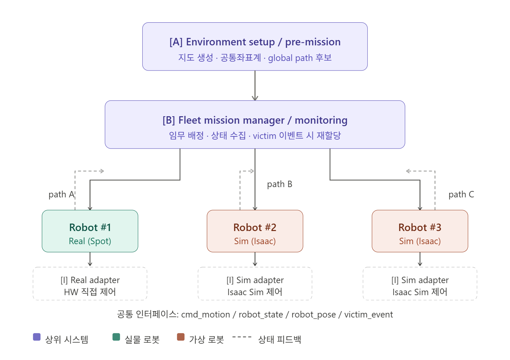

# 시스템 플로우

.png)

## 1. 시스템 블록도

> 각 블록도의 알파벳 순서로 읽고, 흐름 이해하기
> 

#### 1-1. 상위 운용 시스템



- **상세 구조**
    
    ```bnf
    ┌──────────────────────────────────────────────────────────────────────┐
    │                    [A] Environment Setup / Pre-Mission               │
    │----------------------------------------------------------------------│
    │  - Drone / 사전측량 기반 지형 지도 생성                                 │
    │  - 공통좌표계(mission_map, GPS 대용) 정의                               │
    │  - 탐색 구역 분할 (Zone A / B / C)                                     │
    │  - Global path 후보 생성                                               │
    └───────────────────────────────────────────────────────────────────────┘
                                      │
                                      ▼
    ┌──────────────────────────────────────────────────────────────────────┐
    │                 [B] Fleet Mission Manager / Monitoring               │
    │----------------------------------------------------------------------│
    │  - 실물 1대 + 가상 2대에 임무 할당                                     │
    │  - 로봇별 global path A/B/C 배정                                      │
    │  - 각 로봇 상태 수집/임무 진행 관리                                     │
    │  - Victim event 수신 시 임무 종료 / 재할당 / 재계획                     │
    │  - 관제 UI에 전체 fleet 상태 표시                                      │
    └──────────────────────────────────────────────────────────────────────┘
                 │                          │                         │
                 │ mission                  │ mission                 │ mission
                 ▼                          ▼                         ▼
    
     ┌──────────────────────┐   ┌──────────────────────┐   ┌──────────────────────┐
     │   Robot #1 (Real)    │   │   Robot #2 (Sim)     │   │   Robot #3 (Sim)     │
     └──────────────────────┘   └──────────────────────┘   └──────────────────────┘
    ```
    

#### 1-2. 각 로봇 공통 실행 시스템

> 각 로봇 내부는 동일한 공통 구조를 가진다.
> 


- **상세 구조**
    
    ```bnf
    ┌──────────────────────────────────────────────────────────────────────┐
    │                    [C] Robot Mission Executor                        │
    │----------------------------------------------------------------------│
    │  - 할당된 global path 수행                                            │
    │  - mission state machine 관리                                        │
    │    (IDLE / EXECUTING / AVOIDING / VICTIM_FOUND / COMPLETE / FAULT)   │
    │  - Victim 발견 시 상위 Fleet Manager에 이벤트 전송                     │
    └──────────────────────────────────────────────────────────────────────┘
                       │
                       │ uses
                       ▼
    ┌──────────────────────────────────────────────────────────────────────┐
    │                 [D] Planning / Local Decision                        │
    │----------------------------------------------------------------------│
    │  - Global path follower                                              │
    │  - Local obstacle avoidance                                          │
    │  - Local path 생성                                                   │
    │  - 목표 이동 벡터(desired heading / desired velocity) 생성            │
    └──────────────────────────────────────────────────────────────────────┘
              ▲                             ▲                           │
              │                             │                           │ desired motion
              │                             │                           ▼
              │                             │         ┌────────────────────────────────┐
              │                             └───────▶│      [G] Safety Supervisor     │
              │                                       │--------------------------------│
              │                                       │ - 충돌 위험 시 emergency stop   │
              │                                       │ - 통신 끊김 / 자세 이상 감시     │
              │                                       │ - Planning 명령 override       │
              │                                       └────────────────────────────────┘
              │                                                      │ safe cmd
              │                                                      ▼
    ┌──────────────────────────────────────────────────────────────────────┐
    │             [E] Perception / Environment Modeling                    │
    │----------------------------------------------------------------------│
    │  - Camera 기반 victim detection                                      │
    │  - LiDAR 기반 obstacle / free-space / wall 정보 추출                  │
    │  - Planning용 obstacle model publish                                 │
    │  - Localization용 hint publish                                       │
    └──────────────────────────────────────────────────────────────────────┘
                       │                             ▲
                       │                             │
                       │ env model / loc hint        │
                       ▼                             │
    ┌──────────────────────────────────────────────────────────────────────┐
    │           [F] State Estimation / Localization                        │
    │----------------------------------------------------------------------│
    │  - IMU + odom + LiDAR hint 기반 현재 pose 추정                        │
    │  - 공통좌표계(mission_map) 기준 pose 계산                              │
    │  - pose / heading / confidence 생성                                  │
    │  - 관제 시스템으로 현재 위치 전송                                       │
    └──────────────────────────────────────────────────────────────────────┘
                       ▲
                       │ imu / joint state / foot contact / odom source
                       │
    ┌──────────────────────────────────────────────────────────────────────┐
    │             [H] Low-Level Control / RL Locomotion                    │
    │----------------------------------------------------------------------│
    │  - 목표 이동 벡터를 실제 보행 명령으로 변환                              │
    │  - 4족 gait control / 자세 안정화                                     │
    │  - 험지 locomotion RL policy 수행                                     │
    │  - joint state / IMU / foot contact / low-level status publish       │
    └──────────────────────────────────────────────────────────────────────┘
                       │
                       ▼
    ┌──────────────────────────────────────────────────────────────────────┐
    │                    [I] Robot Adapter Layer                           │
    │----------------------------------------------------------------------│
    │  Real Adapter: 실제 Spot-like 로봇 HW 제어                            │
    │  Sim Adapter : Isaac Sim 상 가상 로봇 제어                            │
    │----------------------------------------------------------------------│
    │  공통 인터페이스:                                                     │
    │  - cmd_motion                                                        │
    │  - robot_state                                                       │
    │  - robot_pose                                                        │
    │  - victim_event                                                      │
    └──────────────────────────────────────────────────────────────────────┘
    ```
    

#### 1-3. 시스템 플로우 요약본


---

## 2. 블록도 핵심 해석

#### 2-1. 상위 시스템 흐름

먼저 **사전 준비 단계**에서 실측 or 시연 장소 맵핑을 통해 탐색 공간을 지도화하고, 공통좌표계(`mission_map`)으로 정리한다. 그리고 그 위에서 각 로봇이 맡을 **global path A/B/C**를 만든다. 

Fleet Mission Manager(B)에서 실물 1대, 가상 2대에게 각각 다른 임무를 내린다.

즉, “어느 로봇이 어느 경로를 맡을지에 대한 임무”를 정하는 상위 관제 레이어다.

#### 2-2. 로봇 내부 흐름

**1️⃣ Mission Executor (C)**

상위에서 받은 임무를 관리하는 영역

Ex) “A 경로 탐색 시작”, “현재 장애물 회피 중”, “실종자 발견으로 임무 종료” 같은 상태 전이를 관리

**2️⃣ Planning / Local Decision (D)**

현재 위치와 장애물 정보를 바탕으로

- global path를 따라가다가
- 장애물이 나오면 local path를 생성하고
- 최종 이동 방향을 계산한다

**3️⃣ Perception / Environment Modeling (E)**

카메라와 LiDAR raw 데이터를 바로 쓰지 않고, 아래의 정보를 얻을 수 있는 **환경 모델**을 제작한다

- obstacle model
- free-space
- victim detection
- localization hint

**4️⃣ State Estimation / Localization (F)**

IMU, odom, LiDAR hint를 받아서 Spot의 현재 위치를 추정한다. 이후 최종적으로 **공통좌표계 기준 pose**를 계산한다.

*공통좌표계 : GPS 대용 좌표계

**5️⃣ Low-Level Control / RL Locomotion (H) → 제어 파트 맡은 사람들 확인**

Planning이 준 목표 이동 방향을 받아서 실제 4족 보행 제어를 실행한다.

이때 RL은 험지 보행 정책 or 4족 보행 제어 역할을 맡는다.

**6️⃣ Safety Supervisor (G) → Fail-Safe 영역인데, 각자 맡은 파트에서 알아서 구현하면 될듯**

중간에 위험 상황이면 Planning보다 우선해서 개입한다. 즉, 긴급 정지를 넣을 수 있는 안전 차단기

---

## 3. 각 블록별 구체화

#### [A] Environment Setup / Pre-Mission

- 역할 : 탐색 공간 사전 정밀 지도 생성, 공통좌표계 정의, global path 생성
- Input : 실측 데이터, 디지털트윈 정보 ⇒ 사전 mapping으로 해결
- Output : `mission_map` , `zone_assignment` , `global_path_set`

*mission_map : 정밀지도  

*zone_assignment : 정찰 구역  

*global_path_set : 탐색 출발점부터 종료시점까지 생성할 수 있는 모든 경로 집합

#### [B] Fleet Mission Manager / Monitoring

- 역할 : 로봇별 임무 배정, 상태 수집, 관제 UI 표시, 임무 재할당(선택)
- Input : `mission_map` , 로봇 상태, 실종자 발견 이벤트
- Output : `robot_mission` , `fleet_state` , `replan_command` (선택)

*robot_mission : 각 로봇에 할당 될 정찰 구역 경로 (global path set 중 하나)

#### [C] Robot Mission Executor

- 역할 : 로봇이 현재 무슨 임무 상태인지 관리 ⇒ **로봇 상위 FSM**
- Input : `robot_mission` , `robot_pose` , `victim_event` , `planner_status`
- Output : `mission_context` , `mission_status`

*planner_status : 판단 계층 내부의 실행 상태 요약값

*mission_context : 임무 수행에 필요한 내부 데이터

*mission_status : 외부(관제)에 보여줄 수 있는 **임무 진행 상태**

**[Planner_status 예시]**

```bnf
FOLLOWING_GLOBAL_PATH
GENERATING_LOCAL_PATH
AVOIDING_OBSTACLE
STOPPED_BY_SAFETY
VICTIM_FOUND
MISSION_COMPLETE
REPLANNING
```

**[mission_status 예시]**

```bnf
IDLE
ASSIGNED
EXECUTING
AVOIDING
PAUSED
VICTIM_FOUND
COMPLETED
FAILED
```

#### [D] Planning / Local Decision

- 역할 : global path 추종, local obstacle avoidance(장애물 회피), desired motion 생성
- Input : `mission_context` , `robot_pose` , `obstacle_model` , `free_space_model` (선택)
- Ouput : `local_path` , `desired_heading` , `desired_velocity`

*free_space_model : **주행 가능한 빈 공간 정보**를 산출하는 환경 모델

**[free_space_model 필드]**

```bnf
front_clearance
left_clearance
right_clearance
best_escape_direction
navigable_corridor_detected
corridor_width
free_space_score_left
free_space_score_right
```

#### [E] Perception / Environment Modeling

- 역할 : raw Sensor data를 환경 모델로 변환
- Input : `camera_raw` , `lidar_raw`
- Ouput : `obstacle_model` , `free_space_model` , `victim_detection` , `localization_hint`

*localization_hint : LiDAR raw data 후처리한 정보

**[localization_hint 필드]**

```bnf
left_wall_distance           # 왼쪽 벽까지 거리
right_wall_distance          # 오른쪽 벽까지 거리
front_wall_distance          # 전방 벽까지 거리 or 존재 여부
center_offset_estimate       # 경로 중심에서 얼마나 치우쳤는지
wall_alignment_score         # 벽 정렬 정도
corner_detected
map_match_hint
```

#### [F] State Estimation / Localization (공용 상태 추정 모듈)

- 역할 : 현재 위치 추정, 공통좌표계 기준 pose 생성
- Input : `imu` , `odom` , `localization_hint` , `mission_map_alignment`
- Ouput : `robot_pose` , `robot_heading` , `pose_confidence`

*mission_map_alignment : 현재 로봇 pose 값(상대적인 위치)를 공통좌표계 맞추기 위한 정보

#### [G] Safety Supervisor

- 역할 : 충돌 위험 시 override, 통신 끊김 / 자세 불안정 실시간 감시
    
    ⇒ 각자 맡은 역할의 Fail-Safe 사전 정의하기, 실제로 운용될 때 시나리오에서 안정성을 챙기기 위한 정책이 무엇이 있을지 고민
    
- Input : `desired_motion` , `collision_risk` , `robot_health`
- Ouput : `safe_motion_cmd` , `emergency_stop` , `fault_state`

*desired_motion : Planning이 계산한 이상적인 제어 명령

*safe_motion_cmd : 판단 계층 Safety 거친 후, 승인된 최종 제어 명령 (선택)

*fault_state : 시스템 고장/이상 상태를 나타내는 값

#### [H] Low-Level Control / RL Locomotion

- 역할 : 보행 제어, 자세 제어, RL 기반 험지 적응 보행
- Input : `safe_motion_cmd`
- Ouput : `joint_state` , `imu` , `foot_contact` , `control_status`

*control_status : 제어 FSM

#### [I] Robot Adapter Layer

- 역할 : 실물/가상 로봇을 공통 인터페이스로 연결, 실물 로봇 트윈환경 엔티티 동기화
- Input : `cmd_motion`
- Ouput : `robot_state` , `sensor_stream` , `robot_pose_feedback`