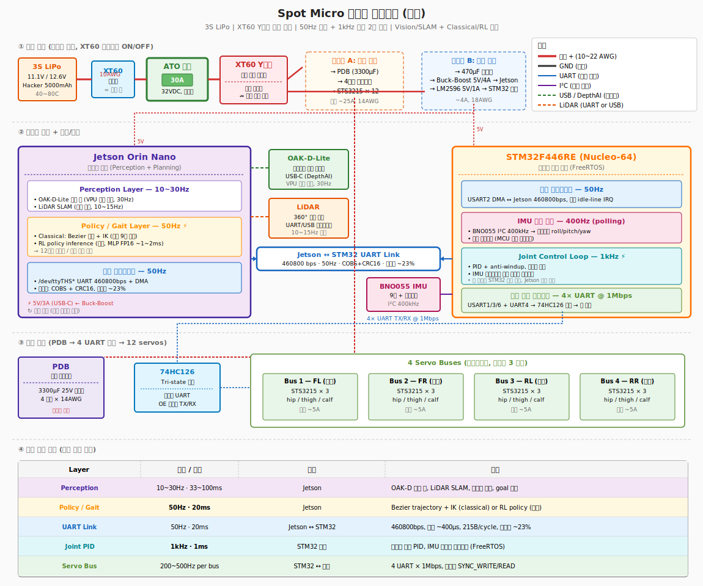

# 하드웨어

생성일: 2026년 4월 13일 오후 5:43

# 팀 페이지

[하드웨어 설계](%ED%95%98%EB%93%9C%EC%9B%A8%EC%96%B4%20%EC%84%A4%EA%B3%84%2033de3b5fd5338010b7fcc9b054bf1bcb.md)

[하드웨어 선정 이유](%ED%95%98%EB%93%9C%EC%9B%A8%EC%96%B4%20%EC%84%A0%EC%A0%95%20%EC%9D%B4%EC%9C%A0%20348e3b5fd53380899b30c1933204f4c1.md)

[전원부 설계](%EC%A0%84%EC%9B%90%EB%B6%80%20%EC%84%A4%EA%B3%84%20348e3b5fd53380539ba7f90f5fa4e50e.md)

[하드웨어 조립](%ED%95%98%EB%93%9C%EC%9B%A8%EC%96%B4%20%EC%A1%B0%EB%A6%BD%2034ae3b5fd5338090bcbed054d2204b13.md)

[하드웨어 스펙](%ED%95%98%EB%93%9C%EC%9B%A8%EC%96%B4%20%EC%8A%A4%ED%8E%99%2034ae3b5fd53380b3bfc5f11f949d4591.md)

[토크 관련 내용 정리](%ED%86%A0%ED%81%AC%20%EA%B4%80%EB%A0%A8%20%EB%82%B4%EC%9A%A9%20%EC%A0%95%EB%A6%AC%20359e3b5fd53380c08bd5c3480981c94e.md)

[Feetech Servo Tool — STS3215 운용 레퍼런스](Feetech%20Servo%20Tool%20%E2%80%94%20STS3215%20%EC%9A%B4%EC%9A%A9%20%EB%A0%88%ED%8D%BC%EB%9F%B0%EC%8A%A4%20359e3b5fd5338004967be924d3646fae.md)

# 개인 페이지

[제영호](%EC%A0%9C%EC%98%81%ED%98%B8%20341e3b5fd5338018a71cf6a09e615856.md)

[구진영](%EA%B5%AC%EC%A7%84%EC%98%81%20341e3b5fd533806bac1eff0e71336302.md)

# 핵심 링크

‣ 

https://docs.google.com/spreadsheets/d/1rDA0zLD5ABkUZUaMXUHDflP-aRKWH7PBWHBIVXlzT1k/edit?gid=0#gid=0

https://github.com/Road-Balance/SpotMicroJetson/tree/master

https://www.youtube.com/watch?v=XBYq_FJbdTk&list=PLDAyxeaWPd36ol0wfXV4KST0x8v7KWFwO

[하드웨어 BOM](https://docs.google.com/spreadsheets/d/1rDA0zLD5ABkUZUaMXUHDflP-aRKWH7PBWHBIVXlzT1k/edit?gid=0#gid=0)

<중요>

https://github.com/dgmz/feetech-servo-tool

위 링크는 고생에 고생에 고생을 해서 찾아낸 URT-2 를 이용한 모터 디버깅 툴 -제영호-

### 컨설턴트님 피드백

- 오픈 아키텍쳐로 STM 을 사용하는건 어떨까
- 예를 들어 젯슨이 불타버려도
STM만으로도 기본적인 동작이 가능하다던지
- 휴대폰을 붙여서도 동작이 가능하다던지?
- 단순히 제어를 하는게 아니라 그런 것들을

