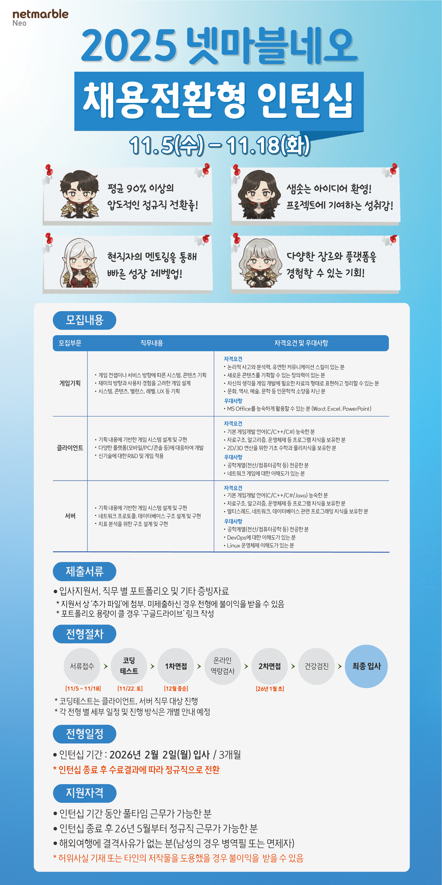

# 넷마블 네오

# JD

# 외부활동

42Seoul (23.10 ~ 25.06)

프랑스 ECOLE 42의 글로벌 캠퍼스인 42서울에 입과하여, C/C++ 기반 시스템, 네트워크 프로그래밍과 웹 기반 실시간 탁구 게임을 개발하는 프로젝트를 수행했습니다.

SSAFY(삼성청년SWAI아카데미) (25.07 ~ 25.09)

삼성에서 주관하는 청년 취업 캠프인 SSAFY에 입과하여, 임베디드 트랙에서 알고리즘, AI, 임베디드 교육을 이수하고 있습니다.

Notion 개인 노트 (23.10 ~)

교육에서 배운 내용과 알고리즘 문제 풀이를 개인 노트에 정리하고, 진행했던 프로젝트들을 기술 노트 형식으로 정리하는 활동을 지속하고 있습니다.

Github 코드 관리 (24.09 ~)

알고리즘 문제 풀이와 진행했던 프로젝트들의 코드를 Github에 정리하며 관리하는 활동을 지속하고 있습니다.

헬스 (17.02 ~)

건강한 신체와 정신을 유지하기 위한 신체 활동을 지속하고 있습니다.

# 업무내용

“모바일·MMORPG 중심의 라이브 게임에서, 대규모 유저 트래픽을 처리하는 서버 기능을 개발·운영하고, 데이터·패치·다운로드·신기술(블록체인·AI)까지 아우르는 백엔드 인프라를 고도화하는 직무”

- 1. 게임 서버 기능 개발
    - RPG, MMORPG 등 넷마블네오 주요 장르(리니지2 레볼루션, 제2의 나라, 나혼렙 등)를 위한
        
        **전투, 성장, 아이템, 레이드/파티, 길드, 랭킹, 매칭** 같은 서버 로직 구현
        
    - **기획자가 엑셀로 설계한 게임 데이터 테이블**을
        
        `테이블 제네레이터` 같은 툴을 통해 서버에서 바로 사용할 수 있도록 연동
        
        → 기획 변경에 따라 테이블 구조가 자주 바뀌어도, **코드 변경 최소화**로 빠른 대응【연구개발: 테이블 제네레이터】
        
    - 모바일·PC 크로스플랫폼 환경에서 **동일 계정/캐릭터가 여러 플랫폼에서 접속**해도
        
        일관된 게임 경험을 제공하도록 세션·인증·동기화 처리
        
- 2. 라이브 서비스 운영 및 성능 최적화
    - 수십만 DAU·동접자를 대상으로 **안정적인 접속/매칭/로딩**이 가능하도록
        
        서버 리소스 사용량, 쿼리 부하, 캐시(예: Redis), 세션 관리 최적화
        
    - `대용량 파일 다운로드 속도 개선` 연구처럼
        
        **게임 번들·패치 파일을 분할 다운로드, 멀티스레드로 전송**하는 기능 구현 및 개선
        
        → 모바일 네트워크 환경에서도 **패치 속도, 설치 경험** 향상
        
    - `테이블 패치 자동화`, `번들 패치 시스템 자동화` 등과 연계해
        
        **게임 빌드 전체를 다시 내리지 않고, 데이터/테이블/리소스만 따로 패치**할 수 있도록
        
        서버 측 패치 버전 관리, 롤백, 핫픽스 경로 설계
        
    - 장애·이슈 발생 시 **로그 분석 및 원인 파악 → 긴급 패치 → 후속 재발 방지 개선**까지 담당
- 3. 데이터·플랫폼·블록체인 연동
    - 넷마블 퍼블리셔 플랫폼과 연동하여
        
        **계정, 결제, 매칭, 보안, 통계** 등의 공통 시스템을 서버에서 호출·연동
        
    - 마블렉스(MARBLEX)와의 **MBX 가상화폐, 스테이킹 계약**이 있는 만큼
        
        P2E 또는 블록체인 요소가 포함된 타이틀에서는
        
        **토큰·NFT·지갑 서버와의 연동, 보상 로직, 정산·로그 관리** 등을 서버에서 구현·검증
        
    - **로그 수집 & DB 저장** 파이프라인을 통해
        
        게임 이용 패턴, 과금 지표(ARPPU, DAU/MAU 등)를 축적하고
        
        내부 BI·AI 분석 시스템과 연계될 수 있도록 API·스키마 설계
        
- 4. 개발 인프라 및 자동화 툴 고도화
    - CI 도입을 기반으로 한
        
        **빌드·테스트·패치 제작 자동화 파이프라인** 구축 및 유지보수
        
        (번들 패치 시스템 자동화, 테이블 패치 자동화 등)
        
    - 서버에서도 사용하는 각종 **게임 리소스/테이블 관리**를 위해
        
        `에셋 관리 시스템`과 연동,
        
        리소스 타입에 상관없이 **일관된 인터페이스로 로딩/캐싱**할 수 있게 설계
        
    - 패치/다운로드/빌드 과정에서의
        
        **휴먼 에러 최소화, 반복 작업 자동화 스크립트** 작성 (배포 스크립트, 검증 스크립트 등)
        
    - 그래픽·클라이언트 R&D 결과(LOD 최적화, FSR2, GPU 인스턴싱 등)가
        
        서버 리소스·네트워크 트래픽에 미치는 영향(패치 크기, 로딩 시간, 동기화량)을 고려해
        
        **백엔드 측 정책(압축, 스트리밍 방식 등)**을 함께 설계
        
- 5. 규제·보안·품질 대응
    - 확률형 아이템 규제 강화(확률 공개, 허위 표시 시 3배 손해배상 등)에 따라
        
        **서버에서 확률형 아이템 로직을 안전하게 구현하고, 로그·리포트 데이터로 증빙 가능하게 설계**
        
    - 선택적 셧다운제, 청소년 보호 등 규제를 만족하기 위해
        
        **연령별 접속 제한, 이용 시간 제한, 보호자 설정** 기능을 서버 차원에서 구현
        
    - 글로벌 서비스 특성상 지역별(한국/일본/북미 등) 법규·운영 정책을 반영해
        
        서버 옵션(과금 모델, 이벤트, 확률 구조, 접속 제한)을 **지역별로 분기**하는 기능 설계
        
    - 저작권·IP 보호를 위해,
        
        서버 로그·접속 기록을 기반으로 **계정 도용, 어뷰징, 봇 탐지 로직**을 고도화
        

## 회사·산업 맥락 속에서 서버 직무가 하는 일

- 매출 대비 **R&D 비율이 60~100%에 육박**할 정도로
    
    회사 자체가 “개발·기술 중심” 구조 →
    
    서버 개발자는 단순 운영이 아니라 **새로운 시스템·툴을 직접 만들고 실험하는 역할**까지 수행
    
- 넷마블 퍼블리셔와의 시너지 구조 덕분에,
    
    서버 개발자는 **IP 기반 대형 RPG, 글로벌 출시 타이틀**에서
    
    **초기 설계 → 론칭 → 라이브 운영**까지 전체 라이프사이클을 경험
    
- 국내·글로벌 게임 시장이 모바일 중심, 크로스플랫폼, AI·블록체인 융합 쪽으로 가는 상황에서
    
    넷마블네오 서버 직무는
    
    **모바일 MMORPG 백엔드 + 플랫폼 연동 + 신기술(AI/블록체인) 실험**의 교차 지점에 서 있는 포지션
    

# 나와의 연결점

웹서버 → 네트워크 프로토콜 경험

철학자 → 멀티스레드/프로세스 경험

데이터베이스 → Mysql, 삼성 알고리즘 B형 문제(DB 설계) 경험

# 비전

# 자소서

전부 700자

- **1. 게임업계에 관심을 갖게 된 계기와 특별히 넷마블네오에 지원한 구체적인 이유를 작성해 주세요.**
    
    저는 사용자가 즐거움을 느끼는 순간을 기술로 만들어내는 과정에 큰 매력을 느껴 게임 개발자의 길을 선택했습니다. 42서울과 SSAFY에서 시스템 프로그래밍, 알고리즘, 임베디드 실습을 경험하면서 복잡한 로직과 제약된 환경에서 안정적으로 동작하는 프로그램을 만드는 일에 흥미를 가지게 되었고, 이를 가장 극대화시킬 수 있는 분야가 MMORPG 기반의 게임 서버 개발이라고 판단했습니다.
    
    여러 게임사 중에서도 넷마블네오를 선택한 이유는 모바일 MMORPG에 특화된 개발 역량과 높은 R&D 투자 비중, 그리고 글로벌 히트작을 지속적으로 만들어온 경험 때문입니다. 특히 리니지2 레볼루션, 제2의 나라, 나 혼자만 레벨업: 어라이즈 등 대규모 트래픽을 처리하는 프로젝트를 성공적으로 운영해온 점이 서버 개발자로서 성장하기에 가장 적합하다고 느꼈습니다. 또한 회사가 테이블, 패치 자동화 등 서버, 클라이언트 개발 생산성을 높이는 기술을 적극적으로 자체 개발한다는 점은, 실제 서비스 품질까지 개선할 수 있는 환경이라고 판단했습니다.
    
    저는 시스템 프로그래밍과 네트워크에 대한 기반 지식을 바탕으로, 안정적인 서버 구조를 고민하고 실제 서비스 성능, 운영 효율을 높이는 개발자로 성장하고자 하며, 이를 위해 가장 적합한 곳이 넷마블네오라고 확신하여 지원하게 되었습니다.
    
- **2. 타인과 협업하며 가장 어려웠던 경험과 그것을 어떻게 극복하였는지, 느낀점은 무엇이었는지 작성해 주세요.**
    
    42서울에서 커스텀 쉘을 팀으로 개발할 때, 파싱 모듈을 맡아 진행한 경험이 있습니다. 문제는 팀원 간 개발 방식이 달라 인터페이스 합의 없이 각자 구현을 시작했고, 그 결과 파싱 결과물이 실행 모듈의 동작 방과 맞지 않아 여러 기능이 정상 동작하지 않는 문제가 발생했습니다. 초기 설계가 미흡했기 때문에 서로의 코드가 반복적으로 충돌했고 일정 지연까지 이어졌습니다.
    
    이를 해결하기 위해 먼저 실행 파트 담당자와 함께 명령 구조, 토큰 규칙, 에러 처리 기준을 명확히 문서화했고, 모든 팀원이 동일한 기준으로 작업할 수 있도록 공통 테스트 케이스와 주 2회 코드 리뷰 시간을 도입했습니다. 이후에는 기능을 나누는 기준이 명확해져 충돌 빈도가 급격히 줄었고, 예정된 제출일에 맞춰 안정적으로 프로젝트를 완성할 수 있었습니다.
    
    이 경험을 통해 협업에서 가장 중요한 것은 개인 역량보다 초기 명세 정리와 소통 구조를 만드는 일이라는 것을 깨달았습니다. 이후 진행한 SSAFY 프로젝트에서도 동일한 방식으로 역할과 기준을 먼저 합의한 덕분에 훨씬 효율적인 협업이 가능했습니다. 앞으로도 갈등 상황에서는 문제를 분석하고 기준을 재정립해 팀 전체의 흐름을 바로잡는 개발자로 행동하고자 합니다.
    
- **3. 게임 서버 개발 직무를 선택한 이유와 게임 개발자가 되기 위해 어떤 노력을 했는지 작성해 주세요.**
    
    저는 수많은 플레이어가 동시에 접속해 하나의 세계를 공유하게 만드는 기술에 매력을 느껴 게임 서버 개발을 선택했습니다. 단순한 화면보다 그 뒤에서 방대한 상태를 안정적으로 관리하고 실시간으로 전달하는 구조를 설계하는 과정이 더 흥미로웠습니다. 특히 MMORPG처럼 동접자가 많은 환경에서 성능, 동기화, 데이터 구조, 네트워크 처리가 모두 결합되는 서버 개발은 제가 좋아하는 문제 해결 방식과 가장 잘 맞는다고 느꼈습니다.
    
    게임 개발자가 되기 위해 기초부터 실전까지 단계적으로 역량을 쌓아왔습니다. 42서울에서는 C/C++ 기반 시스템 프로그래밍, 프로세스, 스레드, 동시성 제어 프로젝트를 수행하며 OS, 메모리, 동기화 개념을 탄탄히 익혔습니다. 또한 웹서버 구현을 통해 TCP 소켓 통신, 논블로킹 I/O, 요청 파싱 등 실제 서버 구조를 경험했습니다.
    
    SSAFY에서는 알고리즘, 자료구조 훈련과 임베디드 실습을 통해 성능과 안정성을 우선하는 개발 방식을 배웠으며, 개인적으로는 C++ 프로젝트, Docker 환경 구성, 간단한 REST 서버 제작 등을 통해 배운 내용을 실전에 반복 적용했습니다.
    
    이 경험들을 통해 게임 서버 개발에 필요한 기본기를 균형 있게 익혔고, 앞으로도 대규모 환경에서 안정적인 시스템을 설계하고 운영 효율을 높이는 개발자로 성장하고자 합니다.
    
- **4. 수강했던 전산/컴퓨터 공학 전공 과목들을 작성하고, 그 중 가장 흥미있었던 과목과 그 이유도 함께 작성해 주세요**.
    
    저는 게임 서버 개발자로 성장하기 위해 전산 기초 과목을 폭넓게 학습해왔습니다. 자료구조와 알고리즘을 통해 성능을 고려한 로직 설계 방식을 익혔고, 운영체제와 컴퓨터 구조에서는 프로세스 스케줄링, 메모리 관리, 동기화와 같은 시스템 동작 원리를 배웠습니다. 또한 네트워크, 소켓 프로그래밍, 데이터베이스, C/C++ 프로그래밍, 시스템 프로그래밍 등 서버 개발에 직접 연결되는 과목들을 실습 중심으로 공부하며 기반을 다졌습니다.
    
    이 중 가장 흥미 있었던 과목은 운영체제입니다. 프로세스가 생성되고 CPU 자원을 배분받아 동작하는 구조, 스레드와 동기화, 파일 디스크립터와 시스템 콜 같은 개념이 실제 코드와 어떻게 연결되는지 직접 확인할 수 있었기 때문입니다. 특히 42서울에서 진행한 minishell, 철학자 문제, 웹서버 구현 프로젝트를 통해 교착상태, 파이프라인, 논블로킹 I/O 같은 개념을 실제로 구현해보며 OS 지식의 중요성을 체감했습니다. 이 경험은 서버가 안정적으로 동작하기 위해 어떤 기반 기술이 필요한지 이해하게 해주었고, 게임 서버 개발에 대한 흥미를 더욱 확고하게 만들어준 계기가 되었습니다.
    
- **5. 게임 프로그래머가 되기 위해 학습한 내용과 주제들을 구체적으로 작성해 주세요.**
    
    게임 프로그래머로 성장하기 위해 저는 전산 기초부터 서버 실전 경험까지 단계적으로 학습해왔습니다. 먼저 C/C++ 문법, 메모리 모델, 객체지향 구조를 중심으로 기반을 다졌고, 자료구조·알고리즘 학습을 통해 성능을 고려한 로직 설계 능력을 기르기 위해 꾸준히 문제 풀이를 진행했습니다.
    
    42서울에서는 시스템 프로그래밍과 네트워크 기반 프로젝트를 통해 게임 서버의 기반이 되는 기술들을 집중적으로 학습했습니다. minishell, 철학자 문제 등을 수행하며 프로세스, 스레드, 동기화, 파일 디스크립터, 시그널 처리를 구현했고, 웹서버 프로젝트에서는 TCP 소켓 통신, 요청 파싱, 논블로킹 I/O, HTTP 상태 관리를 직접 작성해보며 서버 로직의 흐름을 이해했습니다.
    
    SSAFY에서는 알고리즘과 자료구조를 체계적으로 훈련하며 시간·공간 복잡도 최적화를 경험했고, 임베디드 실습을 통해 제한된 환경에서 안정적이고 효율적인 코드를 작성하는 방법을 배웠습니다. 또한 Docker 기반 개발 환경 구성, 간단한 REST API 서버 제작, C++ 사이드 프로젝트 등을 진행하며 실제 개발 환경에서 지식을 반복 적용했습니다.
    
    이를 통해 게임 서버 개발에 필요한 언어, 시스템, 네트워크, 성능, 운영까지 핵심 기반을 고르게 학습할 수 있었고, 앞으로도 대규모 사용자 환경에서 안정적으로 동작하는 서버 구조를 만들기 위한 역량을 지속적으로 확장하고자 합니다.
    
- **6. 넷마블네오의 라이브 프로젝트 중 희망하는 프로젝트명을 작성해 주세요. (복수 작성 가능. 본 항목은 참고용이며, 실제 배치와는 무관) - 예시, 1순위: A, 2순위: B**
    
    1순위: 왕좌의 게임, 2순위: 제2의 나라: Cross Worlds