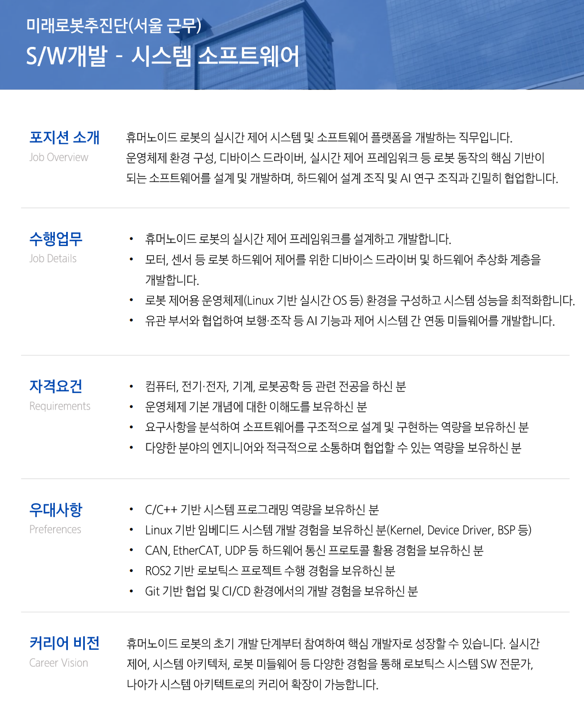

# 로봇

[자소서 작성법](%EC%9E%90%EC%86%8C%EC%84%9C%20%EC%9E%91%EC%84%B1%EB%B2%95%2031e1b2ec3d5180209a97e9f42b2f3854.md)

# 3가지

서경대학교 2점대 성적 기록을 쓸지 말지 → 기업에 따라 다르다. 컨설턴트님에게 연락해보자..

알바 경력(베라, 할리스 커피)를 쓸지 말지 → 쓰는게 좋다..? 물론 경력사항 x 대내외 활동으로.

삼성전자 제품을 갤럭시랑 엮었는데 휴머노이드랑 맞을지 → 갤럭시랑 잘 맞는듯..?

조사넣어서 ai 티 안내기

# JD

# 비전

**인재와 기술을 바탕으로 최고의 제품과 서비스를 창출하여 인류사회에 공헌**

# 군대 주요 활동 사항

소총수로서 주로 경계 근무를 수행하였습니다.

# 대내외 활동

| **활동구분** | **활동명** | **시작일 / 종료일** | **활동 상세 설명** |
| --- | --- | --- | --- |
| **국내연수활동** | **42Seoul** | 2023-10 ~ 2025-06 | 프랑스 ECOLE 42의 글로벌 캠퍼스인 42서울에 입과하여, C/C++ 기반 시스템, 네트워크 프로그래밍 프로젝트를 수행했습니다. |
| **국내연수활동** | **SSAFY(삼성청년SWAI아카데미)** | 2025-07 ~ 2026-03 | 삼성에서 주관하는 청년 취업 캠프인 SSAFY에 입과하여, 임베디드 트랙에서 알고리즘, AI, 임베디드 교육을 이수하고, 물류 자동화 프로젝트를 수행했습니다. |
| **온라인활동** | **Notion 개인 노트** | 2023-10 ~ 2026-03 | 교육에서 배운 내용과 알고리즘 문제 풀이를 개인 노트에 정리하고, 진행했던 프로젝트들을 기술 노트 형식으로 정리하는 활동을 지속하고 있습니다. |
| **온라인활동** | **Github 코드 관리** | 2024-09 ~ 2026-03 | 알고리즘 문제 풀이와 진행했던 프로젝트들의 코드를 Github에 정리하며 관리하는 활동을 지속하고 있습니다. |
| **기타** | **베스킨라빈스31 아르바이트** | 2018-07 ~ 2021-12 | 평일 마감 근무를 담당하며 고객 응대, 아이스크림 기계 및 냉장고 관리, 재고 관리, 마감 정산 및 청소 업무를 수행했습니다. |
| **기타** | **할리스커피 아르바이트** | 2022-03 ~ 2022-12 | 평일 마감 근무를 담당하며 고객 응대, 커피 머신 및 제조 기계 관리, 마감 정산 및 청소 업무를 수행했습니다. |

# 취미/특기/존경인물

**취미 / 특기**
헬스
**존경인물**
아라곤(반지의제왕)
**존경이유**
절망적인 상황에도 희망을 포기하지 않고 동료들을 이끄는 리더십

# 자소서

- 삼성전자를 지원한 이유와 입사 후 회사에서 이루고 싶은 꿈을 기술하십시오.
    
    ver1
    
    [전 세계인이 사용하는 K-휴머노이드 개발의 꿈]
    
    삼성전자에 지원한 이유는 인재와 기술을 바탕으로 인류사회에 공헌한다는 비전에 있습니다. 삼성전자는 반도체, 디스플레이, 통신 등 핵심 기술을 자체적으로 보유한 세계 유일의 종합 기술 기업입니다. 특히 미래로봇추진단을 통해 휴머노이드 로봇 개발에 뛰어든 모습을 보며, 삼성전자가 로보틱스 분야에서도 이러한 비전을 실현하고자 하는 것을 알 수 있었습니다.
    
    삼성전자는 수직 계열화된 자체 기술력을 바탕으로, 전 세계 휴머노이드 시장을 선도할 수 있다고 생각합니다. 이를 위해서는 하드웨어와 AI를 연결하는 시스템 소프트웨어 역량이 중요하다고 생각됩니다. 저는 42서울에서 웹서버와 병렬 프로그램을 구현하며 통신 안정성과 동시성 문제를 다뤘고, AUTOBOX 프로젝트를 통해 ROS2 기반 실시간 제어 시스템을 구축한 경험이 있습니다. 이러한 경험을 살려 삼성전자가 전 세계인이 만족하며 사용할 수 있는 K-휴머노이드 제품을 만드는데 도움이 되고 싶습니다.
    
    ver2
    
    [전 세계인이 사용하는 K-휴머노이드 개발의 꿈]
    
    삼성전자에 지원한 이유는 인재와 기술을 바탕으로 인류 사회에 공헌한다는 비전에 있습니다. 삼성전자는 반도체, 디스플레이, 통신 등 핵심 기술을 자체적으로 보유한 세계 유일의 종합 기술 기업입니다. 특히 미래로봇추진단을 통해 휴머노이드 로봇 개발에 뛰어든 모습을 보며, 삼성전자가 로보틱스 분야에서도 이러한 비전을 실현하고자 하는 것을 알 수 있었습니다.
    
    삼성전자는 수직 계열화된 자체 기술력을 바탕으로, 전 세계 휴머노이드 시장을 선도할 수 있다고 생각합니다. 이를 위해서는 안정적인 제어 시스템과 높은 기술적 완성도가 필하다고 생각됩니다. 저는 42서울에서 웹서버와 병렬 프로그램을 구현하며 통신 안정성과 동시성 문제를 다뤘고, AUTOBOX 프로젝트를 통해 ROS2 기반 실시간 제어 시스템을 구축한 경험이 있습니다. 이러한 경험을 살려 삼성전자가 전 세계인이 만족하며 사용할 수 있는 K-휴머노이드를 만드는 데 도움이 되고 싶습니다.
    
- 본인의 성장과정을 간략히 기술하되 현재의 자신에게 가장 큰 영향을 끼친 사건, 인물 등을 포함하여 기술하시기 바랍니다. (※작품 속 가상인물도 가능)
    
    ver1
    
    [마지막 20분, 인생의 방향이 결정되다]
    
    저는 어문 계열 전공자였습니다. 언어 감각이 있다고 생각해 선택한 전공이었지만, 막상 공부를 시작하니 제가 진정으로 흥미를 느끼는 분야가 아니라는 것을 깨달았습니다. 반면 어릴 때부터 컴퓨터를 다루는 일만큼은 달랐습니다. 게임을 좋아했고, 프로그램 설치나 시스템 설정처럼 무언가 잘 안 풀리는 상황에서도 포기하지 않고 끝까지 되게 만들어야 직성이 풀리는 집념이 있었습니다. 그 집념이 결국 개발로 이어졌습니다.
    
    개발을 시작하기로 결심했을 때, 저는 기반부터 다져야 한다는 생각으로 42서울에 지원했습니다. 42서울은 강사와 교재없이 동료 평가만으로 운영되는 소프트웨어 교육 기관으로, 입과를 위해서는 한 달간의 집중 선발 과정인 라피신을 통과해야 합니다. 당시 제 수준은 C언어로 Hello World를 출력할 수 있는 정도였고, 터미널조차 제대로 다룰 줄 몰랐습니다. 라피신 기간 동안 하루 평균 4~5시간 수면하며 매일 아침 일찍 자리에 앉아 밤 11시까지 코드를 붙잡았고, 주말도 따로 없었습니다. 합격하고 싶다는 열망이 컸던 만큼 스트레스도 많았지만, 그만큼 온전히 몰입할 수 있었습니다. 그 한 달이 제 인생에서 무언가에 가장 깊이 빠져든 시간이었습니다.
    
    그 중 결정적인 순간이 있었습니다. 매주 치르는 시험에서 두 문자열에 포함된 모든 문자를 순서대로 한 번씩만 출력하는 함수를 구현하는 문제가 나왔습니다. 알고리즘도, 문자열 처리도 제대로 모르던 상태에서 포기하고 싶은 마음이 들었지만 그러지 않았습니다. 안 되면 다른 방법을 찾고, 그것도 안 되면 또 다른 방법을 찾는 식으로 경우의 수를 끝까지 따졌습니다. 종료 20분 전, 방문 배열 개념을 스스로 떠올렸고, 종료 2분 전에 구현과 디버깅까지 마치고 정답을 제출했습니다. 그 결과 라피신에서 제가 받은 시험 점수 중 가장 높은 점수를 받았고, 그 덕분에 본 과정에 입과할 수 있었다고 생각합니다.
    
    그때 느낀 것은 단순한 성취감이 아닌, 진심으로 원하는 것 앞에서 끝까지 버티면 길이 생긴다는 것, 그리고 저도 할 수 있다는 태도로 바뀌는 계기가 되었습니다. 문제를 만났을 때 빠르게 포기하는 대신 다른 경로를 계속 탐색하는 방식이 이때부터 자리를 잡았습니다.
    
    실시간 제어 시스템 개발은 정해진 답이 없는 문제의 연속이라고 생각합니다. 하드웨어가 예상과 다르게 동작하고, 원인을 알 수 없는 버그가 발생하는 환경에서 포기하지 않는 태도야말로 가장 필요한 역량이라고 생각됩니다. 포기하지 않고 경우의 수를 끝까지 따지던 그 태도로, 미래로봇추진단이 안정적인 실시간 제어 시스템을 개발하는데 기여하고 싶습니다.
    
    ver2
    
    [마지막 20분, 인생의 방향이 결정되다]
    
    저는 어문 계열 전공자였습니다. 언어 감각이 있다고 생각해 선택한 전공이었지만, 막상 공부를 시작하니 제가 진정으로 흥미를 느끼는 분야가 아니라는 것을 깨달았습니다. 반면 어릴 때부터 컴퓨터를 다루는 일만큼은 달랐습니다. 프로그램 설치나 시스템 설정처럼 무언가 잘 안 풀리는 상황에서도 포기하지 않고 끝까지 되게 만들어야 직성이 풀리는 집념이 있었습니다. 그 집념이 결국 개발로 이어졌습니다.
    
    개발을 시작하기로 결심했을 때, 저는 기반부터 다져야 한다는 생각으로 42서울에 지원했습니다. 42서울은 강사와 교재 없이 동료 평가만으로 운영되는 소프트웨어 교육 기관으로, 입과를 위해서는 한 달간의 집중 선발 과정인 라피신을 통과해야 합니다. 당시 제 수준은 Hello World를 출력할 수 있는 정도였고, 터미널조차 제대로 다룰 줄 몰랐습니다. 라피신 기간 동안 하루 평균 4~5시간 수면하며 매일 밤 11시까지 코드를 붙잡았고, 주말도 따로 없었습니다. 그 한 달이 제 인생에서 무언가에 가장 깊이 빠져든 시간이었습니다.
    
    그 중 결정적인 순간이 있었습니다. 매주 치르는 시험에서 두 문자열에 포함된 모든 문자를 순서대로 한 번씩만 출력하는 함수를 구현하는 문제가 나왔습니다. 알고리즘도, 문자열 처리도 제대로 모르던 상태에서 포기하고 싶은 마음이 들었지만 그러지 않았습니다. 안 되면 다른 방법을 찾고, 그것도 안 되면 또 다른 방법을 찾는 식으로 경우의 수를 끝까지 따졌습니다. 종료 20분 전, 방문 배열 개념을 스스로 떠올렸고, 종료 2분 전에 구현과 디버깅까지 마치고 정답을 제출했습니다. 그 결과 라피신에서 제가 받은 시험 점수 중 가장 높은 점수를 받았고, 그 덕분에 본 과정에 입과할 수 있었다고 생각합니다.
    
    그때 느낀 것은 단순한 성취감이 아닌, 진심으로 원하는 것 앞에서 끝까지 버티면 길이 생긴다는 것, 그리고 저도 할 수 있다는 태도로 바뀌는 계기가 되었습니다. 문제를 만났을 때 빠르게 포기하는 대신 다른 경로를 계속 탐색하는 방식이 이때부터 자리를 잡았습니다.
    
    실시간 제어 시스템 개발은 정해진 답이 없는 문제의 연속이라고 생각합니다. 하드웨어가 예상과 다르게 동작하고, 원인을 알 수 없는 버그가 발생하는 환경에서 포기하지 않는 태도야말로 가장 필요한 역량이라고 생각됩니다. 경우의 수를 끝까지 따지던 그 태도로, 미래로봇추진단이 안정적인 실시간 제어 시스템을 개발하는데 기여하고 싶습니다.
    
- 최근 사회 이슈 중 중요하다고 생각되는 한 가지를 선택하고 이에 관한 자신의 견해를 기술해 주시기 바랍니다.
    
    ver1
    
    [자율화의 완성은 소프트웨어에 달려 있다]
    
    삼성전자는 2030년까지 국내외 생산 공장을 AI 자율 공장으로 전환하고, 오퍼레이팅봇, 물류봇, 조립봇 등 휴머노이드형 제조 로봇을 단계적으로 도입할 계획을 발표했습니다. 단순 자동화를 넘어 AI가 스스로 판단하고 실행하는 자율화로의 전환은 제조업의 패러다임을 바꾸는 중요한 흐름이라고 생각합니다.
    
    저는 이 전환에서 가장 중요한 과제가 소프트웨어 플랫폼에 있다고 생각합니다. 모터와 센서 등 하드웨어 기술은 수십 년간 자동화 공정을 통해 이미 상당히 성숙한 반면, 이를 실시간으로 통합 제어하는 소프트웨어 플랫폼은 휴머노이드 수준에서 아직 초기 단계입니다. 휴머노이드 로봇이 제조 현장에서 실제로 작동하려면, 모터와 센서를 마이크로초 단위로 제어하는 실시간 프레임워크, 하드웨어와 상위 AI 레이어를 연결하는 추상화 계층, 예외 상황에서도 안정적으로 동작하는 디바이스 드라이버가 견고하게 뒷받침되어야 합니다. 예를 들어 고온, 고소음 환경의 환경안전 로봇이 위험 요인을 감지하고 즉각 대응하려면, AI의 판단이 아무리 정확해도 그 명령을 하드웨어에 실시간으로 전달하는 시스템 소프트웨어가 없다면 자율화는 완성될 수 없습니다.
    
    삼성전자가 자율 제조현장 구축을 선언한 지금, 그 기반을 만드는 시스템 소프트웨어 개발이 자율화의 핵심적인 역할이라고 생각됩니다. 저 또한 미래로봇추진단의 시스템 소프트웨어 직무에서 그 기반을 만드는데 기여하고 싶습니다.
    
    ver2
    
    [자율화의 완성은 소프트웨어에 달려 있다]
    
    삼성전자는 2030년까지 국내외 생산 공장을 AI 자율 공장으로 전환하고, 오퍼레이팅봇, 물류봇, 조립봇 등 휴머노이드형 제조 로봇을 단계적으로 도입할 계획을 발표했습니다. 단순 자동화를 넘어 AI가 스스로 판단하고 실행하는 자율화로의 전환은 제조업의 패러다임을 바꾸는 중요한 흐름이라고 생각합니다.
    
    저는 이 전환에서 가장 중요한 과제가 소프트웨어 플랫폼에 있다고 생각합니다. 모터와 센서 등 하드웨어 기술은 수십 년간 자동화 공정을 통해 이미 상당히 성숙한 반면, 이를 실시간으로 통합 제어하는 소프트웨어 플랫폼은 휴머노이드 수준에서 아직 초기 단계입니다. 휴머노이드 로봇이 제조 현장에서 실제로 작동하려면, 모터와 센서를 마이크로초 단위로 제어하는 실시간 프레임워크, 하드웨어와 상위 AI 레이어를 연결하는 추상화 계층과 안정적인 디바이스 드라이버가 견고하게 뒷받침되어야 합니다. 예를 들어 고온, 고소음 환경의 환경안전 로봇이 위험 요인을 감지하고 즉각 대응하려면, AI의 판단이 아무리 정확해도 그 명령을 하드웨어에 실시간으로 전달하는 시스템 소프트웨어가 없다면 자율화는 완성될 수 없습니다.
    
    삼성전자가 자율 제조 현장 구축을 선언한 지금, 그 기반을 만드는 시스템 소프트웨어 개발이 자율화의 핵심적인 역할이라고 생각됩니다. 저 또한 미래로봇추진단의 시스템 소프트웨어 직무에서 그 기반을 만드는데 기여하고 싶습니다.
    
- 지원 직무 관련 본인의 전문지식과 경험을 작성하고, 본인이 지원 직무에 적합한 사유를 삼성전자 제품과 서비스 사용 경험을 기반으로 기술하시기 바랍니다.
    
    ver1
    
    평소 제가 사용하는 갤럭시 스마트폰은 수십 개의 센서를 실시간으로 통합 제어하면서도 높은 안정성을 유지합니다. 휴머노이드 로봇의 시스템 소프트웨어도 본질적으로 같다고 생각합니다. 모터와 센서를 정확하게 제어하는 실시간 제어 정확도와 다수의 구동부를 동시에 제어하는 환경에서의 동시성 관리가 중요할거라 예상됩니다.
    
    [동시성 문제를 해결하고 성능을 2배 끌어올리다]
    42서울에서 수행한 멀티스레드, 프로세스 동기화 프로젝트에서 전역 Lock 방식으로 인해 실행 단위들이 서로 자원을 점유한 채 대기하는 교착 상태에 빠져 프로그램이 멈추거나 성능이 저하되는 문제가 발생했습니다. 이를 해결하기 위해 공유 자원별 Lock 분할과 대칭 깨기 알고리즘을 적용했고, 고 경쟁 시나리오에서 수행 시간을 150초에서 75초로 단축하는 동시에 교착 상태를 완전히 방지했습니다.
    
    [2주간의 집중, 안정적인 자율주행을 만들다]
    AUTOBOX 프로젝트에서 자율 주행 인프라 구축을 맡았습니다. 주행 안정성이 전체 시스템의 핵심이라 판단해 초반 2주를 Nav2 파라미터 튜닝과 오도메트리 보정에 집중했습니다. 특히 라이다 오도메트리가 정지 상태에서 누적 오차가 쌓여 좌표가 틀어지는 문제가 있었는데, 목적지 도착 시점의 좌표를 저장하고 화물 하차 후 재출발 시 저장된 값으로 갱신하는 방식으로 해결해 주행 정확도를 높였습니다. 그 결과 발표 시연에서 무결점 주행을 달성하여 프로젝트 우수상을 수상했습니다.
    
    이러한 동시성 문제 해결 경험과 제어 정확도 개선 경험을 바탕으로, 미래로봇추진단의 실시간 제어 프레임워크와 디바이스 드라이버 개발에서 안정성과 정확도를 모두 갖춘 시스템을 구현하는 데 기여하고 싶습니다.
    
    ver2
    
    평소 제가 사용하는 갤럭시 스마트폰은 수십 개의 센서를 실시간으로 통합 제어하면서도 높은 안정성을 유지합니다. 휴머노이드 로봇의 시스템 소프트웨어도 본질적으로 같다고 생각합니다. 모터와 센서를 정확하게 제어하는 실시간 제어 정확도와 다수의 구동부를 동시에 제어하는 환경에서의 동시성 관리가 중요할 거라 예상됩니다.
    
    [동시성 문제를 해결하고 성능을 2배 끌어올리다]
    42서울에서 수행한 멀티스레드, 프로세스 동기화 프로젝트에서 전역 Lock 방식으로 인해 실행 단위들이 서로 자원을 점유한 채 대기하는 교착 상태에 빠져 프로그램이 멈추거나 성능이 저하되는 문제가 발생했습니다. 이를 해결하기 위해 공유 자원별 Lock 분할과 대칭 깨기 알고리즘을 적용했고, 고 경쟁 시나리오에서 수행 시간을 150초에서 75초로 단축하는 동시에 교착 상태를 완전히 방지했습니다.
    
    [2주간의 집중, 안정적인 자율주행을 만들다]
    AUTOBOX 프로젝트에서 자율주행 인프라 구축을 맡았습니다. 주행 안정성이 전체 시스템의 핵심이라 판단해 초반 2주를 Nav2 파라미터 튜닝과 오도메트리 보정에 집중했습니다. 특히 라이다 오도메트리가 정지 상태에서 누적 오차가 쌓여 좌표가 틀어지는 문제가 있었는데, 목적지 도착 시점의 좌표를 저장하고 화물 하차 후 재출발 시 저장된 값으로 갱신하는 방식으로 해결해 주행 정확도를 높였습니다. 그 결과 발표 시연에서 무결점 주행을 달성하여 프로젝트 우수상을 수상했습니다.
    
    이러한 동시성 문제 해결 경험과 제어 정확도 개선 경험을 바탕으로, 미래로봇추진단의 실시간 제어 프레임워크와 디바이스 드라이버 개발에서 안정성과 정확도를 모두 갖춘 시스템을 구현하는 데 기여하고 싶습니다.
    

# 전체 내용

**[삼성전자]  DX - 미래로봇추진단  시스템 소프트웨어**

# **2026년 상반기 3급 신입사원 채용 공고 (DX부문)**

# **지원 부문/직무/지역**

지원부문
DX - 미래로봇추진단  DX - 네트워크사업부  DX - MX사업부
지원직무
시스템 소프트웨어  시스템 소프트웨어  시스템 소프트웨어
희망근무지역
서울  서울  서울

# **고등학교**

학교
분당중앙고
졸업 구분
졸업
입학일 / 졸업일
2012-03 / 2015-02

# **대학 / 대학원**

대학교 (학사)
학교
학점은행제(대학)
졸업 구분
졸업
입학일 / 졸업일
2024-09 / 2025-08
전공
정보통신공학
전공계열
전산/컴퓨터
단과대학
공과대학
학번
2022-1399248
학점 유형
4.5점 만점 (4.5 ~ 0)
평점
4.16

# **이수교과목**

과정전공학교학사정보통신공학학점은행제(대학)과정전공명수강연도학기과목유형과목명취득학점성적재수강 여부학사정보통신공학(학점은행제(대학)-학사-주전공)20242전공자료구조3AN학사정보통신공학(학점은행제(대학)-학사-주전공)20242전공알고리즘3A+N학사정보통신공학(학점은행제(대학)-학사-주전공)20242전공데이터베이스3AN학사정보통신공학(학점은행제(대학)-학사-주전공)20242전공네트워크프로그래밍3B+N학사정보통신공학(학점은행제(대학)-학사-주전공)20242전공네트워크13B+N학사정보통신공학(학점은행제(대학)-학사-주전공)20242전공컴퓨터구조3AN학사정보통신공학(학점은행제(대학)-학사-주전공)20242전공C언어13AN학사정보통신공학(학점은행제(대학)-학사-주전공)20242전공운영체제3AN학사정보통신공학(학점은행제(대학)-학사-주전공)20251전공프로그래밍언어실습3A+N학사정보통신공학(학점은행제(대학)-학사-주전공)20251전공디지털공학개론3A+N학사정보통신공학(학점은행제(대학)-학사-주전공)20251전공인터넷활용13A+N학사정보통신공학(학점은행제(대학)-학사-주전공)20251전공정보통신기기13A+N학사정보통신공학(학점은행제(대학)-학사-주전공)20251전공정보통신개론3AN학사정보통신공학(학점은행제(대학)-학사-주전공)20251전공정보처리3AN학사정보통신공학(학점은행제(대학)-학사-주전공)20251전공자바프로그래밍3A+N학사정보통신공학(학점은행제(대학)-학사-주전공)20251전공이산수학3A+

# **병역사항**

병역사항
복무완료(병역필)/복무중(완료예정)
병역구분
만기제대
군별구분
육군
제대 계급
병장
입대일 / 제대일
2016-02-02 / 2017-11-01
주요 활동 사항
소총수로서 주로 경계 근무를 수행하였습니다.

# **대내외 활동**

활동구분활동명시작일 / 종료일활동 상세 설명국내연수활동42Seoul2023-10 ~ 2025-06프랑스 ECOLE 42의 글로벌 캠퍼스인 42서울에 입과하여, C/C++ 기반 시스템, 네트워크 프로그래밍 프로젝트를 수행했습니다.국내연수활동SSAFY(삼성청년SWAI아카데미)2025-07 ~ 2026-03삼성에서 주관하는 청년 취업 캠프인 SSAFY에 입과하여, 임베디드 트랙에서 알고리즘, AI, 임베디드 교육을 이수하고, 물류 자동화 프로젝트를 수행했습니다.온라인활동Notion 개인 노트2023-10 ~ 2026-03교육에서 배운 내용과 알고리즘 문제 풀이를 개인 노트에 정리하고, 진행했던 프로젝트들을 기술 노트 형식으로 정리하는 활동을 지속하고 있습니다.온라인활동GitHub 코드 관리2024-09 ~ 2026-03알고리즘 문제 풀이와 진행했던 프로젝트들의 코드를 GitHub에 정리하며 관리하는 활동을 지속하고 있습니다.기타베스킨라빈스 아르바이트2018-07 ~ 2021-12평일 마감 근무를 담당하며 고객 응대, 아이스크림 기계 및 냉장고 관리, 재고 관리, 마감 정산 및 청소 업무를 수행했습니다.기타할리스커피 아르바이트2022-03 ~ 2022-12평일 마감 근무를 담당하며 고객 응대, 커피 머신 및 음료 제조 기계 관리, 마감 정산 및 청소 업무를 수행했습니다.

# **영어 Speaking (필수 자격)**

어학 종류
OPIc
등급
Intermediate High
응시일자 / 장소
2024-09-06국내
자격번호
2A9944929458

# **직무 관련 자격 / 면허**

자격 종류등급취득일자발급기관자격번호네트워크관리사2급2023-04-11한국정보통신자격협회DNT2065916

# **직무 관련 수상 경력**

수상 내용수상 일자시상 단체수상 내용 설명우수상2026-02-09삼성전자ROS2 기반의 자율주행 RC카를 활용한 물류 자동화 분류 시스템, 'AUTOBOX' 프로젝트입니다.

# **취미 / 특기 / 존경인물**

취미 / 특기
헬스
존경인물
아라곤(반지의제왕)
존경이유
절망적인 상황에도 희망을 포기하지 않고 동료들을 이끄는 리더십

# **에세이**

**삼성전자를 지원한 이유와 입사 후 회사에서 이루고 싶은 꿈을 기술하십시오.**
[전 세계인이 사용하는 K-휴머노이드 개발의 꿈]
삼성전자에 지원한 이유는 인재와 기술을 바탕으로 인류 사회에 공헌한다는 비전에 있습니다. 삼성전자는 반도체, 디스플레이, 통신 등 핵심 기술을 자체적으로 보유한 세계 유일의 종합 기술 기업입니다. 특히 미래로봇추진단을 통해 휴머노이드 로봇 개발에 뛰어든 모습을 보며, 삼성전자가 로보틱스 분야에서도 이러한 비전을 실현하고자 하는 것을 알 수 있었습니다.

삼성전자는 수직 계열화된 자체 기술력을 바탕으로, 전 세계 휴머노이드 시장을 선도할 수 있다고 생각합니다. 이를 위해서는 안정적인 제어 시스템과 높은 기술적 완성도가 필요하다고 생각됩니다. 저는 42서울에서 웹서버와 병렬 프로그램을 구현하며 통신 안정성과 동시성 문제를 다뤘고, AUTOBOX 프로젝트를 통해 ROS2 기반 실시간 제어 시스템을 구축한 경험이 있습니다. 이러한 경험을 살려 삼성전자가 전 세계인이 만족하며 사용할 수 있는 K-휴머노이드를 만드는 데 도움이 되고 싶습니다.

**본인의 성장과정을 간략히 기술하되 현재의 자신에게 가장 큰 영향을 끼친 사건, 인물 등을 포함하여 기술하시기 바랍니다. (※작품 속 가상인물도 가능)**
[마지막 20분, 인생의 방향이 결정되다]
저는 어문 계열 전공자였습니다. 언어 감각이 있다고 생각해 선택한 전공이었지만, 막상 공부를 시작하니 제가 진정으로 흥미를 느끼는 분야가 아니라는 것을 깨달았습니다. 반면 어릴 때부터 컴퓨터를 다루는 일만큼은 달랐습니다. 프로그램 설치나 시스템 설정처럼 무언가 잘 안 풀리는 상황에서도 포기하지 않고 끝까지 되게 만들어야 직성이 풀리는 집념이 있었습니다. 그 집념이 결국 개발로 이어졌습니다.

개발을 시작하기로 결심했을 때, 저는 기반부터 다져야 한다는 생각으로 42서울에 지원했습니다. 42서울은 강사와 교재 없이 동료 평가만으로 운영되는 소프트웨어 교육 기관으로, 입과를 위해서는 한 달간의 집중 선발 과정인 라피신을 통과해야 합니다. 당시 제 수준은 Hello World를 출력할 수 있는 정도였고, 터미널조차 제대로 다룰 줄 몰랐습니다. 라피신 기간 동안 하루 평균 4~5시간 수면하며 매일 밤 11시까지 코드를 붙잡았고, 주말도 따로 없었습니다. 그 한 달이 제 인생에서 무언가에 가장 깊이 빠져든 시간이었습니다.

그 중 결정적인 순간이 있었습니다. 매주 치르는 시험에서 두 문자열에 포함된 모든 문자를 순서대로 한 번씩만 출력하는 함수를 구현하는 문제가 나왔습니다. 알고리즘도, 문자열 처리도 제대로 모르던 상태에서 포기하고 싶은 마음이 들었지만 그러지 않았습니다. 안 되면 다른 방법을 찾고, 그것도 안 되면 또 다른 방법을 찾는 식으로 경우의 수를 끝까지 따졌습니다. 종료 20분 전, 방문 배열 개념을 스스로 떠올렸고, 종료 2분 전에 구현과 디버깅까지 마치고 정답을 제출했습니다. 그 결과 라피신에서 제가 받은 시험 점수 중 가장 높은 점수를 받았고, 그 덕분에 본 과정에 입과할 수 있었다고 생각합니다.

그때 느낀 것은 단순한 성취감이 아닌, 진심으로 원하는 것 앞에서 끝까지 버티면 길이 생긴다는 것, 그리고 저도 할 수 있다는 태도로 바뀌는 계기가 되었습니다. 문제를 만났을 때 빠르게 포기하는 대신 다른 경로를 계속 탐색하는 방식이 이때부터 자리를 잡았습니다.

****실시간 제어 시스템 개발은 정해진 답이 없는 문제의 연속이라고 생각합니다. 하드웨어가 예상과 다르게 동작하고, 원인을 알 수 없는 버그가 발생하는 환경에서 포기하지 않는 태도야말로 가장 필요한 역량이라고 생각됩니다. 경우의 수를 끝까지 따지던 그 태도로, 미래로봇추진단이 안정적인 실시간 제어 시스템을 개발하는데 기여하고 싶습니다.

**최근 사회 이슈 중 중요하다고 생각되는 한 가지를 선택하고 이에 관한 자신의 견해를 기술해 주시기 바랍니다.**
[자율화의 완성은 소프트웨어에 달려 있다]
삼성전자는 2030년까지 국내외 생산 공장을 AI 자율 공장으로 전환하고, 오퍼레이팅봇, 물류봇, 조립봇 등 휴머노이드형 제조 로봇을 단계적으로 도입할 계획을 발표했습니다. 단순 자동화를 넘어 AI가 스스로 판단하고 실행하는 자율화로의 전환은 제조업의 패러다임을 바꾸는 중요한 흐름이라고 생각합니다.

저는 이 전환에서 가장 중요한 과제가 소프트웨어 플랫폼에 있다고 생각합니다. 모터와 센서 등 하드웨어 기술은 수십 년간 자동화 공정을 통해 이미 상당히 성숙한 반면, 이를 실시간으로 통합 제어하는 소프트웨어 플랫폼은 휴머노이드 수준에서 아직 초기 단계입니다. 휴머노이드 로봇이 제조 현장에서 실제로 작동하려면, 모터와 센서를 마이크로초 단위로 제어하는 실시간 프레임워크, 하드웨어와 상위 AI 레이어를 연결하는 추상화 계층과 안정적인 디바이스 드라이버가 견고하게 뒷받침되어야 합니다. 예를 들어 고온, 고소음 환경의 환경안전 로봇이 위험 요인을 감지하고 즉각 대응하려면, AI의 판단이 아무리 정확해도 그 명령을 하드웨어에 실시간으로 전달하는 시스템 소프트웨어가 없다면 자율화는 완성될 수 없습니다.

삼성전자가 자율 제조 현장 구축을 선언한 지금, 그 기반을 만드는 시스템 소프트웨어 개발이 자율화의 핵심적인 역할이라고 생각됩니다. 저 또한 미래로봇추진단의 시스템 소프트웨어 직무에서 그 기반을 만드는데 기여하고 싶습니다.

**지원 직무 관련 본인의 전문지식과 경험을 작성하고, 본인이 지원 직무에 적합한 사유를 삼성전자 제품과 서비스 사용 경험을 기반으로 기술하시기 바랍니다.**
평소 제가 사용하는 갤럭시 스마트폰은 수십 개의 센서를 실시간으로 통합 제어하면서도 높은 안정성을 유지합니다. 휴머노이드 로봇의 시스템 소프트웨어도 본질적으로 같다고 생각합니다. 모터와 센서를 정확하게 제어하는 실시간 제어 정확도와 다수의 구동부를 동시에 제어하는 환경에서의 동시성 관리가 중요할 거라 예상됩니다.

[동시성 문제를 해결하고 성능을 2배 끌어올리다]
멀티스레드, 프로세스 동기화 프로젝트에서 전역 Lock 방식으로 인해 실행 단위들이 서로 자원을 점유한 채 대기하는 교착 상태에 빠져 프로그램이 멈추거나 성능이 저하되는 문제가 발생했습니다. 이를 해결하기 위해 공유 자원별 Lock 분할과 대칭 깨기 알고리즘을 적용했고, 고 경쟁 시나리오에서 수행 시간을 150초에서 75초로 단축하는 동시에 교착 상태를 완전히 방지했습니다.

[2주간의 집중, 안정적인 자율주행을 만들다]
AUTOBOX 프로젝트에서 자율주행 인프라 구축을 맡았습니다. 주행 안정성이 전체 시스템의 핵심이라 판단해 초반 2주를 Nav2 파라미터 튜닝과 오도메트리 보정에 집중했습니다. 특히 라이다 오도메트리가 정지 상태에서 누적 오차가 쌓여 좌표가 틀어지는 문제가 있었는데, 목적지 도착 시점의 좌표를 저장하고 화물 하차 후 재출발 시 저장된 값으로 갱신하는 방식으로 해결해 주행 정확도를 높였습니다. 그 결과 발표 시연에서 무결점 주행을 달성하여 프로젝트 우수상을 수상했습니다.

이러한 동시성 문제 해결 경험과 제어 정확도 개선 경험을 바탕으로, 미래로봇추진단의 실시간 제어 프레임워크와 디바이스 드라이버 개발에서 안정성과 정확도를 모두 갖춘 시스템을 구현하는 데 기여하고 싶습니다.