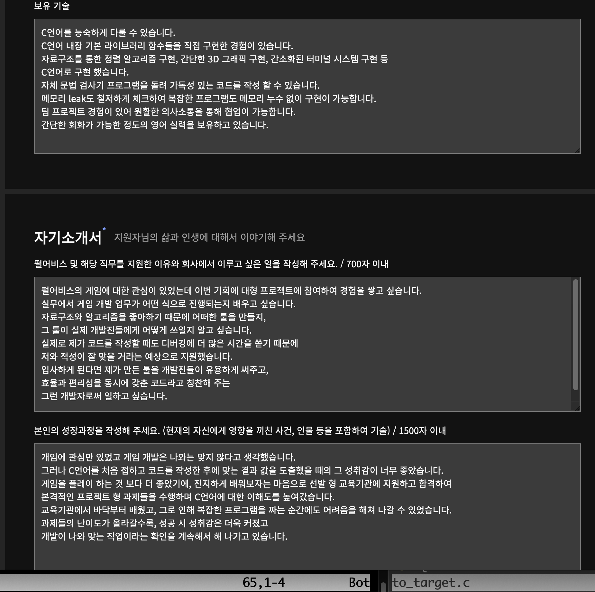
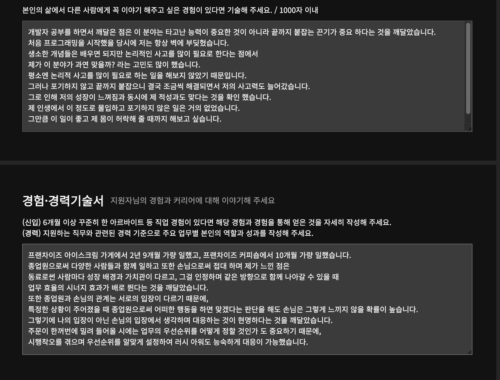

# 이력 기록

[https://bit.ly/48zlOwk](https://bit.ly/48zlOwk) = 이력서 첨부 자료 (코딩 일기)

포트폴리오 : 

- 포트폴리오 작성법
    
    
    
    
    
    
    
    
    
    
    
    
    
    
    
    
    
    
    
    
    
    
    
    
    
    
    
    
    
    
    
    
    
    
    
    
    
    
    
    
    
    
    

[한승현_포트폴리오.pdf](%E1%84%92%E1%85%A1%E1%86%AB%E1%84%89%E1%85%B3%E1%86%BC%E1%84%92%E1%85%A7%E1%86%AB_%E1%84%91%E1%85%A9%E1%84%90%E1%85%B3%E1%84%91%E1%85%A9%E1%86%AF%E1%84%85%E1%85%B5%E1%84%8B%E1%85%A9.pdf)

- 이력 기록
    
    고등학교 입학 날짜 2012. 3.2
    
    고등학교 졸업 날짜  2015. 2. 4
    
    군 입영 날짜 2016. 2.2
    
    군 전역날짜 2017. 11. 1
    
    군번 1672003059
    
    병과 소총
    
    한문이름: 韓承峴
    
    대학교(서경대) 입학 날짜 2015. 3. 2
    
    대학교(서경대) 중퇴 날짜 2022. 4. 25
    
    서경대 평점 평균 2.03
    
    학번 : 2015108157
    
    단과대학 : 인문과학대학
    
    전공 학점: 31  전공 평점 평균: 1.91
    
    학점 은행(컴퓨터공학) 입학 날짜 2022.10.26
    
    학점 은행(컴퓨터공학) 졸업 날짜 2024.2.23
    
    컴퓨터 공학 평점 평균 1.74
    
    학점 은행(정보통신공학) 입학 날짜 2024.9.19
    
    학점 은행(정보통신공학) 졸업 날짜 2025.8.26
    
    정보통신공학 평점 평균 4.16
    
    학번 : 2022-1399248
    
    자격증 정보
    
    Opic
    
    기관 ACTFL
    
    성적 IH
    
    취득일자 2024. 9. 6
    
    수험(등록)번호 2A9944929458
    
    네트워크 관리사 2급
    
    발행기관 한국정보통신자격협회
    
    취득일자  2023. 4. 11
    
    발급번호  DNT2065916
    
    대외(교육)활동
    
    42Seoul
    
    기관 이노베이션아카데미
    
    시작일자 2023. 10. 2
    
    이수일자 2025. 6.
    
    이수시간 2243
    
    SSAFY(삼성청년SWAI아카데미)
    
    멀티캠퍼스 역삼
    
    시작일자 2025. 7. 7
    
    이수일자 2026. 6. 30
    
    1학기 = 925시간
    
    2학기 = 
    
    내일배움카드
    
    발급일 2023. 1. 13
    

- 자소서 작성 팁
    
    진실성이 1위
    
    가독성
    
    직무 ↔ 내 경험 의 교집합 싸움
    
    서류는 일단 다 적는게 유리하다 → 점수제니깐.
    
    카카오게임즈에 헬스까지 적었던걸 생각하자.
    
    일단 서류가 붙어야 면접을 간다. → 알바 경험도 적자.
    
    경험 → 배운점 → 이 생각을 말로 설명하는게 중요
    
    **퉁치지말고 Excuse**
    
    **놀다가 → 정신 차렸다 → 정신을 차렸으면 고고익선의 스펙(근거)가 따라와야 한다.**
    
    
    
    위에 있는 내용은 지양한다.
    
    사람은 쉽게 변하지 않는다 → 과거로 미래를 설득해야 한다.
    
    ex) 아르바이트 3년이상 → 회사에서도 오래 있을 가능성 높음.
    
    대학교때 놀았다 왜? → 하고싶은 것(게임 등) 들이 있어서 → 아르바이트 꾸준히 해서 내 생활비를 벌면서 하고싶은걸 했다.
    
    항목 하나에 N가지 소개를 묶어서 작성 가능
    
    전공자
    
    
    
    왜 1년 더 투자했나?
    
    비전공자
    
    
    
    왜 SW로 왔나? → 솔직하게 답변, 취업이 잘 안되고, SW 알고리즘이 더 재미있었다.
    
    위처럼 흐름으로 작성 가능
    
    
    
    
    
    학점, 학벌이 제일 크게 보인다.. 쩝
    
    알바 경험을 적는건 어느정도 다르긴하지만 적는게 좋다.
    
    남의돈 버는게 쉽지 않으니깐. 또 생활비도 스스로 번것도 경험이다.
    
    
    
    
    
    조직에 잘 녹아들 수 있는 경험, 직무와 관련이 없어도 무조건 넣는다. (동아리, 알바 등)
    
    
    
    나이가 많으면 공백기 길다는것 → excuse 필요 → 어린 친구들과도 잘 어울리는지?
    
    게임 → 취미로 넣지 말아라..
    
    
    
    **이력서는 무조건 거의 다 적는다.**
    
    **자소서는 진짜 중요한것만 의사결정을 통해 넣는다.**
    
    **자소서 작성 팁**
    
    1. 요약해서 앞으로 갖다놓기 (소제목)
    
    요약해서 몇 문장안에 넣은 내용을 맨 앞으로 갖고옴 → 세부적인 내용 블라블라 → 다시 한번 환기
    
    1. 소제목은 명사형이 좋음
        
        
        
    
    제목 → 키워드
    
    
    
    ACE → 외우자.
    
    
    
    
    
    
    
    
    
    
    
    두괄식 → 마무리할때 다시 한번 환기
    
    1. 지원 동기 작성
    
    
    
    팩트 한줄 → 나에게 미친 영향, 내가 하는 생각
    
    ex) 싸피는 ~~ 한 교육 과정입니다. 이에 프로젝트 경험을 원했던 저에게 최고의 교육 프로그램이었습니다
    
    
    
    1. 포부
        
        
        
    
    **비중은 지원동기 > 포부 → 지원동기 비중은 직무적합성 1순위**
    
    
    
    경험이 1순위 → 프로젝트 경험
    
    지식 2순위, 스킬 3순위
    
    경험으로 다 채우는게 좋음
    
    프로젝트 경험을 적을때 → 기능 중요 X → 기술이 중요 → 어떻게 이 기능을 어떤 기술로 구현했나?
    
    기술 적을때 → 세부 키워드를 적자
    
    공기업 IT 지원시
    
    
    
    자격증 많이, NCS점수
    
    좋은 자소서의 조건은?
    
    
    
    **둘다 챙기면 좋지만, 소재가 1순위!**
    
    **지원 동기 → 적합성, 포부 → 연결성(Upgrade)**
    
    **하고싶은 말을 맨위로 올려라!**
    
    입사 후 포부와 성장 목표를 서술할 때는, 지원하는 **직무**와 **회사**의 성격에 맞게 당신의 개인적인 목표와 회사에서의 성장을 어떻게 연관시킬지를 명확하게 보여주는 것이 중요합니다. 이를 위해 다음과 같은 구조와 내용을 따라 작성하는 것이 효과적입니다.
    
    ### 1. **회사의 비전 및 직무에 대한 이해**
    
    먼저, **회사**와 **직무**에 대해 깊이 이해하고 있다는 것을 보여주세요. 회사가 어떤 방향으로 나아가고 있으며, 그 과정에서 자신이 어떻게 기여할 수 있을지 이야기하는 것이 좋습니다.
    
    ### 2. **개인의 포부와 목표**
    
    다음으로, **개인적인 포부**와 **목표**를 구체적으로 명시합니다. 단순히 '성장하고 싶다'라는 식의 추상적인 표현보다는, **구체적인 기술** 또는 **프로젝트**를 언급하면서 어떻게 성장하고 싶은지 설명하는 것이 중요합니다. 예를 들어, 어떤 분야의 기술을 심화하고 싶다든지, 리더십 역할을 맡고 싶다는 식으로 서술할 수 있습니다.
    
    ### 3. **회사를 통한 성장과 기여**
    
    다음으로, **회사의 성장**과 **개인의 성장**이 어떻게 서로 맞물릴지를 강조하는 부분이 중요합니다. 당신이 회사에서 배워 성장하는 동시에, 회사에도 가치를 더하는 사람이 될 것이라는 메시지를 전달해야 합니다.
    
    ### 4. **장기적인 목표**
    
    마지막으로, **장기적인 성장 목표**를 설정하는 것이 좋습니다. 이를 통해 회사에서 단기적으로 성과를 내고, 장기적으로는 어떤 역할을 하고 싶은지를 보여줄 수 있습니다. 예를 들어, 팀 리더나 프로젝트 매니저로 성장하고 싶다는 목표를 설정할 수 있습니다.
    

- 직무 면접 팁
    
    
    
    신입 기준임
    
    
    
    
    
    
    
    
    
    
    
    면접관들이 똑같은 주제를 몇십번 하루에 듣기때문에 귀에 딱 들어오는 주제가 좋음
    
    **결론 → 기대효과 → 리스크 → 극복 방안** 순서
    
    수치화 중요 → 지원 회사를 분석해가면 도움 됨
    
    
    
    
    
    프로젝트에서 기술 사용시 사용 당위성 확보 & 기록 중요
    
    
    
    코테인데 모듈화..? 좀 이해가 안되긴 한다 ㅋㅋ 신경써서 코드 작성해야하는건 맞긴 한데..
    
    
    
    포트폴리오는 회사마다 차별화해서 내면 좋음.
    
    
    
    프로젝트 경험을 통해 회사에 기여하겠다 → 이거 보단,
    
    프로젝트를 통한 성장 가능성, 진지함, 열의가 어필 포인트 → 현업은 더 복잡하기 때문에 기여는 오바다.
    
    
    
    
    
    
    
    대기업은 스페셜리스트보단 제네럴리스트를 원한다. → 스페셜리스트처럼 한 기술을 열심히 익히는것도 좋지만 다양한 업무를 처리할 수 있는 제네럴리스트로서 활동하기를 원한다고 대답.
    
    
    
    구체적인 기술 설명
    
    
    
    
    
    기술을 가져다 쓰는거보다는 직접 구현해야하기 때문에 탄탄한 cs, 기술에 대한 지식, 경험이 중요
    
    
    
    제너럴한 능력, 조직 적합성 중요
    
    
    
    빠르게 적용할 수 있는 능력 중요
    
    위 3개중에 fit에 맞는 회사 지원하는게 중요 → 난 1번인데.. 하.. 카카오게임즈 개객기
    
    
    
    
    
    
    
    서비스 회사는 CS 지식 중요, 자료구조 알고리즘 OS 등.. → 카카오게임즈 개객기..
    
    
    
    관심있는 최신 기술 하나정도는 깊이 있게 알아두면 면접 대비에 좋다.
    
    보통 잘한다고 하는 쪽에 질문을 많이 한다 → 잘한다는 것에 대한 질문 대비가 필요함
    
    잘 하는것, 못하는 것 구분 지으면 대답에 도움이 됨
    
    
    
    코드 리뷰.. 42서울과 알고리즘 문제 풀고 노션에 적은 경험이 많긴 한데,
    
    그래도 면접용으로 따로 준비를 해야한다.
    
    완벽한 코드 결과를 원하지 않음 → 작성한 코드가 전체적으로 구조화되어 있는지 → 내가 작성한 코드를 구조화해서 설명할 수 있는지 설명 
    
    
    
    단골 질문은 무조건 준비해가야 한다.. 카카오게임즈 면접에서 뼈저리게 느꼈다.
    
    면접관들은 입사하고 2~3년후 탈주하는 탈주 닌자들을 가장 거르고 싶어한다. → 회사의 이해도와 로열티가 있는지? 회사와 fit 한지 체크함
    
    
    
    어떤 서비스를 해볼까?
    
    
    
    쉽지 않지만..? 시도해볼수도..?
    
    
    
    많이 체크해보자.
    
    
    
    
    
    지원서는 무조건 지원하는 기업 특화로 적어야 한다. → 면접에서 누굴 뽑을지 애매할때 회사 특화로 적고 준비한 사람을 뽑을 가능성이 높다.
    
    내가 한 프로젝트에 대한 질문은 무조건 답변을 잘 해야한다. → 이거 못하면 치명적이다.
    
    CS 질문은 하나 대답못한다고 불합격 → 이러진 않는다.
    
    구체적인 수치로 개선 결과를 기록하는게 중요.
    
    당연한 기본적인 구현을 대단한것 처럼 포장하는것 좋지 않다. → 정말 차별화되는 기술 강조 중요
    
    예시)
    
    복잡한 쿼리라고 했는데 얼마나 복잡한 쿼리를 처리한건지? →
    
    이런 주관적인 단어 선정을 조심하자. 진짜 현업인이 봐도 복잡한걸 복잡하다고 기록해야 한다.
    
    수준 하, 중, 상 →
    
    메타인지를 하고 있느냐 → 왜 “중”이라고 적었는지? 사유를 잘 말해야함.
    
    메타인지가 잘 되어있으면 성장 가능성도 보임
    
    
    
    **선택엔 합리적인 근거가 있어야 한다!**
    
    
    
    신입에건 어이없는 질문 → 오히려 역질문해서 생각할 시간을 벌고 주거니 받거니하는 대화로 면접관에게 
    
    얘봐라? 하는 impression을 줄 수도 있음. 구조화된 대답도 가능
    
    
    
    2번째 대답이 훨씬 좋은 대답임.
    
    
    
    1번이 무조건 선호 → 결국엔 제대로 파야한다.
    
    
    
    1번이 정답 → 거짓말 하지 마라..
    
    
    
    케바케
    
    → 1번은 증명이 가능한 케이스 ex) 삼성 pro 취득 등
    
    → 2번은 SW역량이 애매하다고 생각히 들면 좋은 케이스
    
    
    
    → 1번, 탄탄한 SW역량이 있으면 소통 역량은 같이 커짐 → 다 알고있으니깐 대화가 잘됨
    
    
    
    2번이 제일 좋음
    
- 인성 면접 팁
    
    
    
    
    
    
    
    
    
    
    
    
    
    
    
    
    
    
    
    진상 3순위 → 길게 말하는 사람
    
    진상 2순위 → 동문서답
    
    진상 1순위 → 동문서답 길게
    
    
    
    압박 질문 들어오면 솔직하게 인정하고 들어가자. 거짓말, 핑계 X
    
    공백기 질문이 들어오면? → 학창 시절부터 계획적으로 진로를 명확하게 설정하고 준비하지 못한 저의 부족함이 있었다. 그래서 그러한 후회를 더이상 남기지 않기 위해 짧은 시간동안에 저의 지원 분야에 대해 이해하고 관련된 역량을 키우기 위해 더욱 치열하게 준비했다 → 이런식으로 인정하고 긍정으로 답변해야 한다. 
    
    내가 뭐가 부족한지 정확하게 인지하고 짚어낸 다음 인정하고 → 긍정으로 나아가야 한다.
    
    면접관이 뭐라고 하든 무조건 인정해야 한다.. → 하늘이 빨갛다고 하면 빨갛다고 한다 → 더한것도 해야 한다.
    
    인정 이후에 긍정적 모습을 보여줘야 한다!
    
    
    
    내 생각과 반대다..?
    
    자신 없는 답변은 무조건 더 당당하게!
    
    자신 있는 답변이면 무조건 더 겸손하게!
    
    [자신없는 답변]
    
    나이가 적다..? → 맞다 나이 적다! 그러나 조직생활에서 오히려 내가 깍듯하게 해서 정말 좋은 분위기를 만든 경험이 있다!
    
    학점이 낮다..? → 맞다 낮다! 그때 놀고싶어서 놀았다! 그러나 더 치열하게 준비해서 여기까지 왔다!
    
    [자신있는 답변]
    
    면접관이 너무 극찬한다..? → 죄송합니다.. 제가 면접 경험이 별로 없어서 너무 장황하게 이야기한것 같습니다. 좀 더 간결하게 이야기하겠습니다.
    
    학점도 좋고 프로젝트도 좋다..? → 저보다 더 나은 친구들도 있는데 좋은 말씀 해주셔서 감사합니다. 프로젝트도 좋은 동료들이 있어서 잘 진행되었던 것 같습니다.
    
    **[최종 정리]**
    
    1. **강점을 강점화**
    2. **경청**
    3. **인정 → 긍정 마무리**
    4. **자신감 AND 겸손함**
    
    
    
    필살기는 리스크가 있다.
    
    상대방을 죽이지 못하면..? → 내가 죽는다.
    
    굉장히 조심히 사용해야할 스킬. 잘 익혀야 한다.
    
    
    
    
    
    
    
    
    
    
    
    
    
    극복 경험을 물어본다 → 1. 어떤 상황이 극복한 경험이었지? or 2. 나한테 이걸 왜 질문하는거지? → 2번으로 생각해야 한다. 질문의 의도는 파악해야함 → 책임감을 가졌는지 물어보는거임. → 책임감이 뭔데? → 포기하지 않고 도망치치 않고 어쩌고 저쩌고.. → 추상적임, 너무 다 똑같은 대답을 함. 사실 모르는거임 → 따라서 답변도 잘 안나옴.
    
    그럼 어떻게 대답해야 하는데? → 위 사진의 **평가 지표**에 따라 답하면 정답임. → 1. 목표가 정확이 무엇인지, 2. 그 목표에 도달하는데 장애물이 뭔지, 3. 이 상황에서 없는 힘까지 발휘하는지.
    
    어떤걸 더 비중을 두고 대답해야하나? → 상황과 역할을 줄여나가고, 생각과 행동을 늘려야 한다. → 그 상황에서 내가 한 생각과 그를 바탕으로한 행동이 더 중요함.
    
    평가 지표는 GPT한테 물어봐도 잘 말해줌.
    
    
    
    
    
    
    
    
    
    
    
    
    
    
    
    
    
    
    
    평가 키워드가 고정되어 있는지 판단
    
    도전했던 경험을 질문하면? → 키워드 고정형 질문
    
    학창시절 기억에 남는 경험? → 키워드 선택형 질문
    
    강제형 질문은 동문서답을 주의해야한다!
    
    앞선 질문에서 직무 관련 키워드가 많이 선택되었다면 뒤에서는 인성을 선택하면 좋다! 감으로 채우면 좋을듯
    
    
    
    
    
    평가지표들을 몇개 추린다음 GPT에게 구체적으로 어떤 역량이 들어가야하는지 질문하면 알려준다.
    
    이걸 바탕으로 대답을 준비하면 좋다.
    
    [결론]
    
    질문의 평가 의도와 지표를 이해하고, 그 키워드에 맞춤형 답변을 상황과 역할을 줄이고 나의 생각과 행동을 중심으로 강조할 수 있어야 한다.
    
    생각도 중요하지만, 실제로 일어난 행동이 더 중요하다. → 생각은 거짓말 가능, 행동은 거의 불가능
    
    
    
    
    
    알바 경험이 중요하다.. 일단 쓰자.
    
    
    
    1번
    
    
    
    2번
    
    
    
    2번이 합격.
    
    키워드 차별화
    
    
    
    
    
    
    
    나만의 영역을 구축해야함
    
    팀워크가 강점? → 특히 자원이 부족한 상황에서 발휘된다.
    
    소통이 강점? → 특히 나와 다른 기술적 배경을 가진 사람들과 이야기가 수월하다.
    
    책임감이 강점? → (주 4일제 회사에서) 휴가 가기전에 마무리를 무조건 확실하게 한다.
    
    내가 최초가 될게 뭐가 있을까..? **양보할 수 없는 키워드를 찾자.**
    
    그러나 정교해야 한다. 아니면 내가 죽는다.
    
    그렇다고 안전하게 안전빵으로 FM 대답한다? → **안정빵으로 탈락한다.**
    
    모험을 해보자. 그러나 정교한 모험.. 다 경험이다.
    
    
    
    경청을 잘한다? → 누구나 할 수 있는 방법을 말하면 안전빵이다.
    
    맛집이 되려면? 위처럼 노하우를 말해줘야 한다.
    
    일반적인 레시피를 넘어서, 그 레시피의 범위 내에서 나만의 방법을 이야기할 수 있어야 한다.
    
    내 자신을 이해해서 나만의 노하우(필살기)를 어필할 수 있어야 한다. 그래야 차별점 → 합격이다.
    
    **누구나 무조건 있다. 찾아내자.**
    
    
    
    같은 운전면허가 있어도 그냥 딴거 or 동아리 팀원들을 위해 운전하기 위해 딴거 → 다르다. 후자는 팀워크 강조 가능
    
    
    
    꽃꽃이 8단을 이력서에 쓸건가? → **무조건 쓴다. 직무역량으로 써먹을 수 있다.** → 2.30대 취준생들이 힘들어해서 강의장 뒤에 꽃을 꼽고싶어서 땄다.
    
    
    
     ****대중이 많이 깨달은 부분을 이야기하면 차별화가 없다.
    
    마라톤 → 끈기 (대중적) → 빨리 포기하는법을 배웠다 (차별화)
    
    
    
    내 스펙은 다 좋다? **NO**
    
    나는 좋은 성적은 받았지만 어떤 부분에서 부족하여 실패했고 → 이를 통해 어떤 점을 배워서 더 발전했다.
    
    → 살을 주고 뼈를 지킨다. → 진실성도 어필 가능.
    
    상황 대처
    
    
    
    
    
    팀워크를 발휘해서 실패한 경험? → 없다거나 두루뭉술하게 넘어가면 무조건 탈락.
    
    나였다면? 쉘 팀프로젝트에서 따로 개발하다 API 통합할때 고생한 경험 → 팀원과 다음에 같이 프로젝트할때는 어떻게 해야하는지 함께 감을 잡아서 더 효율적으로 할 수 있었다. → 팀워크 강조 가능.
    
    A 직무가 아니라 B 직무 배치되면? → 무조건 솔직하게, 진실되게 대답. → 이러한 직무를 기대하고 갔기 때문에 아쉽겠지만(감정을 드러내는것도 괜찮다), 그러나 회사에서 주신 기회인만큼 이 기회를 잡아 열심히 해보고, B 직무에 대한 나의 능력도 파악하고 나중에 이 경험을 기반으로 A 직무에서 시너지를 발휘할 수 있을거 같다.
    
    [최종 정리표]
    
    
    
      
    
    당신을 왜 채용해야 하는가?
    
    
    
    로열티를 보여줘야 한다. 직무 역량을 최우선으로, 부족하면 기반 역량으로 보완
    
    
    
    
    
    
    
    회사에서 어떤 목표를 위해 A 라는 키워드가 필요하지 않나? → 내가 가지고 있다 어필
    
    
    
    노하우 차별화
    
    
    
    구체화 방식을 추천.
    
    
    
    
    
    자기 소개
    
    
    
    자기소개는 첫 인상이다 → 첫 인상이 잘 풀려야 끝도 잘 풀린다. → 자연스러워야 한다!
    
    
    
    
    
    
    
    지시사항은 무조건 이행 
    
    후속 질문이 나와도 편하게 이야기할 수 있는것 → 강점 키워드를 선점해야 한다.
    
    
    
    
    
    
    
    
    
    
    
    어려운 질문 TOP3
    
    
    
    1번 → 부정형 질문에는 긍정형으로 답변하면 된다!
    
    부정 → 긍정으로 마무리
    
    2번 → 너무 긍정적인 사람이 어떤 부분에서 같이 일하는게 힘들다 → 대답의 전환
    
    너무 기회를 많이 주면 힘들다 → 기대에 부합하기가 쉽지 않아서.
    
    3번 → **“가장”** 이라는 키워드에 집착하지 않아도 된다. → 그냥 힘들었던 경험 중 하나 고르면 된다.
    
    
    
    1번 → 2개다 답 → 극단적인 거짓말이 아니면 인재상에 맞춤 → 극단적일 필요가 없다.
    
    2번 → 핑계대지 않는 사람 → 뭔가 해보려고 하는 사람 → 뭔가를 맡기면 계속 시도하는 사람
    
    3번 → 
    

# 제조

[자소서, 면접 관하여](%EC%9E%90%EC%86%8C%EC%84%9C,%20%EB%A9%B4%EC%A0%91%20%EA%B4%80%ED%95%98%EC%97%AC%203281b2ec3d518063a45dc6a1c4a0f92b.md)

[삼성전자 DA](%EC%82%BC%EC%84%B1%EC%A0%84%EC%9E%90%20DA%202791b2ec3d518049b4bfc818d3da4a22.md)

[로봇](%EB%A1%9C%EB%B4%87%203211b2ec3d51800f8d6edd17ce6c0ac2.md)

[한화시스템](%ED%95%9C%ED%99%94%EC%8B%9C%EC%8A%A4%ED%85%9C%2032d1b2ec3d51801483c6d83882b48136.md)

[현대자동차 ](%ED%98%84%EB%8C%80%EC%9E%90%EB%8F%99%EC%B0%A8%2032d1b2ec3d5180e49254dd209e50509c.md)

[DN솔루션즈](DN%EC%86%94%EB%A3%A8%EC%85%98%EC%A6%88%2033a1b2ec3d5180ffa531c40a3db95cd8.md)

[SK인텔릭스](SK%EC%9D%B8%ED%85%94%EB%A6%AD%EC%8A%A4%203441b2ec3d5180f689c2d3c2b713a33b.md)

[현대로템](%ED%98%84%EB%8C%80%EB%A1%9C%ED%85%9C%203521b2ec3d5180218be1c4aac2fe3623.md)

# 게임

# 넥슨

- 2023 넥토리얼
    
    넥슨은 제가 어렸을때 부터 즐겼던 게임들을 개발한 회사입니다.
    넥슨 게임이 가지고 있는 캐주얼한 분위기, 낮은 진입 장벽은 친구들과 함께, 또는 혼자서 즐기기에 충분했고 어린 시절의 저에겐 최고의 선물과도 같은 추억을 만들어 주었습니다.
    그러한 추억들이 있는 상태에서 이제는 성인이 되어 프로그래밍 분야에 관심이 생겨 자연스럽게 게임 회사에 입사하고 싶다는 생각을 가졌습니다.
    마침 넥토리얼 이라는 인턴십 프로그램을 알게 되고 내가 좋아하는 게임을 만드는 회사에 입사하게 된다면 좋은 경험이 될거라고 판단하여 지원하게 되었습니다.
    만약 제가 넥슨에 입사를 한다면 무엇보다 사람들과의 협업을 중시 할 것입니다. 
    협업은 혼자할 때에 비해 몇배의 시너지 효율을 내며 협업 없이는 절대 좋은 프로그램이 개발된다고 생각하지 않습니다.
    하지만 좋은 협업을 통해 훌륭한 게임을 만들어도 게임이 항상 즐겁지만은 않습니다.
    각종 버그, 사람과의 기분나쁜 경험, 콘텐츠 부족 등 게임을 그만두게 만드는 여러 요소가 분명히 존재합니다.
    이러한 점들에 기반하여 저의 성장목표는 크게 네가지로 나뉩니다.
    첫째, 동료들과의 원활한 관계를 유지하며 높은 빈도의 소통으로 협업 효율을 극대화 시킨다.
    둘째, 유저들이 게임 자체의 기술적인 문제에서 막히는 구간이 최대한 없도록 프로토타입 제작 단계에서 빠른 유지 보수가 가능한 강력한 코드를 만들고, 버그가 생기면 신속하고 정확하게 해결하는 능력을 갖춘다.
    셋째, 온라인 게임인 경우 많은 사람들이 서로 부대 끼며 성장을 진행하는 순간이 많기 때문에 최대한 불편한 일이 생기지 않도록 콘텐츠를 만들때 쾌적하고 효율적인 환경을 구현한다. (PVP 제외)
    넷째, 새로운 콘텐츠나 아이디어가 생기면 그것을 현실화 시킬때 코드로 구현할 수 있어야 한다.
    이러한 역량을 갖추려면 저 혼자서는 불가능합니다.
    그렇게에 저는 넥슨에 입사하여 교육과정에 성실히 임하고, 선배님들께 조언을 구하며, 동료들과 함께 실무에 부딪히며 성장하고 싶습니다.
    
    저는 평소에도 게임 관련 개발에 관심이 있어 관련 영상이나 서적도 찾아보곤 했었습니다.
    그러나 본격적으로 공부를 진행하진 않았고 과기부 산하의 재단에서 "42서울" 이라는 C 프로그래머 양성 과정의 교육생들을 선발한다는 공고를 본 후에 처음으로 관련 분야의 목표가 생겼습니다.
    8월에 선발과정이 진행된다는 소식에 4월 즈음 학원에 등록하고 2개월 가량 다녔으나 자세한 설명은 하지 않고 구현 중심의 수업이 진행되었습니다.
    때문에 의문점이 한 두가지가 아니었고 깊은 이해도를 원했기에 CS지식이 담긴 C언어 책 한권을 사서 학원에서 배운 내용에 CS지식을 대입시키며 복습과 학습을 겸하는 방식으로 자습시간을 가졌습니다.
    그리고 8월이 되었습니다.
    약 4주간의 선발 과정이 진행되었고 각 주마다 4일은 개인 과제, 1일은 시험, 2일은 팀 과제 총 7일의 스케줄로 구성되어 있었습니다.
    시간이 촉박했기 때문에 매일 하루 평균 12시간 이상 작업했습니다.
    개인 과제와 시험은 대부분 C 내장함수와 사용자 정의 함수 구현으로 구성되어 있었고 팀 과제는 알고리즘 문제로 구성되어 있었습니다.
    코드 구성을 할때 헤더 제한, 문법 제한, 생각지 못한 테스트 케이스, 매우 불친절한 설명 등 구현하는데 상당히 까다로웠습니다.
    또한 과제를 통과하려면 기계 평가와 더불어 동료들에게 일정 횟수 이상 코드 리뷰를 받고 모두 OK를 받아야 통과할 수 있었습니다.
    개인 과제에선 제가 가진 지식, 구글 검색과 동료들의 도움으로 함수를 구현했고 테스트 케이스에서 틀릴때 마다 코드를 다시 분석하고 수정, 보완했습니다.
    팀 과제는 팀원들끼리 어떤 자료구조을 쓸지 선택하고 각자 역할을 분담하여 각 부분을 구현한 후에 오류를 서로 잡아주고 마지막에 맞는 결과값을 도출하여 성취감이 상당했습니다.
    시험도 주차가 지나갈수록 성적이 나아졌습니다.
    치열한 과정이었으나 피곤함을 느끼지 못했고 결국 본과정 입과에 성공했습니다.
    이러한 경험들로 제가 이 분야를 정말 좋아하고 제 미래를 걸 만한 가치가 있다는걸 깨달았습니다.
    
    제가 사용할수 있는 언어는 C언어 입니다.
    주로 맥 환경에서 쉘의 vim을 사용하여 코드를 작성하여 쉘과 vim 사용법에 익숙하고  vscode도 사용합니다.
    C언어의 내장함수와 그걸 활용한 함수들을 만든 경험이 많아 언어의 내부적인 이해도가 충분합니다.
    이러한 함수들을 구현할때 필연적으로 CS지식을 필요로 하기때문에 CS에 대한 이해도가 충분합니다.
    코드를 작성할때 자체 문법 검사 프로그램을 항상 돌려 코드의 가독성이 뛰어나게 작성할 수 있습니다.
    리스트, 스택, 큐, 트리, 그래프 자료구조를 이해하고 있으며 이러한 자료구조를 활용한 이진 탐색 트리, DFS, BFS등 활용 함수 구현이 가능합니다.
    알고리즘 문제가 주어지면 해당하는 문제에 맞는 자료구조를 대입하여 알고리즘 구성이 가능합니다.
    
- 2024 넥토리얼
    - **넥슨과 선택하신 직무에 지원하게 된 이유를 서술해주세요.**
        
        저는 어릴 적부터 넥슨의 메이플 스토리, 카트라이더 등 여러 게임을 즐기며, 게임을 통해 친구들과 소통하고 함께 즐거운 시간을 보내는 경험을 했습니다.
        이 경험은 저에게 게임이 단순한 오락 이상의 의미를 가진다는 것을 깨닫게 해주었고, 게임 개발에 대한 흥미를 키우는 계기가 되었습니다.
        프로그래밍을 시작한 시점은 조금 늦었지만, 오랫동안 꿈꿔왔던 게임 개발자의 길을 걷기로 결심하고 본격적으로 프로그래밍을 배우기 시작했습니다.
        이를 통해 게임으로 사람들에게 즐거움과 감동을 전달하고자 하는 목표를 이루기 위해 끊임없이 노력하고 있습니다.
        
        최근 넥슨의 데이브 더 다이버 가 큰 성공을 거두는 모습을 보며, 넥슨이 계속해서 창의적인 시도를 하고, 매력적인 게임을 만들어내는 회사라는 점에 깊은 인상을 받았습니다. 게임을 좋아하는 사람으로서, 그리고 게임 개발에 큰 관심을 가진 개발자로서, 넥슨의 이런 성공에 기여하고 싶은 열망이 생겼습니다.
        
        저는 게임 개발이 단순한 기술을 넘어 창의성과 혁신이 중요한 분야라고 생각합니다. 그런 점에서 넥슨의 개발 철학과 방향성은 저의 가치관과 잘 맞습니다.
        제가 가진 프로그래밍 역량을 바탕으로 넥슨의 미래에 기여하고, 더 많은 사람들에게 즐거움과 감동을 주는 게임을 함께 만들어가고 싶습니다.
        
    
    - **선택하신 직무에 필요한 역량을 갖추기 위해 어떠한 준비를 해오셨고, 그 과정에서 얻은 배움이나 성취를 중심으로 기재해 주세요.**
        
        저는 42서울의 교육과정을 통해 C언어 기반의 시스템 프로그래밍부터 C++의 고급 프로그래밍 기법까지 다양한 주제를 깊이 있게 학습하였습니다.
        
        C언어에서는 스탠다드 라이브러리 함수 구현, 멀티 스레드와 프로세스 프로그램 작성(예: 철학자 문제 구현), 간단한 3D 그래픽 표현 프로그램 개발을 통해 저수준 시스템 프로그래밍, 병렬 처리와 동시성 제어, 그래픽 처리의 기본 원리까지 폭넓은 기술을 익혔습니다.
        또한, 간소화된 쉘을 구현하는 팀 프로젝트에 참여하여 파싱을 담당하였고, 이를 통해 복잡한 쉘 커맨드의 처리 과정과 그에 따른 구문 분석 기술을 익혔습니다.
        이러한 경험을 통해 메모리 관리, 멀티 스레딩, 프로세스 간 통신(IPC) 등 중요한 개념들을 실제로 구현하고 적용해보는 기회를 가졌습니다.
        
        C++에서는 객체 지향 프로그래밍(OOP), 템플릿을 통한 제네릭 프로그래밍, STL을 활용한 자료구조 및 알고리즘 처리 등 핵심 기능을 이용한 다양한 프로젝트를 진행하였습니다. 특히, 포드-존슨 알고리즘(병합 삽입 정렬)과 같은 복잡한 알고리즘을 구현할 때 이론서를 참고하며 직접 구현하면서,
        효율적인 문제 해결과 알고리즘 최적화의 중요성을 깨달았습니다. 이러한 경험을 통해 고성능 소프트웨어 개발에 대한 이해를 넓혔습니다.
        
        각 프로젝트에서 디버깅과 성능 최적화의 중요성을 깨닫고, LLDB와 같은 디버깅 도구를 적극 활용하여 문제를 해결하였습니다.
        또한, 프로젝트 진행 중 마주한 문제와 해결 과정을 기록한 기술 노트를 작성해 후속 프로젝트나 문제 해결 시 참조할 수 있도록 체계적으로 관리하였습니다.
        이를 통해 지속적인 학습과 성장을 도모하며, 문제 해결에 있어 더욱 효율적인 접근법을 확립할 수 있었습니다.
        
        이와 같은 경험을 통해 저는 게임 개발에 필요한 프로그래밍 역량, 문제 해결 능력뿐만 아니라 팀 프로젝트에서의 협업 능력을 길렀습니다.
        이러한 기술적 역량을 바탕으로, 앞으로도 더 복잡한 문제를 해결하고 게임 개발에 기여할 수 있는 개발자로 성장하고자 합니다.
        
    
    - **지원하신 직무와 관련해 활용 가능한 스킬셋(기술스택, 플랫폼 등)을 구체적으로 나열하고, 각 스킬의 활용 수준(기초, 중급, 고급)을 설명해주세요.**
        
        유닉스 기반 CLI 개발 환경 경험( zsh, bash, vim) - 중급 : 평소 vim과 터미널을 사용하여 코딩하며, 가볍고 커스터마이징 가능한 개발 환경에 익숙합니다.
        vs code 사용법도 숙지하고 있으나, 주로 터미널과 vim을 선호합니다. LLDB를 사용하여 C/C++ 코드를 디버깅한 경험이 있습니다.
        
        프로그래밍 언어 경험(C, C++) - 중급: C언어로 스탠다드 라이브러리 함수 구현부터 간소화된 쉘 프로그램까지 다양한 프로그래밍 경험이 있습니다.
        C++이 주 사용 언어이며, 주로 알고리즘 문제 해결과 핵심 기능 구현에 활용하였습니다. OOP, 템플릿, STL 등의 C++의 주요 개념을 학습하고 이를 다양한 문제 해결에 적용해본 경험이 있습니다.
        
    
    - **입사 후 포부 및 성장 목표에 대해 서술해 주세요.**
        
        넥슨은 창의적이고 혁신적인 게임 개발로 전 세계의 게이머들에게 큰 즐거움을 주는 회사입니다.
        저는 이러한 비전에 깊이 공감하며, 넥슨이 새로운 게임 시장을 개척하는 과정에 함께하고 싶습니다.
        특히, 넥슨이 지속적으로 시도하고 있는 독창적이고 혁신적인 게임 개발 방식에 동참하여,
        더 많은 사람들에게 감동을 주는 게임을 만들어내는 것이 저의 포부입니다.
        
        입사 후에는 게임 개발에 필요한 기술을 더 깊이 탐구하고, 전문성을 강화하고자 합니다.
        C++, Unity, Unreal Engine과 같은 기술에 대한 이해도를 높여 게임 시스템을 더욱 효율적이고 창의적으로 구현하는 데 전념하겠습니다.
        이를 통해 사용자 경험을 최적화하고, 더 나은 게임 플레이 환경을 제공할 수 있는 기술적인 역량을 쌓아 나가고자 합니다.
        
        또한, 다양한 프로젝트에 참여하여 실무 경험을 쌓고, 이를 바탕으로 제가 가진 역량을 발전시키는 동시에, 회사에도 가치를 더하고 싶습니다.
        새로운 기술이나 트렌드에 발 빠르게 대응하여, 넥슨이 글로벌 게임 시장에서 더 큰 성공을 거두는 데 기여하는 것이 저의 목표입니다.
        
        장기적으로는 프로젝트 매니저로 성장하여 게임 개발의 전반을 관리하고 팀을 이끄는 역할을 하고 싶습니다.
        이를 통해 넥슨이 전 세계 게이머들에게 더 많은 즐거움과 감동을 줄 수 있도록 기여하고,
        계속해서 혁신적인 게임을 선보일 수 있도록 돕는 핵심적인 일원이 되고자 합니다.
        
- 2025 넥슨코리아 메이플스토리
    - 자유롭게 본인을 소개해 주시고 지원하신 분야에 적합하다고 생각하는 이유를 말씀해 주세요.
        
        학생 시절 메이플스토리를 즐기던 중, 계정 해킹으로 모든 아이템과 메소를 잃는 경험을 했습니다.
        이후 다른 플랫폼에서도 해킹 피해를 겪으며, 온라인 공간의 불안정성과 보안의 중요성을 뼈저리게 느꼈습니다.
        공정하게 쌓아 올린 결과가 무너지는 것을 직접 겪으며,
        악의적인 공격이 게임 환경 몰입을 심각하게 방해할 수 있다는 사실을 깨달았고,
        이러한 위협으로부터 게임을 지키고 싶다는 목표를 품게 되었습니다.
        또한, 게임 퍼포먼스 문제로 인해 플레이가 원활하지 않았던 경험을 통해,
        아무리 뛰어난 콘텐츠라도 쾌적한 플레이가 뒷받침되지 않으면 몰입도가 크게 떨어진다는 점을 체감했습니다.
        이러한 경험들은 내가 좋아하는 게임의 환경을 보다 안전하고 쾌적하게 만들어 보고 싶다는 열망으로 이어졌습니다.
        
        이 목표를 이루기 위해, 인문계열 대학을 중퇴한 후 컴퓨터 공학계열로 전향했지만, 학부 과정만으로는 부족함을 느꼈고,
        추가적인 성장 기회를 찾던 중 42Seoul 교육 프로그램을 발견하고 지원했습니다.
        1달간의 입과 테스트 동안 매일 대부분의 시간을 프로그래밍에 몰입하며 입과에 성공했고,
        이후 1년 6개월 동안 다양한 프로젝트를 수행하며 이 분야에 대한 실질적인 이해와 문제 해결 경험을 쌓았습니다.
        
        HTTP/1.1 웹 서버를 직접 구현하며 외부 입력 검증과 무결성 보호의 중요성을 체감했고,
        가상환경 인프라를 구축하며 서비스 분리와 보안 설계 감각을 익혔습니다.
        또한, 병렬 처리 환경에서 성능 테스트와 동기화 문제, 자원 경합을 해결하는 경험을 통해,
        안정성과 성능을 동시에 고려하는 프로그램 설계 감각을 키웠습니다.
        
        개별 과제뿐만 아니라 팀 프로젝트에서도 문제 해결 능력을 검증할 수 있었습니다.
        웹 기반 게임 플랫폼의 인증 흐름을 설계하면서,
        네트워크 통신 중 인증 실패와 만료 상황을 어떻게 처리할지 백엔드 팀원들과 논의하고,
        API 호출 최적화와 오류 대응 로직을 구현하며 보안성과 퍼포먼스를 모두 고려하는 해결 방식을 적용했습니다.
        
        이 모든 과정을 교수나 교재 없이 스스로 자료를 탐색하고, 동료와의 코드 리뷰 및 평가를 통해 피드백을 주고받으며,
        문제를 빠르게 해결하는 것에 그치지 않고, 문제를 본질적으로 분석하고 개선하는 사고방식을 체득할 수 있었습니다.
        이러한 경험을 바탕으로,
        테크니컬 직무에서 요구하는 보안 감수성, 성능 최적화 역량, 협업 능력을 균형 있게 갖출 수 있었다고 생각합니다.
        
        입사 후에는 클라이언트 무결성과 서버 안정성 강화는 물론,
        게임 내 비정상 행위 탐지 및 자동 대응 체계를 고도화하여 핵/매크로 위협에 선제적으로 대응하고자 합니다.
        또한 게임 클라이언트 최적화, 서버 부하 분산 등 퍼포먼스 개선에도 기여하여,
        메이플스토리가 "안전하고 쾌적한 플레이 공간"이라는 신뢰를 확고히 구축하는 데 공헌하겠습니다.
        변화하는 위협 환경 속에서도 끊임없이 기술을 연구하고, 문제를 끝까지 파고드는 자세로
        메이플스토리의 기술적인 수준을 한층 끌어올리는 엔지니어로 성장하겠습니다.
        
    

# 펄어비스

- 2024 펄어비스 테크 인턴
    
    
    
    
    
- 2025 펄어비스 여름 인턴
    - 보유 기술
        
        C / C++: 프로그램 구현, STL 활용, 포인터 및 메모리 제어 가능 (중)
        
        Python: 알고리즘 테스트 및 간단한 자동화 스크립트 작성 (하)
        
        Shell Script: Bash 기반 간단한 빌드 및 자동화 처리 가능 (하)
        
        Docker / Linux: Dockerfile 작성, Compose 구성, 가상 환경 기반 개발 경험 (중)
        
        Network Programming: TCP/UDP 소켓, 비동기 I/O, HTTP 1.1 기반 서버 구현 경험 (중)
        
        Git: GitHub 기반 협업 및 브랜치 전략 활용 가능 (하)
        
        문서 작성 능력: Notion 기반 기술 정리 및 프로젝트 문서화 경험 다수 (중)
        
        커뮤니케이션: 코드 리뷰, 페어 프로그래밍, 디펜스 평가 등을 통해 논리적인 설명력과 피드백 기반 소통 역량을 체화함 (중)
        
    - 펄어비스 및 해당 직무를 지원한 이유와 회사에서 이루고 싶은 일을 작성해 주세요.
        
        학생 시절 검은사막을 포함한 여러 게임을 통해 게임 세계에 깊이 몰입했던 기억이 제게 특별한 경험으로 남아 있습니다.
        게임을 즐기다 내부에서 어떻게 돌아가는지 궁금해, 중학교도 안간 어린 시절에 에디터를 즐겨 사용했던 것이 기억에 남습니다.
        이러한 경험은 게임이 하나의 세계를 구성하는 복합 기술 집합체라는 것을 깨닫게 해주었고,
        이후 개발자의 길을 선택하게 되었을때 게임업계로 오고싶다는 열망으로 이어졌습니다.
        특히 펄어비스는 자체 엔진 개발과 고퀄리티 오픈월드 구현을 통해,
        기술과 창의성을 모두 갖춘 게임을 만든다는 점에서 저에게 큰 동기를 부여해 주어 해당 직무에 지원하게 되었습니다.
        
        저는 시스템 프로그래밍, 네트워크, 병렬 처리 등을 다루며 게임의 핵심 로직을 구현할 수 있는 기초를 다졌고,
        이를 바탕으로 플레이 경험을 정밀하게 설계하고 구현하는 엔지니어로 성장하고자 합니다.
        단순히 기술을 구현하는 데 그치지 않고, 플레이어의 움직임 하나하나가 설득력 있게 느껴지는 게임을 만들고 싶습니다.
        펄어비스의 기술적 철학과 도전적인 개발 문화 속에서, 저 역시 그런 몰입을 만들어내는 개발자가 되고 싶습니다.
        
    - 본인의 성장과정을 작성해 주세요. (현재의 자신에게 영향을 끼친 사건, 인물 등을 포함하여 기술)
        
        대학 시절, 전공 수업에 흥미를 느끼지 못해 방황하던 시기에 처음으로 개발이라는 세계를 접하게 되었습니다.
        처음에는 단순한 흥미로 시작했지만, 문제를 하나씩 해결해가는 과정에서 느낀 성취감은
        지금까지도 제 방향을 흔들리지 않게 붙잡아주고 있습니다.
        이전까지 무엇을 하고 싶은지 확신하지 못했던 제가, 처음으로 '이 길이라면 오래 붙잡고 갈 수 있겠다'고 느꼈던 순간이었습니다.
        
        저는 이후 42서울이라는 독특한 교육기관에 입과해, 정해진 커리큘럼이나 교수 없이 순수 프로젝트 기반의 자기주도 학습을 경험했습니다. 프로젝트는 단순한 기능 구현이 아니라 시스템 전반의 흐름을 이해하고 구조화하는 역량을 요구했고,
        실제 운영체제나 네트워크 동작 원리를 코드로 구현해야 했습니다.
        
        초기에는 반복적인 실패와 에러에 좌절하기도 했지만,
        함께 고민하고 피드백을 주고받는 동료들과의 협업을 통해 조금씩 문제를 해결해 나갔습니다.
        철학자 문제를 통해 병렬 처리 환경에서의 동기화 문제를 해결했고,
        HTTP/1.1 웹 서버를 직접 구현하며 요청 파싱, 응답 구성, 멀티플렉싱 등 네트워크의 흐름을 체득했습니다.
        또한 그래픽 라이브러리를 활용해 3D 물체를 2D 화면에 투영하는 와이어프레임 모델을 구현하며,
        시점 변환, 회전, 행렬 연산 등 컴퓨터 그래픽스의 기초 개념도 익혔습니다.
        이 외에도 가상 머신 구축, 셸(Shell) 구현 등 시스템 수준의 과제를 수행하며 실전 감각을 키웠습니다.
        
        이러한 과정은 복잡한 문제를 어떻게 구조적으로 풀어야 하는지 고민하게 만들었습니다.
        특히 저수준 환경에서 디버깅하고 테스트하며, 플레이어가 체감하지 못하는 부분까지 설계하는 백엔드적 사고는
        게임플레이 엔지니어로서의 자질과도 맞닿아 있다고 생각합니다.
        단순히 기술적인 정답이 아닌, 더 나은 체감과 몰입을 위해 게임 속 '당연한 동작'을 어떻게 구현할지 고민하는 엔지니어가 되고 싶습니다.
        
        개발자로서의 성장을 가능하게 했던 것은 언제나 ‘문제를 끝까지 놓지 않는 자세’였습니다.
        그리고 지금도, 실력과는 별개로 이 자세만큼은 어떤 환경에서도 흔들리지 않고 계속 지켜가고자 합니다.
        
    - 본인의 삶에서 다른 사람에게 꼭 이야기 해주고 싶은 경험이 있다면 기술해 주세요.
        
        “방향을 바꾸는 것도, 용기라는 걸 깨달았습니다.”
        
        처음엔 문과였고, 전공도 인문계열이었습니다.
        하지만 학교를 다니면서도 가슴 뛰는 무언가가 없었고,
        불확실한 진로 앞에서 막막함만 커졌습니다.
        
        그러다 우연히 접한 프로그래밍이 제 삶을 바꾸었습니다.
        당시엔 Hello World도 어렵고, 단순한 오류 하나 해결하는 데 하루를 썼습니다.
        그럼에도 불구하고, 문제를 풀었을 때의 짜릿함, 내가 만든 코드가 작동하는 순간의 뿌듯함은
        이전에 느껴보지 못한 감정이었습니다. 이건 ‘해야 할 공부’가 아니라, ‘하고 싶은 공부’였습니다.
        
        문과 출신에 기초도 없던 제가 선택한 길은,
        교수도 없고 커리큘럼도 없는 42서울이었습니다.
        주어진 틀에 맞춰 배우는 방식보다는, 바닥부터 스스로 탐구하고 실습하는 환경이 제게 더 맞다고 판단했기 때문이었습니다.
        이곳에서 1년 반 동안 직접 문제를 찾고, 팀을 구성하고, 프로젝트를 완성해내며
        낯선 분야에 진입하는 두려움보다, 기초부터 차근히 쌓아가는 경험의 소중함을 배웠습니다.
        
        쉬운 길은 아니었지만, 이제는 스스로 기술을 익히고, 시스템을 분석하며, 동료와 협업해 실질적인 결과물을 만드는 사람이 되었습니다.
        
        이 이야기를 누군가에게 꼭 들려주고 싶은 이유는 단 하나입니다.
        “늦게 시작했더라도, 방향이 맞다면 늦은 게 아니다.”
        저처럼 방황하는 누군가가 있다면,
        혼란 속에서도 반드시 자신에게 맞는 방향을 찾아갈 수 있다는 걸 말해주고 싶습니다.
        
    - 지원자님의 경험과 커리어에 대해 이야기해 주세요
        
        주요 업무 : 아이스크림 및 디저트 판매, 고객 응대 및 주문 처리, 매장 마감 및 정리, 재고 관리 및 청소 업무
        
        기간 : 1년 6개월
        
        역할 : 매장 아르바이트 직원 (마감 근무 중심)
        
        기여도 :
        마감 시간대 손님 응대와 동시에 매장 정리 및 폐점 업무를 꾸준히 수행
        타 직원들이 기피하는 냉장고 성에 제거, 제빙기 청소 등의 고된 작업을 맡아 수행
        신뢰를 바탕으로 사장님과 함께 매장의 중요한 유지보수 작업도 도맡음
        동료들과 원활한 관계를 유지하며 갈등 없이 근무
        
        성과 :
        맡은 역할을 책임감 있게 수행하며 매장 운영의 안정성과 효율성에 기여
        근무 기간 동안 꾸준히 성실한 자세로 신뢰를 얻었고, 사장님의 요청으로 중요한 작업에 지속적으로 투입됨
        다양한 상황에서도 침착하게 응대하며 고객 불만 없이 마감 근무를 마칠 수 있었음
        책임감 있는 근무 태도를 인정받아, 사장님으로부터 감사의 의미로 보너스를 받은 경험이 있음
        

# 크래프톤

- **지원동기를 기재해주세요.**
    
    게임 산업은 현재 전 세계적으로 가장 빠르게 성장하고 있는 엔터테인먼트 산업 중 하나입니다.
    
    매년 시장 규모 가치가 커지고 있으며 이젠 단순한 오락을 넘어 인터랙티브 미디어, 가상 세계, AI 기반 콘텐츠 등으로 확장되고 있습니다.
    
    게임 산업이 차세대 핵심 산업으로 자리잡고 있는 이러한 상황 가운데, 크래프톤은 PUBG라는 글로벌 메가 IP를 이미 구축하고 있으며
    
    인조이라는 새로운 도전을 통해 기존 게임에 존재했던 단순한 인공지능을 넘어 사람과 비슷한 수준의 AI를 구현, 도입하여
    
    이제까지 보지 못한 인생 시뮬레이션 게임을 만들고 출시를 앞두고 있습니다.
    
    이러한 모습을 보고, 크래프톤은 단순한 게임 개발사가 아니라 지속적인 IP 확장과 기술 혁신을 통해
    
    게임 산업의 미래를 선도하고 있다는 확신이 들었습니다.
    
    게임이 가장 강력한 미디어가 될 것이라는 믿음을 바탕으로 끊임없는 도전 정신과 독창성, 차별화된 기술력을 통해
    
    끝없이 연결되는 몰입형 가상 세계를 만드는 것이 크래프톤의 비전이라면, 그 목표에 기꺼이 함께 하고 싶어 지원하게 되었습니다.
    

- **KRAFTON 입사 1년 후, 3년 후, 5년 후 커리어 계획을 기재해주세요.**
    
    입사하게 된다면 1년 차에는 크래프톤의 개발 환경과 코드베이스를 익히고,
    
    실무에서 사용되는 게임 엔진과 서버 아키텍처를 학습하겠습니다.
    
    또한 유지 보수와 문서화 작업을 통해 회사의 업무 방식과 문화에 적응할 예정입니다.
    
    3년 차에는 어느정도 축적된 경험을 바탕으로 게임 로직 보안 강화와 안티 치트 시스템 개선 프로젝트를 주도적을 추진하겠습니다.
    
    보안 취약점 분석 및 새로운 대응 기법 도입 등 공정한 플레이 환경 조성을 하는데 핵심적인 역할을 할 것입니다.
    
    5년 차에는 컨텐츠 개발 및 서버 기술 최적화 부문의 핵심 인재로서, 주요 프로젝트를 리딩하고자 합니다.
    
    팀의 리드 개발자로서 신규 콘텐츠 개발과 대규모 서버 최적화 프로젝트를 총괄하여 크래프톤의 글로벌 경쟁력을 높이는데 기여하겠습니다.
    

- **최근 1년 중 가장 재미있게 플레이했던 게임과 그 이유를 설명해주세요.**
    
    가장 재미있게 플레이했던 게임은 Core Keeper입니다.
    
    샌드박스 탐험 게임으로, 맵의 중앙에서 바깥쪽으로 탐험해가며 새로운 바이옴을 발견해나가는 것이 게임의 주된 흐름입니다.
    
    생존, 크래프팅 요소와 전투, 건설 요소까지 조화롭게 결합된 점이 매우 인상적이었습니다.
    
    특히, 보스 몬스터들의 전투 패턴이 게임의 후반부로 갈수록 더욱 세밀하고 다양해져 긴장감을 더해주었습니다.
    
    게임 내 성장 요소도 존재하여 원하는 분기로 캐릭터 성장이 가능하고, 분기를 선택해도 전환이 쉬워 자유로운 플레이 스타일을 지원했습니다.
    
    또한 아름다운 배경 음악과 높은 해상도의 픽셀 아트로 게임의 분위기까지 잘 설정되어 몰입이 쉬웠습니다.
    
    처음엔 단순한 픽셀 아트 2D 게임이라고 생각했지만, 깊이 있는 게임 메커니즘과 지속적인 업데이트를 통한 게임의 완성도 상승은
    
    개발자로서 이런 게임을 만들어보고 싶다는 동기를 더욱 강화해주는 계기가 되었습니다.
    

- **자신의 강점과 그 강점을 어떻게 업무에 활용할 수 있을지 설명해주세요.**
    
    C/C++를 사용하여 소프트웨어 전반의 다양한 프로그램을 개발한 경험이 있습니다.
    
    1. 병렬 프로그래밍 경험
    
    멀티 스레드/프로세스 프로그램으로 철학자 문제를 해결한 경험이 있습니다.
    
    Race condition 과 Deadlock 같은 동시성 문제를 해결하기 위하여 뮤텍스, 세마포어를 사용해 동기화 시키고,
    
    교착 상태를 방지하기 위한 알고리즘을 적용해야 했습니다. 이로 인해 병렬 처리에서 생길 수 있는 문제점과 그에 대한 해결법을 학습했습니다.
    
    실시간 병렬 처리가 많은 게임 프로그래밍에서 이러한 경험은 게임 성능 최적화와 동시성 처리에 직접 적용될 수 있습니다.
    
    1. 네트워크 프로그래밍 경험
    
    HTTP/1.1 기반의 웹 서버를 구현하기 위해 HTTP 프로토콜, 소켓과 멀티플렉싱을 통한 비동기 I/O 처리를 학습, 구현한 경험이 있습니다.
    
    대규모 온라인 게임은 다수의 클라이언트 요청을 실시간으로 처리해야 하기 때문에,
    
    이러한 경험은 데디케이티드 서버에서 동시 접속 처리 및 부하 분산 처리에 적용될 수 있습니다.
    
    이외에도 간소화된 셸(Shell)구현, 와이어 프레임 모델 구현 등
    
    시스템 프로그래밍 경험과 3D 컴퓨터 그래픽스에 대한 기초 지식을 보유하여 개발 프로세스 전반에 적용될 수 있는 경험을 보유하고 있습니다.
    
    프로젝트를 진행할 때 교수, 교재없이 스스로 자료를 찾고 동료들에게 도움을 주고 받으며 문제를 하나씩 해결했고,
    
    프로젝트가 끝나면 3명의 다른 동료들에게 평가를 받는 동시에 피평가자인 본인은 Defense하는 형식의 코드 리뷰가 진행되었습니다.
    
    또한 개인 기술 노트에 프로젝트 경험과 지식을 정리하여 공유하는 습관이 있어,
    
    입사 후에도 팀원들과 적극적으로 지식을 공유하고 문제점에 관해 토론하며 협업을 강화하는데 기여하겠습니다.
    

- **지금까지 프로그래밍을 하면서 겪었던 가장 어려웠던 문제와 해결 방법을 자세히 설명해주세요.**
    
    가장 어려웠던 문제는 포드-존슨(Ford-Jhonson)알고리즘을 통한 정렬 프로그램 구현이었습니다.
    
    병합-삽입 정렬이라고도 불리며, 병합과 이진 삽입을 통해 lower-bound에 근접한 비교만을 수행하여 정렬하는 알고리즘입니다.
    
    해당 알고리즘 구현을 위해
    
    1. 비교 정렬의 lower-bound는 어떻게 정해지는지
    
    2. 이진 삽입이 무엇인지
    
    3. 알고리즘 안에서 병합과 삽입이 어떻게 이루어지는지
    
    를 알아야 했고, 이를 위해 인터넷과 이론서를 참고하며 공부했습니다.
    
    알고리즘의 작동 방식을 간단히 요약하자면
    
    1. 원소를 2개씩 짝지어 비교를 수행하고 더 크면 메인 체인에, 작으면 서브 체인에 둔다. 비교한 두 원소는 짝을 이룬다.
    2. 메인 체인에 원소가 2개 남을 때까지 재귀적으로 비교를 계속하며 분할한다.
    3. 이후 재귀를 탈출하며 각 재귀의 서브 체인에 있는 원소들을 메인 체인의 특정 인덱스 위치에 이진 삽입한다.
    
    이를 구현하기 위해, 재귀 함수에 2개의 벡터를 두고 이를 메인 체인, 서브 체인으로 두고
    
    주어진 수열에서 비교한 각 2개의 원소들을 메인 체인, 서브 체인에 삽입했습니다.
    
    문제는 비교한 2개의 원소가 짝을 이루고 있어야 메인 체인의 원하는 인덱스에 이진 삽입이 가능했고,
    
    이는 각 재귀에서 비교한 비교 관계들을 기억하고 있어야 함을 의미했습니다.
    
    단순히 각 원소가 어떤 원소와 비교했는지 A벡터에 기록하면 재귀를 탈출한 메인 체인에서
    
    각 메인 체인의 원소를 A벡터에서 찾아야 했습니다. 이는 비교 횟수의 추가를 의미하며 lower-bound를 위반하였습니다.
    
    다른 방법으로는 인덱스로 매핑하는 것을 떠올렸으나 재귀를 탈출한 메인 체인은 정렬을 수행한 이후이기 때문에
    
    인덱스의 위치가 바뀌어 불가능 했습니다.
    
    이를 해결하기 위해 체인을 2차원으로 두고, 비교를 수행할 때마다 열에 비교한 원소의 위치를 추가했습니다.
    
    원소의 위치를 추가하기 때문에 A벡터에서 찾을 이유 없이 바로 서브 체인을 인덱스 기반으로 접근이 가능했고,
    
    메인 체인 인덱스 위치가 바뀌어도 비교했던 비교 관계까지 열 벡터로서 같이 따라 바뀌기 때문에
    
    Lower-bound에 근접한 비교 횟수를 유지하며 정렬을 수행하는 것이 가능했습니다.
    

[넷마블 네오](%EB%84%B7%EB%A7%88%EB%B8%94%20%EB%84%A4%EC%98%A4%202a71b2ec3d51809e971be123d280b06d.md)

[NC](NC%2028b1b2ec3d5180a2a3bdf5ce19079bb7.md)

[웹젠](%EC%9B%B9%EC%A0%A0%202881b2ec3d5180a79611c30278e4f0e6.md)

[카카오게임즈](%EC%B9%B4%EC%B9%B4%EC%98%A4%EA%B2%8C%EC%9E%84%EC%A6%88%202791b2ec3d5180509b1bd1a99128766a.md)

# SI

# 현대 오토에버

- 2024 42Seoul intership
    
    
    - **현대오토에버의 해당 직무에 지원한 이유와 앞으로 현대오토에버에서 키워 나갈 커리어 계획을 작성해 주시기 바랍니다.**
        
        
        로봇 사업과 백 엔드에 관심이 있어서 지원하게 되었습니다.
        앞으로 소프트웨어인 AI와 결합할 하드웨어 로봇이 가장 발전할 사업 중 하나라는 것을 잘 알고있습니다.
        현대에서 로봇 분야에 관심이 많고 투자도 많이 하는 것으로 알고 있기 때문에
        평소에 로봇에 관심이 많던 저에게 좋은 기회라고 생각 되어 지원하게 되었습니다.
        로봇을 사용하는 이유는 더 나은 생산성과 안정성, 편의성 확보를 위해 쓰인다고 생각합니다.
        예를 들어 의료, 제조, 농업 등 여러 분야에서 앞서 말한 장점들을 확보하기 위해
        이미 제한적으로 사용하며 실제로 효능도 검증 시키면서 더욱 적용 분야를 늘려가고 있습니다.
        하지만 아직 기술 수준이 우리가 기대하는 만큼의 단계는 도달하지 못한 것 같습니다.
        도달을 했다면 이미 여러 분야에서 범용적으로 상용화가 되었을 거라고 생각합니다.
        저는 현대에 입사하여 이러한 산업 동향, 기술적 발전 수준에 이바지 하고 싶습니다.
        이 목표를 이루려면 제가 지원하는 부서에 채용되어, 해당 부서의 성장을 도모해야 합니다.
        제가 진행하게 될 프로젝트의 주요내용이 지금은 API 종속성 제거를 위한 변환 작업이지만
        만약 채용되어 입사하게 된다면 더 고차원 적인 프로젝트를 진행 할 것이라고 예상됩니다.
        그러한 프로젝트를 진행하려면 모두가 머리를 맞대어 성과로 인정될 만한 문제(task)를 제시해야 합니다.
        이걸 해결하기 위해 팀원들이 협력하여 문제를 해결하면 성과가 쌓이고,
        그럼 수요가 생기면서 더 많은 업무를 맡겨주고,
        업무가 맡겨지면 그에 따른 새로운 task가 생기고,
        이런 선순환의 고리를 만들어 계속해서 입지를 굳혀 나가며 함께 나아간다면
        제가 지원한 부서가 현대에서 가장 큰 부서중에 하나로 분명히 자리 잡을 수 있다고 생각합니다.
        
    
    - **지원 직무와 관련하여 어떠한 역량을(지식/기술 등) 강점으로 가지고 있는지, 그 역량을 갖추기 위해 무슨 노력과 경험을 했는지 구체적으로 작성해 주시기 바랍니다. (학내외 활동/프로젝트/교육 이수 과정 등 본인의 경험을 기반으로 작성해 주시기 바랍니다.)**
        
        
        C언어를 주로 사용하여 단순한 프로그램부터 비교적 복잡한 프로그램까지 구현한 경험이 있습니다.
        Java와 Python은 C 만큼은 아니지만 문법과 언어 구조는 이해하고 있기 때문에 활용이 가능합니다.
        프로그래밍에 입문하기 위해 42 서울에 지원하게 되었고,
        라피신이라는 강도높은 선발과정에서 모든걸 쏟아 붙는다는 정신으로 임했습니다.
        C언어에 대한 배경 지식은 책 한권 읽은게 다였고, 터미널, 운영체제등 CS지식이 전무한 상태에서
        짧은 시간안에 성과를 내야했기 때문에 살아남기 위해 최선을 다했습니다.
        모르는게 있으면 주변 동료들에게 도움을 구하는 것을 망설이지 않고,
        문제가 해결이 안되면 밤을 새서라도 해결을 보았습니다.
        그렇게 열심히 과정을 진행하며
        코드를 작성하고 맞는 결과값을 도출하여 테스트를 통과해 성취감을 느끼고,
        개인 과제와 팀 과제를 하며 데드 라인이라는 개념과 협업을 통한 업무 수행이 어떤 것인지 배워 갔습니다.
        이러한 경험들로 제가 느낀건
        제가 생각한 것 보다 제 자신이 더욱 이 분야에 잘 맞는다는 것 이었습니다.
        상당히 고된 과정이었지만 힘든 만큼 즐거웠고,
        본 과정에 성공적으로 입과하여 현재는 라피신 과정에서 만들었던 함수들을 이용하여
        더 복잡한 프로그램들을 만들고 있습니다.
        자료구조를 활용한 알고리즘 혹은 프로그램 구현,
        간단한 그래픽, 터미널 시스템 구현 등
        라피신 당시에는 기본적인 함수 구현도 어려웠던 제 자신이 지금은 그 함수들을 활용하여
        실질적인 프로그램을 만드는게 신기했습니다.
        돌이켜 보면 무엇보다 중요했던 것은 성실함과 포기하지 않는 정신 이었습니다.
        남들보다 뒤쳐진다고 조급하게 행동할 필요도 없고,
        앞서나가고 싶어 대충 넘어가거나 편법을 쓰면 결국 자신의 실력은 늘지 않기 때문에
        힘이 닿는 만큼 최선을 다 하여 부딪히는 것을 꾸준히 반복하다 보면
        어느 순간부터 알아듣지 못했던 말들을 알아 듣게 되고,
        나를 도와주었던 사람을 이제는 내가 도와주는 상황이 생기고,
        문제 상황에 전 보다 빠르고 효율적으로 대처하는 제 자신을 발견했습니다.
        저는 이 분야에 뛰어들고 나서 쉴새 없이 벽을 느꼈지만,
        벽은 다음 단계로 넘어가기 위한 관문이라고 생각합니다.
        그렇게 생각한다면
        그걸 언제나 느꼈다는건 제가 성장을 멈춘 적이 없다는 의미이고,
        지금도 계속해서 벽을 허물어 가며 앞으로 나아가는 중입니다.
        
- 2025 상반기
    - **현대오토에버의 해당 직무에 지원한 이유와 앞으로 현대오토에버에서 키워 나갈 커리어 계획을 작성해주시기 바랍니다. (최소 500자 ~ 최대 1000자)**
        
        차량이 단순한 아날로그 형식의 기계 장치가 아닌 "움직이는 소프트웨어 플랫폼"으로 진화하고 있는 흐름에서, 임베디드 SW의 역할이 중요해지는 것을 보고 해당 분야에 자연스레 관심을 가지게 되었습니다. 현대오토에버는 AUTOSAR 표준 기반인 국내 유일의 차량 소프트웨어 플랫폼 "mobilgene"을 개발하여 이미 현대자동차그룹의 다양한 차량에 적용하고 있습니다. MCU 기반의 제어기를 위한 소프트웨어인 모빌진 클래식부터 고성능 어플리케이션 실행을 위한 환경 제공을 하는 모빌진 어댑티브까지, 통합적인 소프트웨어 솔루션을 제공함으로써 갈수록 다양하고 변화의 주기가 빨리지는 고객의 요구사항에 대응할 수 있는 기반을 마련했습니다. 빠른 시대적 변화에도 뒤쳐지지 않고 오히려 변화를 주도하는 오토에버의 역량과 가능성을 보고, 저도 입사하여 함께 미래 모빌리티 산업을 주도하고 싶다는 열망이 생겨 해당 직무에 지원하게 되었습니다.
        입사하게 된다면 주니어 단계에선 RTOS 환경 적응, AUTOSAR 표준 이해 및 적용, 센서 및 액추에이터 동작 원리 학습 등 실무에서 사용하는 기본적인 소프트웨어/하드웨어에 대한 이해도를 높이고, 유지 보수 및 문서화 작업을 통해 회사의 업무 방식과 문화에 적응할 예정입니다.
        미드레벨 단계에선 전문성이 어느정도 확립되었다는 가정 하에 팀장으로서 특정 기능을 하는 모듈을 리드 개발하며 팀 내 멘토링 역할도 수행, 기계, 전자와 밀접한 분야인 만큼 타 부서와의 긴밀한 협업을 통해 소프트 스킬과 하드 스킬 모두 강화할 예정입니다.
        시니어 단계에선 프로젝트를 주도하는 PM 으로 성장하여 기획할 제품의 성공적인 시장 진입 및 성장을 위한 전략 수립, 제품 개발을 리드하고 해외 고객사 유치 및 협력을 통해 글로벌 비즈니스 확장을 주도할 예정입니다.
        
    - **지원 직무와 관련하여 어떠한 역량을(지식/기술 등) 강점으로 가지고 있는지, 그 역량을 갖추기 위해 무슨 노력과 경험을 했는지 구체적으로 작성해주시기 바랍니다. (학내외 활동/프로젝트/교육 이수 과정 등 본인의 경험을 기반으로 작성해주시기 바랍니다.) (최소 500자 ~ 최대 1500자)**
        
        Unix 기반 환경에서 C, C++ 을 사용하여 소프트웨어 전반의 다양한 프로그램을 개발한 경험이 있습니다.
        C :
        
        1. 내장 라이브러리 함수 구현
        다른 라이브러리 함수를 include하는 것을 극히 제한시키고 반복문과 조건문 등을 통해 라이브러리 함수를 완성시켜 구현력과 라이브러리 함수에 대한 이해도가 올라갔습니다.
        2. 멀티 스레드/프로세스 환경을 만들어 철학자 문제 해결
        Race condition 과 Deadlock 같은 동시성 문제를 해결하기 위하여 뮤텍스, 세마포어를 사용해 동기화 시키고, 교착 상태를 방지하기 위한 알고리즘을 적용해야 했습니다. 이로 인해 병렬 처리에서 생길 수 있는 문제점과 그에 대한 해결법을 학습했습니다.
        3. 와이어 프레임 모델 구현
        그래픽 라이브러리를 사용하여 3D 물체를 2D 화면에 픽셀로 찍고 시점 변환, 회전 등을 구현해 보았습니다. 관련된 수학 지식을 학습하는 과정에서 행렬 연산, 투영 등 3차원 컴퓨터 그래픽스에 대한 기초 지식을 습득했습니다.
        4. 간소화된 셸(Shell) 구현
        프롬프트 출력, 입력 파싱, 작업 프로세스 할당, 파이프 구현 등 셸의 핵심 기능을 구현해 보았습니다. 다양한 입력을 처리하기 위해 Parse Tree를 구현하고, 파이프 사용을 위한 fd 관리와 워커 프로세스 생성 등의 경험을 통해 시스템 프로그래밍과 라이프 사이클에 대한 이해도를 높였습니다.
        C++ :
        5. 핵심 기능 구현
        클래스, STL, 가상 함수, 템플릿 등을 모듈 형식의 프로젝트로써 구현해 보았습니다. 각 기능을 사용하기 위해 관련된 문법과 내부적인 동작을 학습했고, 직접 구현해보면서 OOP, Generics와 컨테이너에 대한 지식을 습득했습니다.
        6. HTTP 웹 서버 구현
        HTTP/1.1 기반의 웹 서버를 구현하기 위해 HTTP 프로토콜, 소켓과 멀티플렉싱을 통한 비동기 I/O 처리를 학습, 구현했고, 다른 오픈 소스 웹 서버와 테스트 결과를 비교 분석해가며 디버깅했습니다. 이로 인해 HTTP와 네트워크 프로그래밍의 전반을 이해하게 되었습니다.
        가상 환경 개발 경험 :
        7. 타입 2 하이퍼바이저로 VM 구현
        OS를 설치하는 과정부터 파티션 설정, 패키지 설치, 그에 따른 Configuration 구성 후 검증까지 해야 했습니다. 따라서 하이퍼 바이저 사용법, 파티션 개념, 패키지 사용법과 설정 구성법 등을 학습, 실습해보며 가상 환경 개발에 대한 기초적인 지식을 다졌습니다.
        8. Docker
        Dockerfile을 직접 작성해 커스텀 이미지 파일을 만들고, Docker compose를 통해 해당 이미지 파일들을 빌드 후 도커 네트워크로 연결시켜 웹 사이트를 작동시켜야 했습니다. 따라서 도커와 관련된 개념들, 사용법을 학습하고 실습해보며 도커에 대한 전반적인 이해도를 높였습니다.
        
        교수, 교재없이 스스로 자료를 찾고 동료들에게 도움을 주고 받으며 문제를 하나씩 해결했고, 프로젝트가 끝나면 3명의 다른 동료들에게 평가를 받는 동시에 피평가자인 본인은 Defense하는 형식의 코드 리뷰가 진행되었습니다.
        

# 보안

# 파수

- 2025 상반기
    - **파수와 스패로우에 지원한 동기와 지원 직무에서 커리어를 시작하고 싶은 이유를 작성해주세요**
        
        소프트웨어 보안은 선택이 아닌 필수인 시대이지만, 그 중요성은 갈수록 더 부각되고 있습니다.
        
        재택 근무, 클라우드 활용, 공급망 공격 등 사이버 위협이 한층 복잡해지면서, 기업들은 데이터와 애플리케이션을 안전하게 보호할
        
        통합 보안 솔루션에 대한 수요가 절실해지고 있는 상황입니다.
        
        이러한 상황 가운데 세계 최초 DRM 상용화에 성공하고, 20년 이상 국내 DRM 시장 1위를 지켜온 강력한 보안 기술 경쟁력을 가진파수는
        
        애플리케이션 보안, 개인정보 비식별화 등 소프트웨어 전 주기에 걸친 보안 기술을 보유하고 있어 수많은 국내외 고객사를 보유한 회사입니다.
        
        기술력이 곧 경쟁력이라는 인식을 바탕으로, 자체 연구소 설립과 오랜 시간 R&D 투자로 독보적인 영역을 개척해온 파수라면,
        
        글로벌 20위권 사이버 보안 기업을 목표로 한 비전을 함께 실현해 볼 수 있겠다고 판단하여 지원하게 되었습니다.
        
        파수의 클라이언트 직무에서 커리어를 시작하고 싶은 이유는 네 가지가 있습니다.
        
        1. OS 레벨 보안 핵심 기술 습득
        
        DRM이 제공하는 문서 암호화나 화면과 프린트 제어 등의 기능들은 로우 레벨의 보안 기술이 필요합니다.
        
        이는 운영체제에서 제공하는 API의 동작을 후킹하거나 커널 드라이버를 활용하여 구현이 가능합니다.
        
        이를 학습, 적용하여 시스템 내부 구조에 대한 심도 있는 이해를 쌓고 싶습니다.
        
        1. 실무 중심 문제 해결 역량 배양
        
        클라이언트는 사용자가 실제로 제품을 접하고 활용하는 최전선이기 때문에, 복합적인 문제 해결 능력을 요구합니다.
        
        데이터 손실, 시스템 장애 같은 치명적인 오류가 나지 않는 안정성을 최우선으로 고려하면서,
        
        최적화를 통한 성능 향상과 다양한 예외 상황을 처리하고, 동시에 사용자 편의성도 고려해야 합니다.
        
        이는 결코 쉽지 않은 일이지만, 이 같은 도전적인 작업을 통해 종합적인 문제 해결 역량을 키우고 싶습니다.
        
        1. 체계적인 성장 환경
        
        파수는 인턴십부터 시작해 3개월 신입사원 교육, 3, 6, 9년차 역량 강화 프로그램 등 명확한 교육 로드맵을 제공하며 자체 R&D도 매우 뛰어납니다.
        
        이 같은 지원 환경이 실무 기술과 도메인 지식을 모두 갖춘 엔지니어로 빠르게 성장할 수 있는 발판이 될 것으로 기대합니다.
        
        1. 고객의 피드백을 통한 성장
        
        클라이언트 개발은 사용자의 요구사항이 가장 직접적으로 반영되는 영역입니다.
        
        파수의 보안 솔루션을 이용하는 수많은 글로벌 기업 및 기관으로부터 피드백을 받아 유연한 협업과 만족스러운 문제 해결 과정을 경험하며
        
        더 큰 성장을 이룰 수 있다고 확신합니다.
        
    
    - **지원 직무와 관련된 본인의 대표적인 경험 1가지를 구체적으로 소개해주세요.(교육, 프로젝트, 대외활동 등)**
        
        보안 소프트웨어 클라이언트는 서버와의 통신을 통해 인증, 암/복호화 등의 작업을 수행하기 때문에
        
        안정적인 클라이언트-서버 통신을 구현해야 합니다. 따라서 네트워크 프로그래밍 전반을 경험할 수 있는
        
        HTTP 웹 서버 프로젝트를 대표적인 경험으로 선정했습니다.
        
        이 프로젝트에서는 HTTP/1.1을 지원하는 웹 서버를 C++로 구현하며,
        
        kqueue 함수를 통해 여러 클라이언트의 요청을 비동기 이벤트 기반으로 처리하여
        
        싱글 스레드에서 여러 요청을 효율적으로 처리하도록 설계했습니다.
        
        서버 소켓에서 연결 요청을 받을 때마다 클라이언트와 통신할 클라이언트 소켓을 열고,
        
        요청을 보낸 클라이언트와 연결 후 서버 측은 받은 HTTP 요청문을 파싱하여 적절한 응답문을 생성합니다.
        
        이때 정적 리소스를 제공할지, 동적 리소스를 제공할지 결정합니다.
        
        요청 처리 중 생기는 각종 에러 상황이나 클라이언트가 연결을 끊은 경우, 혹은
        
        클라이언트가 일정 시간동안 요청을 보내지 않는 timeout 상황이 발생하면 연결을 끊고 관련된 리소스를 정리합니다.
        
        이떄 클라이언트가 직접 연결을 끊은 경우가 아니라면 에러 상황을 클라이언트에게 알려줘야 하기 때문에,
        
        상황에 맞는 에러 코드와 응답문을 생성하여 전송합니다.
        
        이러한 프로그램을 구현하며 얻은 경험을 통해
        
        클라이언트-서버 통신과 소켓의 구조를 이해할 수 있었고,
        
        비동기 방식으로 동시성을 처리하여 I/O 멀티플렉싱을 이해하게 되었고,
        
        HTTP 프로토콜을 학습, 적용하여 통신 프로토콜의 사용법을 습득하였으며
        
        다양한 상황에서 리소스를 관리하는 방법을 학습하였습니다.
        
        프로잭트 개요:
        
        수행 기간 : 약 1개월
        
        참여 인원 : 총 3명
        
        활용한 기술 : C++(서버 개발), Python(CGI 스크립트 작성)
        
        협업 방식 : Github Organization을 활용하여 프로젝트를 진행하였고, Branch를 나누어 작업하며 merge시에 Pull request 리뷰를 통해 코드 품질을 유지했습니다.
        
    
    - **지원 직무와 관련된 본인의 역량을 구체적으로 작성해주세요.**
        
        C, C++ 을 사용하여 소프트웨어 전반의 다양한 프로그램을 개발한 경험이 있습니다.
        
        C :
        
        1. 내장 라이브러리 함수 구현
        
        다른 라이브러리 함수를 include하는 것을 극히 제한시키고 반복문과 조건문 등을 통해 라이브러리 함수를 구현해 보았습니다.
        
        이를 통해 구현력을 향상시키고 라이브러리 함수에 대한 이해도를 높였습니다.
        
        2. 철학자 문제 해결
        
        멀티 스레드/프로세스 환경을 만들어 철학자들이 동시에 행동하는 병렬 처리 프로그램을 구현해 보았습니다.
        
        Race condition 과 Deadlock 같은 동시성 문제를 해결하기 위해 뮤텍스, 세마포어를 사용해 동기화 시키고,
        
        교착 상태를 방지하기 위한 알고리즘을 적용해야 했습니다. 이로 인해 병렬 처리에서 생길 수 있는 문제점과 그에 대한 해결법을 학습했습니다.
        
        3. 와이어 프레임 모델 구현
        
        그래픽 라이브러리를 사용하여 3D 물체를 2D 화면에 픽셀로 찍고 시점 변환, 회전 등을 구현해 보았습니다.
        
        관련된 수학 지식을 학습하는 과정에서 행렬 연산, 투영 등 3차원 컴퓨터 그래픽스에 대한 기초 지식을 습득했습니다.
        
        4. 간소화된 셸(Shell) 구현
        
        프롬프트 출력, 입력 파싱, 작업 프로세스 할당, 파이프 구현 등 셸의 핵심 기능을 구현해 보았습니다.
        
        다양한 입력을 처리하기 위해 Parse Tree를 구현하고, 파이프 사용을 위한 fd 관리와 워커 프로세스 생성 등의 경험을 통해
        
        시스템 프로그래밍과 라이프 사이클에 대한 이해도를 높였습니다.
        
        C++ :
        
        1. 핵심 기능 구현
        
        클래스, STL, 가상 함수, 템플릿 등을 모듈 형식의 프로젝트로써 구현해 보았습니다.
        
        각 기능을 사용하기 위해 관련된 문법과 내부적인 동작을 학습했고, 직접 구현해보면서 OOP, Generics와 컨테이너에 대한 지식을 습득했습니다.
        
        2. HTTP 웹 서버 구현
        
        HTTP/1.1 기반의 웹 서버를 구현하기 위해 HTTP 프로토콜, 소켓과 멀티플렉싱을 통한 비동기 I/O 처리를 학습, 구현했고,
        
        다른 오픈 소스 웹 서버와 테스트 결과를 비교 분석해가며 디버깅했습니다. 이로 인해 HTTP와 네트워크 프로그래밍의 전반을 이해하게 되었습니다.
        
        가상 환경 개발 경험 :
        
        1. 가상 머신 구축
        
        타입 2 하이퍼바이저로 VM을 구축하기 위해 OS를 설치하는 과정부터 파티션 설정, 패키지 설치, 그에 따른 Configuration 구성 후 검증까지 해야 했습니다.
        
        따라서 하이퍼 바이저 사용법, 파티션 개념, 패키지 사용법과 설정 구성법 등을 학습, 실습해보며 가상 환경 개발에 대한 기초적인 지식을 다졌습니다.
        
        2. Docker
        
        Dockerfile을 직접 작성해 커스텀 이미지 파일을 만들고, Docker compose를 통해 해당 이미지 파일들을 빌드 후
        
        도커 네트워크로 빌드한 컨테이너들을 연결시켜 웹 사이트를 작동시켜야 했습니다.
        
        따라서 도커와 관련된 개념들, 사용법들을 학습하고 실습해보며 도커에 대한 전반적인 지식을 습득했습니다.
        
        교수, 교재없이 스스로 자료를 찾고 동료들에게 도움을 주고 받으며 문제를 하나씩 해결했고,
        
        프로젝트가 끝나면 3명의 다른 동료들에게 평가를 받는 동시에 피평가자인 본인은 Defense하는 형식의 코드 리뷰가 진행되었습니다.
        
        이를 통해 자기주도적 학습 능력, 협업 및 커뮤니케이션 능력, 그리고 피드백 분석 및 비판적 사고를 통한 문제 해결 능력을 키울 수 있었습니다.
        

# 서비스

# 네이버

- 2025년 상반기
    - **지원하신 부문을 결정한 계기와, 입사 후 성장 목표를 작성해 주세요.**
        
        소프트웨어 개발을 공부하면서 단순히 기능을 구현하는 것뿐만 아니라, 이를 안정적으로 운영하고 최적화하는 과정에 대한 관심이 커졌습니다.
        특히, 네트워크, 서버, 데이터베이스 등의 인프라 환경을 깊이있게 이해하고, 이를 최적화하는 작업이 서비스의 품질과 직결된다는 점에서 인프라 직무에 대한 매력을 느꼈습니다.
        네이버는 국내뿐만 아니라 글로벌 규모의 서비스를 운영하는 기업으로, 대규모 인프라를 안정적으로 관리하고 최적화하는 데 뛰어난 기술력을 보유하고 있습니다.
        저는 네이버에서 효율적인 인프라 운영과 최적화된 서비스 환경 구축을 배우고, 실무에서 적용해보고 싶습니다.
        입사 후에는 먼저 네이버의 인프라 환경과 운영 방식을 깊이 이해하고, 서버 및 네트워크 운영 기술을 익히는 것을 1차 목표로 삼겠습니다.
        이후, 서비스 장애 대응 및 시스템 최적화 작업에 기여하면서 보다 안정적인 운영을 위한 자동화 및 최적화 도구 개발에도 참여하고 싶습니다.
        장기적으로는 클라우드 인프라, 컨테이너 오케스트레이션 등, 분산 시스템 최적화 등의 역량을 갖춘 서비스 엔지니어로 성장하여,
        네이버의 글로벌 서비스 운영에 기여하는 것이 목표입니다.
        
    
    - **스스로의 의지로 새로운 도전이나 변화를 시도했던 경험을 작성해 주세요.**
        
        문과를 선택하고 인문대학을 다니는 도중 학과가 적성에 맞지않아 중퇴를 하게 되었고, 본래 관심이 있었던 소프트웨어 분야로 전향하였습니다.
        교육원에서 컴퓨터 공학, 소프트웨어 관련 수업을 들으며 학업을 수행하였지만, 수업만으로는 실무에 적용할 스킬이나 지식을 배우기에 부족하다고 느꼈습니다.
        따라서 이 부족함을 채워줄 추가적인 교육 과정을 찾던 중 42Seoul이라는 교육 프로그램을 찾아 지원하게 되었습니다.
        "라피신"이라는 1달동안의 입과 테스트를 거치고 합격 통보를 받아야 42서울 본 과정에 입과가 가능했기에,
        1달동안 저의 모든 것을 라피신에 쏟아부어 결국 합격 통보를 받고 본 과정에 입과하게 되었습니다.
        본 과정은 라이브러리, 알고리즘, 병렬 및 네트워크 프로그래밍, 인프라 등 소프트웨어 전반의 핵심적인 기술들을 배울 수 있는 프로젝트들로 구성되어 있으며,
        교수, 교재없이 스스로 자료를 찾고 동료들에게 도움을 주고 받으며 문제를 하나씩 해결했고,
        프로젝트가 끝나면 3명의 다른 동료들에게 평가를 받는 동시에 피평가자인 본인은 Defense하는 형식의 코드 리뷰가 진행되었습니다.
        이러한 본 과정을 1년 6개월 가까이 진행하며 짧다면 짧고 길다면 긴 시간을 보냈고, 이제 수료를 앞두고 있습니다.
        그 과정에서 효율적인 코드 작성, 성능 최적화, 시스템 아키텍처 설계에 대한 고민과 함께 자기주도적 학습 능력, 협업 및 커뮤니케이션 능력을 키웠으며,
        피드백을 분석하고 비판적 사고를 바탕으로 문제를 해결하는 역량도 갖추게 되었습니다.
        
    
    - **팀 혹은 모임 내에서 도전적인 과제를 진행하며 중요한 책임을 맡았던 경험과 그 결과를 작성해 주세요.**
        
        셸(shell)의 핵심 기능을 포함한 간소화된 셸을 구현하는 미니셸(minishell)프로젝트를 진행한 경험이 있습니다.
        프로젝트에서 제가 맡았던 역할은 사용자 입력 파싱이었습니다.
        CLI 인터페이스 애플리케이션으로서 사용자가 입력한 명령줄을 바탕으로 명령을 수행해야 했기 때문에, 입력받은 명령에 대한 파싱은 필수였습니다.
        이 역할이 특히 도전적이었던 이유는, 사용자에게 입력 받는 형식이 비교적 자유로웠기 때문이었습니다.
        명령줄은 문법이 존재하긴 하지만, 통신 프로토콜의 헤더나 설정 파일처럼 엄격하게 정해진 형식이 없기 때문에 굉장히 유연합니다.
        한 명령부터 여러 명령 수행, 각 명령의 사용 범위나 조합 순서 등 대부분이 사용자의 재량에 달려있습니다.
        따라서 정해진 형식을 따라 파싱하는 것이 아닌, 단어 하나 하나를 토큰화하여 개별 구성 요소로 분리시키고 각 토큰을 구문 분석 트리로 조합하여 명령문을 해석했습니다.
        많은 경우 공백 기준의 토큰화가 이루어지지만, 따옴표, 특수문자(파이프, 리디렉션 등), 환경 변수등 예외 사항이 생기면 기준이 달라졌기에 이를 고려하며 토큰화를 진행하였습니다.
        토큰화가 완료되면 토큰과 토큰에 관한 메타 데이터를 토큰 리스트에 담아주었고, 이 리스트를 바탕으로 구문 분석 트리를 만들었습니다.
        트리를 사용한 이유는 계층 구조를 가진 자료구조이며, 각 노드에 분석할 구문의 명령어, 연산자 등을 할당해주어 구조적 요소를 부여해 줄 수 있었고,
        노드 간 부모 자식간의 관계를 설정해주어 요소 간의 관계를 부여줄 수 있었기 때문이었습니다.
        셸은 다양한 기능이 있는 만큼 처리해야하는 수많은 경우와 예외 사항이 있었지만,
        전부 구현을 마치고 과제 기준에 명시되지 않은 항목까지 구현하여 과제 평가시에 평가자에게 긍정적인 피드백을 많이 받았습니다.
        또한 구현 파트와 협력하며 협업 및 커뮤니케이션 역량을 키울 수 있었고, 입력이 어디까지 들어올 수 있을까 고민해보는 시간을 통해 사용자의 입장을 헤아려보는 시간을 가지게 되었습니다.
        

# 라인페이플러스

- **자신을 자유롭게 소개해 주세요.**
    
    새로운 것에 도전하고, 끝까지 포기하지 않는 성격을 가진 사람입니다.
    대학 시절, 전공과 진로에 대해 고민하다가 소프트웨어라는 새로운 세계를 접했고,
    그 선택은 제 인생의 방향을 완전히 바꾸었습니다.
    개발을 처음 접했을 땐 버거웠지만, 문제 하나를 스스로 해결했을 때 느꼈던 짜릿함이 지금까지 저를 계속 이끌고 있습니다.
    
    저는 42서울이라는 독특한 교육 환경에서 1년 6개월 동안 프로젝트 중심의 학습을 해왔습니다.
    교수도, 정해진 교재도 없는 이곳에서
    저는 스스로 공부하고, 팀원들과 협업하고, 끝까지 문제를 해결하며 개발자로서의 기초 체력을 길렀습니다.
    때로는 수없이 실패했고, 좌절도 했지만 ‘그래도 해낸다’는 마음으로 꾸준히 나아갔습니다.
    
    학습을 진행하며 서버와 네트워크, 시스템 프로그래밍에 대한 관심은 점점 더 깊어졌고,
    멀티스레드 환경에서의 동기화 문제, HTTP 프로토콜 기반의 웹 서버 구현, 가상 머신과 도커를 활용한 환경 구성 등
    실전적인 과제들을 수행하면서 부족함도 느꼈지만, 동시에 실무에 가까운 개발자로 한 걸음씩 나아가고 있다는 것을 체감했습니다.
    
    라인 페이플러스의 백엔드 시스템처럼 실제 사용자 수와 트래픽이 방대한 서비스를 다루며,
    보다 안정적이고 정교한 구조를 만들어가는 과정에 참여하고 싶습니다.
    기술을 통한 문제 해결이 재미있는 사람, 계속 배우며 성장하고 싶은 사람이 바로 저입니다.
    

- **LINE에서 왜 자신을 채용해야 하는지, 자신의 경쟁력에 대해 구체적으로 적어 주세요.**
    
    저는 기술적 기반 위에 스스로 문제를 정의하고 해결해 내는 힘,
    그리고 글로벌 핀테크 환경 속에서 서버 개발자로 성장하고자 하는 확고한 의지를 갖춘 사람이기 때문입니다.
    
    저는 시스템, 병렬, 네트워크 프로그래밍과 HTTP 웹서버 구현 등
    서버 개발에 필요한 저수준부터 고수준까지 폭넓은 실습 경험을 쌓아왔습니다.
    특히 멀티플렉싱, 비동기 I/O, 소켓 기반 통신을 직접 구현하며 네트워크 동작의 흐름을 체화했고,
    실제 HTTP 웹서버를 만들면서 API 설계 및 구조에 대한 감각도 익혔습니다.
    이는 라인페이의 API-first 전략, 모듈화된 핀테크 서비스 구조와 잘 맞닿아 있다고 생각합니다.
    
    라인페이는 단순한 결제 서비스를 넘어
    "보이지 않는 결제”, “사용자 중심의 금융 경험”, 그리고 Web3 기반의 미래형 금융 플랫폼으로 진화 중입니다.
    이런 흐름 속에 개발자에게 요구되는 역량은 사용자 경험을 적절히 설계하고,
    복잡한 트래픽과 로직을 안전하게 처리할 수 있는 구조적 사고력이라고 생각합니다.
    
    저는 이러한 역량을 다양한 프로젝트를 통해 길러왔습니다.
    사용자 인증과 접근 제어를 사용자 입장에서 자연스럽고 신뢰할 수 있는 흐름으로 설계한 경험이 있고,
    도커 기반의 서비스 환경 구성, CI/CD 통합 배포 경험, 그리고 팀 프로젝트에서의 라우팅, 인증, API 설계 등
    서비스 전체 흐름을 이해하고 기획하는 데 기여한 경험이 있습니다.
    또한, 코드 리뷰와 피드백 문화에 익숙하고, 동료와의 협업 속에서 끊임없이 발전하고자 하는 자세를 갖고 있습니다.
    
    라인페이가 기술력 중심으로 아시아 최고의 라이프 금융 플랫폼을 목표로 하는 지금,
    저는 책임감 있게 맡은 일을 끝까지 해내는 개발자, 그리고 기술로 실질적인 가치를 만들고 싶은 사람으로서
    이 여정에 기여할 수 있다고 믿습니다.
    

- **가장 깊이 있게 탐구했던 전공과목 또는 전공서적을 선택하고, 그 이유를 설명해 주세요.**
    
    제가 가장 깊이 있게 탐구했던 전공과목은 자료구조입니다.
    해당 과목을 통해 처음으로 다양한 구조들이 어떤 방식으로 데이터를 저장하고, 접근하며, 처리하는지를 배웠습니다.
    그러나 단순히 외워서 사용하는 것이 아닌 내부 동작 방식에 대한 근본적인 이해가 중요하다는 걸 깨닫고,
    개인적으로 이를 좀 더 깊이 파고들기 위해 C++ STL 컨테이너들을 중심으로 내부 구조를 분석하고
    구현 원리를 직접 확인하는 프로젝트들을 진행했습니다.
    
    예를 들어 벡터의 경우, 동적 배열 구조의 특성과 메모리 재할당, 복사 비용 등을 실험하며
    시간 복잡도의 개념을 구체적으로 체감했습니다.
    리스트는 포인터 기반의 이중 연결 리스트 구조로 삽입과 삭제에 강점을 가지지만,
    메모리 비효율성과 랜덤 엑세스의 한계를 함께 고민해야 했습니다.
    또한 map은 레드블랙 트리 기반의 자료구조로,
    키 기반 정렬과 탐색의 시간 복잡도가 O(log n)으로 보장된다는 사실을 통해
    검색 효율성과 균형 잡힌 트리 구조의 필요성을 이해하게 되었습니다.
    
    이러한 학습 과정은 단순히 프로그래밍을 잘하는 것을 넘어서,
    문제 해결 시 어떤 자료구조를 선택하고 어떻게 설계해야 하는지에 대한 기준을 세우는 데 큰 도움이 되었습니다.
    그리고 이것은 실무에서도 매우 중요하다는 걸 느꼈습니다.
    서버 개발자는 다양한 요청과 데이터를 처리해야 하므로, 성능과 메모리 측면에서 최적의 선택을 할 수 있어야 합니다.
    

- **대표적인 프로젝트를 기술하고, 프로젝트에서 어떤 기여를 했는지 구체적으로 설명해 주세요.**
    
    웹 사이트에 핑퐁 게임을 구현하는 팀 프로젝트를 수행한 경험이 있습니다.
    저는 프론트엔드 구조 설계와 통합 배포, 인증 및 프로필 관리를 맡았습니다.
    
    프로젝트 소개 :
    로그인 페이지에서 구글 로그인과 OTP 인증을 통해 로그인에 성공하면
    각 유저는 메인 페이지에 접근이 가능하며, 프로필이 할당됩니다.
    프로필은 사진과 닉네임으로 구성되어 있으며,
    유저가 해당 프로필로 게임 페이지에서 게임을 플레이하면 승/패 결과에 따라 전적이 기록됩니다.
    게임 모드는 로컬, AI, 토너먼트 매치가 있으며, 각 모드마다 쌓이는 전적 기록이 구분됩니다.
    프로필의 전적 통계는 대시보드 페이지에서 확인할 수 있으며,
    프로필의 수정은 프로필 수정 페이지에서 가능합니다.
    
    프로젝트 수행 내용 :
    
    1. 프론트엔드 구조 설계
    페이지 렌더링 성능 향상을 위해 SPA 방식으로 사이트를 만들고자 했고,
    이를 위해 프레임워크 없이 바닐라 타입스크립트로 직접 라우터를 구현하였습니다.
    모든 페이지가 라우터를 통해 렌더링 되기 때문에, 다른 프론트엔드 팀원들과 소통하며
    라우터의 사용법을 알려주고 피드백을 통한 라우터 코드 개선 등의 작업을 수행했습니다.
    2. 통합 배포
    프론트와 백을 함께 빌드하기 위한 통합 배포를 구축하기 위해,
    서로 다른 빌드 방식, 실행 경로, 정적 자원 위치 등을 통일된 구조로 정리했습니다.
    프론트에서 빌드된 결과물들이 백엔드 서버에서 서빙될 수 있도록 구성하고,
    도커 컨테이너 내부 디렉토리 구조와 API 엔드 포인트를 팀원들과 협의하여 통일함으로써,
    다양한 개발 환경에서도 일관된 방식으로 실행되도록 설정했습니다.
    이러한 통합 과정에서 발생하는 의존성 충돌이나 환경 설정 문제를 해결하며,
    안정적으로 실행되는 서비스 구조를 완성하였습니ww다.
    3. 인증 및 프로필 관리
    로그인 페이지와 프로필 수정 페이지를 구현하고,
    사용자 정보 교류를 위해 REST API 를 통해 백엔드와 연동하였습니다.
    API 호출 결과에 따라 UI 상태를 동적으로 변경하고,
    에러 응답과 예외 상황 처리를 통한 안정적인 UX 제공을 위해
    백엔드 팀원들과 API 함수 설계를 어떻게 할지 함께 논의하며 협업했습니다.
    또한 사용자 인증 상태에 따른 페이지 접근 제어 로직도 추가하여,
    비로그인 사용자의 접근을 차단하고 로그인 이후에만 기능을 사용할 수 있도록 구현하였습니다.
    
    프로젝트 개요:
    수행 기간 : 약 1개월
    참여 인원 : 총 5명 (프론트엔드 3명, 백엔드 2명)
    활용한 기술 : Node.js, SQlite (백엔드), Typescript, Tailwind CSS, Babylon.js (프론트엔드)
    협업 방식 : Github Organization을 활용하여 프로젝트를 진행하였고, Branch를 나누어 작업하며 Merge시에 Pull request 리뷰를 통해 코드 품질을 유지했습니다.
    

# 금융

# 유통

# 교육 스쿨

# 싸피

- 향후 어떤 SW 개발자로 성장하고 싶은지 SW 관련 경험을 토대로 기술하고,
SSAFY에 지원하신 동기에 대해서도 작성 바랍니다.
    
    42서울이라는 교육기관에서 약 1년 6개월간 프로젝트 기반으로 시스템, 네트워크, 병렬 프로그래밍 등을 학습하며 개발자로서의 기반을 다졌습니다.
    철학자 문제 구현을 통해 교착 상태를 방지하는 동기화 알고리즘을 적용해 보았고,
    쉘(Shell) 프로그램과 HTTP/1.1 웹 서버 구현을 통해 운영체제와 네트워크 프로토콜의 작동 원리를 이해할 수 있었습니다.
    
    다만 이 과정은 컴퓨터공학 이론 중심의 학습과 저수준 구현에 집중되어 있었기에,
    알고리즘 역량이나 협업 중심의 팀 프로젝트 경험, 임베디드 실습 기회는 상대적으로 부족하다고 느꼈습니다.
    
    SSAFY는 체계적인 알고리즘 훈련, 실무형 팀 프로젝트, 그리고 실제 산업의 수요를 반영한 임베디드 트랙까지 모두 갖추고 있어,
    제가 채워야 할 역량을 구체적으로 보완할 수 있는 최적의 환경이라고 생각합니다.
    특히 취업이라는 간절한 목표에 도달하기 위해선 실전 문제 해결 능력과 협업 경험을 더 깊이 쌓아야 한다고 판단했기 때문에,
    SSAFY는 제게 선택이 아닌 필수라고 느껴 지원하게 되었습니다.
    이번 기회를 통해 실력은 물론, 실무 적응력과 문제 해결 역량까지 갖춘 개발자로 성장하고 싶습니다.
    

# 오토에버 스쿨

- **현대오토에버 모빌리티 SW 스쿨 - 임베디드 5기' 에 지원한 동기를 작성해 주세요.**
    
    차량이 단순한 아날로그 형식의 기계 장치가 아닌 움직이는 소프트웨어 플랫폼으로 진화하고 있는 흐름에서, 임베디드 SW의 역할이 중요해지는 것을 보고 해당 분야에 자연스레 관심을 가지게 되었습니다.
    
    특히 현대오토에버는 AUTOSAR 표준 기반인 국내 유일의 차량 소프트웨어 플랫폼 “Mobilgene”을 자체 개발하여 이미 현대자동차그룹의 다양한 차량에 적용하고 있습니다.
    
    MCU 기반의 제어기를 위한 소프트웨어인 모빌진 클래식부터 고성능 어플리케이션 실행을 위한 모빌진 어댑티브까지, 실제 차량에 적용되는 통합적인 소프트웨어 솔루션을 제공하고 있다는 점에서 현업에서 사용되는 임베디드 기술의 구조와 방향성을 배우기에 가장 적합한 환경이라고 판단했습니다.
    
    저는 다양한 프로그래밍 경험을 쌓아오면서도,
    
    보다 하드웨어와 밀접한 저수준 환경에서의 동작 원리에 대해 깊이 배우고 싶다는 갈증이 있었습니다.
    
    오토에버 모빌리티 SW 스쿨의 임베디드 과정은 실습 중심의 커리큘럼을 통해
    
    이론뿐 아니라 실제 장비를 활용한 실질적인 개발 환경까지 체험할 수 있다는 점에서, 저의 부족한 부분을 채우고
    
    현업 수준의 임베디드 개발자로 성장하는 데 큰 도움이 될 것이라 확신합니다.
    
    단순한 지식 습득을 넘어,
    
    현대오토에버의 기준에 부합하는 개발 문화와 시스템적인 사고방식을 배워보고 싶어 이번 스쿨에 지원하게 되었고, 나아가 최종적으로 현대오토에버에 입사하여 미래 모빌리티 산업을 주도하는 일원으로 성장하고 싶습니다. 
    

- **팀 프로젝트 수행 경험이 있다면, 프로젝트에서 수행한 내용 및 협력한 내용을 중심으로 작성해 주세요.**
    
    
    웹 사이트에 핑퐁 게임을 구현하는 팀 프로젝트를 수행한 경험이 있습니다.
    
    저는 프론트엔드 구조 설계와 통합 배포, 인증 및 프로필 관리를 맡았습니다.
    
    프로젝트 소개 :
    
    로그인 페이지에서 구글 로그인과 OTP 인증을 통해 로그인에 성공하면
    
    각 유저는 메인 페이지에 접근이 가능하며, 프로필이 할당됩니다.
    
    프로필은 사진과 닉네임으로 구성되어 있으며,
    
    유저가 해당 프로필로 게임 페이지에서 게임을 플레이하면 승/패 결과에 따라 전적이 기록됩니다.
    
    게임 모드는 로컬, AI, 토너먼트 매치가 있으며, 각 모드마다 쌓이는 전적 기록이 구분됩니다.
    
    프로필의 전적 통계는 대시보드 페이지에서 확인 가능하며,
    
    프로필의 수정은 프로필 수정 페이지에서 가능합니다.
    
    프로젝트 수행 내용 :
    
    1. 프론트엔드 구조 설계
    
    페이지 렌더링 성능 향상을 위해 SPA 방식으로 사이트를 만들고자 했고,
    
    이를 위해 프레임워크 없이 바닐라 타입 스크립트로 직접 라우터를 구현하였습니다.
    
    모든 페이지가 라우터를 통해 렌더링 되기 때문에, 다른 프론트엔드 팀원들과 소통하며
    
    라우터의 사용법을 알려주고 피드백을 통한 라우터 코드 개선 등의 작업을 수행했습니다.
    
    1. 통합 배포
    
    프론트와 백을 함께 빌드하기 위한 통합 배포를 구축하기 위해,
    
    서로 다른 빌드 방식, 실행 경로, 정적 자원 위치 등을 통일된 구조로 정리했습니다.
    
    프론트에서 빌드된 결과물들이 백엔드 서버에서 서빙될 수 있도록 구성하고,
    
    도커 컨테이너 내부 디렉토리 구조와 API 엔드 포인트를 팀원들과 협의하여 통일함으로써,
    
    다양한 개발 환경에서도 일관된 방식으로 실행되도록 설정했습니다.
    
    이러한 통합 과정에서 발생하는 의존성 충돌이나 환경 설정 문제를 해결하며,
    
    안정적으로 실행되는 서비스 구조를 완성하였습니다. 
    
    1. 인증 및 프로필 관리
    
    로그인 페이지와 프로필 수정 페이지를 구현하고,
    
    사용자 정보 교류를 위해 REST API 를 통해 백엔드와 연동하였습니다.
    
    API 호출 결과에 따라 UI 상태를 동적으로 변경하고,
    
    에러 응답과 예외 상황 처리를 통한 안정적인 UX 제공을 위해
    
    백엔드 팀원들과 API 함수 설계를 어떻게 할지 함께 논의하며 협업했습니다.
    
    또한 사용자 인증 상태에 따른 페이지 접근 제어 로직도 추가하여,
    
    비로그인 사용자의 접근을 차단하고 로그인 이후에만 기능을 사용할 수 있도록 구현하였습니다.
    
    프로젝트 개요:
    
    수행 기간 : 약 1개월
    
    참여 인원 : 총 5명 (프론트엔드 3명, 백엔드 2명)
    
    활용한 기술 : Node.js, SQlite (백엔드), Typescript, Tailwind CSS, Babylon.js (프론트엔드)
    
    협업 방식 : Github Organization을 활용하여 프로젝트를 진행하였고, Branch를 나누어 작업하며 Merge시에 Pull request 리뷰를 통해 코드 품질을 유지했습니다.
    

- **다른 지원자와 차별화되는 본인만의 강점을 작성해 주세요.**
    
    42Seoul 교육 과정에서 여러 경험을 통해 저만의 강점을 쌓았습니다.
    
    1. 저수준 프로그래밍 경험 (C)
    C언어 내장 라이브러리를 직접 구현하며,
    반복문, 조건문만으로 제한된 코드 길이 내에서 효율적인 코드를 작성하는 경험을 했습니다.
    이는 자원이 한정된 임베디드 시스템 개발에 강점이 되리라 생각합니다.
    2. 병렬 프로그래밍 경험 (C)
    멀티 스레드/프로세스 환경을 만들어 식사하는 철학자 문제를 구현하며,
    철학자들 행동 사이에 발생하는 동시성 문제를 해결하기 위해
    뮤텍스와 세마포어를 사용하여 동기화시키고, 교착 방지 알고리즘을 적용하며
    병렬 처리에서 생길 수 있는 문제점과 그에 대한 해결법을 학습했습니다.
    이는 실시간 병렬 처리가 중요한 차량 내 소프트웨어 환경에서도
    신뢰성 높은 프로그램을 개발하는 데 필요한 역량이라고 생각합니다.
    3. 시스템 프로그래밍 경험 (C)
    프롬프트 출력, 입력 파싱, 워커 프로세스 관리, 파이프 처리 등의 기능을 수행하는
    간소화된 Shell 프로그램을 구현한 경험이 있습니다.
    이를 통해 운영체제 수준의 리소스 활용과 프로세스 동작 방식에 대한 이해를 갖추었습니다.
    이는 RTOS의 실시간 Task 관리에 활용이 가능합니다.
    4. 네트워크 프로그래밍 경험 (C++)
    HTTP/1.1 버전의 웹 서버를 구현하며 비동기 I/O 및 소켓 프로그래밍 경험을 쌓았습니다.
    CAN, 이더넷 같은 차량 내 네트워크 프로토콜을 다룰 때 이러한 경험이 강점이 될 수 있습니다.
    5. 자기 주도적 학습 및 문제 해결 경험
    주어진 문제를 해결하기 위해 공식 문서와 관련 자료를 분석하고,
    동료들과 협력하며 문제를 해결해 왔습니다.
    프로젝트 종료 후 코드 리뷰 및 평가 과정을 통해 동료들과 개선점을 도출하는 과정을
    반복하며 논리적 사고, 문제 해결 능력과 협업 능력을 길렀습니다.
    이는 현대 오토에버 모빌리티 SW 스쿨같은 체계적인 교육 환경에서 적극적으로 학습하는 동시에
    동료들과 협업하며 더 깊이 있는 지식을 쌓아가는 데 도움이 될 것이라 확신합니다.

# 넥스원 스쿨

- **새로운 시각이나 끊임없는 혁신의 실행으로 문제를 포기하지 않고 해결했던 경험을 서술해주세요.(발생했던 문제, 새로운 시각 또는 혁신의 세부 내용, 해결 또는 개선된 결과를 포함하여 구체적으로 기술)**
    
    Ford–Johnson 정렬 알고리즘을 구현하며, 구조적인 시각과 끈기를 통해 복잡한 문제를 해결한 경험이 있습니다.
    이 알고리즘은 정렬할 때 불필요한 비교를 최대한 줄이기 위해 설계된 고급 정렬 방식으로,
    일반적인 정렬보다 구조가 복잡하고 참고 자료도 거의 없어 작동 원리를 직접 분석하면서 접근해야 했습니다.
    
    알고리즘의 흐름은 이렇습니다.
    숫자들을 두 개씩 짝지어 비교한 뒤, 더 큰 값은 '메인 체인', 더 작은 값은 '서브 체인'에 나누어 담습니다.
    이 과정을 재귀적으로 반복해 메인 체인을 끝까지 분리한 후, 재귀에서 탈출하며
    서브 체인에 남아 있는 값들을 특정한 순서(야콥스탈 수열)로 메인 체인 안에 하나씩 넣어 정렬하는 방식입니다.
    
    문제는, 서브 체인의 원소들이 메인 체인과 짝을 이루는 순서대로 유지되어야 한다는 점이었습니다.
    처음엔 단순히 비교 관계를 따로 기록하거나 인덱스로 매칭해 처리하려 했지만,
    메인 체인을 정렬하는 과정에서 원소 순서가 바뀌어 서브 체인과의 짝 순서가 어긋나면서,
    다시 짝을 찾기 위한 추가적인 비교가 생겨 알고리즘의 핵심인 ‘최소 비교’ 조건을 지키지 못했습니다.
    
    저는 이 문제를 해결하기 위해 메인 체인을 비교 정보와 같이 움직일 수 있게 2차원 구조로 다시 설계했습니다.
    각 짝의 위치 정보를 메인 체인에 함께 병렬로 저장해 두고,
    정렬이 진행될 때도 그 대응 관계가 같이 움직여 유지되도록 구조를 개선했습니다.
    이에 따라 서브 체인을 추가적인 비교 없이 야콥스탈 순서에 따라 삽입할 수 있었습니다.
    
    이 경험은 단순 구현을 넘어, "이론 해석 → 설계 → 실패 → 구조 재정의"의 연속이었고,
    그 과정에서 복잡한 개념을 분해하고 체계화하는 사고력과, 끝까지 매달려 해결하려는 끈기를 기를 수 있었습니다.
    특히 불필요한 비교를 최소화하며 정렬 구조를 설계했던 경험은,
    제한된 조건 속에서 적합한 구조를 설계하는 시각을 길러주었고,
    이는 자원과 로직의 균형이 중요한 임베디드 시스템 개발 환경에서도 유의미하게 작용할 것이라 생각합니다.
    

- **타인의 협력을 이끌어 내거나 타인을 주도적으로 도와서 공동의 목표를 달성했던 경험을 서술해주세요.(공동의 목표, 함께 했던 사람들, 본인의 역할(리더/팔로워), 협업의 어려움과 극복 방법 또는 시너지 발휘를 위한 노력, 목표 달성 여부 및 본인의 기여도를 포함하여 구체적으로 기술**)
    
    웹 사이트에 핑퐁 게임 서비스를 구현하는 팀 프로젝트에서,
    저는 프론트엔드 구조 설계와 인증 흐름, 통합 배포 환경 구축을 주도하며
    팀 전체의 작업을 매끄럽게 엮는 연결자 역할을 주로 맡았습니다.
    
    초기에는 각자 기능을 따로 구현하다 보니 구조가 복잡해지고, 렌더링 방식이 통일되지 않아 충돌이 잦았습니다.
    저는 페이지 렌더링 성능과 유지보수를 고려해 SPA 방식으로 구조를 설계하고,
    프레임워크 없이 바닐라 타입스크립트로 직접 라우터를 구현해 프로젝트 흐름을 하나로 정리했습니다.
    그리고 팀원들이 각자의 기능을 라우터에 안정적으로 연동할 수 있도록 설명하여 사용 방법을 공유했습니다.
    
    또한 프론트엔드와 백엔드를 하나의 도커 환경으로 통합 배포하기 위해,
    빌드 경로, 정적 자산 위치, 실행 구조 등을 정리하며 배포 환경을 표준화했습니다.
    이 과정에서 의존성 충돌, 경로 오류, 환경 변수 충돌 같은 문제들이 반복적으로 발생했지만,
    기능 구현만큼이나 동료들이 문제없이 작업하고 배포할 수 있도록 구조를 정리하는 데 집중했고,
    공통 문제 해결을 위해 실시간 회의와 채팅을 주도하며 안정적인 실행 환경을 완성했습니다.
    
    인증 및 프로필 관리 기능에서는 백엔드 팀원과 함께 API 설계를 조율하며 예외 상황에 대한 대응 방식을 논의했습니다.
    로그인 실패나 비로그인 접근 등 사용자 입장에서 발생할 수 있는 문제를 시뮬레이션해가며 설계를 조정했고,
    기능의 동작과 사용자의 경험이 모순되지 않도록 여러 차례 논의와 조율을 거쳐
    사용자에게 안정적인 경험을 제공하고 인증 상태에 따른 접근 제어 환경을 구현했습니다.
    
    이 프로젝트에서 가장 크게 얻은 것은 함께 일하는 환경을 설계하고 정돈하는 힘이었습니다.
    각자의 작업이 모여 하나의 흐름이 될 수 있도록 구조를 만들고 조율하는 과정에서,
    협업이 단순한 역할 분담이 아닌 서로의 흐름을 이해하고 연결하는 일이라는 걸 깨달았습니다.
    제가 구현한 코드보다, 팀원 모두가 매끄럽게 기능을 붙일 수 있었던 그 흐름이 가장 기억에 남는 성과입니다.
    

- **The SSEN 임베디드SW 스쿨에 지원한 동기와 본인의 강점을 서술하고, 선발되어 교육을 수료하였을때 어떤 모습을 기대(목표)하는지 서술해주세요. (최소 500자, 최대 1,000자 입력가능**)
    
    기존의 하드웨어 중심 무기체계를 넘어, 현대 전장은 네트워크 기반의 통합 전장 시스템으로 빠르게 진화하고 있습니다.
    LIG넥스원은 유도무기, 감시정찰, 사이버전자전, 무인화 등 다양한 분야에서 첨단 기술을 선도하며,
    특히 자체 개발한 통합 전장 솔루션을 통해 미래 전장 환경에 최적화된 시스템을 구현하고 있습니다.
    이러한 기술력과 비전은 저에게 큰 동기를 부여하였고,
    실제 현장에서 적용되는 임베디드 기술의 구조와 방향성을 배우기에 가장 적합한 환경이라고 판단했습니다.
    
    저의 강점은 저수준부터 고수준까지 폭넓은 실습 경험을 통해 시스템 전반에 대한 감각을 길렀다는 점입니다.
    C언어 내장 라이브러리를 직접 구현하며,
    최소한의 도구로 자원 절약과 정확한 동작을 동시에 만족시키는 코드를 작성한 경험은,
    제한된 환경에서도 견고한 설계를 요구하는 방산 SW 개발에 연결된다고 생각합니다.
    멀티 스레드와 프로세스를 활용한 철학자 문제 구현에서는
    교착 상태를 방지하기 위한 알고리즘 설계와 동기화 구조를 실제로 적용하며,
    실시간 제어 시스템이 갖춰야 할 안정성과 일관성에 대해 고민했습니다.
    또한 입력 파싱, 파이프 처리, 작업 분기 등의 기능을 수행하는 Shell 프로그램을 직접 구현하며
    운영체제 수준에서의 흐름 제어와 분기 구조 설계를 익혔고,
    HTTP/1.1 웹 서버를 직접 구현하며 비동기 I/O와 소켓 기반 통신을 다뤄본 경험은,
    향후 전장 네트워크 프로토콜을 설계하고 최적화하는 데 있어 기반이 될 수 있다고 생각합니다.
    
    저는 The SSEN 스쿨의 실습 중심 커리큘럼을 통해 이론을 넘어 실제 장비 환경에서 임베디드 개발을 체득하고,
    전장 소프트웨어에 필요한 높은 신뢰성과 정밀성을 구현할 수 있는 개발자로 성장하고자 합니다.
    이를 바탕으로 LIG넥스원의 미래 전장 솔루션 개발에 기여하고,
    나아가 국가 방위 산업의 발전에 이바지하는 인재가 되고자 합니다.